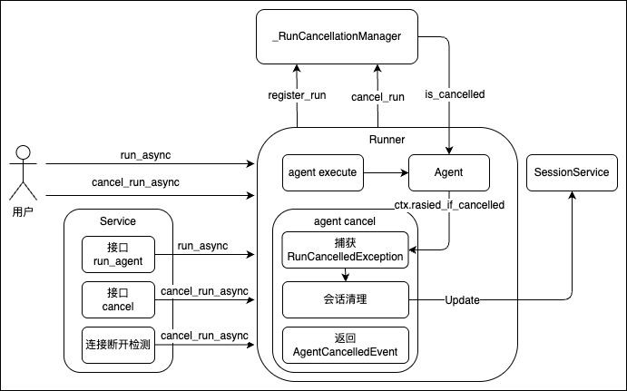

# Agent Cancel Mechanism

During Agent execution, the output may sometimes not meet the user's requirements. In such cases, users often interrupt the Agent execution, provide partial feedback (indicating which outputs before the interruption were unsatisfactory and what should be done next), and then let the Agent continue execution.

For this scenario, the trpc-agent framework provides a Cancel mechanism that allows cancelling an Agent's ongoing operations while preserving partial content (content being streamed by the LLM, tool execution results in progress, etc.). This mechanism is based on a checkpoint design. During execution, each Agent checks at checkpoint locations (after an LLM streaming output chunk, after a tool call completes, etc.) whether the current Agent should be terminated. If termination is required, an exception is thrown, and the framework records and saves the partial information to the session history.

This capability has been integrated into all Agents provided by the framework. Custom Agents implemented by other services can also be easily integrated.

| Module Type | Module Name | Cancel Support | Description |
|---------|---------|-------------|------|
| Single Agent | `LlmAgent` | ✅ | Checkpoints set at LLM streaming output, tool execution, and other locations |
| Single Agent | `LangGraphAgent` | ✅ | Checkpoints set during LangGraph streaming output |
| Single Agent | `ClaudeAgent` | ✅ | Checkpoints set during claude-sdk streaming output |
| Single Agent | `TrpcRemoteA2aAgent` | ✅ | Checkpoints set during HTTP streaming output |
| Multi Agent | `ChainAgent` | ✅ | Exception propagated from its sub-Agents |
| Multi Agent | `ParallelAgent` | ✅ | Execution cancelled when any sub-Agent throws an exception |
| Multi Agent | `CycleAgent` | ✅ | Exception propagated from its sub-Agents |
| Multi Agent | `TeamAgent` | ✅ | Cancellable during both Leader and Member execution |
| Agent Service | `TrpcA2aAgentService` | ✅ | Cancels remote Agent execution via the A2A protocol's cancel_task interface |
| Agent Service | `AgUiService` | ✅ | Agent automatically cancels execution upon SSE connection disconnect detection |


## Agent Cancel Mechanism Design Overview

### Architecture Design

As shown in the architecture below:
- When the framework starts, it creates a global `_RunCancellationManager` object to manage Agent cancellation signals
- Users run and interrupt Agent execution through the Runner
    - Users execute an Agent via `run_async`. Before execution, the Runner registers the current run information with the Manager via `register_run`. The SessionKey is a triplet of (app_name, user_id, session_id)
    - Users cancel Agent execution via `cancel_run_async`. The Runner receives the `RunCancelledException` thrown by the Agent and completes post-cancel processing (injecting partial streaming messages, partial tool call content into the Agent's session). After processing, the Runner generates an `AgentCancelledEvent` to convey the termination information, and the cancellation reason can be obtained through its error_message field
- Agents embed checkpoints during execution to integrate the Cancel capability
    - During Agent execution, within the `_run_async_impl` implementation, `ctx.raise_if_cancelled` is used at various checkpoints (after LLM streaming output chunks, after tool calls, etc.) to check whether the current execution has been cancelled. If `runner.cancel_run_async` has been called, the Agent's execution is marked as cancelled, and `raise_if_cancelled` throws a `RunCancelledException`
    - Common checkpoint locations include: during LLM streaming output, after tool calls. Cancellation during tool call execution is not currently supported
- Agent services automatically invoke `runner.cancel_run_async` through their interfaces and obtain cancellation details via the AgentCancelledEvent returned by the Runner
    - For AG-UI services, the protocol does not natively support cancellation. The client cancels Agent execution by disconnecting the connection. The Agent service detects the disconnection exception and automatically calls `runner.cancel_run_async` to support this capability
    - For A2A services, the protocol natively supports cancellation via the `cancel_task` interface. The framework already supports this interface and adapts it to `runner.cancel_run_async`, but it requires hash-based routing. In multi-node deployment scenarios, configuring hash-based routing can be cumbersome. A simpler approach, similar to AG-UI, would be for the Agent service to automatically detect connection disconnection and call `runner.cancel_run_async`. However, due to the current underlying implementation of the a2a-sdk, the Agent continues to execute after disconnection, so hash-based routing is temporarily required to complete the cancel operation.
    - For custom services, it is recommended to implement Agent cancellation logic triggered by connection disconnection. This approach has very low implementation cost, does not require hash-based routing, and the client simply disconnects from the remote Agent.

<p align="center">
  
</p>

### Session Management

When an Agent is cancelled, different session management strategies are applied depending on the scenario:

**Scenario 1: Cancellation during LLM streaming output**
- Session management: Messages from the start of the LLM response to the point of interruption are preserved. After this partial streamed text, a message "User cancel the agent execution." is appended to make the Agent aware of the cancellation event
- Effect: In the next conversation turn, the user can indicate which text was unsatisfactory, and the Agent will correct its output

**Scenario 2: Cancellation during tool execution**
- Session management: For scenarios where the Agent needs to call multiple tools, e.g., tool 1 and tool 2, if the user cancels Agent execution while tool 1 is being called, the system waits for tool 1 to complete, then skips tool 2 and terminates. The call information for tool 2 in this turn is removed from the session history, as if the Agent never executed tool 2 in this turn. Similarly, after tool 1's call response, a message "User cancel the agent execution." is appended to make the Agent aware of the cancellation event
- Effect: In the next conversation turn, the Agent can perceive that tool 2 was not called and may proceed to call tool 2.

### Limitations

> **⚠️ The current Cancel mechanism only supports single-node scenarios**

`_RunCancellationManager` uses in-process storage (`Dict`) to track active runs. This means:

1. **Cancel requests must be sent to the same node running the Agent**
2. **Cross-node cancellation is not supported**
3. **Applicable scenarios**:
   - Single-node deployment
   - Client communicates with the Agent through the same connection (WebSocket, SSE)
   - Cancellation is automatically triggered upon connection disconnection

## Basic Usage

### Basic Example

```python
import asyncio
import uuid
from trpc_agent_sdk.runners import Runner
from trpc_agent_sdk.sessions import InMemorySessionService
from trpc_agent_sdk.types import Content, Part

async def main():
    runner = Runner(
        app_name="my_app",
        agent=my_agent,
        session_service=InMemorySessionService(),
    )

    user_id = "demo_user"
    session_id = str(uuid.uuid4())

    # Run Agent in a background task
    async def run_agent():
        user_content = Content(parts=[Part.from_text("Please describe the history of artificial intelligence in detail")])
        async for event in runner.run_async(
            user_id=user_id,
            session_id=session_id,
            new_message=user_content,
        ):
            # Check if a cancel event is received
            if isinstance(event, AgentCancelledEvent):  # AgentCancelledEvent
                print(f"Run cancelled: {event.error_message}")
                continue # After continue, runner.run_async will terminate

            if event.content and event.content.parts:
                for part in event.content.parts:
                    if part.text:
                        print(part.text, end="", flush=True)

    task = asyncio.create_task(run_agent())

    # Wait for a period then cancel
    await asyncio.sleep(2)

    # Cancel the run using the same user_id and session_id
    runner2 = Runner(xxxx)
    success = await runner2.cancel_run_async(
        user_id=user_id,
        session_id=session_id,
        timeout=3.0,  # Timeout for waiting the Agent cancel operation to complete
    )
    print(f"\nCancel request result: {success}")

    await task
    await runner.close()
    await runner2.close()

asyncio.run(main())
```

### Agent Custom Service Examples

#### Approach 1: Connection-disconnect-based cancellation (Recommended)

In long-connection scenarios such as SSE/WebSocket, it is recommended to automatically trigger cancellation by detecting connection disconnection. This approach has low implementation cost — users simply disconnect to trigger cancellation without requiring a separate cancel interface.

The following is an example based on FastAPI SSE:

```python
import asyncio
from fastapi import FastAPI, Request
from fastapi.responses import StreamingResponse
from trpc_agent_sdk.runners import Runner
from trpc_agent_sdk.agents import LlmAgent
from trpc_agent_sdk.sessions import InMemorySessionService
from trpc_agent_sdk.types import Content, Part
from trpc_agent_sdk import cancel

app = FastAPI()

# Create Agent and Session Service
agent = LlmAgent(name="my_agent", model=model, instruction="You are an intelligent assistant")
session_service = InMemorySessionService()

# Cancel wait timeout configuration
CANCEL_WAIT_TIMEOUT = 3.0


@app.post("/chat/{user_id}/{session_id}")
async def chat_endpoint(user_id: str, session_id: str, message: str, request: Request):
    """SSE chat endpoint with automatic cancellation on disconnect"""

    app_name = "my_app"

    async def event_generator():
        # Create a Runner for each request
        runner = Runner(
            app_name=app_name,
            agent=agent,
            session_service=session_service,
        )

        try:
            user_content = Content(parts=[Part.from_text(message)])

            async for event in runner.run_async(
                user_id=user_id,
                session_id=session_id,
                new_message=user_content,
            ):
                # Detect if the client has disconnected
                if await request.is_disconnected():
                    break

                # Send SSE events
                if event.content and event.content.parts:
                    for part in event.content.parts:
                        if part.text:
                            yield f"data: {part.text}\n\n"

        except asyncio.CancelledError:
            # Connection closed by the client
            raise
        finally:
            # Trigger cancel operation regardless of normal completion or disconnection
            # This ensures the Agent execution is properly terminated and partial results are saved
            cleanup_event = await cancel.cancel_run(app_name, user_id, session_id)

            if cleanup_event is not None:
                try:
                    # Wait for the cancel operation to complete
                    await asyncio.wait_for(cleanup_event.wait(), timeout=CANCEL_WAIT_TIMEOUT)
                except asyncio.TimeoutError:
                    pass  # Continue after timeout, the Agent may still be running

    return StreamingResponse(
        event_generator(),
        media_type="text/event-stream",
    )
```

This pattern is already implemented in the AG-UI service. See [trpc_agent_sdk/server/ag_ui/_plugin/_utils.py](../../../trpc_agent_sdk/server/ag_ui/_plugin/_utils.py)

#### Approach 2: Explicit cancel interface

If a standalone cancel interface (e.g., REST API) is needed, note the following considerations. You can use this approach:

```python
from fastapi import FastAPI, HTTPException

app = FastAPI()
runner = Runner(...)

@app.post("/sessions/{user_id}/{session_id}/cancel")
async def cancel_session_run(user_id: str, session_id: str):
    """Cancel the run for a specified session"""
    success = await runner.cancel_run_async(
        user_id=user_id,
        session_id=session_id,
        timeout=3.0,
    )
    if success:
        return {"status": "cancellation_requested"}
    else:
        raise HTTPException(
            status_code=404,
            detail="No active run found for this session"
        )
```

**Note**: This approach requires that the cancel request is sent to the same node running the Agent. In multi-node deployment scenarios, hash-based routing must be used to ensure the cancel request reaches the node executing the Agent.

## Agent Cancel Guide

### LlmAgent

LlmAgent has checkpoints set at critical positions in the execution flow:

**Checkpoint locations:**
- At the beginning of each conversation turn
- Before LLM API calls
- During LLM streaming output (each chunk)
- Before and after tool execution

**Usage example:**

```python
from trpc_agent_sdk.agents import LlmAgent
from trpc_agent_sdk.models import OpenAIModel
from trpc_agent_sdk.tools import FunctionTool

# Define tools
async def get_weather(city: str) -> dict:
    """Get city weather"""
    await asyncio.sleep(3)  # Simulate time-consuming operation
    return {"city": city, "temperature": "25°C", "condition": "Sunny"}

# Create Agent
agent = LlmAgent(
    name="weather_agent",
    model=OpenAIModel(model_name="deepseek-chat"),
    instruction="You are a weather query assistant",
    tools=[FunctionTool(get_weather)],
)

# Create Runner
runner = Runner(
    app_name="weather_app",
    agent=agent,
    session_service=InMemorySessionService(),
)

# Run with cancel support
async def run_with_cancel():
    task = asyncio.create_task(run_agent())
    await asyncio.sleep(1)
    await runner.cancel_run_async(user_id, session_id)
    await task
```

**Full example:**
- [examples/llmagent_with_cancel](../../../examples/llmagent_with_cancel/README.md)

### LangGraphAgent

LangGraphAgent wraps LangGraph as a trpc-agent compatible Agent, and also supports the Cancel mechanism.

**Checkpoint locations:**
- Before and after graph node execution
- During streaming output

**Usage example:**

```python
from trpc_agent_sdk.agents import LangGraphAgent
from langgraph.graph import StateGraph

# Build LangGraph
def build_graph():
    builder = StateGraph(State)
    builder.add_node("process", process_node)
    builder.add_node("respond", respond_node)
    builder.set_entry_point("process")
    builder.add_edge("process", "respond")
    return builder.compile()

# Create LangGraphAgent
agent = LangGraphAgent(
    name="langgraph_agent",
    description="LangGraph-powered Agent",
    graph=build_graph(),
)

runner = Runner(
    app_name="langgraph_app",
    agent=agent,
    session_service=InMemorySessionService(),
)

# Cancel usage is the same as LlmAgent
await runner.cancel_run_async(user_id, session_id)
```

**Full example:**
- [examples/langgraph_agent_with_cancel](../../../examples/langgraph_agent_with_cancel/README.md)

### ClaudeAgent

ClaudeAgent runs using the Claude SDK's subprocess mode. When cancelled, the subprocess is terminated.

**Cancel implementation:**
- When a cancellation request is detected, a termination signal is sent to the Claude SDK subprocess
- After the subprocess exits, partial responses are saved to the session

**Usage example:**

```python
from trpc_agent_sdk.server.agents.claude import ClaudeAgent, setup_claude_env
from trpc_agent_sdk.models import OpenAIModel

model = OpenAIModel(model_name="deepseek-chat")

# Set up Claude environment
setup_claude_env(
    proxy_host="0.0.0.0",
    proxy_port=8082,
    claude_models={"all": model},
)

# Create ClaudeAgent
agent = ClaudeAgent(
    name="claude_agent",
    model=model,
    instruction="You are an intelligent assistant",
    tools=[FunctionTool(some_tool)],
)
agent.initialize()

runner = Runner(
    app_name="claude_app",
    agent=agent,
    session_service=InMemorySessionService(),
)

# Cancel usage is the same
await runner.cancel_run_async(user_id, session_id)
```

**Notes:**
- Cancel will cause the Claude SDK subprocess to be terminated. You may see `ProcessError` logs, which is expected behavior
- After the subprocess is terminated, partial responses are saved to the session

**Full example:**
- [examples/claude_agent_with_cancel](../../../examples/claude_agent_with_cancel/README.md)

### TeamAgent

TeamAgent supports Cancel during both Leader planning and Member execution phases.

**Cancel scenarios:**
1. **Cancellation during Leader planning**: Saves the Leader's partial response
2. **Cancellation during Member execution**: Saves the Member's partial response to team memory

**Usage example:**

```python
from trpc_agent_sdk.agents import LlmAgent
from trpc_agent_sdk.teams import TeamAgent
from trpc_agent_sdk.tools import FunctionTool

# Create team members
researcher = LlmAgent(
    name="researcher",
    model=model,
    description="Research expert",
    instruction="Responsible for information retrieval",
    tools=[FunctionTool(search_web)],
)

writer = LlmAgent(
    name="writer",
    model=model,
    description="Writing expert",
    instruction="Responsible for content creation",
)

# Create team
team = TeamAgent(
    name="content_team",
    model=model,
    members=[researcher, writer],
    instruction="Coordinate research and writing tasks",
    share_member_interactions=True,
)

runner = Runner(
    app_name="team_app",
    agent=team,
    session_service=InMemorySessionService(),
)

# Cancel will interrupt the currently executing Leader or Member
await runner.cancel_run_async(user_id, session_id)
```

**Full example:**
- [examples/team_with_cancel](../../../examples/team_with_cancel/README.md)

## Agent Service Cancel Guide

### A2A

Agent services deployed via the A2A protocol support remote Cancel.

**Architecture:**

```
┌─────────────────────────────────────────────────┐
│                   Client                         │
│  ┌───────────────────────────────────────────┐  │
│  │         TrpcRemoteA2aAgent                │  │
│  │     (Connect to remote A2A service)       │  │
│  └─────────────┬─────────────────────────────┘  │
│                │ A2A Protocol                    │
│                │ (Supports Cancel)               │
└────────────────┼────────────────────────────────┘
                 │
                 │ HTTP
                 │
┌────────────────▼────────────────────────────────┐
│                   Server                         │
│  ┌───────────────────────────────────────────┐  │
│  │      TrpcA2aAgentService                  │  │
│  │  ┌─────────────────────────────────────┐  │  │
│  │  │          LlmAgent                   │  │  │
│  │  │     (Cancel-enabled Agent)          │  │  │
│  │  └─────────────────────────────────────┘  │  │
│  └───────────────────────────────────────────┘  │
└─────────────────────────────────────────────────┘
```

**Server configuration:**

run_server.py:

```python
import uvicorn
from dotenv import load_dotenv

from a2a.server.apps import A2AStarletteApplication
from a2a.server.request_handlers import DefaultRequestHandler
from a2a.server.tasks import InMemoryTaskStore

from trpc_agent_sdk.server.a2a import TrpcA2aAgentExecutorConfig
from trpc_agent_sdk.server.a2a import TrpcA2aAgentService

load_dotenv()

HOST = "127.0.0.1"
PORT = 18082
# Timeout (seconds) for waiting the Agent to complete cancellation, recommended to keep consistent with client timeout
CANCEL_WAIT_TIMEOUT = 3.0


def create_a2a_service() -> TrpcA2aAgentService:
    """Create an A2A service with Cancel support"""
    from agent.agent import root_agent

    # Key configuration: cancel_wait_timeout controls how long the server waits
    # for the backend Agent to complete the cancellation after receiving cancel_task
    executor_config = TrpcA2aAgentExecutorConfig(
        cancel_wait_timeout=CANCEL_WAIT_TIMEOUT,
    )

    a2a_svc = TrpcA2aAgentService(
        service_name="weather_agent_cancel_service",
        agent=root_agent,
        executor_config=executor_config,
    )
    a2a_svc.initialize()

    return a2a_svc


def serve():
    """Start the A2A service"""
    a2a_svc = create_a2a_service()

    # Assemble the service using a2a-sdk standard components
    request_handler = DefaultRequestHandler(
        agent_executor=a2a_svc,
        task_store=InMemoryTaskStore(),
    )

    server = A2AStarletteApplication(
        agent_card=a2a_svc.agent_card,
        http_handler=request_handler,
    )

    uvicorn.run(server.build(), host=HOST, port=PORT)


if __name__ == "__main__":
    serve()
```

**Client usage:**

test_a2a_cancel.py:

```python
import asyncio
import uuid
from typing import Awaitable
from typing import Callable
from typing import Optional

from dotenv import load_dotenv
from trpc_agent_sdk.configs import RunConfig
from trpc_agent_sdk.events import AgentCancelledEvent
from trpc_agent_sdk.runners import Runner
from trpc_agent_sdk.server.a2a import TrpcRemoteA2aAgent
from trpc_agent_sdk.sessions import InMemorySessionService
from trpc_agent_sdk.types import Content
from trpc_agent_sdk.types import Part

load_dotenv()

# A2A server address, must match the configuration in run_server.py
AGENT_BASE_URL = "http://127.0.0.1:18082"
# Client timeout (seconds) for waiting cancellation to complete, recommended to keep consistent with server cancel_wait_timeout
CANCEL_TIMEOUT = 3.0


async def run_remote_agent(
    runner: Runner,
    user_id: str,
    session_id: str,
    query: str,
    tool_call_callback: Optional[Callable[[], Awaitable[None]]] = None,
    event_count_callback: Optional[Callable[[int], Awaitable[None]]] = None,
) -> None:
    """Run remote Agent and process the event stream"""
    user_content = Content(parts=[Part.from_text(text=query)])

    run_config = RunConfig(agent_run_config={
        "metadata": {
            "user_id": user_id,
        },
    })

    print("🤖 Remote Agent: ", end="", flush=True)
    event_count = 0
    try:
        async for event in runner.run_async(
                user_id=user_id,
                session_id=session_id,
                new_message=user_content,
                run_config=run_config,
        ):
            event_count += 1
            if event_count_callback:
                await event_count_callback(event_count)

            # Received cancel event, indicating the Agent was successfully cancelled
            if isinstance(event, AgentCancelledEvent):
                print(f"\n❌ Run was cancelled: {event.error_message}")
                break

            if not event.content or not event.content.parts:
                continue

            # Process streaming output (partial=True indicates a streaming chunk)
            if event.partial:
                for part in event.content.parts:
                    if part.text:
                        print(part.text, end="", flush=True)
                continue

            # Process complete events (tool calls, tool results, etc.)
            for part in event.content.parts:
                if part.thought:
                    continue
                if part.function_call:
                    print(f"\n🔧 [Invoke Tool: {part.function_call.name}({part.function_call.args})]")
                    # Trigger callback when tool call is detected, used to initiate cancellation during tool execution
                    if tool_call_callback:
                        await tool_call_callback()
                elif part.function_response:
                    print(f"📊 [Tool Result: {part.function_response.response}]")

    except Exception as e:
        print(f"\n⚠️ Error: {e}")

    print()


def create_runner(
    app_name: str,
    session_service: InMemorySessionService,
    remote_agent: TrpcRemoteA2aAgent,
) -> Runner:
    """Create a Runner instance bound to the remote A2A Agent"""
    return Runner(app_name=app_name, agent=remote_agent, session_service=session_service)


# ============================================================
# Scenario 1: Cancel during LLM streaming output
# After receiving 10 streaming events, send a cancel request to the remote service via cancel_run_async
# ============================================================
async def scenario_1_cancel_during_streaming(remote_agent: TrpcRemoteA2aAgent) -> None:
    print("📋 Scenario 1: Cancel During LLM Streaming (Remote A2A)")
    print("-" * 80)

    app_name = "a2a_cancel_demo"
    user_id = "demo_user"
    session_id = str(uuid.uuid4())
    session_service = InMemorySessionService()

    query1 = "Introduce yourself in detail, what can you do as a weather assistant."
    print(f"🆔 Session ID: {session_id[:8]}...")
    print(f"📝 User Query 1: {query1}")
    print()

    event_threshold_reached = asyncio.Event()

    async def on_event_count(count: int) -> None:
        # Trigger cancel signal when the 10th event is received
        if count == 10:
            print(f"\n⏳ [Received {count} events, triggering cancellation...]")
            event_threshold_reached.set()

    # Runner for running the Agent
    runner1 = create_runner(app_name, session_service, remote_agent)

    async def run_query1() -> None:
        await run_remote_agent(runner1, user_id, session_id, query1, event_count_callback=on_event_count)

    # Run Agent in a background task
    task = asyncio.create_task(run_query1())

    print("⏳ Waiting for first 10 events...")
    await event_threshold_reached.wait()

    # Use another Runner to send the cancel request (simulating an independent cancel caller)
    runner2 = create_runner(app_name, session_service, remote_agent)
    print("\n⏸️  Requesting cancellation after 10 events...")
    # cancel_run_async sends a cancel_task request to the remote A2A service
    success = await runner2.cancel_run_async(user_id=user_id, session_id=session_id, timeout=CANCEL_TIMEOUT)
    print(f"✓ Cancellation requested: {success}")

    await task

    print()
    print("💡 Result: The partial response was saved to session with cancellation message")
    print()

    # Continue conversation in the same session after cancellation to verify session context is maintained
    query2 = "what happens?"
    print(f"📝 User Query 2: {query2}")
    print()

    runner3 = create_runner(app_name, session_service, remote_agent)
    await run_remote_agent(runner3, user_id, session_id, query2)

    print("💡 Result: Agent can still respond with session context maintained")
    print("-" * 80)
    print()


# ============================================================
# Scenario 2: Cancel during tool execution
# Initiate cancellation after detecting a function_call event, while the tool is still executing on the server
# ============================================================
async def scenario_2_cancel_during_tool_execution(remote_agent: TrpcRemoteA2aAgent) -> None:
    print("📋 Scenario 2: Cancel During Tool Execution (Remote A2A)")
    print("-" * 80)

    app_name = "a2a_cancel_demo"
    user_id = "demo_user"
    session_id = str(uuid.uuid4())
    session_service = InMemorySessionService()

    query1 = "What's the current weather in Shanghai and Beijing?"
    print(f"🆔 Session ID: {session_id[:8]}...")
    print(f"📝 User Query 1: {query1}")
    print()

    tool_call_detected = asyncio.Event()

    async def on_tool_call() -> None:
        # Set signal when tool call is detected to trigger cancellation
        print("⏳ [Tool call detected...]")
        tool_call_detected.set()

    runner1 = create_runner(app_name, session_service, remote_agent)

    async def run_query1() -> None:
        await run_remote_agent(runner1, user_id, session_id, query1, tool_call_callback=on_tool_call)

    task = asyncio.create_task(run_query1())

    print("⏳ Waiting for tool call to be detected...")
    await tool_call_detected.wait()

    # Initiate cancellation during tool execution; completed tool results are preserved, incomplete calls are cleaned up
    runner2 = create_runner(app_name, session_service, remote_agent)
    print("\n⏸️  Tool call detected! Requesting cancellation during tool execution...")
    success = await runner2.cancel_run_async(user_id=user_id, session_id=session_id, timeout=CANCEL_TIMEOUT)
    print(f"✓ Cancellation requested: {success}")

    await task

    print()
    print("💡 Result: Incomplete function calls were cleaned up from session")
    print()

    # Continue conversation after cancellation to verify session recovery
    query2 = "what happens?"
    print(f"📝 User Query 2: {query2}")
    print()

    runner3 = create_runner(app_name, session_service, remote_agent)
    await run_remote_agent(runner3, user_id, session_id, query2)

    print("💡 Result: Agent can still respond with session context maintained")
    print("-" * 80)
    print()


async def main():
    # Create a remote A2A Agent connected to the service started by run_server.py
    remote_agent = TrpcRemoteA2aAgent(
        name="weather_agent",
        agent_base_url=AGENT_BASE_URL,
        description="Professional weather query assistant with cancel support",
    )
    await remote_agent.initialize()

    # Run the two cancel scenarios in sequence
    await scenario_1_cancel_during_streaming(remote_agent)

    await scenario_2_cancel_during_tool_execution(remote_agent)


if __name__ == "__main__":
    asyncio.run(main())
```

**Configuration reference:**

| Configuration Location | Parameter | Default | Description |
|----------|------|--------|------|
| Server | `cancel_wait_timeout` | 1.0 | Timeout for the server to wait for the backend Agent to complete cancellation |
| Client | `timeout` | 1.0 | Timeout for the client to wait for the local RemoteA2aAgent to complete cancellation |

It is recommended to configure the same timeout value for both.

**Full example:**
- [examples/a2a_with_cancel](../../../examples/a2a_with_cancel/README.md)

### AG-UI

Agent services deployed via the AG-UI protocol automatically trigger Cancel when the client closes the SSE connection.

**Architecture:**

```
┌─────────────────────────────────────────────────┐
│                   Client                         │
│  ┌───────────────────────────────────────────┐  │
│  │        @ag-ui/client                      │  │
│  │    agent.abortRun() closes connection     │  │
│  └─────────────┬─────────────────────────────┘  │
│                │ AG-UI Protocol (SSE)            │
└────────────────┼────────────────────────────────┘
                 │ HTTP
                 │ ⚡ Connection disconnected
                 │
┌────────────────▼────────────────────────────────┐
│                   Server                         │
│  ┌───────────────────────────────────────────┐  │
│  │      AgUiService (detects disconnect)     │  │
│  │  ┌─────────────────────────────────────┐  │  │
│  │  │  AgUiAgent.cancel_run()             │  │  │
│  │  │    ↓                                │  │  │
│  │  │  Cancellation Manager               │  │  │
│  │  │  (cancel.cancel_run)                │  │  │
│  │  │    ↓                                │  │  │
│  │  │  Agent (stops at checkpoint)        │  │  │
│  │  └─────────────────────────────────────┘  │  │
│  └───────────────────────────────────────────┘  │
└─────────────────────────────────────────────────┘
```

**Server configuration:**

run_server.py:

```python
from dotenv import load_dotenv

from trpc_agent_sdk.sessions import InMemorySessionService

from _agui_runner import create_agui_runner

load_dotenv()

HOST = "127.0.0.1"
PORT = 18080

app_name = "agui_cancel_demo"


def serve():
    """Start the AG-UI service, register Agent and bindroutes"""
    service_name = "weather_agent_cancel_service"
    uri = "/weather_agent"  # AG-UI endpoint path, clients connect via this path
    from agent.agent import root_agent
    session_service = InMemorySessionService()
    agui_runner = create_agui_runner(app_name,
                                     service_name,
                                     uri,
                                     root_agent=root_agent,
                                     session_service=session_service)
    agui_runner.run(HOST, PORT)


if __name__ == "__main__":
    serve()
```

_agui_runner.py:

```python
from contextlib import asynccontextmanager
from typing import Any

from ag_ui.core import RunAgentInput
from fastapi import FastAPI
from pydantic import BaseModel

from trpc_agent_sdk.agents import BaseAgent
from trpc_agent_sdk.log import logger
from trpc_agent_sdk.server.ag_ui import AgUiAgent
from trpc_agent_sdk.server.ag_ui import AgUiManager
from trpc_agent_sdk.server.ag_ui import AgUiService


class HealthResponse(BaseModel):
    status: str = "ok"
    app_name: str
    version: str = "1.0.0"


class AguiRunner:
    """AG-UI Runner: manages AgUiManager, FastAPI app, and service registration"""

    def __init__(
        self,
        app_name: str,
    ) -> None:
        self._app_name = app_name
        self._agui_manager = AgUiManager()
        self._app = self._create_app()

    @property
    def app(self) -> FastAPI:
        return self._app

    def register_service(self, service_name: str, service: AgUiService) -> None:
        self._agui_manager.register_service(service_name, service)

    def run(self, host: str, port: int, **kwargs: Any) -> None:
        self._app.get("/health", response_model=HealthResponse, tags=["meta"])(self.health)
        self._agui_manager.set_app(self._app)
        self._agui_manager.run(host, port, **kwargs)

    @asynccontextmanager
    async def _lifespan(self, app: FastAPI):
        logger.info("TRPC AG-UI Server (with cancel) starting up.")
        yield
        logger.info("TRPC AG-UI Server (with cancel) shutting down.")
        await self._agui_manager.close()

    def _create_app(self) -> FastAPI:
        app = FastAPI(
            title="TRPC AG-UI Server (Cancel Demo)",
            description="HTTP API for TRPC AG-UI Server with Cancel support",
            version="1.0.0",
            lifespan=self._lifespan,
        )
        return app

    async def health(self) -> HealthResponse:
        return HealthResponse(app_name=self._app_name)


def _create_agui_agent(name: str, root_agent: BaseAgent, **kwargs) -> AgUiAgent:
    """Create AgUiAgent with cancel_wait_timeout configuration"""
    agui_agent = AgUiAgent(
        trpc_agent=root_agent,
        app_name=name,
        # Key configuration: timeout for waiting the Agent to complete cancellation after SSE disconnect
        # If configured too short, Cancel may not complete and streamed text cannot be saved to the session
        cancel_wait_timeout=3.0,
        **kwargs,
    )
    return agui_agent


def create_agui_runner(app_name: str, service_name: str, uri: str, **kwargs: Any) -> AguiRunner:
    """Assemble AG-UI service: create Runner -> create Service -> register Agent route"""
    ag_ui_runner: AguiRunner = AguiRunner(app_name)
    agui_service = AgUiService(service_name, app=ag_ui_runner.app)
    agui_agent = _create_agui_agent(app_name, **kwargs)
    # Register the Agent to the specified URI path, clients connect via this path
    agui_service.add_agent(uri, agui_agent)
    ag_ui_runner.register_service(service_name, agui_service)
    return ag_ui_runner
```

**Client usage (JavaScript):**

client_js/main.js:

```javascript
import { HttpAgent } from '@ag-ui/client';

// Connect to the AG-UI server, path must match the uri registered in run_server.py
const agent = new HttpAgent({
  url: 'http://127.0.0.1:18080/weather_agent',
  debug: false
});

let chunkCount = 0;
const ABORT_AFTER_CHUNKS = 5;  // Trigger cancellation after receiving 5 text chunks

// Subscribe to AG-UI event stream
const subscription = agent.subscribe({
  onTextMessageStartEvent: ({ event }) => {
    process.stdout.write('\n🤖 Assistant: ');
  },
  onTextMessageContentEvent: ({ event }) => {
    process.stdout.write(event.delta ?? '');
    chunkCount++;
    // After reaching threshold, call abortRun() to close SSE connection, triggering server-side Cancel
    if (chunkCount === ABORT_AFTER_CHUNKS) {
      process.stdout.write('\n\n⏸️  Aborting run after receiving ' + ABORT_AFTER_CHUNKS + ' text chunks...\n');
      agent.abortRun();
    }
  },
  onTextMessageEndEvent: ({ event }) => {
    process.stdout.write('\n');
  },
  onToolCallStartEvent: ({ event }) => {
    process.stdout.write(`\n🔧 Call Tool ${event.toolCallName}: `);
  },
  onToolCallArgsEvent: ({ event }) => {
    process.stdout.write(event.delta ?? '');
  },
  onToolCallResultEvent: ({ event }) => {
    process.stdout.write(`\n✅ Tool result: ${event.content}`);
  },
  onRunStartedEvent: ({ event }) => {
    process.stdout.write(`\n⚙️  Run started: ${event.runId}`);
  },
  onRunFinishedEvent: ({ result }) => {
    if (result !== undefined) {
      process.stdout.write(`⚙️  Run finished, result: ${result}\n`);
    } else {
      process.stdout.write('⚙️  Run finished\n');
    }
  },
  onRunFailedEvent: ({ error }) => {
    process.stdout.write(`❌ Run failed: ${error}\n`);
  }
});

// Send user message and start the Agent
await agent.addMessage({
  role: 'user',
  content: 'Please introduce yourself in detail and tell me what you can do.',
  id: 'user_123'
});

await agent.runAgent();

subscription.unsubscribe?.();
```

**Cancel trigger mechanism:**
- Client calls `agent.abortRun()` to close the SSE connection
- Server detects the disconnection (`asyncio.CancelledError`)
- Automatically invokes `cancel_run()` to trigger cooperative cancellation
- Agent stops execution at the checkpoint
- Partial responses and session state are saved

**Configuration reference:**

| Parameter | Default | Description |
|------|--------|------|
| `cancel_wait_timeout` | 3.0 | Timeout (in seconds) for waiting the Cancel operation to complete. If this value is not properly configured, the Cancel operation may fail to execute successfully, causing streamed text to not be saved to the session. |

**Full example:**
- [examples/agui_with_cancel](../../../examples/agui_with_cancel/README.md)
