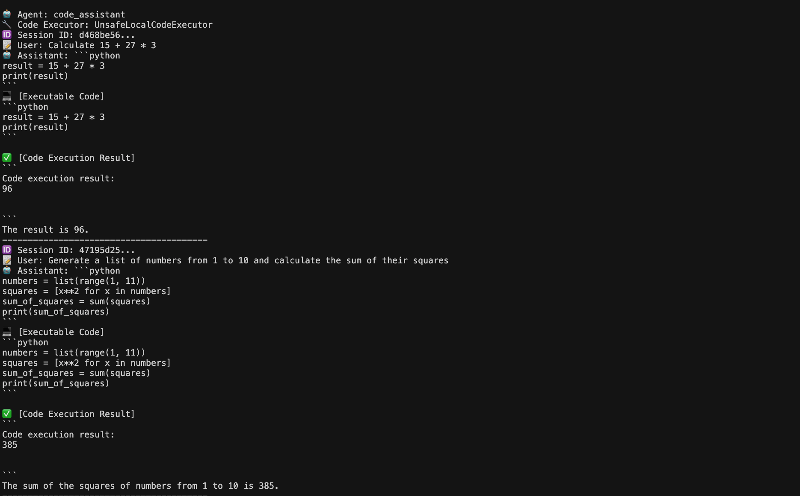
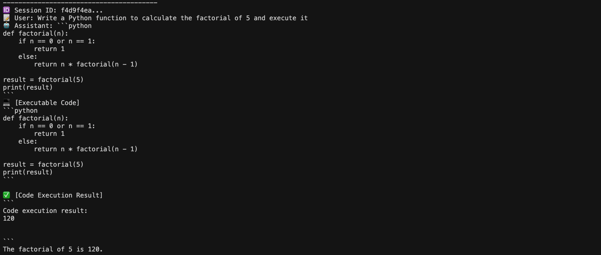
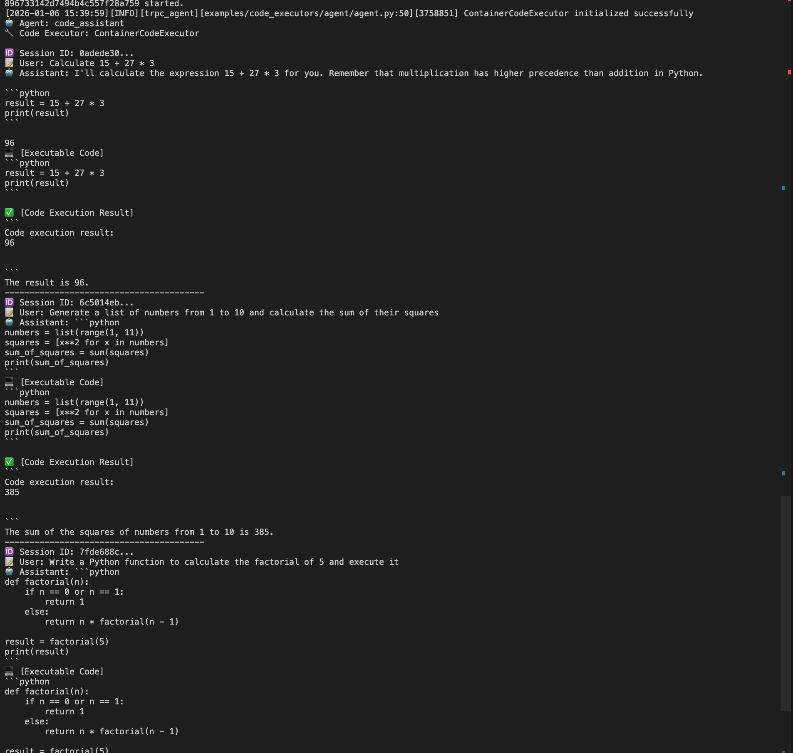
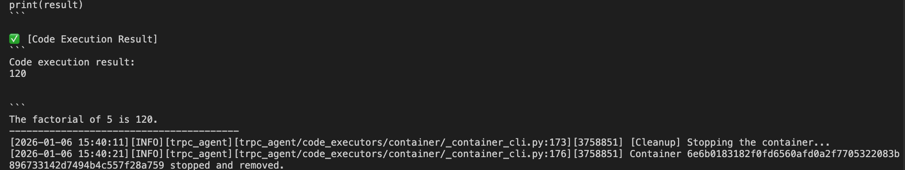

# Agent Code Executor

To provide Agents with a high degree of flexibility, there are times when an Agent needs to generate and execute code. The tRPC-Agent framework supports CodeExecutor for this scenario.

When this feature is enabled, if the LLM returns text containing code snippets, the framework will invoke the corresponding CodeExecutor to execute the code and return the execution results to the LLM, which can then continue generating responses based on those results.

## Code Executor Types

Two types of code executors are currently available:

### UnsafeLocalCodeExecutor

**Features:**
- Executes LLM-generated code within the Agent's own process
- Non-sandboxed environment, directly uses the local Python/Bash runtime; currently only supports `Python/Bash`
- Fast execution speed, no Docker environment required
- **Security Warning**: LLM-generated code may pose risks and is not suitable for production environments

**Use Cases:**
- Development and testing environments
- Trusted code execution scenarios
- Scenarios requiring rapid iteration and debugging

### ContainerCodeExecutor

**Features:**
- Agent dispatches code snippets to a Docker container for execution; currently only supports `Python/Bash`
- Sandboxed environment, providing better isolation and security
- Supports custom Docker images or Dockerfiles
- Requires Docker environment

**Use Cases:**
- Production environments
- Scenarios requiring execution of untrusted code
- Scenarios requiring environment isolation

## Usage Examples

When creating an LlmAgent, build a CodeExecutor and configure the `code_executor` parameter to enable code execution functionality.


### Building a CodeExecutor

```python
from trpc_agent_sdk.agents import LlmAgent
from trpc_agent_sdk.models import LLMModel
from trpc_agent_sdk.models import OpenAIModel
from trpc_agent_sdk.code_executors import BaseCodeExecutor
from trpc_agent_sdk.code_executors import UnsafeLocalCodeExecutor
from trpc_agent_sdk.code_executors import ContainerCodeExecutor
from trpc_agent_sdk.log import logger

def _create_code_executor(code_executor_type: str = "unsafe_local") -> BaseCodeExecutor:
    """Create a code executor.

    Args:
        code_executor_type: Type of code executor to use. Options:
            - "unsafe_local": Use UnsafeLocalCodeExecutor (default, no Docker required)
            - "container": Use ContainerCodeExecutor (requires Docker)
            - None: Auto-detect from environment variable CODE_EXECUTOR_TYPE,
                    or default to "unsafe_local"

    Returns:
        BaseCodeExecutor instance.

    Raises:
        RuntimeError: If container type is requested but Docker is not available.
            The error message will include detailed instructions on how to fix the issue.
    """
    # Get executor type from environment variable if not specified
    if code_executor_type == "unsafe_local":
        return UnsafeLocalCodeExecutor(timeout=10)
    elif code_executor_type == "container":
        # ContainerCodeExecutor will raise a clear error if Docker is not available
        # The error message includes detailed instructions on how to fix the issue
        executor = ContainerCodeExecutor(image="python:3-slim", error_retry_attempts=1)
        logger.info("ContainerCodeExecutor initialized successfully")
        return executor
    else:
        raise ValueError(f"Invalid code executor type: {code_executor_type}. "
                         "Valid options are: 'unsafe_local', 'container'")

```

### Using UnsafeLocalCodeExecutor

```python
# ...
def create_agent() -> LlmAgent:
    """Create an agent with code execution capabilities.

    The agent can:
    - Execute Python code blocks generated by the LLM
    - Use tools like get_weather_report
    - Perform calculations and data processing through code execution

    Note: UnsafeLocalCodeExecutor executes code in the current process context.
    For production use, consider using ContainerCodeExecutor for better security.
    """
    # Select unsafe_local
    executor = _create_code_executor(code_executor_type="unsafe_local")
    agent = LlmAgent(
        name="code_assistant",
        description="Code execution assistant",
        model=_create_model(),  # You can change this to your preferred model
        instruction=INSTRUCTION,
        code_executor=executor,  # Enables code execution functionality
    )
    return agent


root_agent = create_agent()
```

**Execution Result Example:**




### Using ContainerCodeExecutor

```python

# ...
def create_agent() -> LlmAgent:
    """Create an agent with code execution capabilities.

    The agent can:
    - Execute Python code blocks generated by the LLM
    - Use tools like get_weather_report
    - Perform calculations and data processing through code execution

    Note: UnsafeLocalCodeExecutor executes code in the current process context.
    For production use, consider using ContainerCodeExecutor for better security.
    """
    # Select container
    executor = _create_code_executor(code_executor_type="container")
    agent = LlmAgent(
        name="code_assistant",
        description="Code execution assistant",
        model=_create_model(),  # You can change this to your preferred model
        instruction=INSTRUCTION,
        code_executor=executor,  # Enables code execution functionality
    )
    return agent

# Ensure Docker is installed and running before use
# Linux: sudo systemctl start docker
# Windows/Mac: Start Docker Desktop
```

**Execution Result Example:**




## Configuration Parameters

### UnsafeLocalCodeExecutor Parameters

```python
code_executor = UnsafeLocalCodeExecutor(
    # Number of retries on code execution failure, default is 2
    error_retry_attempts=2,

    # Code block delimiters, used to identify code blocks in LLM responses
    # Default support: ```tool_code\n and ```python\n
    code_block_delimiters=[
        CodeBlockDelimiter(start="```python\n", end="\n```"),
        CodeBlockDelimiter(start="```tool_code\n", end="\n```"),
    ],

    # Working directory; uses a temporary directory if empty
    work_dir="",

    # Code execution timeout in seconds
    timeout=10,

    # Whether to clean up temporary files after execution, default is True
    clean_temp_files=True,
)
```

### ContainerCodeExecutor Parameters

```python
code_executor = ContainerCodeExecutor(
    # Docker image name (required, mutually exclusive with docker_path)
    image="python:3-slim",

    # Dockerfile path (required, mutually exclusive with image)
    # docker_path="/path/to/Dockerfile",

    # base_url for remote Docker (optional)
    # base_url="tcp://remote-docker-host:2375",

    # Number of retries on code execution failure, default is 2
    error_retry_attempts=2,

    # Code block delimiters, default uses ```tool_code\n
    code_block_delimiters=[
        CodeBlockDelimiter(start="```tool_code\n", end="\n```"),
    ],
)
```

## Code Block Format

The Agent automatically identifies and executes code blocks in LLM responses. Supported code block formats:

### Default Format

````python
```python
print("Hello, World!")
```

```tool_code
result = 15 + 27 * 3
print(result)
```
````

### Execution Result Format

After code execution, the results are returned to the LLM in the following format:

````python
```tool_output
96
```
````

## Supported Languages

### UnsafeLocalCodeExecutor
- Python (`python`, `py`, `python3`)
- Bash (`bash`, `sh`)

### ContainerCodeExecutor
- Python (`python`, `py`, `python3`, empty string defaults to Python)
- Bash (`bash`, `sh`)

## Workflow

1. **User Query** → Agent receives the user query
2. **LLM Response Generation** → LLM generates a response containing code blocks
3. **Code Extraction** → The framework automatically extracts code blocks (based on `code_block_delimiters`)
4. **Code Execution** → CodeExecutor executes the code
5. **Result Return** → Execution results are returned to the LLM
6. **Final Response** → LLM generates the final response based on the execution results


## 123 Sandbox CodeExecutor Usage

Reference: Pcg123 Sandbox Usage Example (example to be added)

## FAQ

### 1. Docker Connection Failure

**Problem:** Docker connection failure is reported when using ContainerCodeExecutor

**Solution:**
- Linux: Ensure the Docker daemon is running: `sudo systemctl start docker`
- Windows/Mac: Start the Docker Desktop application
- Check Docker permissions: `sudo chmod 666 /var/run/docker.sock` or add the user to the docker group
- Verify Docker is running: `docker ps`
- If using remote Docker, check the `base_url` configuration

### 2. Code Execution Timeout

**Problem:** Code execution takes too long and times out

**Solution:**
```python
# Set timeout for UnsafeLocalCodeExecutor
code_executor = UnsafeLocalCodeExecutor(timeout=30)  # 30-second timeout
```

### 3. Code Execution Fails with No Error Message

**Problem:** Code execution fails but no error message is displayed

**Solution:**
- Check the `error_retry_attempts` setting and increase the retry count
- Review the log output; the framework logs detailed error information
- For ContainerCodeExecutor, check the container logs

## Complete Example

See the complete example code: [examples/code_executors/agent/agent.py](../../../examples/code_executors/agent/agent.py)

## Security Recommendations

1. **Production Environment**: It is strongly recommended to use `ContainerCodeExecutor` for sandbox isolation
2. **Code Review**: Review LLM-generated code before deploying to production
3. **Resource Limits**: Set appropriate resource limits for ContainerCodeExecutor
4. **Access Control**: Restrict the code executor's file system access permissions
5. **Network Isolation**: Restrict container network access as needed

## Performance Considerations

- **UnsafeLocalCodeExecutor**: Fast execution speed, suitable for rapid iteration
- **ContainerCodeExecutor**: The initial startup requires pulling the image; subsequent executions are relatively fast
- It is recommended to use ContainerCodeExecutor in production environments and UnsafeLocalCodeExecutor in development environments
