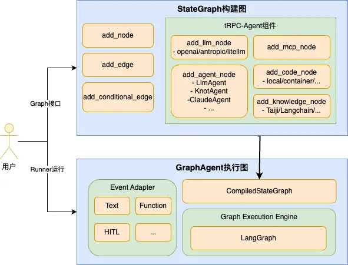
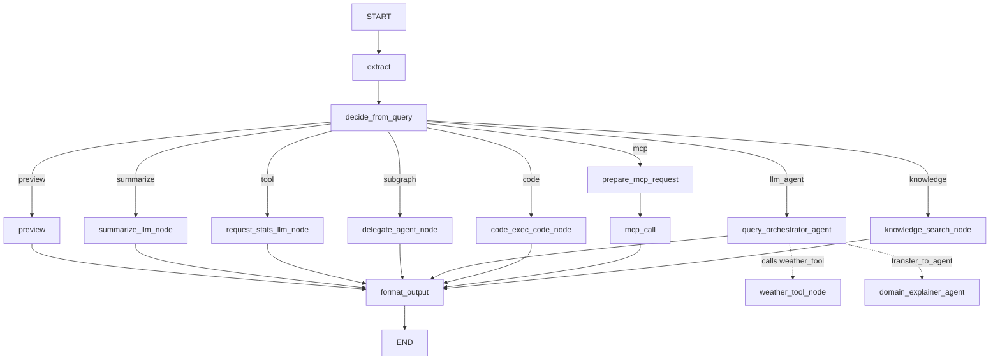

# Graph

## Introduction

In scenarios that require Agents to perform predictable tasks, workflows are typically orchestrated through Graphs. tRPC-Agent-Python now provides Graph capabilities that support not only orchestrating custom business Nodes, but also orchestrating various framework components (Agents, MCP, knowledge bases, code executors, etc.), enabling developers to quickly build workflows tailored to their use cases based on the framework's existing ecosystem.

## Architecture Design

As shown below, users build graphs through the Graph API provided by the framework. The framework's Graph supports general-purpose graph construction and allows integrating existing framework components or custom Agents into the graph. Graph execution is handled by GraphAgent, which wraps LangGraph as the underlying graph execution engine, making it production-ready.



## Environment Setup

It is recommended to configure your environment with the following constraints:

- **Custom nodes must be defined using `async def` to prevent issues caused by mixing synchronous and asynchronous code (e.g., blocking the EventLoop)**
- **Python version must be higher than 3.11 (3.12+ recommended)**: *This constraint is imposed by the graph execution engine LangGraph. The Graph engine wrapper requires nodes to stream various information during execution, a capability LangGraph supports on Python 3.11 and above*
- **LangGraph version 1.0.x stable release is recommended**


## Quick Start

The following example demonstrates how to build and run a Graph: using **add_conditional_edges** to route to different nodes (add_node, add_llm_node, add_agent_node) based on conditions.

```python
import os
from typing import Any

from typing_extensions import Annotated

from trpc_agent_sdk.agents import LlmAgent
from trpc_agent_sdk.models import OpenAIModel
from trpc_agent_sdk.tools import FunctionTool
from trpc_agent_sdk.types import GenerateContentConfig
from trpc_agent_sdk.dsl.graph import (
    GraphAgent,
    NodeConfig,
    STATE_KEY_LAST_RESPONSE,
    STATE_KEY_USER_INPUT,
    State,
    StateGraph,
    append_list,
)


# 1. Define the graph state: inherit from State, with business fields + Reducer fields
class DemoState(State):
    tool_result: str
    agent_reply: str
    # append_list reducer: automatically appends when multiple nodes write, without overwriting
    node_execution_history: Annotated[list[dict[str, Any]], append_list]


# 2. Define a regular function node (must be async def)
async def hello(state: DemoState) -> dict[str, Any]:
    """Entry node: prints a welcome message, the next hop is determined by conditional edges"""
    print("Hello from graph")
    return {}


# 3. Define a routing function: returns different route keys based on user input
def route_choice(state: DemoState) -> str:
    text = state[STATE_KEY_USER_INPUT].strip().lower()
    if "weather" in text:
        return "llm"       # Weather-related → route to llm_node
    return "agent"         # Others → route to agent_node


# 4. Define an output formatting node: writes upstream results to last_response for Runner to return
async def format_output(state: DemoState) -> dict[str, Any]:
    content = state.get("agent_reply") or state.get("tool_result") or "(No content)"
    return {STATE_KEY_LAST_RESPONSE: content}


# 5. Define a tool function for model function_call invocation in llm_node
async def weather_tool(location: str) -> dict[str, str]:
    return {"location": location, "weather": "sunny"}


def create_agent() -> GraphAgent:
    # Initialize the model (configured via environment variables)
    model = OpenAIModel(
        model_name=os.getenv("TRPC_AGENT_MODEL_NAME", "deepseek-chat"),
        api_key=os.getenv("TRPC_AGENT_API_KEY", ""),
        base_url=os.getenv("TRPC_AGENT_BASE_URL", ""),
    )
    weather = FunctionTool(weather_tool)
    tools = {"weather_tool": weather}

    # Build a sub-Agent to be integrated into the graph as an agent_node
    delegate_agent = LlmAgent(
        name="query_orchestrator",
        description="Agent called by graph agent_node",
        model=model,
        instruction="Answer user query briefly.",
        generate_content_config=GenerateContentConfig(
            temperature=0.2,
            max_output_tokens=200,
        )
    )

    # Build the graph
    graph = StateGraph(DemoState)

    # Regular function node: entry point, routes via conditional edges after printing
    graph.add_node(
        name="hello",
        action=hello,
        config=NodeConfig(name="hello", description="Say hello and route by user input"),
    )

    # LLM node: directly invokes the model, with a built-in loop for function_call → tool execution → backfill
    graph.add_llm_node(
        name="plan_with_llm",
        model=model,
        instruction="If weather is asked, call weather_tool; otherwise answer directly.",
        tools=tools,
        tool_parallel=False,
        max_tool_iterations=4,
        generation_config=GenerateContentConfig(
            temperature=0.2,
            max_output_tokens=200,
        ),
        config=NodeConfig(name="plan_with_llm", description="LLM node"),
    )

    # Agent node: integrates an existing LlmAgent as a node in the graph
    graph.add_agent_node(
        node_id="delegate_to_agent",
        agent=delegate_agent,
        config=NodeConfig(name="delegate_to_agent", description="Agent node"),
    )

    # Output formatting node
    graph.add_node(
        name="format_output",
        action=format_output,
        config=NodeConfig(name="format_output", description="Build final response"),
    )

    # Define edges
    graph.set_entry_point("hello")            # START → hello
    graph.set_finish_point("format_output")   # format_output → END

    # Conditional edges: routes to different nodes based on route_choice return value after hello
    graph.add_conditional_edges(
        source="hello",
        path=route_choice,
        path_map={"llm": "plan_with_llm", "agent": "delegate_to_agent"},
    )
    graph.add_edge(start="plan_with_llm", end="format_output")
    graph.add_edge(start="delegate_to_agent", end="format_output")

    # Compile the graph and wrap it as a GraphAgent for Runner execution
    return GraphAgent(
        name="graph_demo",
        description="Simple graph build demo",
        graph=graph.compile(),
    )
```

Execution method (Runner):

```python
import asyncio
import uuid

from trpc_agent_sdk.runners import Runner
from trpc_agent_sdk.sessions import InMemorySessionService
from trpc_agent_sdk.types import Content, Part


async def main() -> None:
    app_name = "graph_demo_app"
    user_id = "demo_user"
    session_id = str(uuid.uuid4())

    session_service = InMemorySessionService()
    await session_service.create_session(
        app_name=app_name,
        user_id=user_id,
        session_id=session_id,
        state={},
    )

    runner = Runner(
        app_name=app_name,
        agent=create_agent(),
        session_service=session_service,
    )

    content = Content(parts=[Part.from_text(text="What's the weather in Seattle?")])
    async for event in runner.run_async(user_id=user_id, session_id=session_id, new_message=content):
        if event.content and event.content.parts:
            for part in event.content.parts:
                if part.text:
                    print(part.text, end="", flush=True)

    await runner.close()


if __name__ == "__main__":
    asyncio.run(main())
```

**Complete Example:**
See [examples/graph](../../../examples/graph/README.md). This example provides a full demonstration of integrating various framework components, as shown below:



Input examples:

- subgraph: Please respond in a friendly tone. → Triggers the subgraph agent_node
- llm_agent: What's the weather in Seattle? → Triggers query_orchestrator_agent and invokes weather_tool (returns sunny as a fixed response)
- llm_agent: child: What is retrieval augmented generation? → Triggers query_orchestrator_agent, which delegates to its child domain_explainer_agent
- tool: Count words for this text. → Triggers an llm_node with tool invocation capability
- code: run python analysis → Triggers code_node, executing the built-in Python statistics script
- mcp: {"operation": "add", "a": 3, "b": 5} → Triggers mcp_node, invoking the local MCP Server's calculate tool via stdio
- knowledge: What is retrieval augmented generation? → Triggers knowledge_node, searching the knowledge base (requires `ENABLE_KNOWLEDGE` to be enabled)
- Long text (40+ words) → Triggers the summarize LLM node
- Short text → Triggers preview (streams output via EventWriter)

Multi-turn conversation example: [examples/graph_multi_turns](../../../examples/graph_multi_turns/README.md)

## StateGraph API Reference

The graph supports integrating various framework components through different `add_*` methods, allowing **models, tools, Agents, code execution, knowledge base retrieval, MCP tools**, and more to be incorporated into the graph, as shown below:


| Method | Purpose | Common Scenarios |
| --- | --- | --- |
| add_node(name, action, ...) | Add a general-purpose async function node | Business logic, data processing, pre-routing processing |
| add_llm_node(name, model, instruction, ...) | Add a node that directly invokes a model (with optional tool loop) | Classification, rewriting, summarization, tool-augmented QA |
| add_code_node(name, code_executor, code, language, ...) | Add a code execution node | Execute Python/Shell scripts and write results back to state |
| add_knowledge_node(name, query, tool, ...) | Add a knowledge retrieval node | RAG retrieval, pre-processing for knowledge base QA |
| add_mcp_node(name, mcp_toolset, selected_tool_name, req_src_node, ...) | Add an MCP tool invocation node | Invoke external MCP Server tools |
| add_agent_node(node_id, agent, ...) | Add a sub-Agent node | Multi-Agent collaboration, subprocess delegation |
| add_edge(start, end) | Add a static directed edge | Fixed execution path |
| add_conditional_edges(source, path, path_map) | Add a conditional routing edge | Intent routing, multi-branch workflows |
| set_entry_point(key) | Set the entry node (START -> key) | Specify workflow entry point |
| set_finish_point(key) | Set the finish node (key -> END) | Specify workflow exit point |
| compile(memory_saver_option=...) | Compile the graph and return an executable object | Final step before Runner execution |

The following sections describe how to add each type of node, applicable scenarios, and commonly used options.

### add_node

Scenario: Integrate a general-purpose async function node (pure business logic, data processing, routing decisions, etc.).

```python
graph.add_node(
    name="extract",
    action=extract_document,
    config=NodeConfig(name="extract", description="Extract input"),
)
```

Common options:
- name: Node ID (used for edge connections, routing, and callback identification)
- action: Must be `async def`
- config: Common configuration (name / description / metadata)
- callbacks: Set callbacks for the current node

### add_llm_node

Scenario: Directly invoke a model within a node; if tools are configured, the node will complete the function_call → tool execution → backfill function_response → re-invoke model loop within the same llm_node.

```python
from trpc_agent_sdk.tools import FunctionTool
from trpc_agent_sdk.types import GenerateContentConfig

async def my_tool(query: str) -> dict[str, str]:
    return {"result": f"Processed: {query}"}

tools = {"my_tool": FunctionTool(my_tool)}

graph.add_llm_node(
    name="classifier",
    model=model,
    instruction="Classify user intent into one label.",
    tools=tools,
    tool_parallel=False,
    max_tool_iterations=4,
    generation_config=GenerateContentConfig(
        temperature=0.1,
        max_output_tokens=64,
    ),
    config=NodeConfig(name="classifier", description="Intent classifier"),
)
```

Common options:
- tools: Tool dictionary (`{tool_name: tool_instance}`), pass `{}` when not needed
- tool_parallel: Whether multiple tool calls within the same round execute in parallel
- max_tool_iterations: Maximum number of model→tool loop iterations within a single llm_node
- generation_config: Model configuration (temperature, max_output_tokens, etc.)
- config / callbacks: Same as add_node

### add_code_node

Scenario: Execute a static code snippet (e.g., Python/Shell) within the graph, with results written to the built-in state; use `STATE_KEY_NODE_RESPONSES[name]` to retrieve the node's output.

```python
from trpc_agent_sdk.code_executors import UnsafeLocalCodeExecutor

graph.add_code_node(
    name="run_script",
    code_executor=UnsafeLocalCodeExecutor(timeout=30, work_dir="", clean_temp_files=True),
    code="result = 1 + 1",
    language="python",
    config=NodeConfig(name="run_script", description="Run inline code"),
)
```

Parameter descriptions:
- code_executor: A `BaseCodeExecutor` instance (e.g., `UnsafeLocalCodeExecutor`, `ContainerCodeExecutor`), constructed by the caller
- code: Source code to execute
- language: `python` / `bash` / `sh`
- config / callbacks: Same as add_node

### add_knowledge_node

Scenario: Integrate a knowledge retrieval node into the graph, using an existing `LangchainKnowledgeSearchTool` for retrieval, with results written to state.

```python
from trpc_agent_sdk.server.knowledge.tools import LangchainKnowledgeSearchTool
from trpc_agent_sdk.server.knowledge.trag_adapter import TragAuthParams
from trpc_agent_sdk.server.knowledge.trag_adapter import TragDocumentLoader
from trpc_agent_sdk.server.knowledge.trag_adapter import TragDocumentLoaderParams
from trpc_agent_sdk.server.knowledge.trag_knowledge import TragKnowledge


def _create_trag_knowledge(auth_params: TragAuthParams) -> TragKnowledge:
    document_loader = TragDocumentLoader(TragDocumentLoaderParams(file_paths=[]))
    return TragKnowledge(auth_params=auth_params, document_loader=document_loader)


# Build the knowledge tool: auth_params from your config (e.g. create_trag_auth_params_xxx())
auth_params = get_auth_params()  # from .config or TragAuthParams(...)
knowledge = _create_trag_knowledge(auth_params=auth_params)
my_knowledge_tool = LangchainKnowledgeSearchTool(
    rag=knowledge,
    top_k=5,
    min_score=0.0,
    knowledge_filter=None,  # optional static filter
)

graph.add_knowledge_node(
    name="search_kb",
    query="user_query",  # or callable: lambda state: state.get("query", ""),
    tool=my_knowledge_tool,
    config=NodeConfig(name="search_kb", description="Knowledge search"),
)
```

Common options:
- query: Retrieval query, can be a string or a callable `(state) -> str`
- tool: Pre-built `LangchainKnowledgeSearchTool` instance, must not be None
- config / callbacks: Same as add_node

### add_mcp_node

Scenario: Invoke a specific MCP tool within the graph; parameters are sourced from the upstream node's output written to `state[STATE_KEY_NODE_RESPONSES][req_src_node]`.

Note: An upstream node must first write MCP request parameters to `node_responses[req_src_node]`; execution failures will raise an error directly, facilitating troubleshooting of invalid requests.

```python
graph.add_mcp_node(
    name="call_mcp",
    mcp_toolset=my_mcp_toolset,
    selected_tool_name="my_mcp_tool",
    req_src_node="build_request",
    config=NodeConfig(name="call_mcp", description="Invoke MCP tool"),
)
```

Common options:
- mcp_toolset: A configured `MCPToolset` instance
- selected_tool_name: The name of the MCP tool to invoke (exact match)
- req_src_node: The upstream node ID that provides request parameters (its output is in `node_responses[req_src_node]`)
- config / callbacks: Same as add_node

### add_agent_node

Scenario: Integrate any BaseAgent (e.g., LlmAgent/GraphAgent) as a node in the graph.

```python
graph.add_agent_node(
    node_id="delegate",
    agent=delegate_agent,
    isolated_messages=True,
    input_from_last_response=False,
    event_scope="delegate_scope",
    input_mapper=StateMapper.rename({"query_text": STATE_KEY_USER_INPUT}),
    output_mapper=StateMapper.merge_response("delegate_reply"),
    config=NodeConfig(name="delegate", description="Delegate to child agent"),
)
```

Common options:
- isolated_messages: Whether to isolate the parent session's message history
- input_from_last_response: Whether to map the parent state's last_response as the child node's user_input
- event_scope: Event branch prefix for the child Agent
- input_mapper / output_mapper: Parent-child state mapping (explicit configuration recommended)
- config / callbacks: Same as add_node

GraphAgent does not require (nor support) registering Agent nodes via sub_agents; composition relationships are handled uniformly through add_agent_node.

## Advanced Usage

This section covers advanced topics including edges and routing, state and Reducers, compilation and execution, node signatures, StateMapper, callbacks, state key constants, and Interrupt.

### Edges and Routing

Scenario: Use add_edge for static paths and add_conditional_edges for conditional branching; entry/exit points can be set using set_entry_point / set_finish_point as shorthands. If **input preprocessing** is needed before routing (e.g., a prepare_input node for validation or normalizing user_input), insert an add_node after the entry point and connect it to the conditional edges.

```python
graph.add_edge(start="extract", end="decide")

graph.add_conditional_edges(
    source="decide",
    path=route_choice,
    path_map={
        "preview": "preview",
        "summarize": "summarize",
    },
)

graph.set_entry_point("extract")
graph.set_finish_point("format_output")
```

- add_edge(start, end): A directed edge from start to end
- add_conditional_edges(source, path, path_map): path(state) returns the next hop key, path_map maps keys to node names
- set_entry_point(key): Equivalent to add_edge(START, key)
- set_finish_point(key): Equivalent to add_edge(key, END)

### State and Reducer Usage

The Graph state is a TypedDict (State) passed between nodes. Recommended practices:

- Inherit from the framework's State to define business fields
- For fields that are "cumulatively updated by multiple nodes", use Annotated[..., reducer]
- Nodes return dict deltas, and the framework merges them according to reducer rules

**Defining State:**

```python
from typing import Any

from google.genai.types import Content
from typing_extensions import Annotated

from trpc_agent_sdk.dsl.graph import (
    State,
    append_list,
    merge_dict,
    messages_reducer,
)


class ArticleState(State):
    article: str
    summary: str

    execution_log: Annotated[list[dict[str, Any]], append_list]
    node_outputs: Annotated[dict[str, Any], merge_dict]
    messages: Annotated[list[Content], messages_reducer]
```

**Reducer behaviors:** append_list (append to list), merge_dict (shallow merge dictionary), messages_reducer (append to message list). Fields like route and summary that are written by a single node do not need Annotated.

### Compilation and Execution

After the graph is built, call `compile`; checkpoint persistence can be optionally configured.

```python
compiled = graph.compile(
    memory_saver_option=MemorySaverOption(
        auto_persist=False,
        persist_writes=False,
    ),
)
agent = GraphAgent(
    name="my_workflow",
    description="My graph workflow",
    graph=compiled,
)
```

Notes:
- After compilation, a `CompiledStateGraph` is obtained. It should be passed to GraphAgent's `graph` parameter and executed via Runner (see "Quick Start" above), rather than calling `compiled.astream(...)` directly.
- To access the compilation result: use `compiled.source` to retrieve the original StateGraph, and `compiled.get_node_config(name)` to look up configuration by node name.
- When constructing the graph, you can attach unified before/after/error callbacks (for logging, inspection, metrics) to the entire graph via `StateGraph(MyState, callbacks=global_callbacks)`.
- During Runner execution, the primary path for state persistence is Event.actions.state_delta → SessionService. When using InMemorySessionService, state is not retained after process restart; when using persistent SessionService implementations like Redis/SQL, distributed deployment is supported.

### Node Signatures and Dependency Injection

Node definitions must be async methods, i.e., `async def`.

The Graph automatically injects capabilities based on the method signature. Common signatures are as follows:

```python
async def node(state: State) -> dict: ...
async def node(state: State, writer: EventWriter) -> dict: ...
async def node(state: State, async_writer: AsyncEventWriter) -> dict: ...
async def node(state: State, ctx: InvocationContext) -> dict: ...
async def node(state: State, writer: EventWriter, ctx: InvocationContext) -> dict: ...
async def node(state: State, async_writer: AsyncEventWriter, ctx: InvocationContext) -> dict: ...
async def node(state: State, writer: EventWriter, async_writer: AsyncEventWriter, ctx: InvocationContext) -> dict: ...
async def node(state: State, callback_ctx, callbacks) -> dict: ...
```

Notes:
- writer: Writes events synchronously
- async_writer: Used when await-based control over event flushing is needed
- ctx: Reads session / user_id / session_id, etc.
- callback_ctx / callbacks: Fine-grained callbacks within a node (advanced usage)

### StateMapper (Input/Output Mapping for add_agent_node)

StateMapper is used to explicitly control the data flow of agent_nodes, consisting of two steps:

- input_mapper: Graph State -> Agent Node input State
- output_mapper: Agent Node result -> Graph State update

The following example illustrates this:

- The Graph state before invoking the Agent Node contains: {"query_text": "What is RAG?", "route": "llm_agent"}
- The Agent Node only recognizes STATE_KEY_USER_INPUT (i.e., user_input)
- After the Agent Node completes execution, we want to write its final response back to the Graph's query_reply

```python
from trpc_agent_sdk.dsl.graph import StateMapper, STATE_KEY_USER_INPUT

graph.add_agent_node(
    node_id="query_orchestrator",
    agent=orchestrator_agent,
    input_mapper=StateMapper.rename({"query_text": STATE_KEY_USER_INPUT}),
    output_mapper=StateMapper.merge_response("query_reply"),
)
```

The effect of the above configuration is:

- Before invoking the Agent Node: Renames the Graph's query_text to the Agent Node's user_input
- After the Agent Node finishes: Writes the Agent Node's last_response to the Graph's query_reply

For more fine-grained control, the following mappers can be combined:

- pick: Only pass whitelisted fields to the child node. For example, `StateMapper.pick("query", "context")` only passes query and context from the parent state to the child Agent, discarding all other fields.
- exclude: Exclude specified fields, passing all others to the child node. For example, `StateMapper.exclude("api_key", "password")` passes the entire parent state except api_key and password to the child Agent.
- rename: Maps parent state key names to child node key names in the format `{parent_key: child_key}`. For example, `StateMapper.rename({"query_text": STATE_KEY_USER_INPUT, "docs": "context"})` maps the parent state's query_text to the child node's user_input, and docs to context.
- combine: Combines multiple input mappers, with results merged as a union; for duplicate keys, the latter overrides the former. For example, `StateMapper.combine(StateMapper.pick("context"), StateMapper.rename({"query_text": STATE_KEY_USER_INPUT}))` first takes the context field, then renames query_text to user_input, and merges both to pass to the child node.
- merge_response: Writes the child node's last_response to a specified field in the parent state; used only for output_mapper. For example, `StateMapper.merge_response("search_results")` writes the child Agent's response to the parent state's search_results.
- identity: Passes the parent state through as-is, without any trimming or renaming. For example, `StateMapper.identity()` passes the full parent state to the child Agent.
- filter_keys: Filters the parent state's keys by a predicate function. For example, `StateMapper.filter_keys(lambda k: k.startswith("user_"))` only passes fields starting with `user_` to the child node.

### NodeCallbacks

NodeCallbacks allows injecting logging, inspection, or other instrumentation before and after node execution, with two levels of granularity:

- Graph-level: StateGraph(..., callbacks=global_callbacks), applies to all nodes in the graph
- Node-level: add_node(..., callbacks=node_callbacks), applies only to the current node

```python
from trpc_agent_sdk.dsl.graph import NodeCallbacks, StateGraph


global_callbacks = NodeCallbacks()
node_callbacks = NodeCallbacks()


async def before_node(ctx, state):
    print(f"[before] step={ctx.step_number} node={ctx.node_id}")
    return None


async def after_node(ctx, state, result, error):
    print(f"[after ] step={ctx.step_number} node={ctx.node_id}")
    return None


global_callbacks.register_before_node(before_node)
node_callbacks.register_after_node(after_node)

graph = StateGraph(MyState, callbacks=global_callbacks)
graph.add_node(name="extract", action=extract_node, callbacks=node_callbacks)
```

Common callback types:

- register_before_node
- register_after_node
- register_on_error
- register_agent_event

Callback merge rules:

- before_node / on_error: Graph-level executes first, then node-level
- after_node: Node-level executes first, then graph-level (so that node-level can modify the output first)

### State Key Constants and Access Patterns

The Graph module provides a set of built-in state key constants. It is recommended to use these constants consistently for reading and writing state, avoiding hardcoded strings scattered throughout business code.

### Constant Key Reference Table

| Constant | Actual Key | Description |
| --- | --- | --- |
| `STATE_KEY_USER_INPUT` | `user_input` | Current turn's user input |
| `STATE_KEY_MESSAGES` | `messages` | Session message list |
| `STATE_KEY_LAST_RESPONSE` | `last_response` | Most recent response text |
| `STATE_KEY_LAST_RESPONSE_ID` | `last_response_id` | Most recent response ID |
| `STATE_KEY_LAST_TOOL_RESPONSE` | `last_tool_response` | Most recent tool execution result |
| `STATE_KEY_NODE_RESPONSES` | `node_responses` | Aggregated responses by node |
| `STATE_KEY_NODE_STRUCTURED` | `node_structured` | Aggregated structured results by node |

### Reading State During Graph Execution

```python
from trpc_agent_sdk.dsl.graph import (
    State,
    STATE_KEY_USER_INPUT,
    STATE_KEY_LAST_RESPONSE,
    STATE_KEY_NODE_RESPONSES,
)


async def inspect_state_node(state: State) -> dict[str, str]:
    user_input = state.get(STATE_KEY_USER_INPUT, "")
    last_response = state.get(STATE_KEY_LAST_RESPONSE, "")
    summarize_text = state.get(STATE_KEY_NODE_RESPONSES, {}).get("summarize", "")
    return {
        "echo_input": user_input,
        "debug_last_response": last_response,
        "debug_summarize_text": summarize_text,
    }
```

### Reading State Outside the Graph

```python
from trpc_agent_sdk.dsl.graph import STATE_KEY_LAST_RESPONSE, STATE_KEY_NODE_RESPONSES


session = await session_service.get_session(
    app_name=app_name,
    user_id=user_id,
    session_id=session_id,
)

if session and session.state:
    last_response = session.state.get(STATE_KEY_LAST_RESPONSE, "")
    node_responses = session.state.get(STATE_KEY_NODE_RESPONSES, {})
```

### Interrupt

The Graph provides interrupt(...), which can pause execution within a node and wait for an external decision:

```python
from trpc_agent_sdk.dsl.graph import interrupt


async def approval_gate(state: State) -> dict[str, Any]:
    decision = interrupt({
        "title": "Approval Required",
        "options": ["approved", "rejected"],
    })
    status = "approved"
    if isinstance(decision, dict):
        status = str(decision.get("status", "approved"))
    return {"approval_status": status}
```

The Runner side will receive a LongRunningEvent, and the client resumes via FunctionResponse:

```python
from trpc_agent_sdk.events import LongRunningEvent
from trpc_agent_sdk.types import Content, FunctionResponse, Part

async for event in runner.run_async(...):
    if isinstance(event, LongRunningEvent):
        resume_payload = {"status": "approved", "note": "Proceed"}
        resume_response = FunctionResponse(
            id=event.function_response.id,
            name=event.function_response.name,
            response=resume_payload,
        )
        resume_content = Content(role="user", parts=[Part(function_response=resume_response)])

        async for _ in runner.run_async(..., new_message=resume_content):
            pass
```

**Complete Example:**
- [examples/graph_with_interrupt](../../../examples/graph_with_interrupt/README.md) - Interrupt + Resume example
