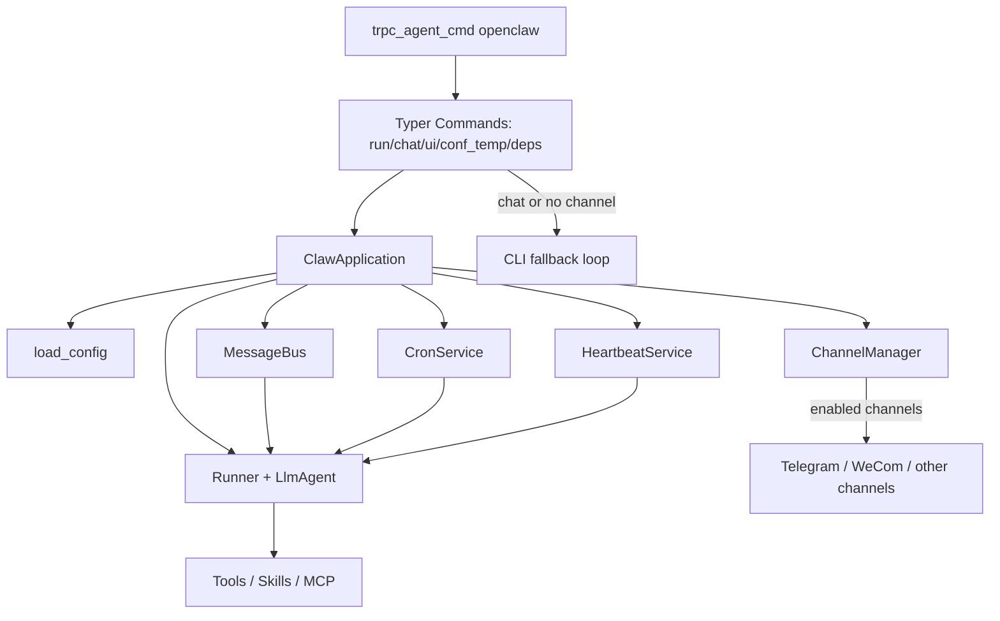

# OpenClaw (trpc-claw)

`openclaw` is an agent runtime built on top of `trpc_agent_sdk` and `nanobot`, supporting:

- Third-party channel integrations (for example: Telegram / WeCom and other channels supported by nanobot). OpenClaw supports all of these channels. See [nanobot/channels](https://github.com/HKUDS/nanobot/tree/main/nanobot/channels).
- Local CLI fallback mode
- Tool invocation (file, shell, web, messaging, scheduled tasks, MCP, skills)
- Session/memory management and summarization
- Heartbeat/Cron scheduled execution

Default workspace: `~/.trpc_agent_claw/workspace`

## Core Capabilities

- **Unified processing pipeline**: whether messages come from Telegram / WeCom or local CLI, they all flow through the same `MessageBus -> Runner -> Agent` pipeline
- **Two run modes**
  - `run`: use gateway when channels are available; automatically fall back to CLI when none are enabled
  - `chat`: force local CLI mode
- **Extensible tool system**: built-in file tools, command execution, web tools, messaging, cron, MCP, and skills
- **Long-running operation support**: heartbeat and cron can trigger tasks even without active user interactions

## Architecture Diagram



## Installation and Startup

### 1) Environment Preparation

- Python `>=3.10` (recommended `3.12`)
- Use a virtual environment (`uv` or `venv`)

```bash
uv venv
source .venv/bin/activate
python -V
```

### 2) CLI Entry Point

Current recommended command entry point (aligned with the repository state):

```bash
trpc_agent_cmd openclaw --help
```

> Note: older docs may mention `trpc-claw-py`; use `trpc_agent_cmd openclaw` as the authoritative command.

### 3) Generate Config Templates

```bash
mkdir -p ~/.trpc_agent_claw

# Minimal template
trpc_agent_cmd openclaw conf_temp > ~/.trpc_agent_claw/config.yaml

# Full template (recommended)
trpc_agent_cmd openclaw conf_temp --full > ~/.trpc_agent_claw/config_full.yaml
```

### 4) Startup Modes

```bash
# Auto mode: use gateway if channels are available; otherwise fall back to CLI
trpc_agent_cmd openclaw run -c ~/.trpc_agent_claw/config_full.yaml

# Force local CLI interaction
trpc_agent_cmd openclaw chat -c ~/.trpc_agent_claw/config_full.yaml

# Start UI
trpc_agent_cmd openclaw ui -c ~/.trpc_agent_claw/config_full.yaml
```

## Command Reference

- `trpc_agent_cmd openclaw conf_temp [--full]`
  - Print built-in config templates (`config.temp.yaml` / `config_full.temp.yaml`)
- `trpc_agent_cmd openclaw run [-w WORKSPACE] [-c CONFIG]`
  - Start gateway mode; automatically fall back to CLI if no third-party channel is available
- `trpc_agent_cmd openclaw chat [-w WORKSPACE] [-c CONFIG]`
  - Always use local CLI mode and ignore third-party channels
- `trpc_agent_cmd openclaw ui [-w WORKSPACE] [-c CONFIG]`
  - Start UI (macOS desktop app, browser on other systems)
- `trpc_agent_cmd openclaw deps [OPTIONS]`
  - Inspect skill dependencies and output an installation plan; supports `--apply` to execute install commands

### `deps` Subcommand (New Capability)

```bash
# Inspect by profile (recommended)
trpc_agent_cmd openclaw deps \
  -c ~/.trpc_agent_claw/config_full.yaml \
  --profile common-file-tools

# Inspect by skill
trpc_agent_cmd openclaw deps \
  -c ~/.trpc_agent_claw/config_full.yaml \
  --skills knot-skill-finder

# Output JSON
trpc_agent_cmd openclaw deps \
  -c ~/.trpc_agent_claw/config_full.yaml \
  --profile common-file-tools \
  --json

# Execute the installation plan directly
trpc_agent_cmd openclaw deps \
  -c ~/.trpc_agent_claw/config_full.yaml \
  --profile common-file-tools \
  --apply
```

Common options:

- `--profile`: dependency profile(s) (comma-separated)
- `--skills/-s`: inspect dependencies by skill name (comma-separated)
- `--state-dir`: toolchain state directory (alignment parameter)
- `--skills-root`: override skills root
- `--skills-extra-dirs`: extra skills roots (comma-separated)
- `--skills-allow-bundled`: override bundled skill allowlist
- `--continue-on-error/--fail-fast`: installation execution strategy

## Config File

Configuration supports `YAML/JSON`, default lookup path:

- `~/.trpc_agent_claw/config.json`

You can override via:

- CLI argument: `-c/--config`
- Environment variable: `TRPC_AGENT_CLAW_CONFIG`

Example:

```bash
export TRPC_AGENT_CLAW_CONFIG=/path/to/config.yaml
trpc_agent_cmd openclaw chat
```

## Key Config Sections (Current Implementation)

### runtime

- `app_name`: runtime app name
- `user_id`: default user ID
- `legacy_sessions_dir`: compatibility path for legacy session storage

### agent

- `workspace`: workspace directory (falls back to default when empty)
- `model`: model name (recommended via `TRPC_AGENT_MODEL_NAME`)
- `api_key`: model API key (recommended via `TRPC_AGENT_API_KEY`)
- `api_base`: model base URL (recommended via `TRPC_AGENT_BASE_URL`)
- `provider/max_tokens/context_window_tokens/...`: model behavior and cost-related settings

### channels

- `send_progress`: whether to push streaming progress
- `send_tool_hints`: whether to push tool hints
- `telegram.*`: Telegram channel config
- `wecom.*`: WeCom channel config
  - `stream_reply`: whether to send stream chunks
  - `restart_command`: command for worker process restart + config reload (default `/restart`)

### skills (Important Updates)

Fields currently used by `openclaw`:

- `sandbox_type`: currently supports `local` / `container`
- `skill_roots`: user skill roots (supports local dirs, `file://`, `http(s)://`)
- `builtin_skill_roots`: built-in skill roots
- `config_keys`: used to satisfy `requires.config` in skill metadata
- `allow_bundled`: allowlist when only selected built-in skills should be exposed (by `skill_key` or `name`)
- `skill_configs`: runtime config by `skill_key` or `name`
  - `enabled`
  - `env` (now unified as env-only; `api_key/primary_env` mapping is removed)
- `local_config` / `container_config`: sandbox-specific config
- `run_tool_kwargs`: passthrough runtime args for `skill_run`

Example:

```yaml
skills:
  sandbox_type: container
  skill_roots: []
  builtin_skill_roots: []
  config_keys:
    - knot.enabled
    - knot
  allow_bundled:
    - knot.skill.finder
    - knot-skill-finder
  skill_configs:
    knot-skill-finder:
      enabled: true
      env:
        KNOT_USERNAME: ${KNOT_USERNAME}
        KNOT_API_TOKEN: ${KNOT_API_TOKEN}
```

### tools

- `restrict_to_workspace`: restrict tools to operate inside workspace only
- `exec.timeout` / `exec.path_append`: command execution config
- `web.search`: search provider config (`brave`/`tavily`/`duckduckgo`/`searxng`/`jina`)
- `mcp_servers`: MCP server list (stdio/http)

### memory / storage / logger / personal

- `memory.memory_service_config.ttl`: memory TTL policy
- `storage`: `file` / `redis` / `sql`
- `logger`: logging config
- `personal`: override paths for `SOUL.md/USER.md/TOOLS.md/AGENTS.md`

## Recommended Environment Variables

- `TRPC_AGENT_API_KEY`
- `TRPC_AGENT_BASE_URL`
- `TRPC_AGENT_MODEL_NAME`
- `WECOM_BOT_ID`
- `WECOM_BOT_SECRET`
- `TELEGRAM_BOT_TOKEN`

## Default Directories

- Config directory: `~/.trpc_agent_claw/`
- Workspace: `~/.trpc_agent_claw/workspace`

## Integrate with ClawBot

### WeCom

After creating a WeCom bot, get `BotID/BotSecret` and configure:

```yaml
channels:
  wecom:
    enabled: true
    bot_id: ${WECOM_BOT_ID}
    secret: ${WECOM_BOT_SECRET}
    stream_reply: true
    restart_command: /restart
```

Start:

```bash
export TRPC_AGENT_API_KEY=xxx
export TRPC_AGENT_BASE_URL=xxx
export TRPC_AGENT_MODEL_NAME=xxx
export WECOM_BOT_ID=xxx
export WECOM_BOT_SECRET=xxx
trpc_agent_cmd openclaw run -c ~/.trpc_agent_claw/config_full.yaml
```


### Telegram

Reference: https://cloud.tencent.com/developer/article/2626214

```yaml
channels:
  telegram:
    enabled: true
    token: ${TELEGRAM_BOT_TOKEN}
```

Start:

```bash
export TELEGRAM_BOT_TOKEN=xxx
trpc_agent_cmd openclaw run -c ~/.trpc_agent_claw/config_full.yaml
```


## Advanced Features

### 1) Multiple Storage Backends (`storage`)

```yaml
storage:
  type: redis # file | redis | sql
  redis:
    url: redis://127.0.0.1:6379
    is_async: false
    password: ""
    db: 0
    kwargs: {}
```

```yaml
storage:
  type: sql
  sql:
    url: sqlite:///./session_memory.db
    is_async: false
    kwargs: {}
```

Notes:

- `type=file`: short-term sessions are persisted by default to `workspace/sessions/*.jsonl`
- `type=redis/sql`: short-term sessions and memory can use shared backends

### 2) Memory TTL (`memory.memory_service_config.ttl`)

```yaml
memory:
  memory_service_config:
    enabled: true
    ttl:
      enable: true
      ttl_seconds: 86400
      cleanup_interval_seconds: 3600
      update_time: 0.0
```

### 3) Agent Advanced Parameters (`agent`)

```yaml
agent:
  provider: auto
  max_tokens: 8192
  context_window_tokens: 65536
  temperature: 0.1
  max_tool_iterations: 40
  reasoning_effort: null # low | medium | high
  extra_headers: {}
```

### 4) MCP Server Integration (`tools.mcp_servers`)

```yaml
tools:
  mcp_servers:
    fs:
      type: stdio
      command: npx
      args: ["-y", "@modelcontextprotocol/server-filesystem", "/tmp"]
      env: {}
      tool_timeout: 30
      enabled_tools: ["*"]
```

### 5) Search Provider Extension (`tools.web.search`)

```yaml
tools:
  web:
    search:
      provider: brave # brave | tavily | duckduckgo | searxng | jina
      api_key: ""
      base_url: ""
      max_results: 5
```

### 6) Logging and Personal Prompt Files

```yaml
logger:
  name: trpc-claw
  log_file: trpc_claw.log
  log_level: INFO
  log_format: "[%(asctime)s][%(levelname)s][%(name)s][%(pathname)s:%(lineno)d][%(process)d] %(message)s"
```

```yaml
personal:
  soul_file: /path/to/SOUL.md
  user_file: /path/to/USER.md
  tool_file: /path/to/TOOLS.md
  agent_file: /path/to/AGENTS.md
```

## Directory Reference (Current Repository)

- [`trpc_agent_sdk/server/openclaw/_cli.py`](../../../trpc_agent_sdk/server/openclaw/_cli.py): OpenClaw CLI commands
- [`trpc_agent_sdk/server/openclaw/claw.py`](../../../trpc_agent_sdk/server/openclaw/claw.py): runtime orchestration core
- [`trpc_agent_sdk/server/openclaw/config/`](../../../trpc_agent_sdk/server/openclaw/config/): config models and loading logic
- [`trpc_agent_sdk/server/openclaw/channels/`](../../../trpc_agent_sdk/server/openclaw/channels/): channel adapters (Telegram / WeCom)
- [`trpc_agent_sdk/server/openclaw/tools/`](../../../trpc_agent_sdk/server/openclaw/tools/): tool implementations
- [`trpc_agent_sdk/server/openclaw/skill/`](../../../trpc_agent_sdk/server/openclaw/skill/): skill system (loading, parsing, dependency inspection)
- [`trpc_agent_sdk/server/openclaw/service/`](../../../trpc_agent_sdk/server/openclaw/service/): Cron / Heartbeat services
