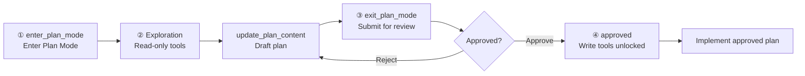

# Plan Mode

Plan Mode adds a **design-then-implement** workflow to `LlmAgent`: during planning, the model may only use read-only tools and draft a plan document; write-capable tools stay blocked until a human approves the plan via Human-In-The-Loop (HITL).

It pairs naturally with `SpawnSubAgentTool` (`EXPLORE_AGENT` / `PLAN_AGENT`) for codebase research and solution design, and with `TodoWriteTool` or `TaskToolSet` after approval to track implementation progress.

## What It Solves

A typical coding agent may start editing files immediately and change direction mid-flight. Plan Mode splits the workflow into two phases:

1. **Planning** — explore with read-only tools (`Read` / `Grep` / `Glob`), spawn read-only sub-agents (`Explore` / `Plan`), write the plan via `update_plan_content`, and ask clarifying questions. Side-effect tools (`Write` / `Edit` / `Bash`, `todo_write`, `task_create`, etc.) are gated.
2. **Implementation** — after human approval, write tools unlock and the model implements against the approved plan.

Three human-touch points — `enter_plan_mode`, `exit_plan_mode`, and `ask_user_question` — are `LongRunningFunctionTool`s. Execution pauses until the host resumes with a tool function response. See [Human in the Loop](./human_in_the_loop.md) for the general HITL mechanism.

## Why It Matters

One of the biggest risks for a coding agent is not writing buggy code — it is **building the wrong thing correctly**. When a user says "refactor the auth module", the agent might choose JWT while the user had OAuth2 in mind. If the agent starts implementing immediately, a dozen files may already be changed before the mismatch is discovered.

Plan Mode addresses **intent alignment**: before any code is modified, the agent explores the codebase, drafts a plan, and obtains human approval. This is not a simple "ask before doing" flag — it is a full state machine involving:

- Write-tool gate (permission-level behavioural constraint)
- Plan document persistence (alignment artefact)
- Workflow prompt injection
- Two HITL checkpoints (enter + exit)
- UI Plan toggle integration (`agent_mode=plan`)

## Solution: Four-Step Closed Loop

Plan Mode introduces a **read-only phase** in the conversation, closed by two long-running tools — `enter_plan_mode` and `exit_plan_mode`:

| Step | Name | Behaviour |
| --- | --- | --- |
| 1 | **Enter Plan Mode** | The model decides planning is needed, or the user selects Plan Mode in the UI; calls `enter_plan_mode` (HITL: user must confirm entry) |
| 2 | **Exploration** | Permission constraint is read-only: only `Read` / `Grep` / `Glob`, read-only sub-agents (`Explore` / `Plan`), and `update_plan_content` are allowed; all writes are intercepted in `before_tool` |
| 3 | **Submit for approval** | After exploration, calls `exit_plan_mode` and submits the plan document for human review (HITL: approve or reject) |
| 4 | **Resume execution** | On approval, status becomes `approved`, the write gate lifts, and the agent implements with full tool permissions |



```text
User / model                   HITL                 Read-only gate         HITL              Full access
    │                           │                       │                   │                  │
    ▼                           ▼                       ▼                   ▼                  ▼
enter_plan_mode  ──approve──▶  exploring/drafting  ──draft──▶  exit_plan_mode  ──approve──▶  approved → Write/Edit/...
```

## Key Design Decisions

From an engineering perspective, Plan Mode embodies three core decisions (aligned with the Claude Code Plan Mode philosophy; mapped to tRPC-Agent-Python as follows):

### 1. Permission mode as behavioural constraint

Once in Plan Mode, the tool surface is restricted to read-only operations — **not** via a prompt like "please do not edit files", but by intercepting write tool calls in `before_tool` before execution (`PLAN_MODE_GATE` error). Sub-agents are constrained too: `spawn_subagent` only allows `Explore` / `Plan` archetypes so the parent cannot delegate write-capable tool surfaces.

### 2. Plan document as alignment artefact

The plan is not ephemeral chat text — it is a persisted **Markdown artefact** (`PlanRecord.content`) stored in session state (`plan[:branch]`) and surviving across `Runner.run_async` calls. Reviewers can edit the plan on approval (pass `content` in the `exit_plan_mode` resume payload); AG-UI exposes it via `STATE_SNAPSHOT` for a live plan panel, keeping remote sessions and local UI aligned.

### 3. State machine, not a boolean flag

Plan Mode is not a simple `isPlanMode` switch. It is a full transition chain (`PlanStatus`) — enter, explore, draft, approve, exit, recover — where each transition has side effects:

| Transition | Side effect |
| --- | --- |
| `enter_plan_mode` approved | Create `PlanRecord`, enter `exploring`, enable write gate |
| `update_plan_content` | `exploring` → `drafting`, append/replace plan body |
| `exit_plan_mode` | → `pending_approval`, pause for review |
| Approve | → `approved`, disable write gate, release plan lock |
| Reject | → `drafting`, allow revision and resubmission |

## Architecture

```
orchestrator (LlmAgent + setup_plan)
├── business tools (e.g. FileToolSet, SpawnSubAgentTool, TodoWriteTool)
└── PlanToolSet (mounted by setup_plan)
    ├── enter_plan_mode      (LongRunningFunctionTool — HITL)
    ├── update_plan_content
    ├── exit_plan_mode       (LongRunningFunctionTool — HITL)
    └── ask_user_question    (LongRunningFunctionTool — HITL)

_PlanCallbacks (before_model / before_tool)
├── inject plan / awareness prompts
├── process HITL resume payloads
├── auto-enter when session state signals UI Plan toggle
└── block write tools while plan gate is active
```

- The plan document is persisted in the **main agent session** at `state["plan[:<branch>]"]` (default prefix `plan`).
- Spawned sub-agents return text only; they do not mutate the parent's plan state.

## State Machine

| Status | Meaning | Write gate |
| --- | --- | --- |
| `pending_enter` | Waiting for human to confirm entering Plan Mode | Active |
| `exploring` | Read-only exploration | Active |
| `drafting` | Plan content being written | Active |
| `pending_approval` | Plan submitted, awaiting human review | Active |
| `approved` | Human approved; implementation may begin | **Off** |

Typical flow:

```text
enter_plan_mode (HITL) → exploring → update_plan_content → drafting
    → exit_plan_mode (HITL) → pending_approval
    → approved → implement with write tools
```

If the human rejects at `exit_plan_mode`, status returns to `drafting` for revision.

## Features

- **Session-scoped plan artifact** — `PlanRecord` serialised as JSON in session state; survives across `Runner.run_async` calls
- **Write gate** — `before_tool` blocks tools in `DEFAULT_WRITE_TOOL_NAMES` while the gate is active
- **Sub-agent restrictions** — `spawn_subagent` limited to read-only archetypes (`Explore`, `Plan`); `dynamic_subagent` must explicitly restrict `tools` to a read-only subset
- **Prompt injection** — awareness prompt when no active plan; full Plan Mode prompt while gate is active
- **HITL tools** — three long-running tools pause for human input; resume handled in `before_model`
- **UI auto-enter** — when session state `agent_mode=plan`, auto-enters Plan Mode and hides `enter_plan_mode` from the tool schema
- **Idempotent HITL resume** — only the latest user turn's function responses are applied; stale rejections in history are not replayed
- **Concurrency safety** — plan tools use `plan_store_lock` (per session + branch) for load → mutate → save

## Comparison with Todo / Task / Goal

| Dimension | TodoWriteTool | TaskToolSet | Goal | **Plan Mode** |
| --- | --- | --- | --- | --- |
| Purpose | Step checklist | Task board + dependencies | Session completion contract | **Design doc + approval before writes** |
| Human approval | No | No | No (enforcement only) | **Yes (enter + exit HITL)** |
| Blocks write tools | No (prompt only) | No | No | **Yes (code-enforced gate)** |
| State key | `todos[:branch]` | `tasks[:branch]` | `goal[:branch]` | `plan[:branch]` |
| Typical use | Track steps after plan | Long boards, dependencies | "Is the whole job done?" | **Explore → draft → approve → implement** |

> Todo / Task track execution steps; Goal enforces completion; **Plan Mode gates side effects until a human signs off on the design.**

## PlanOptions

Configure via `setup_plan(agent, PlanOptions(...))`:

| Parameter | Type | Default | Description |
| --- | --- | --- | --- |
| `state_key_prefix` | `str` | `"plan"` | Session state key prefix; do not use `temp:` |
| `plan_prompt` | `str` | `DEFAULT_PLAN_MODE_PROMPT` | Injected while gate is active |
| `awareness_prompt` | `str` | `DEFAULT_PLAN_AWARENESS_PROMPT` | Injected when no active plan |
| `write_tool_names` | `FrozenSet[str]` | `DEFAULT_WRITE_TOOL_NAMES` | Tool names blocked during gate; extend for MCP / custom write tools |
| `inject_prompt` | `bool` | `True` | Inject plan prompt when gate active |
| `inject_awareness` | `bool` | `True` | Inject awareness prompt otherwise |
| `force_enter_plan_state_key` | `Optional[str]` | `"agent_mode"` | Session key for UI-driven auto-enter; `None` disables |
| `force_enter_plan_state_value` | `str` | `"plan"` | Value that triggers auto-enter |
| `on_approval` | `Callable` | `None` | Callback on `exit_plan_mode` approve / reject |
| `readonly_subagent_types` | `FrozenSet[str]` | `{"Explore", "Plan"}` | Allowed `spawn_subagent` archetypes during gate |
| `readonly_tool_names` | `FrozenSet[str]` | `{"Read", "Grep", "Glob", "webfetch", "websearch"}` | Allowed `dynamic_subagent` tool subset |

> Call `setup_plan()` **once** per agent. Repeated calls append duplicate toolsets and callbacks.

## Tools

### `enter_plan_mode` (LongRunningFunctionTool)

Request human confirmation before entering Plan Mode.

| Parameter | Required | Description |
| --- | --- | --- |
| `objective` | Yes | Short description of what to plan |

Returns `{status: "pending_enter", message, objective, plan_id, approval_id, ...}`. Resume with `{status: "approved"}` or `{status: "rejected", reviewer_note?: "..."}`.

Omitted from the tool schema when `agent_mode=plan` is set or a plan gate is already active.

### `update_plan_content`

Append or replace Markdown plan text.

| Parameter | Required | Description |
| --- | --- | --- |
| `content` | Yes | Plan Markdown |
| `mode` | No | `"append"` (default) or `"replace"` |

Moves status `exploring` → `drafting` on first write.

### `exit_plan_mode` (LongRunningFunctionTool)

Submit the plan for human approval.

| Parameter | Required | Description |
| --- | --- | --- |
| `summary` | No | Short summary for the reviewer |

Requires non-empty plan content. Returns `{status: "pending_approval", content, preview, ...}`. Resume with:

```json
{"status": "approved"}
```

or

```json
{"status": "rejected", "reviewer_note": "Add error handling section"}
```

Optional `content` on approve applies an edited plan from the reviewer.

### `ask_user_question` (LongRunningFunctionTool)

Structured clarification during an active plan.

| Parameter | Required | Description |
| --- | --- | --- |
| `question` | Yes | Question text |
| `options` | No | Suggested answers |

Resume with `{status: "answered", question_id: <int>, answer: "<text>"}`.

## Write Gate Rules

While `PlanRecord.is_gate_active()` (`exploring`, `drafting`, or `pending_approval`):

| Tool kind | Rule |
| --- | --- |
| Plan tools (`enter_plan_mode`, `update_plan_content`, `exit_plan_mode`, `ask_user_question`) | Always allowed (with state checks) |
| `spawn_subagent` | Only `Explore` and `Plan` archetypes |
| `dynamic_subagent` | Only if `tools` is an explicit subset of `readonly_tool_names` |
| Names in `write_tool_names` | Blocked with `PLAN_MODE_GATE` error |

Default blocked names: `Write`, `Edit`, `Bash`, `todo_write`, `task_create`, `task_update`, `create_goal`, `update_goal`.

## HITL Resume (Host Integration)

On resume, submit a user message whose parts include a `function_response` for the paused tool. `before_model` calls `process_hitl_function_response` and replaces the raw host payload with the state machine's standardised result (message + full plan dump) so the model sees the same shape as a normal tool return.

**Enter Plan Mode — approve:**

```python
Content(
    role="user",
    parts=[Part(function_response=FunctionResponse(
        name="enter_plan_mode",
        response={"status": "approved"},
    ))],
)
```

**Exit Plan Mode — approve:**

```python
Content(
    role="user",
    parts=[Part(function_response=FunctionResponse(
        name="exit_plan_mode",
        response={"status": "approved"},
    ))],
)
```

**Ask user question — answer:**

```python
Content(
    role="user",
    parts=[Part(function_response=FunctionResponse(
        name="ask_user_question",
        response={"status": "answered", "question_id": 1, "answer": "Use PostgreSQL"},
    ))],
)
```

With [AG-UI](./agui.md), long-running tools do not emit `TOOL_CALL_RESULT` until resumed; the host sends the function response on the next run. `STATE_SNAPSHOT` events expose `plan:<agent_name>` for live plan panels.

## Entry Methods

Plan Mode can be entered via two paths, differing in who triggers entry and whether `pending_enter` HITL is required:

| Dimension | Method 1: model calls `enter_plan_mode` | Method 2: session state signal (UI-driven) |
| --- | --- | --- |
| Trigger | Model decides planning is needed | Host / UI writes session state |
| Initial status | `pending_enter` → HITL confirm → `exploring` | Enters `exploring` directly |
| Entry confirmation | Yes | No |
| `enter_plan_mode` tool | Exposed normally (when no gate) | Hidden from schema; calls return `PLAN_MODE_GATE` |

### Method 1: model calls `enter_plan_mode` (HITL confirmation)

**Flow:**

1. The model decides the task needs planning (guided by the awareness prompt)
2. Calls `enter_plan_mode(objective="...")`
3. Status becomes `pending_enter`; execution pauses; the host shows a confirmation card
4. On user approval, execution resumes into `exploring` and the write gate activates

### Method 2: session state signal forces auto-enter (UI-driven)

**Flow:**

1. The host writes `agent_mode = "plan"` into session state (defaults; customise via `PlanOptions`)
2. On the next invocation, `before_model` triggers `_ensure_forced_plan`
3. Internally calls `apply_enter`, **skipping** `pending_enter`, entering `exploring` directly
4. `PlanToolSet` hides `enter_plan_mode` from the tool schema to avoid redundant HITL

**AG-UI example (`examples/plan_mode/static/index.html`):**

When the user toggles Plan mode in the page, each run writes `agent_mode` into the AG-UI request `state` field:

```javascript
// Must match PlanOptions defaults
const FORCE_ENTER_PLAN_STATE_KEY = "agent_mode";
const FORCE_ENTER_PLAN_STATE_VALUE = "plan";

function buildRunState() {
  return {
    [FORCE_ENTER_PLAN_STATE_KEY]:
      agentMode === "plan" ? FORCE_ENTER_PLAN_STATE_VALUE : "agent",
  };
}

// RunAgentInput.state = buildRunState()
```

After switching to Plan mode, the next user message auto-enters `exploring` without an `enter_plan_mode` confirmation card. See [examples/plan_mode](../../../examples/plan_mode/) for the full demo.

## Best Practices

- **Mount read-only exploration first** — `FileToolSet` + `SpawnSubAgentTool(EXPLORE_AGENT, PLAN_AGENT)` before `setup_plan`
- **Extend `write_tool_names`** — if the agent mounts MCP, Skills, or custom write tools, add their `tool.name` values to `PlanOptions.write_tool_names`
- **One `setup_plan` per agent** — avoid duplicate callbacks
- **Pair with AG-UI for HITL** — browser cards for enter / approve / questions are easier than CLI simulation
- **After approval** — use `todo_write` or `task_create` to track implementation; Plan Mode does not replace step tracking
- **Trivial tasks** — awareness prompt allows skipping Plan Mode with an explicit reason; do not force plan for one-line fixes

## Full Example

| Example | Description |
| --- | --- |
| [examples/plan_mode](../../../examples/plan_mode/) | Orchestrator + `setup_plan` + AG-UI browser demo with live plan panel and HITL cards |

Install AG-UI extras: `pip install -e '.[ag-ui]'`, configure `examples/plan_mode/.env`, then run `python3 run_agent_with_agui.py`.
