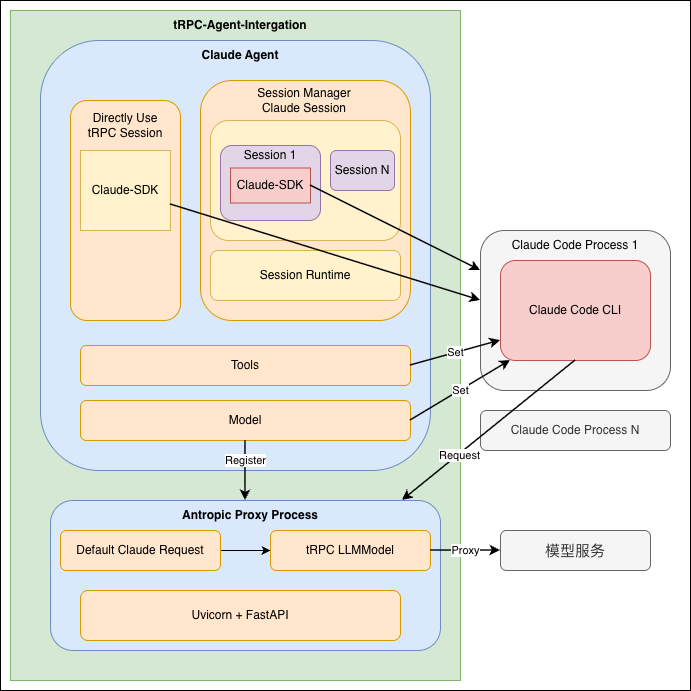

# tRPC-Agent ClaudeAgent

在 [Claude-Code](https://www.claude.com/product/claude-code) 推出来以后，因为其**出色的任务规划能力**，逐渐有开发者尝试基于这个CLI工具开发适用于自己业务的Agent，Anthropics官方也推出了 [Claude-Agent-Sdk-Python](https://github.com/anthropics/claude-agent-sdk-python) 与 Claude-Code-CLI 工具打通，方便快速开发Agent，不需要复杂的Agent工作流编排，也不需要反复的Prompt调优，只需要简单的配置工具及system_instruction编写，也能有不错的效果，Agent将会不断规划合适的工具调用，以完成给定的任务。

tRPC-Agent 通过接入 Claude-Agent-Sdk-Python 以打通tRPC-Agent框架生态与Claude-Code-CLI，方便业务快速迁移已有基于Claude-Agent-Sdk-Python开发的Agent，以复用框架的完整生态（包括但不限于司内模型接入、tRPC生态、Agent的AI生态），同时，也为当前使用框架的开发者，提供一个可选的开发Agent的方式。

## 适用场景

有下面几种情况，比较适合使用ClaudeAgent:
1. 代码相关的Agent：Claude-Code本身就适合代码生成，只需要通过额外工具引入领域内知识，即可编写代码，或者复用Claude-Code的代码检索工具；
2. 需要文件系统交互相关Agent：Claude-Code自带文件系统的读写操作，支持文件查找等工具，Agent可以直接复用这套工具；
3. 完成复杂任务的Agent：Claude-Code内置的多Agent系统架构、精细的Prompt调优，能逐步规划以完成复杂的任务，适合简单配置完成复杂任务Agent的场景

Claude-Code还内置如下工具，如果你开发的Agent正好有使用这些工具，不妨试试ClaudeAgent看下在你的场景里是否有优化:

| 工具 | 描述 |
|------|------|
| Bash | 在环境中执行shell命令 |
| Edit | 对特定文件进行精准编辑 |
| Glob | 基于模式匹配查找文件 |
| Grep | 在文件内容中搜索模式 |
| NotebookEdit | 修改Jupyter notebook单元格 |
| Read | 读取文件内容 |
| SlashCommand | 运行自定义斜杠命令 |
| Task | 运行子Agent处理复杂的多步骤任务 |
| TodoWrite | 创建和管理结构化任务列表 |
| WebFetch | 从指定URL获取内容 |
| WebSearch | 执行带域名过滤的网络搜索 |
| Write | 创建或覆盖文件 |

**注意：**
- **Claude-Code本身实现是闭源的，如果业务场景需要对底层Agent有精细的优化能力或者流程的控制能力，请谨慎使用。**

## 设计

如下架构图所示，tRPC-Agent通过提供ClaudeAgent及Anthropics Proxy Server以接入这个能力，ClaudeAgent基于Claude-Agent-SDK-Python实现，Anthropics Proxy Server通过转发Claude-Code的请求来与司内模型打通，各核心组件介绍如下:
- **ClaudeAgent**：用户通过配置**tRPC-Agent-Python框架提供的ClaudeAgent**以开发基于Claude-Code的Agent，ClaudeAgent可以配置不同的Session用法，以让Claude-Code管理Session（默认），或者让tRPC-Agent来管理Session（通过设置ClaudeAgent的 `enable_session: True` 的字段。
- **SessionManager - Claude Session**：**默认生效**，Session由Claude-Code托管，如果业务有多节点部署的需求，请使用 `hash` 路由，因Claude-SDK的限制，每个Session将会创建一个新的Claude-Code-Process。
- **Directly Use - tRPC Session**：**默认不生效**，Session由tRPC-Agent管理，业务有多节点部署的需求时，只需要使用框架的RedisSession即可，可以理解为每次调用Claude-Code，都是一次全新的会话，只不过框架会在消息里注入历史消息，因为会话不是由Claude-Code管理，缺少Claude-Code内部一些推理信息，因此一些依赖内部推理信息的场景上，多轮对话效果上可能不如Clause Session。
- **Claude Code Progress**：由Claude-Agent-Python-SDK拉起进程，通过stdio与Claude-Code-CLI交互，一个ClaudeSession管理一个子进程的交互。
- **Tools**：用户可以配置Agent时，可以使用Claude-Code的Tool，也可以自定义Tool，框架会自动注入到CLI中。
- **Model**：像LlmAgent一样，用户可以自由定义Agent使用的模型，Claude-Code-CLI执行时，将会调用此模型，只要是框架兼容的，都是可以配置。
- **Anthropics Proxy Process**：框架会自动拉起这个Proxy子进程，转发Claude-Code-CLI的请求到司内模型服务里，业务可以自由配置Venus、Hunyuan、腾讯云等的模型，注意到，存在 `Default Claude Request` 的部分，这是因为就算为 ClaudeAgent 配置了模型，CLI在执行过程中，并不是所有模型调用都会使用配置的模型，一些内部过程及一些简单调用将会使用默认的模型（也即claude-opus, claude-haiku、claude-sonnet模型），框架提供了一种机制，在Proxy进程中，支持将这些默认模型调用转发到用户配置的模型中。

<p align="center">
  
</p>

## 使用指引

### 安装方式

在使用ClaudeAgent前，请先在环境里安装好 Claude-Code-CLI 工具：
```bash
npm install -g @anthropic-ai/claude-code
```

然后安装 tRPC-Agent 适配 ClaudeAgent 的扩展包：
```bash
pip install trpc-agent[agent-claude]
```

### 使用方式

下面以开发一个代码生成Agent为例介绍用法，完整示例见：[examples/claude_agent_with_code_writer/run_agent.py](../../../examples/claude_agent_with_code_writer/run_agent.py)。

该示例项目的结构如下：
```
examples/claude_agent_with_code_writer/
├── .env                  # 环境变量配置
├── run_agent.py          # 主入口
└── agent/
    ├── __init__.py
    ├── config.py          # 模型配置
    ├── prompts.py         # Prompt配置
    └── agent.py           # Agent创建与环境管理
```

首先，在 `agent/config.py` 中通过环境变量获取模型配置，在 `agent/prompts.py` 中定义Agent的指令：
```python
import os
# agent/config.py
def get_model_config() -> tuple[str, str, str]:
    """Get model config from environment variables"""
    api_key = os.getenv('TRPC_AGENT_API_KEY', '')  # 模型API密钥
    url = os.getenv('TRPC_AGENT_BASE_URL', '')  # 模型服务地址
    model_name = os.getenv('TRPC_AGENT_MODEL_NAME', '')  # 模型名称
    if not api_key or not url or not model_name:
        raise ValueError('''TRPC_AGENT_API_KEY, TRPC_AGENT_BASE_URL, 
                         and TRPC_AGENT_MODEL_NAME must be set in environment variables''')
    return api_key, url, model_name
```

```python
# agent/prompts.py
INSTRUCTION = "You are a helpful assistant for writing code."
```

然后，在 `agent/agent.py` 中配置ClaudeAgent，因为我们要开发一个代码生成助手，因此只需要简单指定他的角色及使用的工具即可，可以看到，我们指定他能操作文件（Read/Write/Edit），能够检索文件名（Glob）和文件内容（Grep），还支持任务管理（TodoWrite），除了Claude-Code内置的工具外，还能通过 `tools` 配置其他工具，如果你不知道如何配置，可以参考[tRPC-Agent FunctionTools用法](./tool.md) 及 [tRPC-Agent MCPTools用法](./tool.md)：
```python
# agent/agent.py
from trpc_agent_sdk.server.agents.claude import ClaudeAgent, setup_claude_env, destroy_claude_env
from trpc_agent_sdk.models import LLMModel, OpenAIModel
from claude_agent_sdk.types import ClaudeAgentOptions

from .prompts import INSTRUCTION
from .config import get_model_config

CLAUDE_ALLOWED_TOOLS = ["Read", "Write", "Edit", "TodoWrite", "Glob", "Grep"]

def _create_model() -> LLMModel:
    """Create a model"""
    api_key, url, model_name = get_model_config()
    return OpenAIModel(model_name=model_name, api_key=api_key, base_url=url)

def create_agent() -> ClaudeAgent:
    """Create an agent"""
    return ClaudeAgent(
        name="code_writing_agent",  # Agent名称
        description="A helpful Claude assistant for writing code",  # Agent描述
        model=_create_model(),  # 使用的LLM模型
        instruction=INSTRUCTION,  # Agent系统指令
        claude_agent_options=ClaudeAgentOptions(
            allowed_tools=CLAUDE_ALLOWED_TOOLS,  # Claude-Code内置工具白名单
        ),
        # tools=[...], # 其他业务自定义的工具，都可以放在这里，详见链接
        # enable_session=False, # 是否启用tRPC Session，默认关闭，相关描述见架构设计
    )
```

接着，在同一文件中提供环境初始化和清理方法。进程启动时，在执行Agent之前，需要通过 `setup_claude_env` 初始化Proxy子进程及Claude的默认模型，，通过 `destroy_claude_env` 停止Proxy子进程：
```python
def setup_claude(proxy_host: str = "0.0.0.0", proxy_port: int = 8082):
    """Setup Claude environment (proxy server)"""
    claude_default_model = _create_model()
    setup_claude_env(
        proxy_host=proxy_host,
        proxy_port=proxy_port,
        claude_models={"all": claude_default_model},
    )

def cleanup_claude():
    """Clean up Claude environment (stop proxy server)"""
    destroy_claude_env()
```
在 `run_agent.py` 中实现运行Agent的主流程，通过 `agent.initialize()` 初始化Runtime以执行Claude-Agent-Python-SDK，通过Runner运行Agent，并且打印出Agent的各个行为，在程序退出前，需要通过 `agent.destroy()` 停止与Claude-Code的会话：
```python
# run_agent.py
import asyncio
import uuid
import json
from trpc_agent_sdk.runners import Runner
from trpc_agent_sdk.sessions import InMemorySessionService
from trpc_agent_sdk.types import Content, Part

from dotenv import load_dotenv
load_dotenv()


async def run_code_writer_agent():
    """Run the Claude code writer agent demo"""

    app_name = "claude_code_writing_app"

    from agent.agent import create_agent, setup_claude, cleanup_claude

    # 初始化 Claude 环境：启动 Anthropic Proxy Server 子进程
    setup_claude()

    # 创建 Agent 并初始化运行时
    agent = create_agent()
    agent.initialize()

    # 创建内存会话服务和 Runner
    session_service = InMemorySessionService()
    runner = Runner(app_name=app_name, agent=agent, session_service=session_service)

    user_id = "demo_user"

    demo_queries = [
        "Write a Python function that calculates the Fibonacci sequence up to n terms, save it to 'fibonacci.py'.",
    ]

    try:
        for query in demo_queries:
            current_session_id = str(uuid.uuid4())

            await session_service.create_session(
                app_name=app_name,
                user_id=user_id,
                session_id=current_session_id,
                state={"user_name": f"{user_id}"},
            )

            print(f"🆔 Session ID: {current_session_id[:8]}...")
            print(f"📝 User: {query}")

            user_content = Content(parts=[Part.from_text(text=query)])

            print("🤖 Assistant: ", end="", flush=True)
            # 异步迭代 Agent 返回的事件流
            async for event in runner.run_async(user_id=user_id, session_id=current_session_id, new_message=user_content):
                if not event.content or not event.content.parts:
                    continue

                # 流式文本片段（partial=True），逐字打印
                if event.partial:
                    for part in event.content.parts:
                        if part.text:
                            print(part.text, end="", flush=True)
                    continue

                # 完整事件：工具调用、工具结果、最终响应等
                for part in event.content.parts:
                    if part.thought:
                        continue
                    if part.function_call:
                        args_str = json.dumps(part.function_call.args, ensure_ascii=False)[:200]
                        print(f"\n🔧 [Tool Call: {part.function_call.name}({args_str})]", flush=True)
                    elif part.function_response:
                        response_str = json.dumps(part.function_response.response, ensure_ascii=False)[:200]
                        print(f"📊 [Tool Result: {part.function_response.name}({response_str})]", flush=True)

            print("\n" + "-" * 40)

    finally:
        # 资源清理：关闭 Runner -> 销毁 Agent（停止 Runtime）-> 停止 Proxy 子进程
        await runner.close()
        agent.destroy()
        cleanup_claude()
        print("🧹 Claude environment cleaned up")


if __name__ == "__main__":
    asyncio.run(run_code_writer_agent())
```

### 运行Agent

在运行前，请先设置模型相关的环境变量（也可以在 `.env` 文件中配置）：
```bash
export TRPC_AGENT_API_KEY="your-api-key"
export TRPC_AGENT_BASE_URL="your-base-url"
export TRPC_AGENT_MODEL_NAME="your-model-name"
```

运行Agent程序，示例输出如下所示，可以看到，ClaudeAgent根据用户指令自动编写代码并写入文件，大家可以替换 `demo_queries` 中的提问文本为适合自己场景的例子，更多示例也可参考 [trpc-agent 的 examples 目录](../../../examples/)：
```text
[2026-03-17 17:18:47][INFO][trpc_agent][_setup.py:222][68046] Proxy server proxy process started (PID: 68077)
[2026-03-17 17:18:49][INFO][trpc_agent][_setup.py:239][68046] Proxy server is ready at http://0.0.0.0:8082
[2026-03-17 17:18:49][INFO][trpc_agent][_runtime.py:26][68046] ClaudeAgent event loop thread started
🆔 Session ID: 3fe4f9f2...
📝 User: Write a Python function that calculates the Fibonacci sequence up to n terms, save it to 'fibonacci.py'.
🤖 Assistant: Here is the Python function that calculates the Fibonacci sequence up to n terms.
I will save it to a file named fibonacci.py:
🔧 [Tool Call: Write({"file_path": "fibonacci.py", "content": "def fibonacci(n):\n    ..."})]
📊 [Tool Result: Write({"result": "File created successfully at: fibonacci.py"})]
I've created the fibonacci.py file with the Fibonacci sequence implementation.
----------------------------------------
[2026-03-17 17:19:14][INFO][trpc_agent][_runtime.py:38][68046] ClaudeAgent event loop thread stopped
[2026-03-17 17:19:14][INFO][trpc_agent][_runtime.py:61][68046] ClaudeAgent thread terminated successfully
[2026-03-17 17:19:14][INFO][trpc_agent][_setup.py:275][68046] Terminating proxy process (PID: 68077)...
[2026-03-17 17:19:14][INFO][trpc_agent][_setup.py:287][68046] Subprocess terminated successfully.
🧹 Claude environment cleaned up
```

注意到，在程序运行时，也会在运行目录下，写入一个 `anthropic_proxy.log` 的文件，这是转发Claude-Code请求子进程的日志文件，感兴趣的话可以查阅，能看到Claude-Code触发模型调用的行为。

## 事件映射

ClaudeAgent 通过 `claude_agent_sdk` 接收 Claude-Code 的消息，并将其转换为框架统一的 `Event` 对象。SDK 返回的消息类型与框架事件的对应关系如下：

| Claude SDK 消息类型 | 框架事件 | 说明 |
|-----|-----|-----|
| `AssistantMessage` 中的 `TextBlock` | 文本 response 事件 | 模型回复的文本内容 |
| `AssistantMessage` 中的 `ThinkingBlock` | thought 事件 | 模型的推理/思考内容 |
| `AssistantMessage` 中的 `ToolUseBlock` | tool-call response 事件 | 工具调用，包含工具名和参数 |
| `AssistantMessage` / `UserMessage` 中的 `ToolResultBlock` | tool-result response 事件 | 工具执行结果 |
| `StreamEvent` (`text_delta`) | partial text 事件 | 流式输出的文本片段 |
| `StreamEvent` (`input_json_delta`) | partial tool-call 事件 | 流式输出的工具参数片段 |
| `SystemMessage` | 不发出事件 | 仅记录日志 |
| `ResultMessage` | 不发出事件 | 包含用量和耗时等统计信息，仅记录日志 |

**最终响应判定**：当一个事件不包含工具调用、不包含工具结果、不是 partial 事件时，框架判定为最终响应（`is_final_response()`），此时如果配置了 `output_key`，会将文本结果写入 session state。

## 流式输出

ClaudeAgent 支持流式输出，在 Runner 中通过 `run_config.streaming` 控制是否启用：

```python
from trpc_agent_sdk.runners import Runner, RunConfig

runner = Runner(app_name="my_app", agent=agent, session_service=session_service)

async for event in runner.run_async(
    user_id=user_id,
    session_id=session_id,
    new_message=user_content,
    run_config=RunConfig(streaming=True),  # 支持流式输出
):
    if event.partial:
        # 流式文本片段
        for part in event.content.parts:
            if part.text:
                print(part.text, end="", flush=True)
    else:
        # 完整事件（工具调用、工具结果、最终响应等）
        ...
```

启用后，ClaudeAgent 会设置 `ClaudeAgentOptions.include_partial_messages = True`，SDK 会返回 `StreamEvent` 类型的流式消息，框架将其转换为 `partial=True` 的事件。

流式输出支持两类内容：
- **文本流**：`text_delta` 类型，每个片段作为一个 partial text 事件发出
- **工具参数流**：`input_json_delta` 类型，仅对标记了 `is_streaming=True` 的工具生效，参数片段通过 partial tool-call 事件发出

## 可观测性与追踪

### 事件追踪

ClaudeAgent 内置了 `CustomTraceReporter`，在每个事件发出时自动执行追踪上报：

```python
trace_reporter = CustomTraceReporter(
    agent_name=self.name,              # Agent 名称，用于标识追踪来源
    model_prefix="claude",             # 模型追踪前缀，区分不同类型的模型调用
    tool_description_prefix="Claude tool",  # 工具追踪前缀，标记 Claude 内置工具
    text_content_filter=_text_filter,  # 文本过滤器，用于脱敏或截断过长的文本内容
)
# 每个事件发出时自动追踪
trace_reporter.trace_event(ctx, event)
```

ClaudeAgent 通过与 claude_agent_sdk 交互，在每次查询结束后会返回 `ResultMessage`，其中包含本次调用的统计信息（对话轮次、耗时、费用等），框架不会将其转换为事件，而是以 debug 日志形式记录：
```
Claude query complete: turns=5, duration=12000ms, cost=$0.05
```

### Proxy 日志

运行 ClaudeAgent 时，框架会在工作目录下生成 `anthropic_proxy.log` 文件，记录 Anthropic Proxy Server 转发请求的日志，可用于观测 Claude-Code 的模型调用行为，排查模型调用链路问题。

## 更多用法
### 工具设置

#### 使用Claude-Code内置工具

通过`claude_agent_options`参数的`allowed_tools`字段指定允许使用的内置工具:

```python
from claude_agent_sdk.types import ClaudeAgentOptions

agent = ClaudeAgent(
    name="code_writer",
    description="A helpful Claude assistant for writing code",
    model=model,
    instruction="You are a helpful assistant for writing code.",
    claude_agent_options=ClaudeAgentOptions(
        # 指定允许使用的 Claude-Code 内置工具
        allowed_tools=["Read", "Write", "Edit", "TodoWrite", "Glob", "Grep"],
    ),
)
```

#### 使用自定义工具

ClaudeAgent支持配置Agent框架工具，可以配置FunctionTool或者MCPTool:

```python
from trpc_agent_sdk.tools import FunctionTool, MCPToolset

def get_current_date():
    """获取今天的日期"""
    return datetime.datetime.now().strftime("%Y-%m-%d")

# 自定义MCP工具集
class GoogleSearchMCP(MCPToolset):
    def __init__(self):
        super().__init__()
        self._connection_params = StdioConnectionParams(
            server_params=StdioServerParameters(
                command="npx",
                args=["google-search-mcp"],
            ),
            timeout=30.0,
        )

agent = ClaudeAgent(
    name="travel_planner",
    description="旅游规划助手",
    model=model,
    instruction="你是一个旅游规划助手...",
    claude_agent_options=ClaudeAgentOptions(
        allowed_tools=["TodoWrite"],  # Claude内置工具
    ),
    tools=[  # 用户自定义工具
        FunctionTool(get_current_date),
        GoogleSearchMCP(),
    ],
)
```

### 会话管理

ClaudeAgent 提供两种会话管理模式，通过 `enable_session` 参数控制：

#### 模式一：Claude Session（默认，`enable_session=False`）

由 Claude-Code 内部管理会话历史。框架使用 `ctx.session.id`（tRPC-Agent 的 session ID）作为 Claude 的 session ID，同一个 session ID 对应同一个 `ClaudeSDKClient` 实例和 Claude-Code 子进程。

该模式下，Claude-Code 保留完整的内部推理上下文，多轮对话效果最佳。每次调用时只发送最新的用户消息，历史由 Claude-Code 维护。

适合单节点部署或使用 hash 路由的多节点部署。

#### 模式二：tRPC Session（`enable_session=True`）

由 tRPC-Agent 管理会话历史。每次调用都创建新的 `ClaudeSDKClient`，session ID 固定为 `"default"`，即每次都是全新的 Claude-Code 会话。框架会从 session events 中提取完整的对话历史，拼接为带上下文的 prompt 发送。

该模式下可以使用框架的 RedisSession 等分布式 Session 存储，适合多节点部署。但由于 Claude-Code 不保留内部推理信息，多轮对话效果可能不如 Claude Session。

#### Session 生命周期

当使用 Claude Session 时，框架通过 `SessionManager` 管理 `ClaudeSDKClient` 的生命周期，通过 `SessionConfig` 控制行为：
- `ttl`：空闲 session 被清理的时间，单位为秒，默认 600s（10分钟）没有使用就清理。设为 0 则永不自动清理。

每次查询前，`SessionManager` 会自动清理超过 TTL 的空闲 session，释放对应的 Claude-Code 子进程资源。

```python
from trpc_agent_sdk.server.agents.claude import SessionConfig

ClaudeAgent(
    ...,
    # enable_session=False, # 默认关闭，代表使用 Claude Session，下面的 SessionConfig 才会生效
    session_config=SessionConfig(
        ttl=600,
    ),
)
```

#### 资源清理

使用 ClaudeAgent 时，需要在程序退出前正确清理资源：
- `agent.destroy()`：关闭 SessionManager 和所有 ClaudeSDKClient 连接，停止 AsyncRuntime 线程
- `destroy_claude_env()`：停止 Anthropic Proxy Server 子进程

如果未正确清理（如 Ctrl+C 强制退出），残留的 Claude-Code 会话可能干扰后续运行，此时需要手动执行 `rm -rf ~/.claude*` 清理。

### 使用claude agent sdk内置的skill能力
claude agent sdk 已内置了使用skill的能力，只需要简单配置，就可以快速应用skill能力。

#### 创建skills
- 在项目目录或者根目录(~)创建./claude/skills目录
    - 一般而言，如果你的skills创建在根目录，代表的是用户级的skill能力（跨项目）
    - 如果你的skills目录创建在项目目录，代表的是项目级的skill能力（项目）
- 在skills目录下创建skill目录，比如traver-helper
- 在traver目录下创建SKILL.md文档，格式参考[skill格式](https://platform.claude.com/docs/zh-CN/agents-and-tools/agent-skills/overview#skill)

示例skill.md
```
---
name: 旅游规划助手
description: 根据用户的旅游需求（目的地、时间、预算等）自动生成完整的旅游规划方案，包括交通、住宿、景点、美食、行程安排等。当用户询问旅游计划、行程安排、旅行攻略或提到具体目的地旅游时使用。
---

# 旅游规划助手

## 工作流程

当用户提出旅游规划需求时，按以下步骤自动生成完整的旅游方案：
...
```

#### 配置option
```python
from claude_agent_sdk.types import ClaudeAgentOptions

agent = ClaudeAgent(
    name="travel_planner",
    description="旅游规划助手",
    model=model,
    instruction="""
你是一位专业的AI助手，基于Claude Agent SDK构建。你的核心职责是理解用户需求并调用合适的Skill来完成复杂任务。
你应保持专业、客观的态度，拒绝执行任何有害或不合规的操作。
""",
    claude_agent_options=ClaudeAgentOptions(
        # cwd is where the project directory is
        cwd="your project path",
        # setting_sources is the way of claude agent to get the skills from the user and the project
        # user is the way of claude agent to get the skills from path: ~/.claude/skills
        # project is the way of claude agent to get the skills from path: cwd/.claude/skills
        setting_sources=["user", "project"], 
        # Skill Tool is the way of claude agent to use the skills,must be allowed
        allowed_tools=["Skill"], 
    ),
)
```

- 配置cwd。cwd为claude agent工作的项目目录，可能会存放项目级的skills文档
- 配置setting_sources，可以配置多个数据源。
    - 如果设置了`user`, 会读取目录`~/.claude/skills`
    - 如果设置了`project`, 会读取目录 `cwd_path/.claude/skills`
    - 可以设置多个数据源
- 配置tools。必须配置`Skill`作为Tool的能力之一, 因为claude agent sdk 通过tool调用的方式实现skill能力。

详细使用说明见：[claude agent sdk with skills](https://platform.claude.com/docs/en/agent-sdk/skills)

#### 测试效果

```
📝 用户: 帮我制定一个去北京的旅游攻略

🤖 Agent: 
🔧 [Tool Call: Skill({"skill": "traver_helper"})]
📊 [Tool Result: Skill({"result": "Launching skill: traver_helper"})]

🔧 [Tool Call: mcp__travel_planner_tools__get_current_date({})]
📊 [Tool Result: mcp__travel_planner_tools__get_current_date({"result": "2025-12-22"})]
### 北京旅游攻略（3天2夜）

📍 **目的地**：北京  
🗓️ **建议出行时间**：2025年12月24日 - 2025年12月26日  
⏱️ **行程天数**：3天2夜  
💰 **预算区间**：经济型（约1500元/人） / 舒适型（约2500元/人）  
🎯 **行程主题**：文化探索 + 美食体验  

---

### **B. 交通方案**

#### 往返交通
- **高铁**：从上海到北京，约4.5小时，票价约553元（二等座）。  
- **飞机**：从上海到北京，约2小时，票价约800元（经济舱）。  

#### 当地交通
- **地铁**：北京地铁覆盖广泛，单程票价3-7元。  
- **公交**：票价2元起，适合短途出行。  
- **打车**：起步价13元，适合夜间或多人出行。  

**交通建议**：  
- 高铁更适合短途旅行，飞机适合时间紧张的游客。  
- 提前下载“北京地铁”APP，方便查询线路。  

---

### **C. 住宿推荐**

| 酒店名称       | 位置优势               | 价格区间（每晚） | 预订建议          |
|----------------|------------------------|------------------|-------------------|
| 如家酒店（前门店） | 靠近天安门、故宫       | 300-400元        | 提前1周预订       |
| 北京饭店       | 市中心，交通便利       | 800-1000元       | 提前2周预订       |
| 四合院民宿     | 体验老北京风情         | 500-700元        | 提前1个月预订     |

.....
```

### ClaudeAgentOptions参数配置

通过`ClaudeAgentOptions`可以精细控制Claude-Code的行为，下面是一些常用的配置，可以按需取用:

```python
from claude_agent_sdk.types import ClaudeAgentOptions

claude_agent_options = ClaudeAgentOptions(
    # 工具配置
    allowed_tools=["Read", "Write", "Edit"],  # 允许的内置工具列表，不指定则默认允许所有工具
    disallowed_tools=["Bash"],  # 禁用的工具列表
    
    # 权限控制
    permission_mode="default",  # 权限模式: default, acceptEdits, plan, bypassPermissions
    
    # 会话控制
    max_turns=10,  # 最大对话轮数
    
    # 环境配置
    cwd="/path/to/workdir",  # 工作目录，默认是当前main方法所在的目录
    add_dirs=["/path/to/extra/dir"],  # 额外允许访问的目录
    env={"KEY": "VALUE"},  # 环境变量
)
```

详细参数说明见：[ClaudeAgentOptions配置](https://docs.claude.com/en/api/agent-sdk/python#claudeagentoptions)。

### 模型生成参数配置

ClaudeAgent支持通过`generate_content_config`参数配置模型生成时的参数（如温度、最大token数等），该配置将会覆盖Claude-Code发出请求的参数。

#### ClaudeAgent中配置

可以在创建ClaudeAgent时指定`generate_content_config`：

```python
from trpc_agent_sdk.types import GenerateContentConfig
from trpc_agent_sdk.models import OpenAIModel
from trpc_agent_sdk.server.agents.claude import ClaudeAgent

# 创建生成配置
config = GenerateContentConfig(
    temperature=0.7,        # 温度参数，控制随机性
    max_output_tokens=2000, # 最大输出token数
    top_p=0.9,             # nucleus sampling参数
    top_k=40,              # top-k sampling参数
)

# 创建Agent时指定配置
agent = ClaudeAgent(
    name="my_agent",
    model=OpenAIModel(
        model_name="deepseek-chat",
        api_key=os.environ.get("TRPC_AGENT_API_KEY", ""),
        base_url="https://api.deepseek.com/v1",
    ),
    instruction="You are a helpful assistant.",
    generate_content_config=config,  # 指定生成配置
)
```

#### setup_claude_env中配置默认模型参数

当在`setup_claude_env`中配置默认模型（用于处理Claude-Code的内部调用）时，也可以为这些默认模型配置生成参数。

```python
from trpc_agent_sdk.types import GenerateContentConfig
from trpc_agent_sdk.models import OpenAIModel
from trpc_agent_sdk.server.agents.claude import setup_claude_env

# 在OpenAIModel中直接配置generate_content_config
# OpenAIModel内置支持generate_content_config字段
model = OpenAIModel(
    model_name="deepseek-chat",
    api_key=os.environ.get("TRPC_AGENT_API_KEY", ""),
    base_url="https://api.deepseek.com/v1",
    generate_content_config=GenerateContentConfig(
        temperature=0.8,
        max_output_tokens=1500,
    ),
)

# 在setup_claude_env中使用配置好的模型
# Proxy服务器会自动提取模型的generate_content_config
# 这样Claude-Code的默认调用（sonnet/opus/haiku）都会使用这个配置
setup_claude_env(
    proxy_host="0.0.0.0",
    proxy_port=8082,
    claude_models={"all": model}  # 配置会被自动提取
)
```

**说明**：
- `OpenAIModel`的`generate_content_config`字段会在`setup_claude_env`中被**自动提取**
- 提取后的配置会存储在Proxy服务器中，用于所有映射到该模型的请求
- 当使用`{"all": model}`时，sonnet、opus、haiku三个模型都会使用相同的配置

#### 配置查找与优先级说明

Proxy服务器在构建请求时，会按以下顺序查找配置：

**配置查找顺序**：
1. **model_configs存储的配置**：通过ClaudeAgent的`generate_content_config`或`setup_claude_env`自动提取的配置
2. **模型实例的配置**：如果model_configs中没有，则使用模型实例的`generate_content_config`（回退机制）
3. **请求参数**：如果配置为None或不存在，使用Claude-Code请求中的参数

**字段优先级**：对于找到的配置，具体字段的优先级为：
- **已配置的字段优先**：如果`generate_content_config`中设置了某个字段（非None），则使用配置的值
- **请求参数作为后备**：如果配置中的字段为None，则使用Claude-Code请求中的参数值

例如：
```python
# 配置中设置了temperature=0.7，但top_p未设置（None）
config = GenerateContentConfig(temperature=0.7, top_p=None)

# Claude-Code请求中：temperature=0.5, top_p=0.9
# 最终使用：
#   temperature=0.7  （使用配置值，不会被Claude-Code请求参数覆盖）
#   top_p=0.9        （配置为None，使用Claude-Code请求参数）
```

**配置来源优先级**：
- ClaudeAgent显式配置 > OpenAIModel配置 > Claude请求参数

#### 注意事项

- 常用的可配置字段包括：
  - `temperature`: 温度参数（0.0-1.0）
  - `max_output_tokens`: 最大输出token数
  - `top_p`: nucleus sampling参数
  - `top_k`: top-k sampling参数
  - `stop_sequences`: 停止序列列表

## ClaudeAgent完整示例

- 简单天气查询 Agent 示例见：[examples/claude_agent/run_agent.py](../../../examples/claude_agent/run_agent.py)
- 代码生成 Agent 示例见：[examples/claude_agent_with_code_writer/run_agent.py](../../../examples/claude_agent_with_code_writer/run_agent.py)
- 旅游规划Agent（多轮对话）示例见：[examples/claude_agent_with_travel_planner/run_agent.py](../../../examples/claude_agent_with_travel_planner/run_agent.py)
- 旅游规划Agent（Skill）示例见：[examples/claude_agent_with_skills/run_agent.py](../../../examples/claude_agent_with_skills/run_agent.py)
- 流式工具 Agent 示例见：[examples/claude_agent_with_streaming_tool/run_agent.py](../../../examples/claude_agent_with_streaming_tool/run_agent.py)
- 取消执行 Agent 示例见：[examples/claude_agent_with_cancel/run_agent.py](../../../examples/claude_agent_with_cancel/run_agent.py)

## 常见问题
### 历史会话干扰当前会话
- 原因：在测试过程中，按ctrl+c退出，或者没有按框架的资源清理逻辑清理资源，因为此时Claude-Code历史会话未能正常关闭，因此会影响当前的会话
- 解决方案：执行命令行执行：`rm -rf ~/.claude*`，手动清理会话
