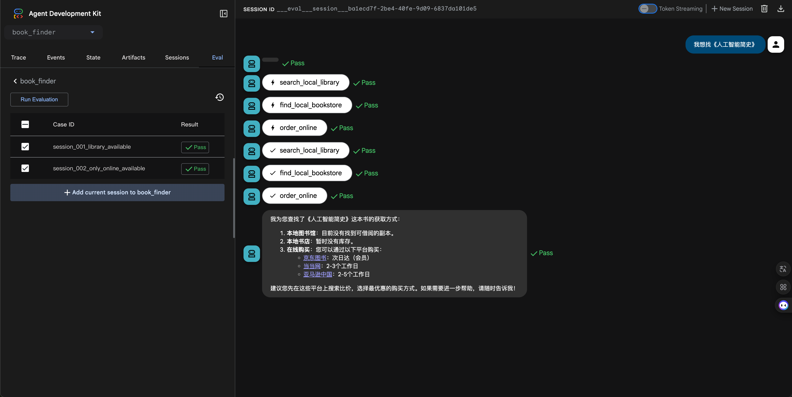
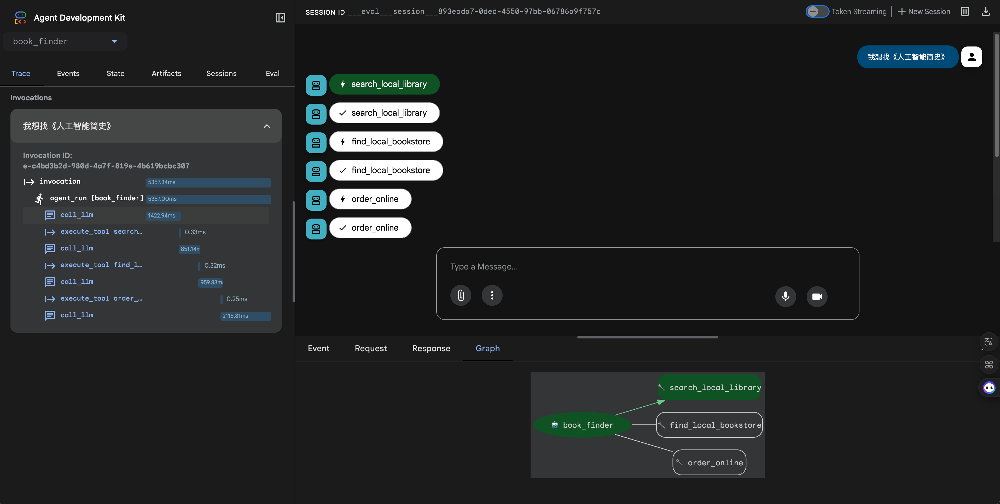

# Agent 评测

本文介绍 Agent 评测的核心理念、评测集与评估器的设计思路，以及如何在实际项目中落地回归评测。具体使用与运行方式见：[使用 pytest 进行 Agent 评测](#使用-pytest-进行-agent-评测)、[使用 WebUI 进行 Agent 评测](#使用-webui-进行-agent-评测)。

## 为什么要 Agent 评测

随着大模型与工具生态成熟，Agent 从试验场景逐步进入业务关键链路，版本迭代越来越频繁。此时交付质量不再由「某一次演示是否成功」决定，而取决于在模型、提示词、工具、知识库与编排持续演进下，行为是否**稳定、可回归**。迭代中常出现**行为漂移**：工具选错、参数结构变化、输出形态改变等，若不通过评测固化预期，回归成本会很高。

与确定性程序不同，Agent 的问题多为**概率性偏离**——同一输入多次运行结果可能不同，复现与回放困难，定位往往要查日志、轨迹和外部依赖，问题闭环成本高。

**评估**的作用，是把关键场景与验收标准固化为可复用的资产，形成可持续的回归信号。tRPC-Agent-Python 的 evaluation 模块提供开箱即用的评测能力：通过评测集与评测配置管理用例与结果落盘，内置工具轨迹、回复匹配及 LLM Judge 等评估器，并支持多轮会话、多次重复运行、Trace 模式、回调与上下文注入等，便于本地调试与接入流水线回归。

## 准备评测前想清楚

动手写用例和配置之前，建议先想清三件事。

**什么算通过？** 即对当前 Agent 而言，一次对话「通过」的判定标准是什么——是否要求工具调用正确、回复包含某类信息或符合某种格式，还是由 LLM 按规则判定合格。想清楚后，才能确定用例里要写哪些预期、选用哪类评测指标。

**关键任务有哪些？** 即本次评测要覆盖哪些用户诉求或业务场景。建议先圈定最核心的几条场景，为它们写好用例并跑通，再按需扩充。

**打算用哪些指标？** 即在评测配置中启用哪些评估方式及通过阈值，应能量化你在「什么算通过」里定义的通过标准。具体配置见 [使用 pytest 进行 Agent 评测](#使用-pytest-进行-agent-评测)。

## 评什么：轨迹与最终回复

评测针对两类对象：**轨迹**与**最终回复**，可单独使用也可组合，取决于你的通过标准。

**轨迹**指 Agent 在回复用户之前执行的一串步骤（如先查知识库、再调接口、再组织回复）。评测时会逐轮对比「实际调用了哪些工具、传了什么参数、顺序如何」与用例中的预期轨迹。若通过标准包含「工具与参数必须正确」，在用例中写好预期工具调用即可，并在评测配置里选用轨迹类评估方式。

**最终回复**指 Agent 返回给用户的那段话或结构化内容。有标准答案时，可要求实际回复与预期精确一致、包含某段话或语义相似；没有逐字标准答案但能描述什么是好回复时，可由 LLM 按规则或细则判定合格。具体支持哪些评估方式与如何配置见 [使用 pytest 进行 Agent 评测](#使用-pytest-进行-agent-评测)。

## 评测模块怎么运作

**输入**：评测集（JSON，内含多条用例与每轮的 user 输入、可选的预期工具调用与预期回复）、同目录下的评测配置文件（指定指标与阈值）、以及通过参数传入的 Agent 模块。

**流程**：加载评测集与配置 → 加载 Agent → 对每个用例按轮次向 Agent 发用户消息、收集实际工具调用与最终回复 → 按配置的指标将实际结果与预期对比、计算得分 → 全部达阈值则通过，否则断言失败。可配置多轮运行以统计 pass@k，也可将结果写入指定目录。

**最小示例与目录约定**：见 [Quickstart](../../../examples/evaluation/quickstart/) 与 [使用 pytest 进行 Agent 评测](#使用-pytest-进行-agent-评测)。

## 怎么跑评测

**pytest**：在用例所在目录执行 pytest（如 Quickstart 的 `pytest test_quickstart.py -v -s`）。环境、依赖与更多用法见 [使用 pytest 进行 Agent 评测](#使用-pytest-进行-agent-评测)。

**WebUI**：启动 Debug Server 与 adk-web，在浏览器中选择 Agent 与评测集并运行。见 [使用 WebUI 进行 Agent 评测](#使用-webui-进行-agent-评测)。

## 使用 pytest 进行 Agent 评测

### 概述

#### 这是什么

tRPC-Agent 评测模块是一套**自动化 Agent 质量检验工具**。它让你可以像写单元测试一样，编写评测用例来验证 Agent 的行为是否符合预期——包括 Agent 是否调用了正确的工具、是否传了正确的参数、最终回复是否包含关键信息等。

#### 为什么用 pytest

通过 pytest 触发评测，可将评测用例纳入自动化测试或 CI/CD 流水线，无需启动 Web 服务或人工操作界面，适合本地回归与持续集成。

#### 评测能做什么

| 能力 | 说明 | 典型场景 |
| --- | --- | --- |
| 工具调用验证 | 检查 Agent 是否调用了正确的工具、参数是否匹配 | 验证天气 Agent 遇到天气问题时确实调用了 `get_weather` |
| 最终回复验证 | 检查 Agent 的回复是否包含预期内容 | 验证回复中包含温度数值 |
| LLM 裁判评估 | 用另一个 LLM 当裁判，对回复做语义级判定 | 验证回复是否合理、是否与参考答案一致 |
| LLM 细则评估 | 用 LLM 裁判按多条评估细则逐项打分 | 验证回复是否同时满足"结论明确""切题"等多个质量要求 |
| 知识召回评估 | 评估 RAG 场景下检索到的知识是否足以支撑回答 | 验证知识库检索结果覆盖了问题中的关键事实 |
| 多轮运行与统计 | 同一用例跑多次，计算 pass@k 等稳定性指标 | 评估 Agent 在多次尝试中的通过率 |
| Trace 回放 | 跳过推理，直接用录制好的对话轨迹打分 | 用线上日志做离线评估，不消耗推理资源 |
| 回调钩子 | 在推理/打分的 8 个生命周期节点挂载自定义逻辑 | 打点、日志、采样、上报 |

#### 评测整体流程

一次完整的评测分为三步：**加载 → 推理 → 打分**。

```
           你准备的文件                          框架自动执行
    ┌─────────────────────┐          ┌───────────────────────────────────┐
    │  评测集文件           │          │                                   │
    │  (.evalset.json)     │──加载──▶│  AgentEvaluator                   │
    │  · 用户输入           │          │    │                              │
    │  · 预期工具调用       │          │    ├─ 推理阶段：逐用例调用 Agent  │
    │  · 预期最终回复       │          │    │   产出实际工具调用、实际回复  │
    ├─────────────────────┤          │    │                              │
    │  评测配置文件          │          │    └─ 打分阶段：按指标对比       │
    │  (test_config.json)  │──加载──▶│        实际 vs 预期，计算分数    │
    │  · 用哪些指标         │          │        与阈值比较，判定通过/失败 │
    │  · 阈值是多少         │          │                                   │
    │  · 匹配规则           │          │  ──▶ 输出：EvaluateResult        │
    └─────────────────────┘          └───────────────────────────────────┘
```

- **评测集文件**：描述"测什么"——用户会说什么、Agent 应该调用什么工具、应该回复什么。
- **评测配置文件**：描述"怎么判"——用哪些指标评估、匹配策略是什么、多少分算通过。
- **AgentEvaluator**：框架入口，加载文件、驱动推理、执行打分、汇总结果。

---

### 快速开始

本节给出一个最小可运行示例，帮你在 5 分钟内跑通第一次评测。完整示例见 [examples/evaluation/quickstart/](../../../examples/evaluation/quickstart/)。

#### 第一步：环境准备

**系统要求**：Python 3.10+，可访问的 LLM 模型服务。

**安装依赖**（包含 pytest、pytest-asyncio、rouge-score 等）：

```bash
pip install -e ".[eval]"
```

**配置环境变量**：

```bash
export TRPC_AGENT_API_KEY="your-api-key"
## 可选
export TRPC_AGENT_BASE_URL="https://api.example.com/v1"
export TRPC_AGENT_MODEL_NAME="your-model-name"
```

#### 第二步：准备文件

你需要准备 4 个文件，组织结构如下：

```
quickstart/
├── test_quickstart.py          ← 测试入口（pytest 运行此文件）
└── agent/
    ├── agent.py                ← Agent 定义
    ├── weather_agent.evalset.json  ← 评测集（测什么）
    └── test_config.json        ← 评测配置（怎么判）
```

##### 文件 1：Agent 定义（`agent/agent.py`）

构建一个可评测的 Agent。`instruction` 约束 Agent 用工具回答天气问题。quickstart 中实际从 `config` 读取模型配置并注册多个天气工具，完整代码见 [quickstart/agent/agent.py](../../../examples/evaluation/quickstart/agent/agent.py)；以下为最小示意。

```python
## agent/agent.py（示意；完整见 quickstart/agent/agent.py）
from trpc_agent_sdk.agents import LlmAgent
from trpc_agent_sdk.models import OpenAIModel
from trpc_agent_sdk.tools import FunctionTool

def get_weather(city: str):
    """查询指定城市当前天气。"""
    return {"city": city, "temperature": 20, "condition": "晴"}

def create_agent() -> LlmAgent:
    return LlmAgent(
        name="weather_agent",
        description="天气查询助手",
        model=OpenAIModel(model_name="your-model", api_key="your-key", base_url="https://..."),
        instruction="你是天气助手，用 get_weather 查询天气。",
        tools=[FunctionTool(get_weather)],
    )

root_agent = create_agent()
```

##### 文件 2：评测集（`agent/weather_agent.evalset.json`）

评测集描述"测什么"：用户会说什么、期望 Agent 调用什么工具、期望回复什么。

- `eval_set_id`：标识这个评测集。
- `eval_cases`：用例列表。每个用例有唯一的 `eval_id`。
- `conversation`：多轮对话序列。推理阶段按此顺序逐轮取 `user_content` 作为输入。
- `intermediate_data.tool_uses`：预期的工具调用（供工具轨迹评估器对比）。
- `final_response`：预期的最终回复（供最终响应评估器对比）。
- `session_input`：会话初始化信息（`app_name`、`user_id`、`state`）。

工具 `id` 通常由运行时生成，不作为匹配依据。

```json
{
  "eval_set_id": "weather_agent_quickstart",
  "name": "天气 Agent 单用例",
  "description": "Quickstart 单轮天气查询评测",
  "eval_cases": [
    {
      "eval_id": "simple_weather_001",
      "conversation": [
        {
          "invocation_id": "e-quick-001",
          "user_content": {
            "parts": [{"text": "上海天气怎么样"}],
            "role": "user"
          },
          "final_response": {
            "parts": [{"text": "18°C"}],
            "role": "model"
          },
          "intermediate_data": {
            "tool_uses": [
              {
                "id": "t1",
                "name": "get_weather",
                "args": {"city": "上海"}
              }
            ]
          }
        }
      ],
      "session_input": {
        "app_name": "weather_agent",
        "user_id": "user",
        "state": {}
      }
    }
  ]
}
```

##### 文件 3：评测配置（`agent/test_config.json`）

评测配置描述"怎么判"：用哪些指标、匹配策略是什么、多少分算通过。

- `metrics`：指标数组。每条指标有 `metric_name`（选评估器）、`threshold`（通过阈值）、`criterion`（评估准则）。
- 下例配了两条指标：工具轨迹（工具名和参数须完全匹配，0.8 分以上算通过）、最终响应（回复包含预期文字即可，0.6 分以上算通过）。

```json
{
  "metrics": [
    {
      "metric_name": "tool_trajectory_avg_score",
      "threshold": 0.8,
      "criterion": {
        "tool_trajectory": {
          "default": {
            "name": {"match": "exact", "case_insensitive": false},
            "arguments": {"match": "exact"}
          },
          "order_sensitive": false,
          "subset_matching": false
        }
      }
    },
    {
      "metric_name": "final_response_avg_score",
      "threshold": 0.6,
      "criterion": {
        "final_response": {
          "text": {"match": "contains", "case_insensitive": true}
        }
      }
    }
  ]
}
```

##### 文件 4：测试入口（`test_quickstart.py`）

在 pytest 测试中调用 `AgentEvaluator.evaluate()`，传入 Agent 所在模块路径与评测集文件路径。框架会从指定模块加载 `root_agent`，从评测集文件同目录加载 `test_config.json`，然后执行推理与打分。

```python
import os
import pytest
from trpc_agent_sdk.evaluation import AgentEvaluator

@pytest.mark.asyncio
async def test_quickstart_with_eval_set():
    test_dir = os.path.dirname(os.path.abspath(__file__))
    eval_set_path = os.path.join(test_dir, "agent", "weather_agent.evalset.json")

    await AgentEvaluator.evaluate(
        agent_module="agent",
        agent_name="weather_agent",
        eval_dataset_file_path_or_dir=eval_set_path,
        print_detailed_results=True,
    )
```

#### 第三步：执行评测

```bash
cd examples/evaluation/quickstart
pytest test_quickstart.py -v --tb=short -s
```

执行评估时，框架读取评测集文件与评测配置文件，加载 Agent 并逐用例推理，再根据评测指标完成评分。若传入的为目录路径，框架会递归扫描该目录下所有 `.evalset.json` 与 `.test.json` 并逐一执行评测。

#### 第四步：查看结果

- **全部通过**：终端打印评测结果摘要；若 `print_detailed_results=True`，还会打印每个用例的详细对比信息。
- **有用例未达阈值**：框架会抛出 `AssertionError`，失败摘要以 JSON 形式包含在错误信息中。
- **结果落盘**：若调用时传入 `eval_result_output_dir`，当次评测结果会写入该目录下的 `.evalset_result.json` 文件（详见[评测结果](#评测结果)一节）。

---

### 核心概念

本节解释评测模块的各个组成部分与它们之间的关系。理解这些概念后，你就能清楚地知道"每个配置文件影响了哪个环节"。

#### 关键组件

| 组件 | 职责 | 你需要做的 |
| --- | --- | --- |
| **AgentEvaluator** | 对用户暴露的入口，提供 `evaluate()` 与 `get_executer()` | 在 pytest 测试中调用它 |
| **评测集（EvalSet）** | 描述"测什么"——场景、用户输入、预期输出 | 编写 `.evalset.json` 文件 |
| **评测配置（EvalConfig）** | 描述"怎么判"——用哪些指标、阈值、匹配规则 | 编写 `test_config.json` 文件 |
| **评估服务（LocalEvalService）** | 执行推理与打分的引擎 | 框架自动创建，通常无需关心 |
| **评估器（Evaluator）** | 按指标计算分数的具体实现 | 选择内置评估器，或注册自定义 |
| **评估器注册表（EvaluatorRegistry）** | 维护 `metric_name` → 评估器类型的映射 | 需要自定义评估器时注册 |
| **评测结果（EvaluateResult）** | 承载评测的结构化结果 | 通过 `get_result()` 获取并分析 |

#### 各组件如何协作

AgentEvaluator 是整个评测流程的入口和编排者：

1. **加载阶段**：AgentEvaluator 从评测集文件（`.evalset.json` / `.test.json`）加载 EvalSet，从同目录的 `test_config.json` 加载 EvalConfig，按 `agent_module` 加载 Agent。
2. **构建评估服务**：AgentEvaluator 将 EvalSet 写入 InMemoryEvalSetsManager，创建 LocalEvalService（依赖该 Manager、UserSimulatorProvider、可选 EvalSetResultsManager、Runner、Callbacks）。默认使用 StaticUserSimulator，按 conversation 的 user_content 驱动推理。可选注入 LocalEvalSetResultsManager 将运行结果写入目录。
3. **推理阶段**：评估服务按 EvalSet 中的用例与 conversation 驱动 Runner 推理，得到实际 Invocation 列表（实际工具调用、实际回复）。
4. **打分阶段**：评估服务根据 EvalConfig 中的 EvalMetric 列表，从 EvaluatorRegistry 获取各评估器，对实际与预期逐项打分并汇总为 EvalCaseResult。
5. **结果汇总**：AgentEvaluator 根据结果判定通过/失败，有用例未达阈值时抛出 `AssertionError`，可选将结果落盘为 `.evalset_result.json`。

---

### 评测集（EvalSet）编写指南

评测集是评测的数据基础，描述"要测什么"。本节教你如何编写评测集文件。

#### 文件格式与命名

- 文件格式：JSON
- 文件后缀：`.evalset.json` 或 `.test.json`
- 配置键支持 snake_case（如 `eval_set_id`、`eval_cases`、`user_content`）

#### 结构总览

评测集的层次结构为：**EvalSet → EvalCase → Invocation**。

```
EvalSet（一个评测集）
├── eval_set_id: 评测集唯一标识
├── eval_cases: 用例列表
│   ├── EvalCase（一个评测用例）
│   │   ├── eval_id: 用例唯一标识
│   │   ├── eval_mode: 默认模式 / trace 模式
│   │   ├── conversation: 多轮对话序列（预期）
│   │   │   ├── Invocation（一轮对话）
│   │   │   │   ├── user_content: 用户输入
│   │   │   │   ├── final_response: 预期最终回复
│   │   │   │   └── intermediate_data: 预期中间数据（工具调用等）
│   │   │   └── ...更多轮
│   │   ├── actual_conversation: 实际轨迹（仅 Trace 模式）
│   │   ├── session_input: 会话初始化信息
│   │   └── context_messages: 每轮推理前注入的额外上下文
│   └── ...更多用例
└── ...元信息（name, description 等）
```

#### 各层级字段详解

##### EvalSet（评测集）

| 字段 | 类型 | 必填 | 说明 |
| --- | --- | --- | --- |
| eval_set_id | string | 是 | 评测集唯一标识 |
| app_name | string | 否 | 默认应用名（会话/结果），可被 EvalCase 的 session_input.app_name 覆盖 |
| name | string | 否 | 可读名称 |
| description | string | 否 | 描述 |
| eval_cases | EvalCase[] | 是 | 评测用例列表 |
| creation_timestamp | number | 否 | 创建时间戳 |

##### EvalCase（评测用例）

| 字段 | 类型 | 必填 | 说明 |
| --- | --- | --- | --- |
| eval_id | string | 是 | 用例唯一标识 |
| eval_mode | string | 否 | 为空表示默认模式（实时推理）；为`"trace"` 时使用 actual_conversation 作为实际轨迹，不推理 |
| conversation | Invocation[] | 默认模式必填 | 多轮交互序列；每轮含 user_content，以及可选的 final_response、intermediate_data 作为预期 |
| actual_conversation | Invocation[] | Trace 模式必填 | Trace 模式下的实际输出轨迹 |
| session_input | SessionInput | 否 | 会话初始化信息（app_name、user_id、state） |
| context_messages | Content[] | 否 | 每轮推理前注入的额外上下文 |

##### Invocation（一轮对话）

| 字段 | 类型 | 必填 | 说明 |
| --- | --- | --- | --- |
| invocation_id | string | 否 | 本轮标识 |
| user_content | Content | 是 | 本轮用户输入（如 parts、role） |
| final_response | Content | 否 | 预期最终响应，供评估器对比 |
| intermediate_data | object | 否 | 预期中间数据；含 tool_uses（工具调用列表，每项含 id、name、args 等）、tool_responses |
| creation_timestamp | number | 否 | 时间戳 |

##### SessionInput（会话初始化）

| 字段 | 类型 | 必填 | 说明 |
| --- | --- | --- | --- |
| app_name | string | 是 | 应用名 |
| user_id | string | 是 | 用户标识 |
| state | object | 否 | 会话初始状态 |

#### 运行机制说明

EvalSet 由 `eval_set_id` 标识，包含多个 EvalCase，每个用例由 `eval_id` 标识。默认模式推理阶段按 conversation 的轮次读取 `user_content` 作为输入，`session_input.user_id` 用于创建会话，必要时通过 `session_input.state` 注入初始状态；`context_messages` 会在每次推理前注入额外上下文。Trace 模式下不推理，直接使用 `actual_conversation` 作为实际轨迹参与评估。conversation 中的 `intermediate_data.tool_uses` 与 `final_response` 用于描述预期的工具轨迹与最终响应，是否需要填写取决于所选评估指标。`eval_mode` 为空表示默认模式；为 `"trace"` 时跳过推理，使用 `actual_conversation` 作为实际轨迹，此时可同时配置 `conversation` 作为预期输出供评估器对比。

#### 默认模式 vs Trace 模式

| 对比项 | 默认模式 | Trace 模式 |
| --- | --- | --- |
| 设置方式 | `eval_mode` 为空或不填 | `eval_mode: "trace"` |
| 是否调用 Agent 推理 | 是，框架会真实调用 Agent | 否，跳过推理 |
| 实际轨迹来源 | Agent 推理产出 | 你提供的 `actual_conversation` |
| 预期轨迹来源 | `conversation` | `conversation`（可选） |
| 适用场景 | 日常评测、回归测试 | 回放线上日志、离线评估、调试评估流程 |
| 是否消耗推理资源 | 是 | 否 |

Trace 模式的配置详见[高级功能 - Trace 模式](#trace-模式)。

#### 上下文注入（context_messages）

若希望在每轮推理前注入一段固定上下文（如系统提示、领域知识、约束），可在 EvalCase 上配置 `context_messages`。每个 Content 与对话中的消息结构一致（如 parts、role）。适用于为用例注入统一说明、知识片段或格式约束，而不必在每条 user_content 里重复书写。

详细用法与示例见[高级功能 - 上下文注入](#上下文注入)。

---

### 评测配置（test_config.json）编写指南

评测配置描述"怎么判"。本节教你如何编写评测配置文件、如何选择合适的评估指标。

#### 文件位置

`test_config.json` 必须放在评测集文件（`.evalset.json` / `.test.json`）的**同目录**下，框架会自动加载。

#### 结构定义

**EvalConfig**（由 `test_config.json` 解析）

| 字段 | 类型 | 说明 |
| --- | --- | --- |
| metrics | array | 指标数组，每项含 metric_name、threshold、criterion |
| num_runs | number | 每个用例运行次数，默认 1 |

**EvalMetric**（单条指标）

| 字段 | 类型 | 说明 |
| --- | --- | --- |
| metric_name | string | 指标名，与评估器注册名一致 |
| threshold | number | 通过/失败的分数阈值 |
| criterion | object | 可选，评估准则；不同评估器使用 criterion 内不同的键名（如 tool_trajectory、final_response、llm_judge） |

配置键支持 snake_case（如 `metric_name`）与 camelCase（如 `metricName`）。

#### 内置评估指标速查

`metric_name` 用于从 EvaluatorRegistry 获取评估器。当前内置并已注册的指标如下：

| metric_name | 评估器 | 一句话说明 | 什么时候用 |
| --- | --- | --- | --- |
| `tool_trajectory_avg_score` | TrajectoryEvaluator | 对比实际工具调用与预期工具调用 | 需要验证 Agent 调用了正确的工具和参数 |
| `final_response_avg_score` | FinalResponseEvaluator | 对比实际回复与预期回复（文本/JSON） | 需要验证回复包含特定文字或 JSON 内容 |
| `llm_final_response` | LLMFinalResponseEvaluator | LLM 裁判判定回复是否与参考一致 | 回复正确性难以用文本匹配衡量，需语义判定 |
| `llm_rubric_response` | LLMRubricResponseEvaluator | LLM 裁判按评估细则逐项打分 | 需要从多个维度（正确性、相关性、合规性等）评估回复质量 |
| `llm_rubric_knowledge_recall` | LLMRubricKnowledgeRecallEvaluator | LLM 裁判评估知识检索结果是否足以支撑回答 | RAG 场景，需验证检索到的知识覆盖了关键事实 |

**Rubric** 指评估细则：在配置中以 `rubrics` 数组列出多条可独立判定的条款（如「回答须包含结论」「须与问题相关」），LLM 裁判对每条细则给出通过与否，再汇总为该项指标的得分。

#### 如何选择指标

```
需要评估什么？
│
├─ Agent 是否调用了正确的工具？
│   └─ 选 tool_trajectory_avg_score
│
├─ Agent 回复是否包含特定文字/数值/JSON？
│   └─ 选 final_response_avg_score
│
├─ Agent 回复是否语义上正确？（难以用精确匹配衡量）
│   ├─ 只需整体判定"合理/不合理"
│   │   └─ 选 llm_final_response
│   └─ 需要从多个维度逐项评估
│       └─ 选 llm_rubric_response
│
├─ RAG 检索的知识是否足以支撑回答？
│   └─ 选 llm_rubric_knowledge_recall
│
└─ 以上都不满足？
    └─ 注册自定义评估器（见"自定义评估器"一节）
```

> **提示**：一个配置文件可以同时使用多条指标，框架会逐条应用并分别产出分数与状态。评估器按每轮 Invocation 计算分数并聚合，得到的整体分数与 `threshold` 比较以判定通过或失败。同一评测集下各 `metric_name` 保持唯一；`metrics` 数组顺序即评估执行与结果展示顺序。

---

### 评估准则（Criterion）详解

Criterion 定义了"怎样算匹配"——实际输出和预期输出之间用什么规则做比较。不同指标在 `criterion` 中使用不同的键名，各评估器只读取自己对应的那部分配置。键名支持 snake_case（如 `tool_trajectory`）与 camelCase（如 `toolTrajectory`）。

#### 各指标对应的 criterion 键名

| 指标 | criterion 中的键名 | 说明 |
| --- | --- | --- |
| tool_trajectory_avg_score | `tool_trajectory` / `toolTrajectory` | 工具轨迹比较准则 |
| final_response_avg_score | `final_response` / `finalResponse` | 最终响应比较准则 |
| llm_final_response | `llm_judge` / `llmJudge` | LLM 评判配置（judge_model 等） |
| llm_rubric_response | `llm_judge` / `llmJudge` | LLM 评判配置（judge_model、rubrics） |
| llm_rubric_knowledge_recall | `llm_judge` / `llmJudge` | LLM 评判配置（judge_model、rubrics、knowledge_tool_names） |

#### TextCriterion（文本匹配准则）

**做什么用**：规定"两段字符串怎样算匹配"。用于工具名是否匹配、最终回复里的文字是否匹配等场景。评估时框架会拿"实际字符串"（Agent 输出）和"预期字符串"（评测集里写的）按配置的规则做比较。

**在哪里用**：

- **工具名匹配**（工具轨迹评估时）：在 `tool_trajectory.default.name` 里配置（对所有工具生效）。若要对某个工具单独配置，在 `tool_trajectory.tool_strategy` 里用工具名做键，再在该键下配 `name`。
- **最终响应文字匹配**：在 `final_response.text` 里配置。

**字段说明**

| 字段 | 类型 | 说明 |
| --- | --- | --- |
| match | string | 匹配策略，见下表 |
| case_insensitive | boolean | 为 true 时先转成小写再比较；默认 false |
| ignore | boolean | 为 true 时跳过比较、始终视为匹配；默认 false |

**match 策略说明**：比较时用「实际字符串」（Agent 输出）和「预期字符串」（评测集里的预期），按所选策略判断是否通过。

| match 取值 | 含义 |
| --- | --- |
| `exact`（默认） | 实际字符串与预期字符串**完全相同**才通过。 |
| `contains` | 实际字符串**包含**预期字符串即通过（预期是子串即可）。 |
| `regex` | 将预期字符串当作**正则表达式**，在实际字符串中搜索；有匹配即通过。 |

以上是内置的 match 规则。若要用**自己的比较逻辑**（例如先去掉首尾空格再比），可通过注册整类准则（如 `FINAL_RESPONSE`、`TOOL_TRAJECTORY`）实现，见本章末尾「[自定义准则](#自定义准则)」。

**配置片段示例**

工具名必须完全一致（写在工具轨迹的 `default.name`，或写在 `tool_strategy` 里以工具名为键的 `name` 下）：

```json
{
  "match": "exact",
  "case_insensitive": false
}
```

最终响应只要包含预期文字且忽略大小写（`final_response.text`）：

```json
{
  "match": "contains",
  "case_insensitive": true
}
```

#### JSONCriterion（JSON 匹配准则）

**做什么用**：比较两个 JSON 是否"算一致"。用于工具参数（arguments）、工具结果（result）或最终响应中的 JSON 内容。可忽略部分字段、放宽数字容差，避免因无关或波动字段导致误判。

**在哪里用**：JSONCriterion 作为**内层对象**写进别处：

- **工具轨迹**：在 `tool_trajectory.default.arguments` 或 `default.result` 里写（对所有工具生效）；若要对某个工具单独定规则，在 `tool_trajectory.tool_strategy` 里以工具名为键，再在该键下写 `arguments` 或 `result`。
- **最终响应**：在 `final_response.json_config` 里写。

**字段说明**

| 字段 | 类型 | 说明 |
| --- | --- | --- |
| match | string | 当前仅支持`"exact"`（默认）：两边 JSON 结构一致、键与值逐项相等才算通过；数字按 number_tolerance 判等。 |
| ignore_tree | object | 比较前先删掉这些字段再比。键为字段名，值为`true` 表示删掉该字段；值为对象则递归到子对象里删。例如 `{"id": true}` 表示忽略顶层 `id`，`{"metadata": {"timestamp": true}}` 表示忽略 `metadata.timestamp`。 |
| number_tolerance | number | 比较数字时，两数之差的绝对值不超过此值即视为相等；默认 1e-6。例如填 0.01 表示允许误差 0.01。 |
| ignore | boolean | 为 true 时不比较，直接视为匹配；默认 false。 |

**配置片段示例**

比较前忽略 `id` 和 `metadata.timestamp`，且数字允许 0.01 的误差（适合工具参数里带 ID、时间戳等易变字段时使用）：

```json
{
  "match": "exact",
  "ignore_tree": {
    "id": true,
    "metadata": {"timestamp": true}
  },
  "number_tolerance": 0.01
}
```

#### ToolTrajectoryCriterion（工具轨迹准则）

**做什么用**：定义"工具调用序列"的匹配规则——逐轮对比实际调用的工具与预期（工具名、参数等），按你配置的策略判断是否通过。

**对应指标**：`tool_trajectory_avg_score`，由 **TrajectoryEvaluator** 执行。不配置 criterion 时采用严格匹配（数量、顺序、工具名与参数均须一致）。每轮完全匹配记 1 分、否则 0 分，整体取逐轮平均后与 `threshold` 比较。

**如何配置**：在 `test_config.json` 的 `metrics` 中，为 `metric_name` 为 `tool_trajectory_avg_score` 的那条在 `criterion` 里填键 `tool_trajectory`（或 `toolTrajectory`），值为下文的配置对象。评测集需在对应用例的 `conversation` 中提供预期的 `intermediate_data.tool_uses`。

**字段说明**

| 字段 | 类型 | 说明 |
| --- | --- | --- |
| default | object | 默认策略，应用于所有工具；含`name`（TextCriterion）、`arguments`（JSONCriterion）、`result`（JSONCriterion） |
| tool_strategy | object | 可选。按工具名覆盖策略，键为工具名，值为`{ name?, arguments?, result? }`；仅当需要为部分工具配置与 default 不同的比较方式时使用 |
| order_sensitive | boolean | 是否要求顺序一致；默认 false（允许乱序匹配） |
| subset_matching | boolean | 是否允许实际工具调用多于预期；默认 false（数量需一致） |

`default` 与 `tool_strategy` 中的 `name`、`arguments`、`result` 分别使用 TextCriterion 与 JSONCriterion 的配置格式。若整条指标未配置 criterion，TrajectoryEvaluator 使用严格匹配（数量、顺序、工具名、参数均需一致）。

**配置片段示例**

基础用法——所有工具名与参数均按"完全一致"比较，不要求顺序、不要求数量严格相等：

```json
{
  "metrics": [
    {
      "metric_name": "tool_trajectory_avg_score",
      "threshold": 0.8,
      "criterion": {
        "tool_trajectory": {
          "default": {
            "name": {"match": "exact", "case_insensitive": false},
            "arguments": {"match": "exact"}
          },
          "order_sensitive": false,
          "subset_matching": false
        }
      }
    }
  ]
}
```

进阶用法——对部分工具单独配置（例如 `get_weather` 参数忽略 `request_id`，`search_api` 结果用数字容差），使用 `tool_strategy`，键为工具名：

```json
{
  "metrics": [
    {
      "metric_name": "tool_trajectory_avg_score",
      "threshold": 0.8,
      "criterion": {
        "tool_trajectory": {
          "default": {
            "name": {"match": "exact"},
            "arguments": {"match": "exact"}
          },
          "tool_strategy": {
            "get_weather": {
              "name": {"match": "exact"},
              "arguments": {
                "match": "exact",
                "ignore_tree": {"request_id": true}
              }
            },
            "search_api": {
              "name": {"match": "exact"},
              "arguments": {"match": "exact"},
              "result": {
                "match": "exact",
                "number_tolerance": 0.01
              }
            }
          },
          "order_sensitive": false,
          "subset_matching": false
        }
      }
    }
  ]
}
```

#### FinalResponseCriterion（最终响应准则）

**做什么用**：定义"最终回复"的匹配规则——逐轮对比实际当轮输出与预期的 `final_response`（文本或 JSON），按你配置的策略判断是否通过。

**对应指标**：`final_response_avg_score`，由 **FinalResponseEvaluator** 执行。不配置 criterion 时按文本完全一致匹配。每轮匹配记 1 分、否则 0 分，整体取逐轮平均后与 `threshold` 比较。

**如何配置**：在 `test_config.json` 的 `metrics` 中，为 `metric_name` 为 `final_response_avg_score` 的那条在 `criterion` 里填键 `final_response`（或 `finalResponse`），值为下文的配置对象。评测集需在对应 `conversation` 的每轮提供预期的 `final_response`。

**字段说明**

| 字段 | 类型 | 说明 |
| --- | --- | --- |
| text | object | 文本比较策略（TextCriterion 配置）；支持`match`、`case_insensitive`、`ignore` |
| json_config | object | JSON 比较策略（JSONCriterion 配置）；支持`ignore_tree`、`number_tolerance`、`ignore` |

若同时配置 `text` 与 `json_config`，两者均需通过（AND）。若均未配置，FinalResponseEvaluator 使用默认文本匹配。

**配置片段示例**

按文本"包含"比较且忽略大小写（常见于最终回复只需包含关键信息时）：

```json
{
  "metrics": [
    {
      "metric_name": "final_response_avg_score",
      "threshold": 0.6,
      "criterion": {
        "final_response": {
          "text": {
            "match": "contains",
            "case_insensitive": true
          }
        }
      }
    }
  ]
}
```

#### LLMJudgeCriterion（LLM 裁判准则）

**做什么用**：配置"LLM 当裁判"的模型与规则，由你指定的评判模型根据会话与（可选）细则（rubrics）对回复或知识召回打分，再与阈值比较。

**对应指标**（三者均使用本 criterion，配置键均为 `criterion.llm_judge` / `llmJudge`）：

- **llm_final_response**：对最终回答做语义判定（是否合理、是否与参考答案一致），由 **LLMFinalResponseEvaluator** 执行；只需配置 `judge_model`，无需 rubrics。评测集通常需提供 `final_response` 作为参考；裁判输出映射为 0/1，可设 `num_samples` 多次采样后聚合再与 `threshold` 比较。
- **llm_rubric_response**：按评估细则（rubrics）判定最终回答是否满足各条细则，由 **LLMRubricResponseEvaluator** 执行；需配置 `judge_model` 与 `rubrics`，按细则通过情况聚合后与 `threshold` 比较。
- **llm_rubric_knowledge_recall**：评估工具检索结果能否支撑细则，侧重知识库召回，由 **LLMRubricKnowledgeRecallEvaluator** 执行；需配置 `judge_model`、`rubrics`，可选 `knowledge_tool_names`（默认 `["knowledge_search"]`）指定哪些工具视为知识检索，从工具输出中提取内容作为裁判输入。

**字段说明**

| 字段 | 类型 | 说明 |
| --- | --- | --- |
| judge_model | object | 评判模型配置（JudgeModelOptions）；必填 |
| rubrics | array | Rubric 列表；llm_rubric_response 与 llm_rubric_knowledge_recall 需要 |
| knowledge_tool_names | array | 知识检索工具名列表；llm_rubric_knowledge_recall 使用，默认`["knowledge_search"]` |

**JudgeModelOptions**（judge_model 字段）

| 字段 | 类型 | 说明 |
| --- | --- | --- |
| model_name | string | 模型名（如 "glm-4.7"） |
| api_key | string | API 密钥 |
| base_url | string | 可选，自定义端点 |
| num_samples | number | 每轮评判采样数；默认 1 |
| generation_config | object | 生成参数（max_tokens、temperature 等） |

**Rubric**（rubrics 数组项）

| 字段 | 类型 | 说明 |
| --- | --- | --- |
| id | string | Rubric 项唯一标识 |
| content | object | 展示给评判模型的内容（如`{"text": "..."}`） |
| description | string | 简短描述 |
| type | string | Rubric 类型标签（如 "FINAL_RESPONSE_QUALITY"、"KNOWLEDGE_RELEVANCE"） |

**配置片段示例**

LLM 最终响应评判（仅需 judge_model）：

```json
{
  "metrics": [
    {
      "metric_name": "llm_final_response",
      "threshold": 1,
      "criterion": {
        "llm_judge": {
          "judge_model": {
            "model_name": "glm-4.7",
            "api_key": "${TRPC_AGENT_API_KEY}",
            "base_url": "${TRPC_AGENT_BASE_URL}",
            "num_samples": 2,
            "generation_config": {
              "max_tokens": 2000,
              "temperature": 0.2
            }
          }
        }
      }
    }
  ]
}
```

带细则的 LLM 响应质量（llm_rubric_response 或 llm_rubric_knowledge_recall；`knowledge_tool_names` 仅 llm_rubric_knowledge_recall 使用）：

```json
{
  "metrics": [
    {
      "metric_name": "llm_rubric_response",
      "threshold": 1,
      "criterion": {
        "llm_judge": {
          "judge_model": {
            "model_name": "glm-4.7",
            "api_key": "${TRPC_AGENT_API_KEY}",
            "base_url": "${TRPC_AGENT_BASE_URL}"
          },
          "rubrics": [
            {
              "id": "1",
              "content": {
                "text": "回答须包含明确的结论或数值"
              },
              "description": "结论明确",
              "type": "FINAL_RESPONSE_QUALITY"
            },
            {
              "id": "2",
              "content": {
                "text": "回答须与用户问题直接相关"
              },
              "description": "切题",
              "type": "RELEVANCE"
            }
          ]
        }
      }
    }
  ]
}
```

建议 `api_key`、`base_url` 用环境变量占位（如 `${TRPC_AGENT_API_KEY}`），由执行环境替换，避免明文写入配置文件。

#### 自定义准则

若要在代码里完全自定义"是否匹配"的逻辑，可在评估运行前向 `CRITERION_REGISTRY` 注册一个匹配函数。支持注册的类型为 `TOOL_TRAJECTORY`、`FINAL_RESPONSE`；注册后，该类型在比较时会调用你提供的函数 `(actual, expected) -> bool`，不再使用配置文件中的内置准则。

**用法**：在调用 `AgentEvaluator.evaluate()` 或执行器 `evaluate()` **之前**执行一次 `CRITERION_REGISTRY.register(CriterionType.XXX, your_match_fn)`。函数签名为 `(actual, expected) -> bool`，两参数含义与类型依准则类型而定（见下方示例）。

**框架行为**：最终响应评估器在逐轮比较时调用 `criterion.matches(actual.final_response, expected.final_response)`，因此注册的 **FINAL_RESPONSE** 回调收到的是当轮的「最终回复内容」，类型为 `Optional[Content]`（`Content` 来自 `trpc_agent_sdk.types`，含 `parts`、`role` 等）；**TOOL_TRAJECTORY** 回调收到的是当轮的工具调用列表，类型为 `(list[FunctionCall], list[FunctionCall])`。

**示例：注册 FINAL_RESPONSE 的自定义比较**

```python
from typing import Optional

from trpc_agent_sdk.types import Content
from trpc_agent_sdk.evaluation import CRITERION_REGISTRY, CriterionType


def _content_to_text(value: Optional[Content]) -> str:
    if value is None:
        return ""
    if isinstance(value, str):
        return value
    parts = getattr(value, "parts", None)
    if parts is not None:
        return "\n".join(getattr(p, "text", "") or "" for p in parts)
    return str(value)


def my_final_response_match(
    actual: Optional[Content],
    expected: Optional[Content],
) -> bool:
    """自定义：转成文本后 strip 再比较是否相等。"""
    a = _content_to_text(actual).strip()
    e = _content_to_text(expected).strip()
    return a == e


## 在跑评测前注册一次
CRITERION_REGISTRY.register(CriterionType.FINAL_RESPONSE, my_final_response_match)
## 之后 evaluate 时，final_response_avg_score 会走 my_final_response_match
```

`TOOL_TRAJECTORY` 的注册函数签名为 `(actual_tool_calls: list[FunctionCall], expected_tool_calls: list[FunctionCall]) -> bool`。注册通常用于测试或与现有配置不兼容时的扩展。

---

### 评估器（Evaluator）详解

评估器是"打分"的具体执行者。根据配置中的 `metric_name` 从评估器注册表获取，负责对每轮（或每用例）的「实际轨迹/实际响应」与「预期」做比较、计算分数，并与阈值比较得到通过或失败。评测时，评估服务会按你在 `test_config.json` 的 `metrics` 里配置的每条指标，依次获取对应评估器并调用其评估逻辑。所有评估器的输入均为当次评估的「实际 invocation 列表」与「预期 invocation 列表」，输出为包含每轮分数与整体通过状态的评估结果；整体分数与对应指标的 `threshold` 比较后决定该用例是否通过。

#### 工具轨迹评估器（TrajectoryEvaluator）

| 属性 | 值 |
| --- | --- |
| 指标名称 | `tool_trajectory_avg_score` |
| 评测集要求 | 用例的 `conversation` 中需提供 `intermediate_data.tool_uses` |
| 配置准则 | [ToolTrajectoryCriterion](#tooltrajectorycriterion工具轨迹准则) |
| 打分逻辑 | 每轮完全匹配记 1 分，否则记 0 分；整体为逐轮平均值 |

在每一轮用 ToolTrajectoryCriterion（若已配置）或默认规则对比实际与预期的工具调用：工具名、参数（及可选的 result）。未配置 criterion 时采用严格匹配：工具调用数量、顺序、工具名与参数均须一致。

#### 最终响应评估器（FinalResponseEvaluator）

| 属性 | 值 |
| --- | --- |
| 指标名称 | `final_response_avg_score` |
| 评测集要求 | 用例的 `conversation` 中需提供 `final_response` |
| 配置准则 | [FinalResponseCriterion](#finalresponsecriterion最终响应准则) |
| 打分逻辑 | 每轮匹配记 1 分，否则记 0 分；整体为逐轮平均值 |

在每一轮用 FinalResponseCriterion（若已配置）或默认规则对比实际与预期的最终响应。未配置 criterion 时按文本完全一致匹配。若需按「包含」或正则等策略比较，或在比较前忽略部分 JSON 字段，请在 criterion 中配置 `final_response.text` 或 `final_response.json_config`。

#### LLM 评估器

LLM Judge 类评估器使用裁判模型对输出进行语义打分，适合评估正确性、完整性、合规性等难以用确定性规则覆盖的场景。该类评估器通过 [LLMJudgeCriterion](#llmjudgecriterionllm-裁判准则) 中的 `judge_model` 选择裁判模型，并支持用 `numSamples` 对同一轮进行多次采样以降低裁判波动。

框架内置了以下三种 LLM Judge 类评估器（指标），可按需在 `test_config.json` 的 `metrics` 中选用：

##### LLM 最终响应评估器

| 属性 | 值 |
| --- | --- |
| 指标名称 | `llm_final_response` |
| 评估器类 | LLMFinalResponseEvaluator |
| 评测集要求 | 通常需提供 `final_response` 作为参考 |
| criterion 要求 | 需配置 `llm_judge.judge_model`，无需 rubrics |
| 侧重点 | 最终回答与参考答案的一致性 |

使用 LLMJudgeCriterion 中的 `judge_model` 调用裁判模型，对最终回答做语义判定（如是否合理、是否与参考答案一致）。评估器会将用户输入、预期最终回答与实际最终回答组织为裁判输入。裁判输出经解析后映射为 0 或 1，可按 `numSamples` 多次采样后聚合再与 `threshold` 比较。

**配置示例**：

```json
{
  "metric_name": "llm_final_response",
  "threshold": 1,
  "criterion": {
    "llm_judge": {
      "judge_model": {
        "model_name": "glm-4-flash",
        "api_key": "${TRPC_AGENT_API_KEY}",
        "base_url": "${TRPC_AGENT_BASE_URL}",
        "num_samples": 2,
        "generation_config": {"max_tokens": 2000, "temperature": 0.2}
      }
    }
  }
}
```

完整示例可见：[examples/evaluation/llm_final_response/](../../../examples/evaluation/llm_final_response/)。

##### LLM 细则响应评估器

| 属性 | 值 |
| --- | --- |
| 指标名称 | `llm_rubric_response` |
| 评估器类 | LLMRubricResponseEvaluator |
| criterion 要求 | 需配置 `llm_judge.judge_model` 与 `rubrics` |
| 侧重点 | 最终回答是否满足各项评估细则（正确性、相关性、合规性等） |
| 打分逻辑 | 裁判对每条 rubric 给出通过与否，单轮分数为各细则得分平均值 |

**配置示例**：

```json
{
  "metric_name": "llm_rubric_response",
  "threshold": 1,
  "criterion": {
    "llm_judge": {
      "judge_model": {
        "model_name": "glm-4-flash",
        "api_key": "${TRPC_AGENT_API_KEY}",
        "base_url": "${TRPC_AGENT_BASE_URL}"
      },
      "rubrics": [
        {
          "id": "conclusion",
          "content": {
            "text": "回答须包含明确的结论或数值"
          },
          "description": "结论明确",
          "type": "FINAL_RESPONSE_QUALITY"
        },
        {
          "id": "relevance",
          "content": {
            "text": "回答须与用户问题直接相关"
          },
          "description": "切题",
          "type": "RELEVANCE"
        }
      ]
    }
  }
}
```

建议 rubric 的 `content.text` 表述具体，便于裁判根据用户输入与最终回答直接判定。

完整示例可见：[examples/evaluation/llm_rubric_response/](../../../examples/evaluation/llm_rubric_response/)。

##### LLM 细则知识库召回评估器

| 属性 | 值 |
| --- | --- |
| 指标名称 | `llm_rubric_knowledge_recall` |
| 评估器类 | LLMRubricKnowledgeRecallEvaluator |
| criterion 要求 | 需配置 `llm_judge.judge_model`、`rubrics`，可选 `knowledge_tool_names` |
| 侧重点 | 检索到的知识是否足以支撑用户问题或细则中的关键事实 |
| 适用场景 | RAG 场景的召回质量评估 |

评估器会从实际轨迹中提取知识检索类工具（默认 `knowledge_tool_names` 为 `["knowledge_search"]`，可配置）的调用结果作为证据，结合用户输入与 rubrics 构造裁判输入。裁判对每条 rubric 判定通过与否，单轮分数为细则得分平均值，再与 `threshold` 比较。实际轨迹中需包含知识检索类工具调用并返回可用结果，否则无法形成稳定裁判输入。

**配置示例**：

```json
{
  "metric_name": "llm_rubric_knowledge_recall",
  "threshold": 1,
  "criterion": {
    "llm_judge": {
      "judge_model": {
        "model_name": "glm-4-flash",
        "api_key": "${TRPC_AGENT_API_KEY}",
        "base_url": "${TRPC_AGENT_BASE_URL}"
      },
      "rubrics": [
        {
          "id": "coverage",
          "content": {
          "text": "检索到的内容须覆盖问题中的关键事实"
        },
          "description": "召回覆盖",
          "type": "KNOWLEDGE_COVERAGE"
        },
        {
          "id": "relevance",
          "content": {
          "text": "检索结果须与用户问题相关"
        },
          "description": "召回相关性",
          "type": "KNOWLEDGE_RELEVANCE"
        }
      ],
      "knowledge_tool_names": ["knowledge_search"]
    }
  }
}
```

未配置 `knowledge_tool_names` 时默认使用 `["knowledge_search"]`；若实际使用的工具名为 `retrieve`、`search` 等，可写成 `"knowledge_tool_names": ["retrieve", "search"]`。

完整示例可见：[examples/evaluation/llm_rubric_knowledge_recall/](../../../examples/evaluation/llm_rubric_knowledge_recall/)。

##### 为 Judge Agent 注册工具

裁判由框架内的 **LlmAgent** 担任。若希望裁判模型在打分时也能调用工具（如查规则、查判定标准），可在评测运行前通过 **LLM_EVALUATOR_REGISTRY.register_judge_tools(metric_name, tools)** 为指定指标注册工具列表。`metric_name` 可为 `llm_final_response`、`llm_rubric_response`、`llm_rubric_knowledge_recall` 之一。`tools` 与普通 LlmAgent 一致：可为 `BaseTool`、`BaseToolSet` 或 callable（会包装为 FunctionTool）。取消注册使用 `unregister_judge_tools(metric_name)`。

使用 **llm_rubric_response** 时，可在 rubrics 中规定工具的**调用时机和用法**（例如「裁判在打分前必须先调用 get_eval_policy 获取判定标准，再仅根据该工具返回的条款判定」），使裁判必须依赖工具才能完成打分，工具效果更明显。

```python
from trpc_agent_sdk.evaluation import LLM_EVALUATOR_REGISTRY
from trpc_agent_sdk.tools import FunctionTool

def get_eval_policy() -> str:
    """裁判在打分前必须调用：返回本用例的判定标准。"""
    return (
        "本用例判定标准（共 3 条）：\n"
        "1. 最终回答须包含明确的温度数值。\n"
        "2. 最终回答须包含天气状况描述。\n"
        "3. 回答须与用户问题直接相关。"
    )

LLM_EVALUATOR_REGISTRY.register_judge_tools(
    "llm_rubric_response",
    [FunctionTool(get_eval_policy)],
)
```

完整示例（含 rubrics 中规定工具调用时机与用法的 test_config）见 [examples/evaluation/llm_judge_tools/](../../../examples/evaluation/llm_judge_tools/)。

##### LLM 评估器内部流程（五步算子）

以下说明 LLM 类评估器的**内部流程**。除步骤 2（多次采样）外，其余四步均对应可注册的算子，通过 **LLM_EVALUATOR_REGISTRY** 注入自定义实现；未注册时使用内置算子。

| 步骤 | 做什么 | 输入 → 输出 |
| --- | --- | --- |
| 1. 消息构造 | 把「当前要判的一轮」的信息整理成一段发给裁判模型的文字 | 实际/预期轨迹、criterion → 一条用户消息（字符串） |
| 2. 多次采样 | 用上一步的消息，按配置的`numSamples` 次调用裁判模型 | 用户消息 → 多份裁判原始输出（文本） |
| 3. 响应评分 | 从每份裁判输出里解析出「分数 + 理由」 | 每份原始文本 → 一个**ScoreResult**（score、reason 等） |
| 4. 样本聚合 | 把同一轮的多份 ScoreResult 合成一个代表结果 | 多份 ScoreResult、threshold → 一个 ScoreResult（代表该轮） |
| 5. 多轮聚合 | 把多轮的代表结果合成整体分数和通过/不通过 | 各轮结果、threshold → 整体分数 +**EvalStatus**（PASSED/FAILED） |

###### 步骤 1：消息构造

**作用**：为「当前这一轮」构造发给裁判模型的**用户消息**。消息里通常包含：用户问了什么、Agent 实际答了什么、参考答案是什么（若有）、评估细则（rubrics）等，方便裁判据此打分。

**内置行为**：不同指标使用不同模板。`llm_final_response` 会填入「用户输入 + 实际最终回答 + 参考最终回答」；`llm_rubric_response` 填入「用户输入 + 实际最终回答 + rubrics」；`llm_rubric_knowledge_recall` 会从实际轨迹里抽出知识检索类工具的返回内容作为证据，再配上用户输入和 rubrics。

**自定义**：若希望裁判看到的内容格式与内置不同，可在评测运行前调用 `LLM_EVALUATOR_REGISTRY.register_messages_constructor(metric_name, fn)` 注册自己的构造函数。框架要求 `fn` 签名为 `(actuals: list[Invocation], expecteds: Optional[list[Invocation]], criterion: LLMJudgeCriterion, metric_name: str) -> str`（与 `MessagesConstructorFn` 一致），返回一条完整的用户消息字符串。`metric_name` 只能取 `llm_final_response`、`llm_rubric_response`、`llm_rubric_knowledge_recall` 之一。

```python
from typing import Optional

from trpc_agent_sdk.types import Content
from trpc_agent_sdk.evaluation import (
    LLM_EVALUATOR_REGISTRY,
    Invocation,
    LLMJudgeCriterion,
)


def _text_from_content(c: Optional[Content]) -> str:
    """从 Content 提取纯文本（parts 中 part.text 拼接）。"""
    if c is None or not getattr(c, "parts", None):
        return ""
    return "\n".join((p.text or "") for p in c.parts).strip()


def my_messages(
    actuals: list[Invocation],
    expecteds: Optional[list[Invocation]],
    criterion: LLMJudgeCriterion,
    metric_name: str,
) -> str:
    """自定义：只取最后一轮的 actual/expected 拼成简单文本。"""
    a = actuals[-1] if actuals else None
    e = expecteds[-1] if expecteds else None
    a_text = _text_from_content(getattr(a, "final_response", None)) if a else ""
    e_text = _text_from_content(getattr(e, "final_response", None)) if e else ""
    return f"Actual:\n{a_text}\n\nExpected:\n{e_text}"


LLM_EVALUATOR_REGISTRY.register_messages_constructor("llm_final_response", my_messages)
```

###### 步骤 2：多次采样

**作用**：对**同一轮**用上一步构造的那条用户消息，调用裁判模型 **numSamples** 次（在 criterion 的 `numSamples` 中配置）。因为单次裁判可能有波动，多次采样后再用下一步的「样本聚合」合并，可以得到更稳定的该轮结果。

###### 步骤 3：响应评分

**作用**：把裁判模型返回的**原始文本**（通常是一段 JSON）解析成结构化的**分数和理由**，即一个 **ScoreResult**（包含 `score`、`reason`；细则类指标还会解析出每条 rubric 的通过情况 `rubric_scores`）。

**内置行为**：按指标类型解析固定格式的 JSON。`llm_final_response` 看字段 `is_the_agent_response_valid`，为 valid 则记 1 分、invalid 记 0 分；`llm_rubric_response` 和 `llm_rubric_knowledge_recall` 解析每条细则的 verdict（yes→1，no→0），该轮分数取所有细则得分的平均值。

**自定义**：若你的裁判输出格式与上述内置格式不一致，可调用 `LLM_EVALUATOR_REGISTRY.register_response_scorer(metric_name, fn)` 注册自己的解析函数。框架要求 `fn` 签名为 `(response_text: str, metric_name: str) -> ScoreResult`（与 `ResponseScorerFn` 一致），需从 `trpc_agent_sdk.evaluation` 引入 `ScoreResult`（细则类还需 `RubricScore`）。

```python
import json

from trpc_agent_sdk.evaluation import LLM_EVALUATOR_REGISTRY, ScoreResult


def my_scorer(response_text: str, metric_name: str) -> ScoreResult:
    try:
        d = json.loads(response_text.strip())
        return ScoreResult(score=float(d.get("score", 0)), reason=d.get("reason", ""))
    except (json.JSONDecodeError, TypeError, KeyError):
        return ScoreResult(score=0.0, reason="parse error")

LLM_EVALUATOR_REGISTRY.register_response_scorer("llm_final_response", my_scorer)
```

###### 步骤 4：样本聚合

**作用**：当 `numSamples` > 1 时，同一轮会得到多份 **ScoreResult**。样本聚合把这多份结果**合并成该轮的一个代表结果**（一个 ScoreResult），供后面的「多轮聚合」使用。

**内置行为**：**多数票**。先用 `threshold` 把每份样本判为「通过」或「未通过」，看通过多还是未通过多，取多数那一侧的任意一份样本作为代表；若一样多则取未通过一侧（更严格）。

**自定义**：可调用 `LLM_EVALUATOR_REGISTRY.register_samples_aggregator(metric_name, fn)`。框架要求 `fn` 签名为 `(samples: list[ScoreResult], threshold: float) -> ScoreResult`（与 `SamplesAggregatorFn` 一致）。例如可实现「取最低分」：只要有一次采样未通过，该轮就按未通过算。

```python
from trpc_agent_sdk.evaluation import LLM_EVALUATOR_REGISTRY, ScoreResult


def min_score_aggregator(samples: list[ScoreResult], threshold: float) -> ScoreResult:
    if not samples:
        return ScoreResult(score=0.0, reason="no samples")
    return min(samples, key=lambda s: s.score or 0)

LLM_EVALUATOR_REGISTRY.register_samples_aggregator("llm_final_response", min_score_aggregator)
```

###### 步骤 5：多轮聚合

**作用**：评测可能有多轮对话（多个 invocation），每轮在步骤 4 后都有一个代表结果（**PerInvocationResult**）。多轮聚合把这些**各轮结果合成一个整体分数**，并得到最终的**通过/不通过**（**EvalStatus**：PASSED / FAILED），与指标配置的 `threshold` 比较。

**内置行为**：**算术平均**。只考虑状态不是 `NOT_EVALUATED` 的轮次，把它们的分数取平均作为整体分数；若整体分数 ≥ threshold 则整体为 PASSED，否则为 FAILED。若没有任何可计分轮次，则整体为 NOT_EVALUATED。

**自定义**：可调用 `LLM_EVALUATOR_REGISTRY.register_invocations_aggregator(metric_name, fn)`。框架要求 `fn` 签名为 `(results: list[PerInvocationResult], threshold: float) -> tuple[Optional[float], EvalStatus]`（与 `InvocationsAggregatorFn` 一致），返回（整体分数, 整体状态）。需从 `trpc_agent_sdk.evaluation` 引入 `PerInvocationResult`、`EvalStatus`。

```python
from typing import Optional

from trpc_agent_sdk.evaluation import LLM_EVALUATOR_REGISTRY, EvalStatus, PerInvocationResult


def my_invocations_aggregator(
    results: list[PerInvocationResult],
    threshold: float,
) -> tuple[Optional[float], EvalStatus]:
    scores = [r.score for r in results if r.eval_status != EvalStatus.NOT_EVALUATED and r.score is not None]
    if not scores:
        return (None, EvalStatus.NOT_EVALUATED)
    overall = sum(scores) / len(scores)
    status = EvalStatus.PASSED if overall >= threshold else EvalStatus.FAILED
    return (overall, status)

LLM_EVALUATOR_REGISTRY.register_invocations_aggregator("llm_final_response", my_invocations_aggregator)
```

以上注册均需在调用 `AgentEvaluator.evaluate()` 或执行器 `evaluate()` 之前完成；注册按 `metric_name` 生效，仅影响该指标对应的 LLM 评估器。

#### 自定义评估器

框架通过 **EvaluatorRegistry** 维护 `metric_name` 与评估器类型的映射。默认已注册的对应关系如下：

| metric_name | 评估器 |
| --- | --- |
| tool_trajectory_avg_score | TrajectoryEvaluator |
| final_response_avg_score | FinalResponseEvaluator |
| llm_final_response | LLMFinalResponseEvaluator |
| llm_rubric_response | LLMRubricResponseEvaluator |
| llm_rubric_knowledge_recall | LLMRubricKnowledgeRecallEvaluator |

若需扩展，可在代码中调用 `EvaluatorRegistry.register(metric_name, 评估器类)` 注册自定义评估器。注册需在调用 `AgentEvaluator.evaluate()` 或 `get_executer()` **之前**完成；评估器类需继承 **Evaluator**，实现 `evaluate_invocations(actual_invocations, expected_invocations) -> EvaluationResult`，且构造函数接受 `eval_metric: EvalMetric`。

**示例**：注册一个自定义指标 `my_custom_score`，该评估器对所有轮次给固定分 1.0 并判定通过。

```python
from trpc_agent_sdk.evaluation import (
    EVALUATOR_REGISTRY,
    Evaluator,
    EvalMetric,
    EvalStatus,
    EvaluationResult,
    Invocation,
    PerInvocationResult,
)


class MyCustomEvaluator(Evaluator):
    def __init__(self, eval_metric: EvalMetric):
        self._eval_metric = eval_metric

    def evaluate_invocations(
        self,
        actual_invocations: list[Invocation],
        expected_invocations: list[Invocation] | None,
    ) -> EvaluationResult:
        threshold = self._eval_metric.threshold
        results = [
            PerInvocationResult(
                actual_invocation=inv,
                expected_invocation=expected_invocations[i] if expected_invocations and i < len(expected_invocations) else None,
                score=1.0,
                eval_status=EvalStatus.PASSED,
                reason=None,
                rubric_scores=None,
            )
            for i, inv in enumerate(actual_invocations)
        ]
        overall_status = EvalStatus.PASSED if 1.0 >= threshold else EvalStatus.FAILED
        return EvaluationResult(
            overall_score=1.0,
            overall_eval_status=overall_status,
            per_invocation_results=results,
        )


## 在运行评测前注册
EVALUATOR_REGISTRY.register("my_custom_score", MyCustomEvaluator)
```

**配置文件示例**：仅使用自定义指标时，`agent/test_config.json` 可为：

```json
{
  "metrics": [
    {
      "metric_name": "my_custom_score",
      "threshold": 1
    }
  ]
}
```

若与内置指标一起使用，在 `metrics` 数组中追加一项即可，例如：

```json
{
  "metrics": [
    {
      "metric_name": "tool_trajectory_avg_score",
      "threshold": 0.8,
      "criterion": {"tool_trajectory": { "..." : "..." }}
    },
    {
      "metric_name": "my_custom_score",
      "threshold": 1
    }
  ]
}
```

---

### 评测结果

评测跑完后可拿到结构化结果，也可将结果落盘。本节说明如何获取结果、结果数据结构、以及如何落盘。相关类型均由 `trpc_agent_sdk.evaluation` 导出。

#### 两种调用方式的区别

| 方式 | 是否返回结果对象 | 用途 |
| --- | --- | --- |
| `AgentEvaluator.evaluate(...)` | 否，仅根据通过/失败断言 | 在 CI/CD 中做 pass/fail 判定 |
| `AgentEvaluator.get_executer(...)` | 是，通过 `get_result()` 获取 | 需要在代码中使用结构化结果 |

#### 使用 get_executer 获取结果

先取得执行器，再 `await executer.evaluate()`，最后 `executer.get_result()` 得到 **EvaluateResult**（未执行完或异常时为 `None`）。

> **注意**：有用例不通过时 `evaluate()` 会抛 `AssertionError`，因此 `get_result()` 放 `finally` 才能保证拿到结果。

路径与 quickstart 一致；多轮时可由同目录 `test_config.json` 的 `num_runs` 控制，或在此处传入 `num_runs`。

```python
import os
import pytest
from trpc_agent_sdk.evaluation import AgentEvaluator

@pytest.mark.asyncio
async def test_eval_and_use_result():
    test_dir = os.path.dirname(os.path.abspath(__file__))
    eval_set_path = os.path.join(test_dir, "agent", "weather_agent.evalset.json")

    executer = AgentEvaluator.get_executer(
        agent_module="agent",
        agent_name="weather_agent",
        eval_dataset_file_path_or_dir=eval_set_path,
        num_runs=1,
        print_detailed_results=True,
    )
    try:
        await executer.evaluate()
    finally:
        result = executer.get_result()
        if result is not None:
            for eval_set_id, set_result in result.results_by_eval_set_id.items():
                print(f"EvalSet: {eval_set_id}, num_runs: {set_result.num_runs}")
                for eval_id, case_results in set_result.eval_results_by_eval_id.items():
                    for run_result in case_results:
                        status = run_result.final_eval_status.value
                        scores = {m.metric_name: m.score for m in run_result.overall_eval_metric_results}
                        print(f"  case {eval_id}: {status}, scores={scores}")
```

#### 结果数据结构

结果的层次结构为：**EvaluateResult → EvalSetAggregateResult → EvalCaseResult → EvalMetricResult**。

##### EvaluateResult

用户通过 `get_result()` 拿到的顶层对象，表示一次评测中所有评测集的聚合结果。

| 字段 | 类型 | 说明 |
| --- | --- | --- |
| results_by_eval_set_id | dict[str, EvalSetAggregateResult] | 键为评测集 ID（eval_set_id），值为该评测集的聚合结果。 |

##### EvalSetAggregateResult

| 字段 | 类型 | 说明 |
| --- | --- | --- |
| eval_results_by_eval_id | dict[str, list[EvalCaseResult]] | 键为用例 ID（eval_id），值为该用例在各次运行中的 EvalCaseResult 列表；num_runs > 1 时列表有多项。 |
| num_runs | int | 该评测集运行的次数，默认 1。 |

##### EvalCaseResult

| 字段 | 类型 | 说明 |
| --- | --- | --- |
| eval_set_id | str | 所属评测集 ID。 |
| eval_id | str | 用例 ID。 |
| run_id | int\| None | 运行序号（1-based），num_runs > 1 时有值。 |
| final_eval_status | EvalStatus | 该用例在该轮的最终状态：passed / failed / not_evaluated。 |
| error_message | str\| None | 推理或评估失败时的错误信息。 |
| overall_eval_metric_results | list[EvalMetricResult] | 各指标在本用例上的整体结果。 |
| eval_metric_result_per_invocation | list[EvalMetricResultPerInvocation] | 逐 invocation 的指标结果；每项含 actual_invocation、expected_invocation、eval_metric_results。 |
| session_id | str | 评测时使用的会话 ID。 |
| user_id | str\| None | 评测时使用的用户 ID。 |
| session_details | Any\| None | 可选会话详情。 |

##### EvalMetricResult

继承 **EvalMetric**，因此除下表外还包含基类字段 metric_name、threshold、criterion。

| 字段 | 类型 | 说明 |
| --- | --- | --- |
| metric_name | str | 指标名（来自 EvalMetric）。 |
| threshold | float | 配置的通过/不通过阈值（来自 EvalMetric）。 |
| criterion | dict\| null | 可选评估配置（来自 EvalMetric）。键如`tool_trajectory`、`final_response`，供对应评估器使用；落盘时会脱敏（如去掉 api_key）。 |
| score | float\| None | 该指标得分。 |
| eval_status | EvalStatus | 该指标通过与否（1=passed, 2=failed, 3=not_evaluated）。 |
| details | EvalMetricResultDetails\| None | 可选细节（reason、score、rubric_scores，LLM 类评估器会填）。 |

##### EvalMetricResultDetails

| 字段 | 类型 | 说明 |
| --- | --- | --- |
| reason | str\| None | 打分理由（如 LLM 裁判）。 |
| score | float\| None | 细节中的分数。 |
| rubric_scores | list[Any]\| None | 细则类指标的逐条得分（如 LLM rubric 的 RubricScore）。 |

##### EvalMetricResultPerInvocation

| 字段 | 类型 | 说明 |
| --- | --- | --- |
| actual_invocation | Invocation | 该轮实际轨迹。 |
| expected_invocation | Invocation\| None | 该轮预期轨迹。 |
| eval_metric_results | list[EvalMetricResult] | 该轮各指标结果。 |

#### 结果落盘

在调用 **AgentEvaluator.evaluate(...)** 或 **AgentEvaluator.get_executer(...)** 时传入参数 **eval_result_output_dir**（字符串，目录的绝对或相对路径）。传入后，框架会使用 **LocalEvalSetResultsManager**，在每次评测集运行结束时将该评测集的结果写入该目录下；未传则不写文件，仅内存聚合。

**示例**：将结果写入当前目录下的 `eval_output`。

```python
executer = AgentEvaluator.get_executer(
    agent_module="agent",
    eval_dataset_file_path_or_dir=eval_set_path,
    eval_result_output_dir=os.path.join(os.path.dirname(__file__), "eval_output"),
)
await executer.evaluate()
## 结果会写入 eval_output/<app_name>/*.evalset_result.json
```

#### 落盘文件格式

传入 **eval_result_output_dir** 时，框架在每次评测集运行结束后调用 **LocalEvalSetResultsManager.save_eval_set_result**，将 **EvalSetResult** 序列化为 JSON 写入文件。

##### 目录与文件名

- **目录**：`{eval_result_output_dir}/{app_name}/`。其中 **app_name** 来自评测集 **EvalSet** 的 **app_name** 字段（evalset.json 根节点可配置）；若未配置则为默认值 `"test_app"`。
- **文件名**：`{eval_set_result_name}.evalset_result.json`。**eval_set_result_name** 由 `_eval_set_results_manager_utils.create_eval_set_result` 生成：先得到 `eval_set_result_id = "{app_name}_{eval_set_id}_{timestamp}"`（timestamp 为 `time.time()`），再对 id 做 `replace("/", "_")` 得到 **eval_set_result_name** 作为文件名（见 `_sanitize_eval_set_result_name`）。读取时 `list_eval_set_results(app_name)` 返回文件名去掉后缀的列表（即各 eval_set_result_name）；将该字符串作为 `get_eval_set_result(app_name, eval_set_result_id)` 的第二个参数即可加载对应文件。

##### 文件内容结构

文件内容为单个 JSON 对象，对应 **EvalSetResult**（与 `_eval_result.EvalSetResult` 一致）。落盘实现见 `_local_eval_set_results_manager.LocalEvalSetResultsManager.save_eval_set_result`：先 `eval_set_result.model_dump_json()`（未传 `by_alias`），再 `json.dumps(json.loads(...), indent=2)` 写入；因此 JSON 键为模型字段名（snake_case），**EvalStatus** 序列化为枚举整数值 1、2、3。主要字段如下。

| 字段 | 类型 | 说明 |
| --- | --- | --- |
| eval_set_result_id | str | 本结果唯一标识，值为`{app_name}_{eval_set_id}_{timestamp}`。 |
| eval_set_result_name | str\| null | 用于文件名的名称（eval_set_result_id 中`/` 替换为 `_`），与文件名前缀一致。 |
| eval_set_id | str | 评测集 ID。 |
| eval_case_results | array | 该评测集本次运行的全部用例结果，每项为**EvalCaseResult** 的 JSON（含 eval_set_id、eval_id、run_id、final_eval_status、overall_eval_metric_results、eval_metric_result_per_invocation、session_id、user_id 等）。 |
| summary | object\| null | **EvalSetResultSummary**：多轮/多用例汇总，有结果时由框架构建，非空。字段见下表。 |
| creation_timestamp | number | 创建时间戳（浮点数）。 |

##### 落盘文件中的嵌套结构

以下结构与 `_eval_result` 中各模型一致；落盘键为 snake_case，EvalStatus 为 1/2/3。

**EvalSetResultSummary**（summary 对象）

| 字段 | 类型 | 说明 |
| --- | --- | --- |
| overall_status | EvalStatus | 所有用例与轮次的汇总状态（1/2/3）。 |
| num_runs | int | 运行次数。 |
| run_status_counts | EvalStatusCounts\| null | 各轮状态计数；全为 0 时为 null。 |
| run_summaries | list[EvalSetRunSummary] | 每轮汇总。 |
| eval_case_summaries | list[EvalCaseResultSummary] | 每个用例跨轮次的汇总。 |

**EvalStatusCounts**（用于 run_status_counts、case_status_counts、status_counts 等。由 `_eval_set_results_manager_utils._normalize_counts` 生成：仅当 passed、failed、not_evaluated 全为 0 时序列化为 null）

| 字段 | 类型 | 说明 |
| --- | --- | --- |
| passed | int | 通过数。 |
| failed | int | 未通过数。 |
| not_evaluated | int | 未评估数。 |

**EvalSetRunSummary**（run_summaries 每项）

| 字段 | 类型 | 说明 |
| --- | --- | --- |
| run_id | int | 运行序号（1-based）。 |
| overall_status | EvalStatus | 该轮整体状态。 |
| case_status_counts | EvalStatusCounts\| null | 该轮用例状态计数。 |
| metric_summaries | list[EvalMetricSummary] | 该轮各指标汇总。 |

**EvalMetricSummary**（metric_summaries 每项）

| 字段 | 类型 | 说明 |
| --- | --- | --- |
| metric_name | str | 指标名。 |
| average_score | float | 各样本平均分。 |
| eval_status | EvalStatus | 按平均分与阈值得到的汇总状态。 |
| threshold | float | 阈值。 |
| status_counts | EvalStatusCounts\| null | 各状态计数。 |

**EvalCaseResultSummary**（eval_case_summaries 每项）

| 字段 | 类型 | 说明 |
| --- | --- | --- |
| eval_id | str | 用例 ID。 |
| overall_status | EvalStatus | 该用例跨轮次汇总状态。 |
| run_status_counts | EvalStatusCounts\| null | 该用例各轮状态计数。 |
| metric_summaries | list[EvalMetricSummary] | 该用例各指标跨轮次汇总。 |
| run_summaries | list[EvalCaseRunSummary] | 该用例每轮汇总。 |

**EvalCaseRunSummary**（EvalCaseResultSummary.run_summaries 每项）

| 字段 | 类型 | 说明 |
| --- | --- | --- |
| run_id | int | 运行序号（1-based）。 |
| final_eval_status | EvalStatus | 该轮该用例的最终状态。 |
| error_message | str\| null | 该轮错误信息。 |
| metric_results | list[EvalMetricRunSummary] | 该轮各指标结果。 |

**EvalMetricRunSummary**（单轮单指标）

| 字段 | 类型 | 说明 |
| --- | --- | --- |
| metric_name | str | 指标名。 |
| score | float | 该轮得分。 |
| eval_status | EvalStatus | 该轮该指标状态。 |
| threshold | float | 阈值。 |

##### 落盘 JSON 示例

以下为单用例、单次运行、两条指标的落盘文件示例。Invocation、Content 等嵌套结构按各自模型序列化，此处用 `...` 省略。**EvalStatus** 枚举落盘为数值：1=passed、2=failed、3=not_evaluated；**EvalStatusCounts** 的 passed/failed/not_evaluated 为整数。

```json
{
  "eval_set_result_id": "test_app_weather_agent_quickstart_1730123456.78",
  "eval_set_result_name": "test_app_weather_agent_quickstart_1730123456.78",
  "eval_set_id": "weather_agent_quickstart",
  "eval_case_results": [
    {
      "eval_set_id": "weather_agent_quickstart",
      "eval_id": "simple_weather_001",
      "run_id": 1,
      "final_eval_status": 1,
      "error_message": null,
      "overall_eval_metric_results": [
        {
          "metric_name": "tool_trajectory_avg_score",
          "threshold": 0.8,
          "criterion": null,
          "score": 1.0,
          "eval_status": 1,
          "details": null
        },
        {
          "metric_name": "final_response_avg_score",
          "threshold": 0.6,
          "criterion": null,
          "score": 1.0,
          "eval_status": 1,
          "details": null
        }
      ],
      "eval_metric_result_per_invocation": [
        {
          "actual_invocation": {
            "invocation_id": "...",
            "user_content": {"...": "..."},
            "final_response": {"...": "..."},
            "intermediate_data": {"...": "..."}
          },
          "expected_invocation": {
            "invocation_id": "e-quick-001",
            "user_content": {"...": "..."},
            "final_response": {"...": "..."},
            "intermediate_data": {"...": "..."}
          },
          "eval_metric_results": [
            {
              "metric_name": "tool_trajectory_avg_score",
              "threshold": 0.8,
              "criterion": null,
              "score": 1.0,
              "eval_status": 1,
              "details": null
            },
            {
              "metric_name": "final_response_avg_score",
              "threshold": 0.6,
              "criterion": null,
              "score": 1.0,
              "eval_status": 1,
              "details": null
            }
          ]
        }
      ],
      "session_id": "...",
      "user_id": "user",
      "session_details": null
    }
  ],
  "summary": {
    "overall_status": 1,
    "num_runs": 1,
    "run_status_counts": {
      "passed": 1,
      "failed": 0,
      "not_evaluated": 0
    },
    "run_summaries": [
      {
        "run_id": 1,
        "overall_status": 1,
        "case_status_counts": {"passed": 1, "failed": 0, "not_evaluated": 0},
        "metric_summaries": ["..."]
      }
    ],
    "eval_case_summaries": [
      {
        "eval_id": "simple_weather_001",
        "overall_status": 1,
        "run_status_counts": {
          "passed": 1,
          "failed": 0,
          "not_evaluated": 0
        },
        "metric_summaries": ["..."],
        "run_summaries": [
          {
            "run_id": 1,
            "final_eval_status": 1,
            "error_message": null,
            "metric_results": ["..."]
          }
        ]
      }
    ]
  },
  "creation_timestamp": 1730123456.78
}
```

---

### 高级功能

#### 运行方式

评测用例为异步测试，需使用 `pytest-asyncio`。若项目根目录的 `pyproject.toml` 中配置了 `[tool.pytest.ini_options]` 且 `asyncio_mode = "auto"`，则无需在每条测试上指定事件循环；否则需在测试上使用 `@pytest.mark.asyncio`。

在评测用例所在目录或从项目根指定测试路径执行，建议加 `-v`、`-s`、`--tb=short`：

```bash
cd examples/evaluation/quickstart
pytest test_quickstart.py -v --tb=short -s

## 或从项目根
pytest examples/evaluation/quickstart/test_quickstart.py -v -s
```

#### 只运行单个评测用例

当评测集内有多条用例，只想跑其中一条时，可在 `eval_dataset_file_path_or_dir` 中采用「文件路径 + 冒号 + 用例 ID」的形式，框架会只加载并执行该用例。

格式：`<评测集文件路径>:<eval_case_id>`。若指定的 `eval_case_id` 在评测集文件中不存在，会抛出 `ValueError` 并提示该文件中已有的用例 ID 列表。

```python
test_dir = os.path.dirname(os.path.abspath(__file__))
eval_set_path = os.path.join(test_dir, "agent", "weather_agent.evalset.json:simple_weather_001")
await AgentEvaluator.evaluate(
    agent_module="agent",
    agent_name="weather_agent",
    eval_dataset_file_path_or_dir=eval_set_path,
    print_detailed_results=True,
)
```

#### 多轮运行（num_runs）

默认每个评测用例只跑一轮。若希望观察稳定性、评估随机性或多轮统计（如 pass@k），可配置 **num_runs > 1**：框架会对同一评测集执行 N 次「推理 → 打分」，每轮独立跑 Agent，互不影响。

**配置方式**

- 在 **AgentEvaluator.get_executer()** 或 **evaluate()** 中传入 `num_runs=N`。
- 若评测集同目录存在 `test_config.json`，其中的 **num_runs** 会作为该评测集的运行次数（覆盖调用时传入的 num_runs）。

**示例**：跑 3 轮并打印每轮每用例状态

```python
import os
import pytest
from trpc_agent_sdk.evaluation import AgentEvaluator

@pytest.mark.asyncio
async def test_multi_run():
    test_dir = os.path.dirname(os.path.abspath(__file__))
    eval_set_path = os.path.join(test_dir, "agent", "weather_agent.evalset.json")

    executer = AgentEvaluator.get_executer(
        agent_module="agent",
        agent_name="weather_agent",
        eval_dataset_file_path_or_dir=eval_set_path,
        num_runs=3,
    )
    await executer.evaluate()
    result = executer.get_result()
    if result:
        for eval_set_id, agg in result.results_by_eval_set_id.items():
            print(f"EvalSet {eval_set_id}, num_runs={agg.num_runs}")
            for eval_id, case_list in agg.eval_results_by_eval_id.items():
                for r in case_list:
                    print(f"  {eval_id} run_id={r.run_id} status={r.final_eval_status}")
```

也可在 **test_config.json** 中指定 num_runs。**优先级**：当评测集同目录存在 `test_config.json` 时，以其中 **num_runs** 为准，覆盖调用 **get_executer()** / **evaluate()** 时传入的 num_runs；不存在该文件时，使用调用时传入的 num_runs。

```json
{
  "metrics": ["..."],
  "num_runs": 3
}
```

#### pass@k 与 pass^k

多轮运行（num_runs > 1）后，除逐轮通过/失败外，还可基于「全通过的轮数」估计 **pass@k** 与 **pass^k** 两个指标。二者均需先得到 **(n, c)**：**n** 为运行轮数，**c** 为该评测集中「整轮所有用例都通过」的轮数（即每一轮视为一次"尝试"，仅当该轮下所有用例均通过时该轮计为成功）。

- **pass@k**：在只做 **k** 次尝试时，至少有一次整轮全通过的概率。公式为 `1 - C(n-c, k)/C(n, k)`。k=1 时即「单次尝试通过率」的无偏估计。常用于衡量「给 k 次机会时模型能否至少成功一次」。
- **pass^k**（pass 的 k 次方）：连续 **k** 轮都全通过的概率。公式为 `(c/n)^k`。常用于衡量稳定性或「k 次都成功」的估计概率。

**如何得到 (n, c)**

跑完评测并拿到 **EvaluateResult** 后，用 **AgentEvaluator.parse_pass_nc(result)**：返回 `dict[str, PassNC]`，键为评测集 ID，值为 **PassNC(n, c)**（即该评测集的 n 与 c）。**PassNC** 为具名元组，字段为 **n**、**c**。

**如何计算 pass@k、pass^k**

- **AgentEvaluator.pass_at_k(n, c, k)**：传入上述 n、c 与 k，返回 pass@k 的数值（0～1）。
- **AgentEvaluator.pass_hat_k(n, c, k)**：传入 n、c 与 k，返回 pass^k 的数值（0～1）。

**示例**：多轮运行后计算某评测集的 pass@1、pass@5 与 pass^2（与 [pass_at_k](../../../examples/evaluation/pass_at_k/) 示例对齐；多轮次数可由同目录 `test_config.json` 的 `num_runs` 配置）。

```python
import os
import pytest
from trpc_agent_sdk.evaluation import AgentEvaluator

@pytest.mark.asyncio
async def test_pass_at_k():
    test_dir = os.path.dirname(os.path.abspath(__file__))
    eval_set_path = os.path.join(test_dir, "agent", "weather_agent.evalset.json")

    executer = AgentEvaluator.get_executer(
        agent_module="agent",
        agent_name="weather_agent",
        eval_dataset_file_path_or_dir=eval_set_path,
        print_detailed_results=True,
    )
    try:
        await executer.evaluate()
    finally:
        result = executer.get_result()
        if result is not None:
            nc_by_set = AgentEvaluator.parse_pass_nc(result)
            for eval_set_id, nc in nc_by_set.items():
                n, c = nc.n, nc.c
                pass_1 = AgentEvaluator.pass_at_k(n, c, 1)
                pass_5 = AgentEvaluator.pass_at_k(n, c, 5)
                pass_hat_2 = AgentEvaluator.pass_hat_k(n, c, 2)
                print(
                    f"EvalSet {eval_set_id}: n={n}, c={c}, "
                    f"pass@1={pass_1:.4f}, pass@5={pass_5:.4f}, pass^2={pass_hat_2:.4f}"
                )
```

完整示例见 [examples/evaluation/pass_at_k/](../../../examples/evaluation/pass_at_k/)。

#### Trace 模式

默认模式下，评估服务会真实调用 Agent 做推理。若你已有录制好的对话轨迹（如线上日志、历史会话），希望只做「打分」、不重复推理，可使用 **Trace 模式**：在用例上设置 **eval_mode: "trace"** 并提供 **actual_conversation**，评估服务会跳过推理，直接使用该轨迹参与打分。

**配置方式**

- 在 **EvalCase** 上设置 **eval_mode**: `"trace"`。
- 在同一用例中提供 **actual_conversation**（Invocation 数组），即作为「实际轨迹」的对话记录，结构与 **conversation** 一致（每轮含 user_content、final_response、intermediate_data 等）。
- 可选：仍可配置 **conversation** 作为预期，供评估器对比「实际 vs 预期」。

**适用场景**

回放已有对话、离线评估、或调试评估流程时避免重复调用 Agent 与模型。

**示例**：evalset 中一个 Trace 模式用例

```json
{
  "eval_set_id": "my_trace_set",
  "eval_cases": [
    {
      "eval_id": "replay_001",
      "eval_mode": "trace",
      "actual_conversation": [
        {
          "invocation_id": "inv-1",
          "user_content": {
            "parts": [{"text": "北京天气"}],
            "role": "user"
          },
          "final_response": {
            "parts": [{"text": "北京晴，25°C"}],
            "role": "model"
          },
          "intermediate_data": {
            "tool_uses": [
              {
                "id": "t1",
                "name": "get_weather",
                "args": {"city": "北京"}
              }
            ]
          }
        }
      ],
      "conversation": [
        {
          "invocation_id": "exp-1",
          "user_content": {
            "parts": [{"text": "北京天气"}],
            "role": "user"
          },
          "final_response": {
            "parts": [{"text": "北京晴，25°C"}],
            "role": "model"
          },
          "intermediate_data": {
            "tool_uses": [
              {
                "id": "t1",
                "name": "get_weather",
                "args": {"city": "北京"}
              }
            ]
          }
        }
      ]
    }
  ]
}
```

完整示例见 [examples/evaluation/trace_mode/](../../../examples/evaluation/trace_mode/)

#### 上下文注入

若希望在每个评测用例的**每轮推理前**注入一段固定上下文（如系统提示、领域知识、约束），可在该用例上配置 **context_messages**。评估服务在驱动 Agent 时，会在每轮推理前将这些 Content 注入会话上下文。

**配置方式**

在 **EvalCase** 中设置 **context_messages**（Content 数组）。每个 Content 与对话中的消息结构一致（如 parts、role）。

**适用场景**

为用例注入统一说明、知识片段或格式约束，而不必在每条 user_content 里重复书写。

**示例**：evalset 中为用例注入一段系统说明

```json
{
  "eval_id": "with_context_001",
  "context_messages": [
    {
      "parts": [
        {
          "text": "你是一个天气助手，只回答与天气相关的问题，回答要简短。"
        }
      ],
      "role": "user"
    }
  ],
  "conversation": [
    {
      "invocation_id": "e-1",
      "user_content": {
        "parts": [{"text": "上海天气怎么样"}],
        "role": "user"
      },
      "final_response": {
        "parts": [{"text": "18°C，晴"}],
        "role": "model"
      },
      "intermediate_data": {
        "tool_uses": ["..."]
      }
    }
  ]
}
```

完整示例见 [examples/evaluation/context_messages/](../../../examples/evaluation/context_messages/)

#### 并发推理

推理时，多个评测用例会并行执行，同时执行的用例数由 **InferenceConfig.parallelism** 控制。通过 **AgentEvaluator** 调用时，可在 **get_executer()**、**evaluate()** 或 **evaluate_eval_set()** 中传入 **case_parallelism**（整数）进行设置；不传则使用默认（如 4）。并发过高可能触发模型或 API 的 QPS/RPM 限制。

**示例**：限制为 2 个用例同时推理

```python
executer = AgentEvaluator.get_executer(
    agent_module="agent",
    agent_name="weather_agent",
    eval_dataset_file_path_or_dir=eval_set_path,
    case_parallelism=2,
)
await executer.evaluate()
```

#### 并发评估

打分时，多个推理结果会并行参与评估，同时打分的用例数由 **EvaluateConfig.parallelism** 控制（默认 4）。通过 **AgentEvaluator** 调用时，可在 **get_executer()**、**evaluate()** 或 **evaluate_eval_set()** 中传入 **case_eval_parallelism**（整数）进行设置；不传则使用默认（4）。使用 LLM 评估器时需注意模型的并发/配额限制。

**示例**：限制为 2 个用例同时打分

```python
executer = AgentEvaluator.get_executer(
    agent_module="agent",
    agent_name="weather_agent",
    eval_dataset_file_path_or_dir=eval_set_path,
    case_eval_parallelism=2,
)
await executer.evaluate()
```

#### 回调（Callbacks）

在评测的**推理**与**打分**两个阶段里，可在 8 个生命周期节点挂载自己的逻辑（打点、日志、采样、上报等），通过 **Callbacks** 注册钩子，并在 `AgentEvaluator.evaluate()` 或 `get_executer()` 时传入 `callbacks=callbacks`。

##### 使用步骤

1. 构造 `Callbacks()`，用 `Callback(节点名=函数, ...)` 包住一个或多个钩子，再 `callbacks.register("名字", callback)`；或对单个节点用 `callbacks.register_before_inference_set("名字", fn)` 等。
2. 每个钩子签名为 `(ctx: dict[str, Any], args: <见下表>) -> None | CallbackResult`。框架定义 `CallbackFn` 为 `(ctx, args) -> Optional[CallbackResult]`；`ctx` 为阶段内共享的上下文字典，`args` 为当前节点的参数（类型见下表）。需要在本阶段内向后传递数据时，返回 `CallbackResult(context={...})`；不传则 `return None`。
3. 调用 `AgentEvaluator.evaluate(..., callbacks=callbacks)` 或 `get_executer(..., callbacks=callbacks)` 执行评测，钩子会在对应节点被调用。

##### 8 个节点与执行顺序

评测先跑完**推理阶段**（所有用例），再跑**打分阶段**。单用例时顺序如下（多用例时 case 级会交错，set 级仍各一次）：

| 节点 | 触发时机 | args 类型（来自`trpc_agent_sdk.evaluation`） |
| --- | --- | --- |
| before_inference_set | 推理集开始前 | BeforeInferenceSetArgs |
| before_inference_case | 每个用例推理开始前 | BeforeInferenceCaseArgs |
| after_inference_case | 每个用例推理结束后 | AfterInferenceCaseArgs |
| after_inference_set | 推理集结束后 | AfterInferenceSetArgs |
| before_evaluate_set | 打分集开始前 | BeforeEvaluateSetArgs |
| before_evaluate_case | 每个用例打分开始前 | BeforeEvaluateCaseArgs |
| after_evaluate_case | 每个用例打分结束后 | AfterEvaluateCaseArgs |
| after_evaluate_set | 打分集结束后 | AfterEvaluateSetArgs |

##### 回调参数 args 详解

| args 类型 | 字段 | 类型 / 说明 |
| --- | --- | --- |
| BeforeInferenceSetArgs | request | InferenceRequest，见下表 |
| AfterInferenceSetArgs | request | InferenceRequest |
| | results | list[InferenceResult]，本集所有用例的推理结果 |
| | error | Optional[Exception] |
| | start_time | float |
| BeforeInferenceCaseArgs | request | InferenceRequest |
| | eval_case_id | str |
| | session_id | str |
| AfterInferenceCaseArgs | request | InferenceRequest |
| | result | InferenceResult，本用例推理结果，见下表 |
| | error | Optional[Exception] |
| | start_time | float |
| BeforeEvaluateSetArgs | request | EvaluateRequest，见下表（无 eval_set_id，用例数用 len(request.inference_results)） |
| AfterEvaluateSetArgs | request | EvaluateRequest |
| | result | Optional[EvalSetRunResult]，本集打分汇总（类型为 Optional，框架调用时通常传入非 None） |
| | error | Optional[Exception] |
| | start_time | float |
| BeforeEvaluateCaseArgs | request | EvaluateRequest |
| | eval_case_id | str |
| AfterEvaluateCaseArgs | request | EvaluateRequest |
| | inference_result | InferenceResult |
| | result | EvalCaseResult，本用例打分结果；**用例 id 用 result.eval_id**（本 args 无 eval_case_id） |
| | error | Optional[Exception] |
| | start_time | float |

**嵌套类型字段**（上述 request / result 等字段的具体内容）：

| 类型 | 常用字段 |
| --- | --- |
| InferenceRequest | app_name: str, eval_set_id: str, eval_case_ids: Optional[list[str]], inference_config: InferenceConfig |
| EvaluateRequest | inference_results: list[InferenceResult], evaluate_config: EvaluateConfig |
| InferenceResult | eval_case_id: str, eval_set_id: str, app_name: str, inferences: Optional[list[Invocation]], session_id: Optional[str], status: InferenceStatus, error_message: Optional[str], run_id: Optional[int] |
| EvalCaseResult | eval_id: str, eval_set_id: str, final_eval_status: EvalStatus, overall_eval_metric_results: list[EvalMetricResult], eval_metric_result_per_invocation: list[EvalMetricResultPerInvocation], run_id: Optional[int], session_id: str, user_id: Optional[str], error_message: Optional[str] |
| EvalSetRunResult | app_name: str, eval_set_id: str, eval_case_results: list[EvalCaseResult] |

##### 用 CallbackResult 在钩子之间传数据

**目的**：在同一个阶段内（推理阶段或打分阶段），让前面的钩子把数据传给后面的钩子用，例如传 run_id、阶段名、统计信息等。

**怎么传**：在要“交出数据”的钩子里返回 `CallbackResult(context={"键名": 值, ...})`，不需要传就 `return None`。

```python
def before_evaluate_set(ctx: dict, args: BeforeEvaluateSetArgs) -> Optional[CallbackResult]:
    # 写入：后面同阶段的钩子可以从 ctx 里读到
    return CallbackResult(context={"phase": "evaluate", "run_id": "run-001"})
```

**怎么接**：在**同一阶段内**、**之后执行**的任意钩子里，用 `ctx.get("context")` 拿到刚才传的字典，再用键名取值。

```python
def after_evaluate_set(ctx: dict, args: AfterEvaluateSetArgs) -> Optional[CallbackResult]:
    # 读取：before_evaluate_set 里写进的 phase、run_id
    prev = ctx.get("context") or {}
    phase = prev.get("phase", "?")
    run_id = prev.get("run_id", "?")
    print(f"阶段={phase}, run_id={run_id}")
    return None
```

**注意两点**：

- 数据存在 `ctx["context"]` 里，**不要**用 `ctx.get("phase")`，要用 `(ctx.get("context") or {}).get("phase")`。若多个钩子都返回 `CallbackResult`，后执行的会**整块覆盖** `ctx["context"]`；要追加字段需先读再合并：`prev = ctx.get("context") or {}; return CallbackResult(context={**prev, "new_key": value})`。
- **推理阶段**和**打分阶段**各有自己的 `ctx`，互不共享。Set 级钩子（如 before_evaluate_set）写入的 context 会传到该阶段内每个 Case 的钩子；Case 级钩子写入的只在当前 Case 内可见。

##### 完整示例

8 个节点都打日志，并在打分阶段用 context 传 `phase`（before_evaluate_set 写入，after_evaluate_set 读取）：

```python
import os
from typing import Any, Optional

import pytest
from trpc_agent_sdk.evaluation import (
    AgentEvaluator,
    Callbacks,
    Callback,
    CallbackResult,
    BeforeInferenceSetArgs,
    AfterInferenceSetArgs,
    BeforeInferenceCaseArgs,
    AfterInferenceCaseArgs,
    BeforeEvaluateSetArgs,
    AfterEvaluateSetArgs,
    BeforeEvaluateCaseArgs,
    AfterEvaluateCaseArgs,
)


def before_inference_set(
    ctx: dict[str, Any],
    args: BeforeInferenceSetArgs,
) -> Optional[CallbackResult]:
    print("[callback] 推理集开始", args.request.eval_set_id, flush=True)
    return None


def after_inference_set(
    ctx: dict[str, Any],
    args: AfterInferenceSetArgs,
) -> Optional[CallbackResult]:
    n = len(args.results) if args.results else 0
    print("[callback] 推理集结束，共", n, "个用例", flush=True)
    return None


def before_inference_case(
    ctx: dict[str, Any],
    args: BeforeInferenceCaseArgs,
) -> Optional[CallbackResult]:
    print("[callback] 用例推理开始", args.eval_case_id, flush=True)
    return None


def after_inference_case(
    ctx: dict[str, Any],
    args: AfterInferenceCaseArgs,
) -> Optional[CallbackResult]:
    print("[callback] 用例推理结束", args.result.eval_case_id, flush=True)
    return None


def before_evaluate_set(
    ctx: dict[str, Any],
    args: BeforeEvaluateSetArgs,
) -> Optional[CallbackResult]:
    n = len(args.request.inference_results)
    print("[callback] 打分集开始 cases=", n, flush=True)
    return CallbackResult(context={"phase": "evaluate"})


def after_evaluate_set(
    ctx: dict[str, Any],
    args: AfterEvaluateSetArgs,
) -> Optional[CallbackResult]:
    n = len(args.result.eval_case_results) if args.result else 0
    phase = (ctx.get("context") or {}).get("phase", "?")
    print("[callback] 打分集结束，共", n, "个用例，ctx.phase=", phase, flush=True)
    return None


def before_evaluate_case(
    ctx: dict[str, Any],
    args: BeforeEvaluateCaseArgs,
) -> Optional[CallbackResult]:
    print("[callback] 用例打分开始", args.eval_case_id, flush=True)
    return None


def after_evaluate_case(
    ctx: dict[str, Any],
    args: AfterEvaluateCaseArgs,
) -> Optional[CallbackResult]:
    print("[callback] 用例打分结束", args.result.eval_id, flush=True)
    return None

@pytest.mark.asyncio
async def test_with_callbacks():
    test_dir = os.path.dirname(os.path.abspath(__file__))
    eval_set_path = os.path.join(test_dir, "agent", "callbacks_example.evalset.json")
    callbacks = Callbacks()
    callbacks.register(
        "demo",
        Callback(
            before_inference_set=before_inference_set,
            after_inference_set=after_inference_set,
            before_inference_case=before_inference_case,
            after_inference_case=after_inference_case,
            before_evaluate_set=before_evaluate_set,
            after_evaluate_set=after_evaluate_set,
            before_evaluate_case=before_evaluate_case,
            after_evaluate_case=after_evaluate_case,
        ),
    )
    await AgentEvaluator.evaluate(
        agent_module="agent",
        agent_name="weather_agent",
        eval_dataset_file_path_or_dir=eval_set_path,
        callbacks=callbacks,
    )
```

完整可运行示例（含 8 个节点注册与顺序断言）见 [examples/evaluation/callbacks/](../../../examples/evaluation/callbacks/)。

#### 自定义 Runner

默认情况下，评估服务会使用内置的 Runner 与会话驱动 Agent。若你已有 **Runner** 实例（自带会话服务、Agent 或部署环境），希望用同一环境跑评测，可将其传入：评估服务会优先使用该 Runner 执行推理，打分逻辑仍由框架完成；若用例中配置了 **session_input**，会按需更新 Runner 的会话等。

**配置方式**

在 **AgentEvaluator.get_executer()** 或 **evaluate_eval_set()** 中传入 **runner=** 你的 **Runner** 实例。

**适用场景**

复用已有会话服务、特定 Agent 部署或中间件（如统一鉴权、日志），而评测流程与打分逻辑仍由框架统一完成。

**示例**：使用自建 Runner 跑评测（与 [custom_runner](../../../examples/evaluation/custom_runner/) 示例对齐）

```python
import os
import pytest
from trpc_agent_sdk.evaluation import AgentEvaluator
from trpc_agent_sdk.runners import Runner
from trpc_agent_sdk.sessions import InMemorySessionService
from agent import root_agent

@pytest.mark.asyncio
async def test_evaluate_with_custom_runner():
    test_dir = os.path.dirname(os.path.abspath(__file__))
    eval_set_path = os.path.join(test_dir, "agent", "custom_runner_example.evalset.json")

    session_service = InMemorySessionService()
    runner = Runner(
        app_name="weather_agent",
        agent=root_agent,
        session_service=session_service,
    )
    await AgentEvaluator.evaluate(
        agent_module="agent",
        agent_name="weather_agent",
        eval_dataset_file_path_or_dir=eval_set_path,
        runner=runner,
    )
```

完整示例见 [examples/evaluation/custom_runner/](../../../examples/evaluation/custom_runner/)。


## 使用 WebUI 进行 Agent 评测

本文档介绍如何使用 **WebUI** 进行 Agent 评测。WebUI 提供了可视化的评测界面，支持交互式创建评测用例、运行评测和查看结果。

**说明**：本框架的 WebUI 功能是通过对接 [adk-web](https://github.com/google/adk-web) 实现的。adk-web 是 Google ADK 项目提供的 Web 界面，用于可视化管理 Agent 和运行评测。

### 安装

使用 WebUI 进行 Agent 评测需要安装以下依赖：

```bash
pip install -e ".[eval]"
```

### 启动服务

#### 1. 启动 Debug Server

```bash
## 推荐：明确指定 IP 和端口
python -m trpc_agent_sdk.server.debug.server --agents ./agents --host 0.0.0.0 --port 8000

## 或者使用默认值（仅本地访问）
python -m trpc_agent_sdk.server.debug.server --agents ./agents
```

**参数说明**：
- `--host`：服务器地址（默认：127.0.0.1）
  - 使用 `0.0.0.0` 允许从其他机器访问
  - 使用 `127.0.0.1` 仅允许本地访问
- `--port`：服务器端口（默认：8000）
- `--agents`：Agent 文件所在目录（默认：./agents）

**⚠️ 重要提示**：
- **建议明确指定 `--host` 和 `--port`**，特别是需要从其他机器访问时

#### 2. 启动 WebUI（adk-web）

WebUI 使用 [adk-web](https://github.com/google/adk-web) 项目，这是一个开源的 Agent 管理界面。启动步骤如下：

```bash
git clone https://github.com/google/adk-web.git
cd adk-web
npm install
## --backend 指向 debug server 的地址（需要与上面启动的 server 地址一致）
npm run serve --backend=http://127.0.0.1:8000
```

**说明**：
- adk-web 是一个独立的前端项目，需要通过 `--backend` 参数连接到我们的 Debug Server
- `--backend` 参数必须与 Debug Server 的地址和端口一致
  - 如果 Debug Server 使用 `--host 0.0.0.0 --port 8000`，则使用 `http://<server_ip>:8000`
  - 如果 Debug Server 使用默认值，则使用 `http://127.0.0.1:8000`
- Debug Server 实现了与 adk-web 兼容的 API 接口，因此可以直接使用
- adk-web 默认运行在 `http://localhost:8080`

访问 WebUI：`http://localhost:8080`

### 文件组织方式

#### ⚠️ 重要：文件命名和组织约定

WebUI 评测对文件命名和组织方式有严格要求，请务必遵循以下约定：

**核心原则**：
1. **`root_agent.name` 必须与目录名或文件名匹配**（不含 `.py` 后缀）
2. **`app_name` 必须与 `root_agent.name` 完全匹配**（区分大小写）
3. **Eval Set 文件必须放在 `{agents_dir}/{app_name}/` 目录下**
4. **所有 ID（`eval_set_id`、`eval_id`）只能包含字母、数字、下划线**

#### Agent 文件组织

Agent 文件可以按以下三种方式组织：

**方式 1：单个 Agent（推荐用于简单场景）**

```
agents/
└── agent.py          # 包含 root_agent
```

**方式 2：多个 Agent（每个在子目录中，推荐）**

```
agents/
├── agent/
│   └── agent.py      # 包含 root_agent，name="agent"
└── weather_agent/
    └── agent.py      # 包含 root_agent，name="weather_agent"
```

**方式 3：多个 Agent（每个是独立 Python 文件）**

```
agents/
├── agent.py          # 包含 root_agent，name="agent"
└── weather_agent.py  # 包含 root_agent，name="weather_agent"
```

**关键要求**：
- Agent 必须导出 `root_agent` 变量
- `root_agent.name` 必须与目录名或文件名匹配（不含 `.py` 后缀）
- 例如：若子目录为 `agent/`，则 `root_agent.name` 必须是 `"agent"`

#### Eval Set 文件组织

Eval Set 文件必须放在以下位置之一：

**标准路径（推荐）**：
```
agents/
└── {app_name}/
    └── {eval_set_id}.evalset.json
```

**关键要求**：
- `app_name` 必须与 Agent 的 `root_agent.name` **完全匹配**
- `eval_set_id` 是文件名（不含 `.evalset.json` 后缀）
- 文件扩展名必须是 `.evalset.json`

**示例**：

假设 Agent 定义如下：
```python
## agents/agent/agent.py
root_agent = LlmAgent(
    name="agent",  # ⚠️ 必须与目录名一致
    ...
)
```

那么 Eval Set 文件应放在该目录下：
```
agents/
└── agent/
    └── agent.evalset.json  # eval_set_id = "agent"，与文件名一致
```

#### Eval Set 文件内容命名

在 Eval Set JSON 文件中，需要注意以下命名：

```json
{
  "eval_set_id": "agent",
  "name": "书籍查找评测",
  "description": "测试书籍查找功能",
  "eval_cases": [
    {
      "eval_id": "session_001_library_available",
      "conversation": [...],
      "session_input": {
        "app_name": "agent",
        "user_id": "user",
        "state": {}
      }
    }
  ]
}
```

**关键字段说明**：
- `eval_set_id`：必须与文件名匹配（不含 `.evalset.json` 后缀）
- `session_input.app_name`：必须与 `root_agent.name` 匹配
- `eval_id`：每个评测用例的唯一标识，在同一个 eval set 中必须唯一

### 使用流程

#### 1. 准备 Agent

确保 Agent 文件已正确组织，并且 `root_agent.name` 设置正确：

```python
## agents/agent/agent.py
from trpc_agent_sdk.agents import LlmAgent
from trpc_agent_sdk.models import OpenAIModel

root_agent = LlmAgent(
    name="agent",  # ⚠️ 与目录名一致，将作为 app_name 使用
    model=OpenAIModel(...),
    instruction="你是一个书籍查找助手",
    tools=[...],
)
```

#### 2. 创建 Eval Set

在 WebUI 中：
1. 选择对应的 Agent（`app_name` 对应 `root_agent.name`）
2. 创建新的 Eval Set
3. 系统会自动在 `{agents_dir}/{app_name}/` 目录下创建 `{eval_set_id}.evalset.json` 文件

**注意**：`eval_set_id` 必须符合命名规范：
- 只包含字母（a-z, A-Z）、数字（0-9）和下划线（_）
- 不能包含空格、连字符、点号等特殊字符
- 正则表达式：`^[a-zA-Z0-9_]+$`

#### 3. 添加评测用例

有两种方式添加评测用例：

**方式 1：从会话添加（推荐）**
1. 在 WebUI 中与 Agent 进行对话
2. 选择要添加的会话
3. 点击"添加到 Eval Set"
4. 输入 `eval_id`（用例唯一标识）
5. 系统会自动将会话转换为评测用例

**方式 2：手动编辑 JSON 文件**
直接编辑 `{eval_set_id}.evalset.json` 文件，添加 `eval_cases`。

#### 4. 运行评测

在 WebUI 中运行评测的步骤如下：

1. **选择 Eval Set**：在左侧列表中选择要评测的 Eval Set
2. **选择评测用例**：勾选要评测的用例（或选择全部）
3. **配置评测指标**：设置评测指标和阈值
   - `tool_trajectory_avg_score`：工具调用轨迹匹配分数（阈值建议 0.8）
   - `response_match_score`：响应匹配分数（阈值建议 0.5）
4. **运行评测**：点击"运行评测"按钮
5. **查看结果**：在右侧查看评测结果和详细报告



**评测运行界面说明**：
- **左侧面板**：显示可用的 Eval Set 和评测用例列表，可以勾选要评测的用例
- **中间配置区**：显示评测配置，包括指标选择和阈值设置
- **右侧结果区**：显示评测结果，包括通过/失败状态、分数详情和对比信息

#### 5. 查看评测追踪

评测运行完成后，可以查看详细的执行追踪信息：



**评测追踪界面说明**：
- **执行轨迹**：显示每个评测用例的完整执行过程
- **工具调用**：展示 Agent 调用的工具及其参数
- **响应对比**：对比期望响应和实际响应，高亮差异部分
- **评分详情**：显示每个指标的详细评分和通过/失败状态

### 完整示例

完整示例：[examples/evaluation/webui/](../../../examples/evaluation/webui/)。传 `--agents` 指向该目录时，其下子目录 `agent/` 即一个应用（目录名须与 `root_agent.name` 一致）。

**文件结构**：

```
webui/                          # --agents 指向此目录
├── agent/                      # 子目录名 = root_agent.name
│   ├── agent.py
│   ├── agent.evalset.json
│   ├── config.py, prompts.py, tools.py, test_config.json, ...
│   └── __init__.py
├── run_agent.py
├── test_book_finder.py
└── README.md
```

**agent/agent.py**（节选）：
```python
root_agent = LlmAgent(
    name="agent",  # 与目录名 agent/ 一致
    ...
)
```

**agent/agent.evalset.json**：`eval_set_id` 与文件主名一致为 `"agent"`，`session_input.app_name` 为 `"agent"`。

启动服务：
```bash
python -m trpc_agent_sdk.server.debug.server --agents examples/evaluation/webui
```

启动后，在 WebUI 中：
- Agent 列表显示 `agent`
- Eval Set 从 `agent/agent.evalset.json` 加载
- 可运行评测并查看结果
