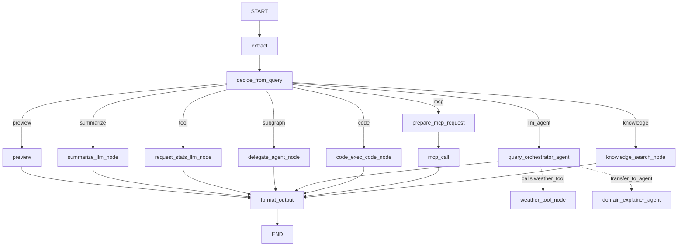

# Graph

## 简介

在要求Agent执行可预测性的场景，往往通过Graph来编排工作流，tRPC-Agent-Python现在提供Graph能力，不光支持编排业务自己的Node，还支持编排框架的各个组件（各类Agent、MCP、知识库、代码执行器等），方便业务基于框架的已有生态，快速构建适用于业务场景的工作流。

## 架构设计

如下所示，用户通过框架提供的Graph接口来构建图，框架的Graph支持通用图的构建，也支持将框架已有的组件或者业务自己开发的Agent引入图中。图执行使用GraphAgent来执行，它底层封装了LangGraph作为图执行引擎，生产可用。


## 环境准备

建议按下面约束配置环境：

- **用户自定义节点必须使用 `async def`来定义，防止同步异步混用导致的各类问题（比如阻塞EventLoop）**
- **Python 版本必须高于 3.11（建议 3.12+）**：*此项约束受限于图执行引擎LangGraph的要求，Graph引擎封装需要Node执行过程中流式返回各类信息，LangGraph在3.11及以上支持了这个能力*
- **LangGraph 版本推荐使用 1.0.x 正式版**

升级trpc-agent到 **v0.6.0** 以上，即可使用Graph能力：
```bash
pip install trpc-agent>=0.6.0 --extra-index-url https://mirrors.tencent.com/repository/pypi/tencent_pypi/simple/
```

## 快速开始

下面示例演示如何构建 Graph、如何运行 Graph：通过 **add_conditional_edges** 按条件路由到不同节点（add_node、add_llm_node、add_agent_node）。

```python
import os
from typing import Any

from typing_extensions import Annotated

from trpc_agent_sdk.agents import LlmAgent
from trpc_agent_sdk.models import OpenAIModel
from trpc_agent_sdk.tools import FunctionTool
from trpc_agent_sdk.types import GenerateContentConfig
from trpc_agent_sdk.dsl.graph import (
    GraphAgent,
    NodeConfig,
    STATE_KEY_LAST_RESPONSE,
    STATE_KEY_USER_INPUT,
    State,
    StateGraph,
    append_list,
)


# 1. 定义图的状态：继承 State，业务字段 + Reducer 字段
class DemoState(State):
    tool_result: str
    agent_reply: str
    # append_list reducer：多个节点写入时自动追加，不会覆盖
    node_execution_history: Annotated[list[dict[str, Any]], append_list]


# 2. 定义普通函数节点（必须 async def）
async def hello(state: DemoState) -> dict[str, Any]:
    """入口节点：打印欢迎信息，后续由条件边决定下一跳"""
    print("Hello from graph")
    return {}


# 3. 定义路由函数：根据用户输入返回不同的路由 key
def route_choice(state: DemoState) -> str:
    text = state[STATE_KEY_USER_INPUT].strip().lower()
    if "weather" in text:
        return "llm"       # 天气相关 → 走 llm_node
    return "agent"         # 其他 → 走 agent_node


# 4. 定义输出格式化节点：将上游结果写入 last_response 供 Runner 返回
async def format_output(state: DemoState) -> dict[str, Any]:
    content = state.get("agent_reply") or state.get("tool_result") or "(No content)"
    return {STATE_KEY_LAST_RESPONSE: content}


# 5. 定义工具函数，供 llm_node 中模型 function_call 调用
async def weather_tool(location: str) -> dict[str, str]:
    return {"location": location, "weather": "sunny"}


def create_agent() -> GraphAgent:
    # 初始化模型（通过环境变量配置）
    model = OpenAIModel(
        model_name=os.getenv("TRPC_AGENT_MODEL_NAME", "deepseek-chat"),
        api_key=os.getenv("TRPC_AGENT_API_KEY", ""),
        base_url=os.getenv("TRPC_AGENT_BASE_URL", ""),
    )
    weather = FunctionTool(weather_tool)
    tools = {"weather_tool": weather}

    # 构建一个子 Agent，后续作为 agent_node 接入图中
    delegate_agent = LlmAgent(
        name="query_orchestrator",
        description="Agent called by graph agent_node",
        model=model,
        instruction="Answer user query briefly.",
        generate_content_config=GenerateContentConfig(
            temperature=0.2,
            max_output_tokens=200,
        )
    )

    # 构建图
    graph = StateGraph(DemoState)

    # 普通函数节点：入口，打印后由条件边路由
    graph.add_node(
        name="hello",
        action=hello,
        config=NodeConfig(name="hello", description="Say hello and route by user input"),
    )

    # LLM 节点：直接调用模型，支持 function_call → 工具执行 → 回填的内置循环
    graph.add_llm_node(
        name="plan_with_llm",
        model=model,
        instruction="If weather is asked, call weather_tool; otherwise answer directly.",
        tools=tools,
        tool_parallel=False,
        max_tool_iterations=4,
        generation_config=GenerateContentConfig(
            temperature=0.2,
            max_output_tokens=200,
        ),
        config=NodeConfig(name="plan_with_llm", description="LLM node"),
    )

    # Agent 节点：将已有的 LlmAgent 作为图中的一个节点
    graph.add_agent_node(
        node_id="delegate_to_agent",
        agent=delegate_agent,
        config=NodeConfig(name="delegate_to_agent", description="Agent node"),
    )

    # 输出格式化节点
    graph.add_node(
        name="format_output",
        action=format_output,
        config=NodeConfig(name="format_output", description="Build final response"),
    )

    # 连边
    graph.set_entry_point("hello")            # START → hello
    graph.set_finish_point("format_output")   # format_output → END

    # 条件边：hello 之后根据 route_choice 的返回值路由到不同节点
    graph.add_conditional_edges(
        source="hello",
        path=route_choice,
        path_map={"llm": "plan_with_llm", "agent": "delegate_to_agent"},
    )
    graph.add_edge(start="plan_with_llm", end="format_output")
    graph.add_edge(start="delegate_to_agent", end="format_output")

    # 编译图并包装为 GraphAgent，交给 Runner 执行
    return GraphAgent(
        name="graph_demo",
        description="Simple graph build demo",
        graph=graph.compile(),
    )
```

运行方式（Runner）：

```python
import asyncio
import uuid

from trpc_agent_sdk.runners import Runner
from trpc_agent_sdk.sessions import InMemorySessionService
from trpc_agent_sdk.types import Content, Part


async def main() -> None:
    app_name = "graph_demo_app"
    user_id = "demo_user"
    session_id = str(uuid.uuid4())

    session_service = InMemorySessionService()
    await session_service.create_session(
        app_name=app_name,
        user_id=user_id,
        session_id=session_id,
        state={},
    )

    runner = Runner(
        app_name=app_name,
        agent=create_agent(),
        session_service=session_service,
    )

    content = Content(parts=[Part.from_text(text="What's the weather in Seattle?")])
    async for event in runner.run_async(user_id=user_id, session_id=session_id, new_message=content):
        if event.content and event.content.parts:
            for part in event.content.parts:
                if part.text:
                    print(part.text, end="", flush=True)

    await runner.close()


if __name__ == "__main__":
    asyncio.run(main())
```

**完整示例：**
见 [examples/graph](../../../examples/graph/README.md)，该示例完整演示了框架各个组件的对接，如下所示：



输入示例：

- subgraph: Please respond in a friendly tone. → 触发子图 agent_node
- llm_agent: What's the weather in Seattle? → 触发 query_orchestrator_agent 并调用 weather_tool（固定返回 sunny）
- llm_agent: child: What is retrieval augmented generation? → 触发 query_orchestrator_agent，并转交给其子 domain_explainer_agent
- tool: Count words for this text. → 触发带工具调用能力的 llm_node
- code: run python analysis → 触发 code_node，执行内置 Python 统计脚本
- mcp: {"operation": "add", "a": 3, "b": 5} → 触发 mcp_node，通过 stdio 调用本地 MCP Server 的 calculate 工具
- knowledge: What is retrieval augmented generation? → 触发 knowledge_node，搜索知识库（需启用 `ENABLE_KNOWLEDGE`）
- 长文本（40 词以上）→ 触发 summarize LLM 节点
- 短文本 → 触发 preview（会用 EventWriter 流式输出）

多轮对话示例见：[examples/graph_multi_turns](../../../examples/graph_multi_turns/README.md)

## StateGraph API介绍

图中可以接入框架的多种组件，通过不同的 `add_*` 方法将**模型、工具、Agent、代码执行、知识库检索、MCP 工具**等接入图中，如下所示：


| 函数 | 作用 | 常见场景 |
| --- | --- | --- |
| add_node(name, action, ...) | 添加通用异步函数节点 | 业务处理、数据清洗、路由前置处理 |
| add_llm_node(name, model, instruction, ...) | 添加直接调用模型的节点（可选工具循环） | 分类、改写、摘要、工具增强问答 |
| add_code_node(name, code_executor, code, language, ...) | 添加代码执行节点 | 执行 Python/Shell 脚本并写回状态 |
| add_knowledge_node(name, query, tool, ...) | 添加知识检索节点 | RAG 检索、知识库问答前置 |
| add_mcp_node(name, mcp_toolset, selected_tool_name, req_src_node, ...) | 添加 MCP 工具调用节点 | 调用外部 MCP Server 工具 |
| add_agent_node(node_id, agent, ...) | 添加子 Agent 节点 | 多 Agent 协作、子流程委托 |
| add_edge(start, end) | 添加静态有向边 | 固定执行链路 |
| add_conditional_edges(source, path, path_map) | 添加条件路由边 | 意图分流、多分支流程 |
| set_entry_point(key) | 设置入口节点（START -> key） | 指定工作流起点 |
| set_finish_point(key) | 设置结束节点（key -> END） | 指定工作流终点 |
| compile(memory_saver_option=...) | 编译图并返回可执行对象 | Runner 执行前的最后一步 |

下面介绍每种节点如何添加、适用场景与常用选项。

### add_node

场景：接入一个普通异步函数节点（纯业务逻辑、数据加工、路由决策等）。

```python
graph.add_node(
    name="extract",
    action=extract_document,
    config=NodeConfig(name="extract", description="Extract input"),
)
```

常用选项：
- name：节点 ID（用于连边、路由、回调定位）
- action：必须是 async def
- config：公共配置（name / description / metadata）
- callbacks：设置当前节点的回调

### add_llm_node

场景：在节点内直接调用模型；若配置 tools，会在同一 llm_node 内完成 function_call → 执行工具 → 回填 function_response → 再次调用模型的循环。

```python
from trpc_agent_sdk.tools import FunctionTool
from trpc_agent_sdk.types import GenerateContentConfig

async def my_tool(query: str) -> dict[str, str]:
    return {"result": f"Processed: {query}"}

tools = {"my_tool": FunctionTool(my_tool)}

graph.add_llm_node(
    name="classifier",
    model=model,
    instruction="Classify user intent into one label.",
    tools=tools,
    tool_parallel=False,
    max_tool_iterations=4,
    generation_config=GenerateContentConfig(
        temperature=0.1,
        max_output_tokens=64,
    ),
    config=NodeConfig(name="classifier", description="Intent classifier"),
)
```

常用选项：
- tools：工具字典（`{tool_name: tool_instance}`），不需要时传 `{}`
- tool_parallel：同一轮内多个工具调用是否并行
- max_tool_iterations：单次 llm_node 内最多 model→tool 循环轮数
- generation_config：模型配置（temperature、max_output_tokens 等）
- config / callbacks：同 add_node

### add_code_node

场景：在图中执行一段静态代码（如 Python/Shell），结果写入内置状态；可通过 `STATE_KEY_NODE_RESPONSES[name]` 取该节点输出。

```python
from trpc_agent_sdk.code_executors import UnsafeLocalCodeExecutor

graph.add_code_node(
    name="run_script",
    code_executor=UnsafeLocalCodeExecutor(timeout=30, work_dir="", clean_temp_files=True),
    code="result = 1 + 1",
    language="python",
    config=NodeConfig(name="run_script", description="Run inline code"),
)
```

参数说明：
- code_executor：`BaseCodeExecutor` 实例（如 `UnsafeLocalCodeExecutor`、`ContainerCodeExecutor`），由调用方自行构建
- code：要执行的源码
- language：`python` / `bash` / `sh`
- config / callbacks：同 add_node

### add_knowledge_node

场景：在图中接入一个知识检索节点，使用已有的 `LangchainKnowledgeSearchTool` 做检索，结果写入状态。

```python
from trpc_agent_sdk.server.knowledge.tools import LangchainKnowledgeSearchTool
from trpc_agent_sdk.server.knowledge.trag_adapter import TragAuthParams
from trpc_agent_sdk.server.knowledge.trag_adapter import TragDocumentLoader
from trpc_agent_sdk.server.knowledge.trag_adapter import TragDocumentLoaderParams
from trpc_agent_sdk.server.knowledge.trag_knowledge import TragKnowledge


def _create_trag_knowledge(auth_params: TragAuthParams) -> TragKnowledge:
    document_loader = TragDocumentLoader(TragDocumentLoaderParams(file_paths=[]))
    return TragKnowledge(auth_params=auth_params, document_loader=document_loader)


# Build the knowledge tool: auth_params from your config (e.g. create_trag_auth_params_xxx())
auth_params = get_auth_params()  # from .config or TragAuthParams(...)
knowledge = _create_trag_knowledge(auth_params=auth_params)
my_knowledge_tool = LangchainKnowledgeSearchTool(
    rag=knowledge,
    top_k=5,
    min_score=0.0,
    knowledge_filter=None,  # optional static filter
)

graph.add_knowledge_node(
    name="search_kb",
    query="user_query",  # or callable: lambda state: state.get("query", ""),
    tool=my_knowledge_tool,
    config=NodeConfig(name="search_kb", description="Knowledge search"),
)
```

常用选项：
- query：检索 query，可为字符串或 `(state) -> str` 的可调用对象
- tool：预构建的 `LangchainKnowledgeSearchTool` 实例，不可为 None
- config / callbacks：同 add_node

### add_mcp_node

场景：在图中调用 MCP 的某一个工具；参数来自上游节点写入的 `state[STATE_KEY_NODE_RESPONSES][req_src_node]`。

注意：需先有上游节点把 MCP 请求参数写入 `node_responses[req_src_node]`；执行失败会直接抛错，便于排查错误请求。

```python
graph.add_mcp_node(
    name="call_mcp",
    mcp_toolset=my_mcp_toolset,
    selected_tool_name="my_mcp_tool",
    req_src_node="build_request",
    config=NodeConfig(name="call_mcp", description="Invoke MCP tool"),
)
```

常用选项：
- mcp_toolset：已配置的 `MCPToolset` 实例
- selected_tool_name：要调用的 MCP 工具名（精确匹配）
- req_src_node：提供请求参数的上游节点 ID（其输出在 `node_responses[req_src_node]`）
- config / callbacks：同 add_node

### add_agent_node

场景：将任意 BaseAgent（如 LlmAgent/GraphAgent）作为图中一个节点。

```python
graph.add_agent_node(
    node_id="delegate",
    agent=delegate_agent,
    isolated_messages=True,
    input_from_last_response=False,
    event_scope="delegate_scope",
    input_mapper=StateMapper.rename({"query_text": STATE_KEY_USER_INPUT}),
    output_mapper=StateMapper.merge_response("delegate_reply"),
    config=NodeConfig(name="delegate", description="Delegate to child agent"),
)
```

常用选项：
- isolated_messages：是否隔离父会话消息历史
- input_from_last_response：是否将父状态 last_response 映射为子节点 user_input
- event_scope：子 Agent 事件分支前缀
- input_mapper / output_mapper：父子状态映射（推荐显式配置）
- config / callbacks：同 add_node

GraphAgent 不需要（也不支持）通过 sub_agents 注册 Agent 节点；组合关系统一用 add_agent_node 完成。

## 进阶用法

本节介绍连边与路由、状态与 Reducer、编译与执行、节点签名、StateMapper、回调、状态常量、Interrupt 等进阶内容。

### 边与路由

场景：静态链路用 add_edge，条件分支用 add_conditional_edges；入口/出口可用 set_entry_point / set_finish_point 简写。若需在路由前做**输入预处理**（如校验、归一化 user_input 的 prepare_input 节点），可在入口后接一个 add_node 再连到条件边。

```python
graph.add_edge(start="extract", end="decide")

graph.add_conditional_edges(
    source="decide",
    path=route_choice,
    path_map={
        "preview": "preview",
        "summarize": "summarize",
    },
)

graph.set_entry_point("extract")
graph.set_finish_point("format_output")
```

- add_edge(start, end)：从 start 到 end 的有向边
- add_conditional_edges(source, path, path_map)：path(state) 返回下一跳 key，path_map 将 key 映射到节点名
- set_entry_point(key)：等价于 add_edge(START, key)
- set_finish_point(key)：等价于 add_edge(key, END)

### State 与 Reducer 用法

Graph 的状态是一个 TypedDict（State）在节点间传递。推荐做法是：

- 继承框架的 State 定义业务字段
- 对“会被多节点累积更新”的字段，使用 Annotated[..., reducer]
- 节点返回 dict 增量，框架按 reducer 规则合并

**定义 State：**

```python
from typing import Any

from google.genai.types import Content
from typing_extensions import Annotated

from trpc_agent_sdk.dsl.graph import (
    State,
    append_list,
    merge_dict,
    messages_reducer,
)


class ArticleState(State):
    article: str
    summary: str

    execution_log: Annotated[list[dict[str, Any]], append_list]
    node_outputs: Annotated[dict[str, Any], merge_dict]
    messages: Annotated[list[Content], messages_reducer]
```

**Reducer 行为：** append_list（追加列表）、merge_dict（浅合并字典）、messages_reducer（消息列表追加）。像 route、summary 等单节点写入即可的字段无需 Annotated。

### 编译与执行

图构建完成后调用 `compile`；可选配置 checkpoint 持久化。

```python
compiled = graph.compile(
    memory_saver_option=MemorySaverOption(
        auto_persist=False,
        persist_writes=False,
    ),
)
agent = GraphAgent(
    name="my_workflow",
    description="My graph workflow",
    graph=compiled,
)
```

说明：
- 编译后得到 `CompiledStateGraph`，应将其传入 `GraphAgent` 的 `graph` 参数，通过 Runner 执行（见上文「快速开始」），而不是直接调用 `compiled.astream(...)`。
- 若需访问编译结果：可用 `compiled.source` 取回原 StateGraph，用 `compiled.get_node_config(name)` 按节点名查配置。
- 构造图时可通过 `StateGraph(MyState, callbacks=global_callbacks)` 为整图挂统一的 before/after/error 回调（日志、检查、指标）。
- Runner 运行时，状态持久化主路径是 Event.actions.state_delta → SessionService；使用 InMemorySessionService 时进程重启后状态不保留，使用 Redis/SQL 等持久化 SessionService 时可支持分布式部署。

### 节点签名与依赖注入

节点定义必须为异步方法，也即 `async def`。

Graph 根据方法定义自动注入能力，常见签名如下：

```python
async def node(state: State) -> dict: ...
async def node(state: State, writer: EventWriter) -> dict: ...
async def node(state: State, async_writer: AsyncEventWriter) -> dict: ...
async def node(state: State, ctx: InvocationContext) -> dict: ...
async def node(state: State, writer: EventWriter, ctx: InvocationContext) -> dict: ...
async def node(state: State, async_writer: AsyncEventWriter, ctx: InvocationContext) -> dict: ...
async def node(state: State, writer: EventWriter, async_writer: AsyncEventWriter, ctx: InvocationContext) -> dict: ...
async def node(state: State, callback_ctx, callbacks) -> dict: ...
```

说明：
- writer：同步写事件
- async_writer：需 await 控制事件刷出时使用
- ctx：读取 session / user_id / session_id 等
- callback_ctx / callbacks：节点内细粒度回调（高级用法）

### StateMapper（add_agent_node 输入输出映射）

StateMapper 用于显式控制 agent_node 的数据流，分为两步：

- input_mapper：Graph State -> Agent Node 输入 State
- output_mapper：Agent Node 结果 -> Graph State 更新

下面用一个具体例子说明：

- Graph 在调用 Agent Node 前的状态包含：{"query_text": "What is RAG?", "route": "llm_agent"}
- Agent Node 只识别 STATE_KEY_USER_INPUT（即 user_input）
- Agent Node 执行完成后，我们希望把它的最终回复写回 Graph 的 query_reply

```python
from trpc_agent_sdk.dsl.graph import StateMapper, STATE_KEY_USER_INPUT

graph.add_agent_node(
    node_id="query_orchestrator",
    agent=orchestrator_agent,
    input_mapper=StateMapper.rename({"query_text": STATE_KEY_USER_INPUT}),
    output_mapper=StateMapper.merge_response("query_reply"),
)
```

上面这段配置的效果是：

- 调用 Agent Node 前：把 Graph query_text 重命名为 Agent Node 的 user_input
- Agent Node 结束后：把 Agent Node 的 last_response 写入 Graph query_reply

如需更精细的控制，可组合使用以下 mapper：

- pick: 只传白名单字段给子节点。例如 `StateMapper.pick("query", "context")` 只将父状态中的 query 和 context 传给子 Agent，其余字段丢弃。
- exclude: 排除指定字段，其余都传给子节点。例如 `StateMapper.exclude("api_key", "password")` 把除 api_key、password 以外的父状态全部传给子 Agent。
- rename: 将父状态键名映射为子节点键名，格式为 `{父键: 子键}`。例如 `StateMapper.rename({"query_text": STATE_KEY_USER_INPUT, "docs": "context"})` 把父状态的 query_text 映射为子节点的 user_input，docs 映射为 context。
- combine: 组合多个 input mapper，结果取并集，同键时后者覆盖前者。例如 `StateMapper.combine(StateMapper.pick("context"), StateMapper.rename({"query_text": STATE_KEY_USER_INPUT}))` 先取 context 字段，再把 query_text 重命名为 user_input，两者合并传给子节点。
- merge_response: 将子节点 last_response 写入父状态指定字段，仅用于 output_mapper。例如 `StateMapper.merge_response("search_results")` 把子 Agent 的回复写入父状态的 search_results。
- identity: 原样透传父状态，不做任何裁剪或重命名。例如 `StateMapper.identity()` 把父状态完整传给子 Agent。
- filter_keys: 按谓词函数过滤父状态的键。例如 `StateMapper.filter_keys(lambda k: k.startswith("user_"))` 只传以 `user_` 开头的字段给子节点。

### NodeCallbacks

可以通过 NodeCallbacks 在节点执行前后注入日志、检查或其他埋点，支持两种粒度：

- Graph级：StateGraph(..., callbacks=global_callbacks)，作用于全图节点
- 节点级：add_node(..., callbacks=node_callbacks)，只作用于当前节点

```python
from trpc_agent_sdk.dsl.graph import NodeCallbacks, StateGraph


global_callbacks = NodeCallbacks()
node_callbacks = NodeCallbacks()


async def before_node(ctx, state):
    print(f"[before] step={ctx.step_number} node={ctx.node_id}")
    return None


async def after_node(ctx, state, result, error):
    print(f"[after ] step={ctx.step_number} node={ctx.node_id}")
    return None


global_callbacks.register_before_node(before_node)
node_callbacks.register_after_node(after_node)

graph = StateGraph(MyState, callbacks=global_callbacks)
graph.add_node(name="extract", action=extract_node, callbacks=node_callbacks)
```

常用回调类型：

- register_before_node
- register_after_node
- register_on_error
- register_agent_event

回调合并规则：

- before_node / on_error：图级先执行，再执行节点级
- after_node：节点级先执行，再执行图级（便于节点级先修改输出）

### State Key 常量与取值方式

Graph 模块内置了一组常用状态 Key 常量，建议统一使用常量读写状态，避免业务代码里散落硬编码字符串。

### 常量 Key 对照表

| 常量 | 实际 Key | 说明 |
| --- | --- | --- |
| `STATE_KEY_USER_INPUT` | `user_input` | 当前轮用户输入 |
| `STATE_KEY_MESSAGES` | `messages` | 会话消息列表 |
| `STATE_KEY_LAST_RESPONSE` | `last_response` | 最近一次回复文本 |
| `STATE_KEY_LAST_RESPONSE_ID` | `last_response_id` | 最近一次回复 ID |
| `STATE_KEY_LAST_TOOL_RESPONSE` | `last_tool_response` | 最近一次工具执行结果 |
| `STATE_KEY_NODE_RESPONSES` | `node_responses` | 按节点聚合的响应结果 |
| `STATE_KEY_NODE_STRUCTURED` | `node_structured` | 按节点聚合的结构化结果 |

### 在 Graph 运行中读取

```python
from trpc_agent_sdk.dsl.graph import (
    State,
    STATE_KEY_USER_INPUT,
    STATE_KEY_LAST_RESPONSE,
    STATE_KEY_NODE_RESPONSES,
)


async def inspect_state_node(state: State) -> dict[str, str]:
    user_input = state.get(STATE_KEY_USER_INPUT, "")
    last_response = state.get(STATE_KEY_LAST_RESPONSE, "")
    summarize_text = state.get(STATE_KEY_NODE_RESPONSES, {}).get("summarize", "")
    return {
        "echo_input": user_input,
        "debug_last_response": last_response,
        "debug_summarize_text": summarize_text,
    }
```

### 在 Graph 外读取

```python
from trpc_agent_sdk.dsl.graph import STATE_KEY_LAST_RESPONSE, STATE_KEY_NODE_RESPONSES


session = await session_service.get_session(
    app_name=app_name,
    user_id=user_id,
    session_id=session_id,
)

if session and session.state:
    last_response = session.state.get(STATE_KEY_LAST_RESPONSE, "")
    node_responses = session.state.get(STATE_KEY_NODE_RESPONSES, {})
```

### Interrupt

Graph 提供 interrupt(...)，可在节点中暂停执行并等待外部决策：

```python
from trpc_agent_sdk.dsl.graph import interrupt


async def approval_gate(state: State) -> dict[str, Any]:
    decision = interrupt({
        "title": "Approval Required",
        "options": ["approved", "rejected"],
    })
    status = "approved"
    if isinstance(decision, dict):
        status = str(decision.get("status", "approved"))
    return {"approval_status": status}
```

Runner 侧会收到 LongRunningEvent，客户端通过 FunctionResponse 恢复：

```python
from trpc_agent_sdk.events import LongRunningEvent
from trpc_agent_sdk.types import Content, FunctionResponse, Part

async for event in runner.run_async(...):
    if isinstance(event, LongRunningEvent):
        resume_payload = {"status": "approved", "note": "Proceed"}
        resume_response = FunctionResponse(
            id=event.function_response.id,
            name=event.function_response.name,
            response=resume_payload,
        )
        resume_content = Content(role="user", parts=[Part(function_response=resume_response)])

        async for _ in runner.run_async(..., new_message=resume_content):
            pass
```

**完整示例：**
- [examples/graph_with_interrupt](../../../examples/graph_with_interrupt/README.md) - interrupt + resume 示例
