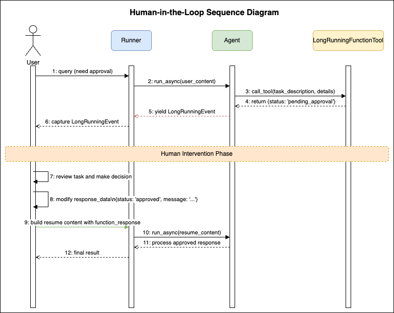

# Human-In-The-Loop

在 Agent 处理请求的过程中，某些场景需要引入人工判断或调整，以提高任务完成的准确率。例如：
- 风险操作审批：当 Agent 生成 SQL 或 Shell 脚本时，是否执行通常需要人工审批。以命令执行为例：如果人工同意，则拉起 terminal 执行并将结果回传给 Agent；如果不同意，则说明命令可能有问题，需要 Agent 重新生成替代命令。
- 执行计划审批：对于复杂任务，Agent 通常会先生成 Plan，再交由用户确认。如果用户同意，则按计划逐步执行；如果不同意，用户可补充调整提示词，让 Agent 重新生成更符合要求的 Plan。

## 实现机制

业界当前主要有两种实现方式：
- 方式一：提供一个 UserAgent 专门负责与用户沟通（例如 autogen/agentscope），再通过多 Agent 编排形成应用。该方式简单易用，但额外引入 Agent 会增加系统复杂度，并且由于交互接口相对固定，灵活性受限，难以覆盖所有场景。
- 方式二：将 Tool 作为人工参与的结合点（例如 langgraph/agno）。人工操作被纳入 Tool 执行过程，人工结果作为 Tool 调用结果返回。该方式更灵活，但实现复杂度更高。

框架当前支持“以 Tool 作为人工参与结合点”的方式，并在 `LlmAgent` 上提供 `LongRunningFunctionTool` 与 `LongRunningEvent` 来实现该机制。如下图所示：当用户使用 `LongRunningFunctionTool` 创建工具后，Agent 调用该工具时传入的参数，可视为“待人工确认的操作”；用户可在 Tool 实现中将这些操作组织为 `dict` 结果并返回。`LongRunningFunctionTool` 执行后，框架会生成 `LongRunningEvent` 事件。识别到该事件后，用户可执行相应人工操作，并将结果提交给 Agent 继续执行。




### LongRunningEvent
`LongRunningEvent` 是一个特殊的事件类型，表示 Agent 执行被暂停，等待人工参与。
- `function_call`: 触发操作的 Tool 调用；
- `function_response`: Tool 的初始响应（通常包含等待状态信息）。可以基于此对象（主要是 `id` 和 `name`）将人工操作结果提交给 Agent，见下方代码示例；

## LlmAgent 用法

### 1. 创建 LongRunningFunctionTool

首先定义一个需要人工审批的 Tool：

```python
async def human_approval_required(task_description: str, details: dict) -> dict:
    """A long-running function that requires human approval.

    Args:
        task_description: Description of the task requiring approval
        details: Additional details about the task

    Returns:
        A dictionary indicating the task is pending human approval
    """
    return {
        "status": "pending_approval",
        "message": f"Task '{task_description}' requires human approval",
        "details": details,
        "approval_id": str(uuid.uuid4()),
        "timestamp": time.time(),
    }


from trpc_agent_sdk.tools import LongRunningFunctionTool
approval_tool = LongRunningFunctionTool(human_approval_required)
```

### 2. 配置 Agent

使用 `LongRunningFunctionTool` 包装工具并配置 Agent：

```python
import os
from trpc_agent_sdk.agents import LlmAgent
from trpc_agent_sdk.models import OpenAIModel
from trpc_agent_sdk.tools import LongRunningFunctionTool

def create_agent():
    model = OpenAIModel(
        model_name=os.getenv("TRPC_AGENT_MODEL_NAME", ""),
        api_key=os.getenv("TRPC_AGENT_API_KEY", ""),
        base_url=os.getenv("TRPC_AGENT_BASE_URL", ""),
    )
    approval_tool = LongRunningFunctionTool(human_approval_required)

    agent = LlmAgent(
        name="human_in_loop_agent",
        description="Agent demonstrating long-running tools with human-in-the-loop",
        model=model,
        instruction="""You are an assistant that can handle long-running operations requiring human approval.
When you encounter tasks that need approval, use the appropriate tool and wait for human intervention.""",
        tools=[approval_tool],
    )
    return agent
```

### 3. 捕获 LongRunningEvent

```python
@dataclass
class InvocationParams:
    """一次调用执行所需参数"""
    user_id: str
    session_id: str
    agent: LlmAgent
    session_service: InMemorySessionService
    app_name: str

async def run_invocation(
    params: InvocationParams,
    content: Content,
) -> Optional[LongRunningEvent]:
    """使用新的 Runner 实例执行一次调用。"""
    runner = Runner(
        app_name=params.app_name,
        agent=params.agent,
        session_service=params.session_service,
    )

    captured_long_running_event = None

    try:
        async for event in runner.run_async(
            user_id=params.user_id,
            session_id=params.session_id,
            new_message=content,
        ):
            if isinstance(event, LongRunningEvent):
                # 捕获长运行事件
                captured_long_running_event = event
                print(f"\n🔄 [Long-running operation detected]")
                print(f"   Function: {event.function_call.name}")
                print(f"   Response: {event.function_response.response}")
            elif event.content and event.content.parts and event.author != "user":
                # 处理其他事件...
                pass
    finally:
        await runner.close()

    return captured_long_running_event
```

### 4. 执行人工操作

注意：只需要 `FunctionResponse` 的 `id`、`name`、`response`，就可以创建用于恢复 Agent 执行的 `Content`。在 Agent 作为服务对外提供能力的场景中，只需将这些信息返回给前端；前端在人工操作完成后，于下一次 Agent 调用时携带这些信息即可。

```python
from trpc_agent_sdk.sessions import InMemorySessionService
from trpc_agent_sdk.events import LongRunningEvent

async def run_agent():
    """运行 Agent（支持长运行事件）。"""

    # 创建Agent和Session Service
    agent = create_agent()
    session_service = InMemorySessionService()

    params = InvocationParams(
        user_id="demo_user",
        session_id=str(uuid.uuid4()),
        agent=agent,
        session_service=session_service,
        app_name="agent_demo",
    )

    # 触发长运行操作的查询
    query = "I need approval to delete the production database. The details are: environment=prod, database=user_data, reason=migration"
    user_content = Content(parts=[Part.from_text(text=query)])

    # 第一次运行 - 触发人工审批
    long_running_event = await run_invocation(params, user_content)

    # 模拟人工干预
    if long_running_event:
        print("\n👤 [模拟人工干预]")
        await asyncio.sleep(2)  # 模拟人工思考时间

        # 获取Tool返回的初始响应
        response_data = long_running_event.function_response.response
        if response_data["status"] != "pending_approval":
            print("   ❌ 响应状态无效")
            return

        # 模拟人工提供审批输入
        response_data["status"] = "approved"
        response_data["message"] = "APPROVED: The database deletion is approved for migration purposes."
        response_data["approved_by"] = "admin"
        response_data["timestamp"] = time.time()
        # 你也能创建新的工具返回结果，而不是复用function_response.response
        # response_data = {"user_is_approved": True}

        # 创建用于恢复Agent执行的消息，如果是调用Agent服务的场景
        # 只需要返回function_response的id和name给前端，下次调用请求里包含这些信息，用于创建resume_content即可
        resume_function_response = FunctionResponse(
            id=long_running_event.function_response.id,
            name=long_running_event.function_response.name,
            response=response_data,
        )
        resume_content = Content(role="user", parts=[Part(function_response=resume_function_response)])

        # 继续执行Agent
        await run_invocation(params, resume_content)
```

## LangGraphAgent 用法

LangGraphAgent 适配了 LangGraph 的 interrupt 与框架 `LongRunningEvent` 的交互机制。与 LlmAgent 不同的是，它可以在 Node 内恢复原有会话，而 LlmAgent 的 Tool 内部无法继续执行。

为使用 LangGraphAgent 的 interrupt 能力，请务必开启 `checkpoint`。该能力会暂停图执行，因此需要保存图状态以便后续恢复。

注意：LangGraph 在恢复执行时，会从 Node 开头重新执行到 interrupt 位置，也就是该段逻辑会执行两次。如包含耗时操作，请注意优化。

### 1. 构建包含工具输出审批确认的 Graph

**请注意，一定要开启 checkpoint**

```python
import os
from typing import Annotated, Literal, TypedDict

from langchain.chat_models import init_chat_model
from langchain_core.tools import tool
from langgraph.graph import StateGraph, START, END
from langgraph.graph.message import add_messages
from langgraph.prebuilt import tools_condition, ToolNode
from langgraph.types import interrupt, Command
from langgraph.checkpoint.memory import InMemorySaver

from trpc_agent_sdk.agents import langgraph_llm_node, langgraph_tool_node


@tool
@langgraph_tool_node
def execute_database_operation(operation: str, database: str, details: dict) -> str:
    """Execute a database operation that requires approval.

    Args:
        operation: The type of operation ('delete', 'update', 'create')
        database: The database name
        details: Additional operation details
    """
    return f"Database operation '{operation}' on '{database}' executed successfully with details: {details}"


class State(TypedDict):
    messages: Annotated[list, add_messages]
    task_description: str
    approval_status: str


def build_graph():
    """Build a LangGraph with human-in-the-loop approval using interrupt."""

    model = init_chat_model(
        os.getenv("TRPC_AGENT_MODEL_NAME", ""),
        api_key=os.getenv("TRPC_AGENT_API_KEY", ""),
        api_base=os.getenv("TRPC_AGENT_BASE_URL", ""),
    )
    tools = [execute_database_operation]
    llm_with_tools = model.bind_tools(tools)

    @langgraph_llm_node
    def chatbot(state: State):
        """Chatbot node that can use tools"""
        return {"messages": [llm_with_tools.invoke(state["messages"])]}

    # 使用 LangGraph interrupt 的人工审批节点
    def human_approval(state: State) -> Command[Literal["approved_path", "rejected_path"]]:
        """Human approval node that interrupts execution for human input."""
        task_info = {
            "_node_name": "human_approval",
            "question": "Do you approve this database operation?",
        }

        # 中断执行并等待人工输入
        decision = interrupt(task_info)
        approval_status = decision.get("status", "rejected")

        if approval_status in ["approved", "approve", "yes", "true"]:
            return Command(goto="approved_path", update={"approval_status": "approved"})
        else:
            return Command(goto="rejected_path", update={"approval_status": "rejected"})

    # 审批通过/拒绝分支节点
    def approved_node(state: State) -> State:
        """Handle approved operations"""
        return {"messages": [{"role": "assistant", "content": "Operation has been approved and will be executed."}]}

    def rejected_node(state: State) -> State:
        """Handle rejected operations"""
        return {"messages": [{"role": "assistant", "content": "Operation has been rejected and cancelled."}]}

    # 构建图
    graph_builder = StateGraph(State)
    graph_builder.add_node("chatbot", chatbot)
    graph_builder.add_node("human_approval", human_approval)
    graph_builder.add_node("approved_path", approved_node)
    graph_builder.add_node("rejected_path", rejected_node)

    tool_node = ToolNode(tools=tools)
    graph_builder.add_node("tools", tool_node)

    graph_builder.add_edge(START, "chatbot")
    graph_builder.add_conditional_edges("chatbot", tools_condition)
    graph_builder.add_edge("tools", "human_approval")
    graph_builder.add_edge("approved_path", END)
    graph_builder.add_edge("rejected_path", END)

    # 必须启用 checkpointer 才能支持 interrupt
    checkpointer = InMemorySaver()
    return graph_builder.compile(checkpointer=checkpointer)
```

### 2. 创建 LangGraphAgent

```python
from trpc_agent_sdk.agents import LangGraphAgent

def create_agent():
    """Create a LangGraph Agent with human-in-the-loop support"""
    graph = build_graph()

    return LangGraphAgent(
        name="human_in_loop_langgraph_agent",
        description="A LangGraph agent that requires human approval for database operations",
        graph=graph,
        instruction="""You are a database management assistant that requires human approval for all operations.

When a user requests a database operation:
1. Use the execute_database_operation tool to prepare the operation
2. The system will automatically request human approval
3. Only proceed if the human approves the operation

Always be clear about what operation you're about to perform and why it needs approval.""",
    )
```

### 3. 捕获和处理 LongRunningEvent

LangGraphAgent 的 Human-In-The-Loop 处理方式与 LlmAgent 相同，均通过捕获 `LongRunningEvent` 事件实现：

```python
from dataclasses import dataclass
from typing import Optional

from trpc_agent_sdk.runners import Runner
from trpc_agent_sdk.sessions import InMemorySessionService
from trpc_agent_sdk.agents import LangGraphAgent
from trpc_agent_sdk.events import LongRunningEvent
from trpc_agent_sdk.types import Content, Part, FunctionResponse


@dataclass
class InvocationParams:
    """一次调用执行所需参数"""
    user_id: str
    session_id: str
    agent: LangGraphAgent
    session_service: InMemorySessionService
    app_name: str


async def run_invocation(
    params: InvocationParams,
    content: Content,
) -> Optional[LongRunningEvent]:
    """使用新的 Runner 实例执行一次调用。"""
    runner = Runner(
        app_name=params.app_name,
        agent=params.agent,
        session_service=params.session_service,
    )

    captured_long_running_event = None

    try:
        async for event in runner.run_async(
            user_id=params.user_id,
            session_id=params.session_id,
            new_message=content,
        ):
            if isinstance(event, LongRunningEvent):
                # 捕获长运行事件
                captured_long_running_event = event
                print(f"\n🔄 [Long-running operation detected]")
                print(f"   Function: {event.function_call.name}")
                print(f"   Response: {event.function_response.response}")
            elif event.content and event.content.parts and event.author != "user":
                # 处理其他事件...
                pass
    finally:
        await runner.close()

    return captured_long_running_event
```

### 4. 执行人工操作

人工干预处理方式与 LlmAgent 完全相同：

```python
import asyncio
import uuid

async def run_human_in_loop_agent():
    """运行 Agent（支持长运行事件）。"""

    # 创建Agent和Session Service
    agent = create_agent()
    session_service = InMemorySessionService()

    params = InvocationParams(
        user_id="demo_user",
        session_id=str(uuid.uuid4()),
        agent=agent,
        session_service=session_service,
        app_name="langgraph_human_in_loop_demo",
    )

    # 触发长运行操作的查询
    query = "I need to delete the production database 'user_data' for migration purposes. The details are: environment=prod, backup_created=true, reason=migration_to_new_system"
    user_content = Content(parts=[Part.from_text(text=query)])

    # 第一次运行 - 触发人工审批
    long_running_event = await run_invocation(params, user_content)

    # 模拟人工干预
    if long_running_event:
        print("\n👤 [模拟人工干预]")
        await asyncio.sleep(2)  # 模拟人工思考时间

        # 模拟人工决策
        human_decision = "approved"  # or "rejected"
        resume_data = {"status": human_decision}

        # 创建用于恢复Agent执行的消息
        resume_function_response = FunctionResponse(
            id=long_running_event.function_response.id,
            name=long_running_event.function_response.name,
            response=resume_data,
        )
        resume_content = Content(role="user", parts=[Part(function_response=resume_function_response)])

        # 继续执行Agent
        await run_invocation(params, resume_content)
```

## 完整代码示例

完整的示例代码请参考：
- LlmAgent：[examples/llmagent_with_human_in_the_loop/README.md](../../../examples/llmagent_with_human_in_the_loop/README.md)
- LangGraphAgent：[examples/langgraphagent_with_human_in_the_loop/README.md](../../../examples/langgraphagent_with_human_in_the_loop/README.md)
