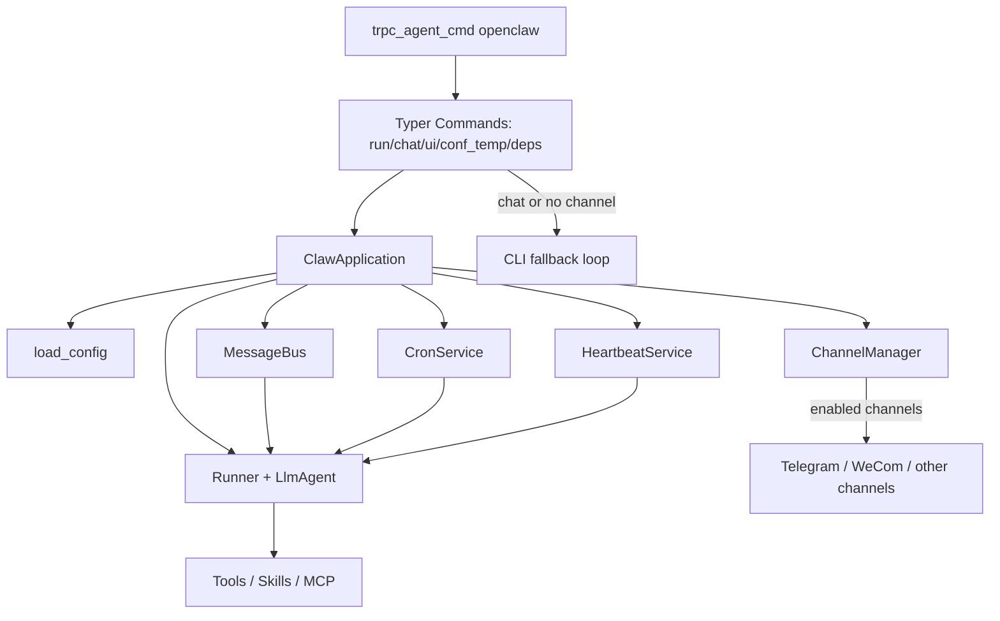

# OpenClaw (trpc_claw)

`openclaw(又称为trpc_claw)` 是基于 `trpc_agent_sdk` 与 `nanobot` 的智能体运行时，支持：

- 第三方通道接入（例如：Telegram / WeCom等 nanobot 支持的 channels，这里都支持，参考： [nanobot/channels](https://github.com/HKUDS/nanobot/tree/main/nanobot/channels)）
- 本地 CLI 回退交互
- 工具调用（文件、Shell、Web、消息、定时任务、MCP、Skills）
- 会话/记忆管理与摘要
- Heartbeat/Cron 定时触发

默认工作目录：`~/.trpc_claw/workspace`

## 核心能力

- **统一处理链路**：不论消息来自 Telegram / WeCom 还是本地 CLI，都进入同一条 `MessageBus -> Runner -> Agent` 管线
- **双运行模式**
  - `run`：有可用通道时走 gateway，无通道自动回退 CLI
  - `chat`：强制本地 CLI 模式
- **可扩展工具体系**：内置文件、执行命令、Web、消息、Cron、MCP 与 Skill 体系
- **长期可运行**：通过 heartbeat 和 cron 在无人交互时也能定时触发任务

## 架构简图



## 安装与启动

### 1) 环境准备

- Python `>=3.10`（推荐 `3.12`）
- 建议使用虚拟环境（`uv` 或 `venv`）

```bash
uv venv
source .venv/bin/activate
python -V
```

### 2) 命令入口

当前推荐命令入口（与仓库现状一致）：

```bash
trpc_agent_cmd openclaw --help
```

### 3) 生成配置模板

```bash
mkdir -p ~/.trpc_claw

# 简版模板
trpc_agent_cmd openclaw conf_temp > ~/.trpc_claw/config.yaml

# 完整模板（建议）
trpc_agent_cmd openclaw conf_temp --full > ~/.trpc_claw/config_full.yaml
```

### 4) 启动方式

```bash
# 自动模式：有通道走 gateway，无通道自动回退 CLI
trpc_agent_cmd openclaw run -c ~/.trpc_claw/config_full.yaml

# 强制本地 CLI 交互
trpc_agent_cmd openclaw chat -c ~/.trpc_claw/config_full.yaml

# 启动 UI
trpc_agent_cmd openclaw ui -c ~/.trpc_claw/config_full.yaml
```

## 命令说明

- `trpc_agent_cmd openclaw conf_temp [--full]`
  - 打印内置配置模板（`config.temp.yaml` / `config_full.temp.yaml`）
- `trpc_agent_cmd openclaw run [-w WORKSPACE] [-c CONFIG]`
  - 启动网关模式；若无可用第三方通道，则自动回退到 CLI
- `trpc_agent_cmd openclaw chat [-w WORKSPACE] [-c CONFIG]`
  - 始终使用本地 CLI 模式，忽略第三方通道
- `trpc_agent_cmd openclaw ui [-w WORKSPACE] [-c CONFIG]`
  - 启动 UI（macOS 桌面，其它系统浏览器）
- `trpc_agent_cmd openclaw deps [OPTIONS]`
  - 检查 Skill 依赖并输出安装计划；支持 `--apply` 执行安装命令

### deps 子命令（新增能力）

```bash
# 按 profile 检查（推荐）
trpc_agent_cmd openclaw deps \
  -c ~/.trpc_claw/config_full.yaml \
  --profile common-file-tools

# 指定 skill 检查
trpc_agent_cmd openclaw deps \
  -c ~/.trpc_claw/config_full.yaml \
  --skills {skill-finder} # 用于下载 skill 的 skill 名称，这里只是占位符，用户使用的时候需要修改为自己真正的 skill 名称

# 输出 JSON
trpc_agent_cmd openclaw deps \
  -c ~/.trpc_claw/config_full.yaml \
  --profile common-file-tools \
  --json

# 直接执行安装计划
trpc_agent_cmd openclaw deps \
  -c ~/.trpc_claw/config_full.yaml \
  --profile common-file-tools \
  --apply
```

常用参数：

- `--profile`：依赖 profile（逗号分隔）
- `--skills/-s`：按技能名检查依赖（逗号分隔）
- `--state-dir`：工具链状态目录（保留对齐参数）
- `--skills-root`：覆盖 skills root
- `--skills-extra-dirs`：额外 skills root（逗号分隔）
- `--skills-allow-bundled`：覆盖 bundled skill 白名单
- `--continue-on-error/--fail-fast`：安装执行策略

## 配置文件说明

配置支持 `YAML/JSON`，默认查找路径：

- `~/.trpc_claw/config.json`

你也可以通过以下方式覆盖：

- 命令行参数：`-c/--config`
- 环境变量：`TRPC_CLAW_CONFIG`

示例：

```bash
export TRPC_CLAW_CONFIG=/path/to/config.yaml
trpc_agent_cmd openclaw chat
```

## 关键配置项（按当前实现）

### runtime

- `app_name`：运行时应用名
- `user_id`：默认用户 ID
- `legacy_sessions_dir`：历史 sessions 目录兼容路径

### agent

- `workspace`：工作目录（不填时自动回退默认目录）
- `model`：模型名（建议用环境变量 `TRPC_AGENT_MODEL_NAME`）
- `api_key`：模型 API Key（建议用环境变量 `TRPC_AGENT_API_KEY`）
- `api_base`：模型 Base URL（建议用环境变量 `TRPC_AGENT_BASE_URL`）
- `provider/max_tokens/context_window_tokens/...`：模型行为与成本相关参数

### channels

- `send_progress`：是否推送流式进度
- `send_tool_hints`：是否推送工具提示
- `telegram.*`：Telegram 通道配置
- `wecom.*`：WeCom 通道配置
  - `stream_reply`：是否流式分片回复
  - `restart_command`：触发工作进程重启并重载配置的命令（默认 `/restart`）

### skills（重点更新）

当前 `openclaw` 使用的字段：

- `sandbox_type`：当前支持 `local` / `container`
- `skill_roots`：用户 skill 根目录（支持本地目录、`file://`、`http(s)://`）
- `builtin_skill_roots`：内置 skill 根目录
- `config_keys`：用于满足 skill 元数据中的 `requires.config`
- `allow_bundled`：当仅允许部分内置 skill 暴露时的白名单（按 `skill_key` 或 `name`）
- `skill_configs`：按 `skill_key` 或 `name` 的运行时配置
  - `enabled`
  - `env`（当前已统一为 env-only，不再使用 `api_key/primary_env` 映射）
- `local_config` / `container_config`：对应沙箱配置
- `run_tool_kwargs`：透传 `skill_run` 运行参数

示例：

```yaml
skills:
  sandbox_type: container
  skill_roots: []
  builtin_skill_roots: []
  config_keys:
    - skillhub.enabled
    - skillhub
  allow_bundled:
    - skillhub.skill.finder
    - skillhub-skill-finder
  skill_configs:
    skillhub-skill-finder:
      enabled: true
      env:
        SKILLHUB_USERNAME: ${SKILLHUB_USERNAME}
        SKILLHUB_TOKEN: ${SKILLHUB_TOKEN}
```

注意这里的 `skillhub-skill-finder` 只是一个例子，需要用户换成自己真正的 skill 名称 

### tools

- `restrict_to_workspace`：是否限制工具仅在 workspace 内操作
- `exec.timeout` / `exec.path_append`：命令执行配置
- `web.search`：检索 provider 配置（`brave`/`tavily`/`duckduckgo`/`searxng`/`jina`）
- `mcp_servers`：MCP 服务列表（stdio/http）

### memory / storage / logger / personal

- `memory.memory_service_config.ttl`：记忆 TTL 策略
- `storage`：`file` / `redis` / `sql`
- `logger`：日志输出配置
- `personal`：`SOUL.md/USER.md/TOOLS.md/AGENTS.md` 覆盖路径

## 推荐环境变量

- `TRPC_AGENT_API_KEY`
- `TRPC_AGENT_BASE_URL`
- `TRPC_AGENT_MODEL_NAME`
- `WECOM_BOT_ID`
- `WECOM_BOT_SECRET`
- `TELEGRAM_BOT_TOKEN`

## 默认目录

- 配置目录：`~/.trpc_claw/`
- 工作目录：`~/.trpc_claw/workspace`

## 接入 ClawBot

### 企业微信

企业微信创建机器人后获取 `BotID/BotSecret`，并配置：

```yaml
channels:
  wecom:
    enabled: true
    bot_id: ${WECOM_BOT_ID}
    secret: ${WECOM_BOT_SECRET}
    stream_reply: true
    restart_command: /restart
```

启动：

```bash
export TRPC_AGENT_API_KEY=xxx
export TRPC_AGENT_BASE_URL=xxx
export TRPC_AGENT_MODEL_NAME=xxx
export WECOM_BOT_ID=xxx
export WECOM_BOT_SECRET=xxx
trpc_agent_cmd openclaw run -c ~/.trpc_claw/config_full.yaml
```


### Telegram

参考：https://cloud.tencent.com/developer/article/2626214

```yaml
channels:
  telegram:
    enabled: true
    token: ${TELEGRAM_BOT_TOKEN}
```

启动：

```bash
export TELEGRAM_BOT_TOKEN=xxx
trpc_agent_cmd openclaw run -c ~/.trpc_claw/config_full.yaml
```


## 高级功能

### 1) 多存储后端（`storage`）

```yaml
storage:
  type: redis # file | redis | sql
  redis:
    url: redis://127.0.0.1:6379
    is_async: false
    password: ""
    db: 0
    kwargs: {}
```

```yaml
storage:
  type: sql
  sql:
    url: sqlite:///./session_memory.db
    is_async: false
    kwargs: {}
```

说明：

- `type=file`：短期会话默认落盘到 `workspace/sessions/*.jsonl`
- `type=redis/sql`：短期会话与记忆可走共享后端

### 2) 记忆 TTL（`memory.memory_service_config.ttl`）

```yaml
memory:
  memory_service_config:
    enabled: true
    ttl:
      enable: true
      ttl_seconds: 86400
      cleanup_interval_seconds: 3600
      update_time: 0.0
```

### 3) Agent 高级参数（`agent`）

```yaml
agent:
  provider: auto
  max_tokens: 8192
  context_window_tokens: 65536
  temperature: 0.1
  max_tool_iterations: 40
  reasoning_effort: null # low | medium | high
  extra_headers: {}
```

### 4) MCP 服务接入（`tools.mcp_servers`）

```yaml
tools:
  mcp_servers:
    fs:
      type: stdio
      command: npx
      args: ["-y", "@modelcontextprotocol/server-filesystem", "/tmp"]
      env: {}
      tool_timeout: 30
      enabled_tools: ["*"]
```

### 5) 搜索 Provider 扩展（`tools.web.search`）

```yaml
tools:
  web:
    search:
      provider: brave # brave | tavily | duckduckgo | searxng | jina
      api_key: ""
      base_url: ""
      max_results: 5
```

### 6) 日志与个人提示词文件

```yaml
logger:
  name: trpc_claw
  log_file: trpc_claw.log
  log_level: INFO
  log_format: "[%(asctime)s][%(levelname)s][%(name)s][%(pathname)s:%(lineno)d][%(process)d] %(message)s"
```

```yaml
personal:
  soul_file: /path/to/SOUL.md
  user_file: /path/to/USER.md
  tool_file: /path/to/TOOLS.md
  agent_file: /path/to/AGENTS.md
```

## 目录参考（当前仓库）

- [trpc_agent_sdk/server/openclaw/_cli.py](../../../trpc_agent_sdk/server/openclaw/_cli.py)：OpenClaw CLI 命令
- [trpc_agent_sdk/server/openclaw/claw.py](../../../trpc_agent_sdk/server/openclaw/claw.py)：运行时核心编排
- [trpc_agent_sdk/server/openclaw/config/](../../../trpc_agent_sdk/server/openclaw/config/)：配置模型与加载逻辑
- [trpc_agent_sdk/server/openclaw/channels/](../../../trpc_agent_sdk/server/openclaw/channels/)：通道适配（Telegram / WeCom）
- [trpc_agent_sdk/server/openclaw/tools/](../../../trpc_agent_sdk/server/openclaw/tools/)：工具实现
- [trpc_agent_sdk/server/openclaw/skill/](../../../trpc_agent_sdk/server/openclaw/skill/)：Skill 体系（加载、解析、依赖检查）
- [trpc_agent_sdk/server/openclaw/service/](../../../trpc_agent_sdk/server/openclaw/service/)：Cron / Heartbeat 服务
