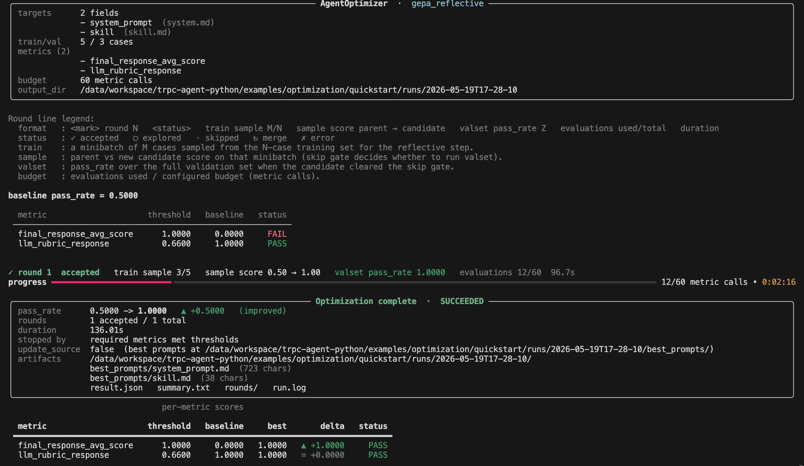

# Prompt 自优化（AgentOptimizer）

`AgentOptimizer` 是 tRPC-Agent-Python 的 **prompt 自优化模块**：它把 prompt 工程的迭代过程——失败案例分析、改写、回归验证、版本管理——整体托管为一条可复现的自动化流水线，把工程师从手工试错中解放出来。

> **这里 "prompt" 的外延**：在 agent 应用中，prompt 不仅指狭义的 system prompt，还包括所有以自然语言驱动 agent 行为的文本资产——skill 描述、rule 规范、sub-agent 协同指令、工具使用说明等。它们的本质都是被 LLM 解读的自然语言文本；只要会左右 agent 决策，都可以作为 `AgentOptimizer` 的优化目标。

模块由四个子模块组成，对外通过单一入口 `AgentOptimizer.optimize` 驱动：

| 子模块 | 职责 |
|---|---|
| **优化算法** | 反思—评估—保留循环；当前内置 [GEPA](https://github.com/gepa-ai/gepa)（Genetic-Evolutionary Pareto，MIT License），通过 `OPTIMIZER_REGISTRY` 可扩展接入其他算法 |
| **评测桥接** | 复用 `AgentEvaluator`，让优化过程与日常回归共用同一份 `EvalSet` 与 metric 配置 |
| **Prompt 管理** | `TargetPrompt` 统一抽象 prompt 字段的读写；支持本地文件（path）与任意后端（callback）两种源 |
| **运行编排** | 资源调度、stopper（停机器）、产物原子落盘、SIGINT 信号安全 |

`AgentOptimizer` 把"prompt 调优"重新定义成一个**有边界、可复现、可审计**的工程问题：

| 维度 | 表达方式 |
|---|---|
| 优化目标 | `evaluate.metrics[]` —— 数值化、可重复评估的指标集合 |
| 决策变量 | `TargetPrompt` 注册的 prompt 字段（一个或多个） |
| 搜索过程 | reflection LM（反思型 LLM）驱动的反思—评估—保留循环（详见 [§5](#5-gepa-是怎么工作的)） |
| 终止条件 | 6 种内置 stopper + 用户自定义停机器（详见 [§4.7](#47)） |
| 产物 | `OptimizeResult` 对象 + `runs/<时间戳>/` 全量审计目录（详见 [§8](#8-产物与目录约定)） |

> **前置阅读**：[Agent 评测](evaluation.md) —— 优化建立在评测之上；本文假设读者已了解 `EvalSet` 与 `metric` 的基本概念。

---

## 1 这是什么 / 解决什么问题

### 1.1 解决的问题

在 agent 应用进入业务关键链路后，prompt（含 skill、rule 等所有驱动 agent 行为的自然语言文本）是迭代成本最高的资产之一：手工调优依赖工程师对失败案例的归纳能力，规模化后回归风险快速放大；多 sub-agent 链路上 prompt 字段之间的耦合让单字段优化失去意义；模型升级、工具变更、场景扩张都会让"昨日最优"的 prompt 在今日失效。

`AgentOptimizer` 模块把这套迭代过程**完整地工程化**：

- **优化目标显式化**——把"什么算好"沉淀为 metric + threshold 的数值契约，可被评测、优化、CI/CD 共享
- **搜索过程算法化**——反思—评估—保留循环替代人工试错，过程可重放、结果可比较
- **多 prompt 联合优化**——支持同时优化多个字段（如 router + worker + summarizer 的指令、CLAUDE.md + SKILL.md），并通过 GEPA 的 merge 机制做跨字段搜索
- **运行过程可审计**——每轮 reflection 输入、候选改动、评估分数、接受/拒绝原因都落盘到 `runs/<时间戳>/`，支持事后追溯
- **结果可控可回滚**——`update_source` 决定是否回写源 prompt；`TargetPrompt` 提供原子写入与失败回滚，写盘半中断或 SIGINT 二次中断都不会损坏源文件

### 1.2 与评测模块的关系

`AgentEvaluator` 与 `AgentOptimizer` 构成**评测—优化闭环**的两端：

| 模块 | 角色 | 输出 |
|---|---|---|
| `AgentEvaluator`（[evaluation.md](evaluation.md)） | 度量当前 prompt 的质量 | 每条 case 的 pass/fail + 各 metric 分 |
| `AgentOptimizer`（本文） | 在度量结果上搜索更优 prompt | 最优 prompt + 全程优化历史 |

二者共享同一份 `EvalSet`、同一套 metric 配置、同一个 `call_agent`。一份资产同时支撑日常回归（pytest 跑 `AgentEvaluator`）与定期优化（夜间窗口跑 `AgentOptimizer`，详见 [§4.6 CI 闭环](#46)）。

### 1.3 适用边界

`AgentOptimizer` 的有效性取决于三个前提：

1. **评测信号足够稳定**。判分本身的方差大于 prompt 改写带来的提升时，优化方向不可信。建议先在 `AgentEvaluator` 上跑 `num_runs=3` 观察 metric 跨次一致性，再开始优化。
2. **预算与搜索空间匹配**。一次典型的小规模优化在 `max_metric_calls=30~60`（一次 case-level 评估算一次 metric_call）量级、reflection LM 调用 5~20 次、运行 1~10 分钟、消耗几美元到几十美元（详见 [§6 成本与并发](#6-成本与并发)）。预算显著低于该量级时，应先在 `AgentEvaluator` 上完成基线调优。
3. **prompt 有可优化的语义结构**。少于 20 字的硬编码或仅作占位拼接的 prompt，搜索空间过窄；GEPA 反思在这种场景下退化为同义改写。

不在以上前提内的场景，应优先选择 [`AgentEvaluator`](evaluation.md) 持续观察，而非启动优化。


## 2 5 分钟 Quickstart

完整代码与数据：[`examples/optimization/quickstart/`](../../../examples/optimization/quickstart/)。

### 2.1 示例任务

本示例的 agent 是一个 **小学算术应用题求解器**：接收自然语言描述的算术题（如"小明早上买了 4 个苹果，下午又买了 7 个苹果，他一共有多少个苹果？"），输出带单位的数字答案（如"答案：11 个"）。

agent 行为由两个 prompt 文件共同驱动，二者就是本次优化的目标：

| 优化目标 | 路径 | 在 agent 中的角色 |
|---|---|---|
| **system_prompt** | `agent/prompts/system.md` | 角色与回答风格定义（如"你是一个数学助教，用清晰的中文回答"） |
| **skill** | `agent/prompts/skill.md` | 解题方法论（如"先识别题型 → 列式 → 计算 → 写出带单位的答案"） |

评测从两个维度同时打分，两条都达标才算 agent 通过：

| 评测指标 | 类型 | 阈值 | 判分方式 |
|---|---|---|---|
| `final_response_avg_score` | 文本匹配 | 1.0 | agent 输出必须**包含**参考答案文本（如 "答案：11 个"），大小写不敏感 |
| `llm_rubric_response` | LLM 裁判 | 0.66 | 由独立 LLM 按三条 rubric 打分取均值：① 答案数值与参考一致 ② 推理步骤清晰 ③ 答案带正确单位 |

数据集规模：训练集 5 条、验证集 3 条。


### 2.2 准备环境

```bash
pip install "trpc-agent-py[optimize]"

export TRPC_AGENT_API_KEY="<your-key>"
export TRPC_AGENT_BASE_URL="<your-endpoint>"
export TRPC_AGENT_MODEL_NAME="<your-model>"
```

`[optimize]` extra 包含 `gepa`（反思算法实现）与 `rich`（终端进度面板）。


### 2.3 目录结构

```text
examples/optimization/quickstart/
├── agent/
│   ├── agent.py              # 定义 create_agent() 工厂函数
│   ├── config.py             # 模型 / 凭据从环境变量读取
│   └── prompts/
│       ├── system.md         # baseline system prompt（待优化）
│       └── skill.md          # baseline skill 文档（待优化）
├── train.evalset.json        # 5 条训练用例（反思 minibatch 来源）
├── val.evalset.json          # 3 条验证用例（每轮全量评估，决定候选是否被接受）
├── optimizer.json            # 算法 + metric 配置
└── run_optimization.py       # 入口脚本
```

> 训练集与验证集必须是不同文件，框架启动期会校验路径不重合。

### 2.4 核心代码

`run_optimization.py` 由三段构成，对应优化器对外的三个核心抽象。

**第一段：`call_agent` —— 业务桥接函数**（详见 [§3.4](#34-call_agent)）

签名固定为 `async def(query: str) -> str`。框架通过它驱动 agent 完成单次推理；任意形态的 agent（`LlmAgent`、HTTP 服务、子进程 CLI 等）都通过这层桥接接入。

```python
async def call_agent(query: str) -> str:
    # 每次重读 prompt 文件 → GEPA 写入新候选立即生效
    root_agent = create_agent()
    session_service = InMemorySessionService()
    runner = Runner(app_name=APP_NAME, agent=root_agent,
                    session_service=session_service)
    # ... 发送 user_content、收集 is_final_response 事件
    return final_text.strip()
```

**第二段：`TargetPrompt` —— 优化目标声明**（详见 [§3.3](#33-targetprompt)）

注册哪些 prompt 字段会被优化器读写。每个字段对应一个本地文件（`add_path`）或一对异步读写回调（`add_callback`，用于远端 KV 等任意后端）。

```python
target = (
    TargetPrompt()
    .add_path("system_prompt", str(SYSTEM_PROMPT_PATH))
    .add_path("skill",         str(SKILL_PATH))
)
```

**第三段：`AgentOptimizer.optimize` —— 优化器调用**（完整参数见 [§7.1](#71-agentoptimizeroptimize-参数表)）

```python
await AgentOptimizer.optimize(
    config_path=str(CONFIG_PATH),
    call_agent=call_agent,
    target_prompt=target,
    train_dataset_path=str(TRAIN_PATH),
    validation_dataset_path=str(VAL_PATH),
    output_dir=str(RUNS_DIR / timestamp),
    update_source=False,
    verbose=1,
)
```

| 参数 | 说明 |
|---|---|
| `config_path` | `optimizer.json`，定义 metric / 算法 / 停机条件 |
| `output_dir` | 产物目录；不存在会自动创建，建议用时间戳子目录 |
| `update_source` | `False` 只产出 `best_prompts/`；`True` 优化成功后回写源文件（CI 场景，详见 [§4.6](#46)） |
| `verbose` | `0` 静默 / `1` Rich 进度面板 / `2` 附 gepa 诊断日志 |

### 2.5 配置文件 `optimizer.json`

配置分两段：`evaluate`（评测，与评测模块同源）+ `optimize`（优化器专属）。

```json
{
  "evaluate": {
    "metrics": [
      {
        "metric_name": "final_response_avg_score",
        "threshold": 1.0,
        "criterion": {
          "final_response": {"text": {"match": "contains", "case_insensitive": true}}
        }
      },
      {
        "metric_name": "llm_rubric_response",
        "threshold": 0.66,
        "criterion": {
          "llm_judge": {
            "judge_model": {"model_name": "...", "base_url": "...", "api_key": "..."},
            "rubrics": [
              {"id": "numeric_correct", "content": {"text": "答案数值与参考一致"}, "type": "FINAL_RESPONSE_QUALITY"},
              {"id": "reasoning_clear", "content": {"text": "推理步骤清晰"},      "type": "FINAL_RESPONSE_QUALITY"},
              {"id": "units_present",   "content": {"text": "答案带正确单位"},    "type": "FINAL_RESPONSE_QUALITY"}
            ]
          }
        }
      }
    ],
    "num_runs": 1
  },
  "optimize": {
    "eval_case_parallelism": 2,
    "stop": {"required_metrics": "all"},
    "algorithm": {
      "name": "gepa_reflective",
      "seed": 42,
      "reflection_lm": {"model_name": "...", "base_url": "...", "api_key": "..."},
      "candidate_selection_strategy": "pareto",
      "module_selector": "round_robin",
      "reflection_minibatch_size": 3,
      "skip_perfect_score": false,
      "max_metric_calls": 60,
      "max_iterations_without_improvement": 8
    }
  }
}
```

本示例用到的关键概念：

| 概念 | 在配置中的位置 | 一句话说明 | 详见 |
|---|---|---|---|
| **metric** | `evaluate.metrics[]` | 评测指标列表；多条可叠加，每条独立打分 | [§4.5](#45) |
| **LLM judge** | `criterion.llm_judge` | LLM 裁判，按 rubric 打分；本例为 `llm_rubric_response` 服务 | [§4.5](#45) |
| **stop.required_metrics** | `optimize.stop.required_metrics` | 框架级停机：哪些 metric 必须同时达阈值才停 | [§7.3.5](#735-optimizestop-段) |
| **reflection_lm** | `optimize.algorithm.reflection_lm` | 反思型 LLM，每轮检视失败用例并生成新候选 prompt | [§3.8](#38-reflection-lm) / [§6.5](#65-reflection-lm-选型建议表) |
| **candidate_selection_strategy** | `optimize.algorithm` | 每轮挑哪个候选作为反思 parent | [§7.3.3](#733-optimizealgorithm-段) |
| **module_selector** | `optimize.algorithm` | 多字段优化时每轮选哪个字段改写 | [§4.3](#43) |
| **reflection_minibatch_size** | `optimize.algorithm` | 每轮反思从 train 抽几条 case | [§5](#5-gepa-是怎么工作的) |
| **stopper** | `optimize.algorithm.max_*` / `timeout_seconds` / `score_threshold` | 算法层停机条件，至少需要设置一个 | [§4.7](#47) / [§7.3.3](#733-optimizealgorithm-段) |

完整字段参考见 [§7.3](#73-optimizerjson-配置项表)。


### 2.6 运行

```bash
python examples/optimization/quickstart/run_optimization.py
```

终端依序输出：baseline 评估分数 → 每轮反思的接受/拒绝记录 → 收尾摘要。小规模配置下 1~3 分钟完成。



### 2.7 产物

```text
runs/<时间戳>/
├── result.json              # 完整运行记录（OptimizeResult 序列化）
├── summary.txt              # 人类可读总览（首先看这个）
├── run.log                  # 单行状态
├── config.snapshot.json     # 输入配置的快照副本
├── rounds/round_NNN.json    # 每轮 RoundRecord
├── baseline_prompts/<字段>.md   # 优化前快照
└── best_prompts/<字段>.md       # 优化后最佳候选（仅 SUCCEEDED）
```

`summary.txt` 关键行：

```text
Optimization complete  | status=SUCCEEDED | algorithm=gepa_reflective
pass_rate     : 0.5000 -> 0.8500   (+0.3500, improved)
rounds        : 3 accepted / 7 total
duration      : 124.31s
stop_reason   : required_metrics_passing
update_source : false
```

> **什么是 pass_rate？**
>
> pass_rate 衡量的是：**你的 agent 在验证集上"做对了"多少比例的题**。
>
> ---
>
> **第一步：每个 metric 独立判定达标/未达标**
>
> 每个 metric 有自己的阈值（threshold），分数 ≥ 阈值就达标，否则未达标。
>
> **第二步：一条 case 的通过规则——所有 metric 都达标才算通过**
>
> 就像考试同时考语文和数学，两科都及格才算"通过"，任何一科不及格就是"失败"。
>
> **第三步：pass_rate = 通过的 case 数 ÷ 总 case 数**
>
> ---
>
> **完整示例**：假设验证集有 4 条 case，配了 3 个 metric：
>
> | | metric_A（阈值 0.8） | metric_B（阈值 0.6） | metric_C（阈值 1.0） | 这条 case 通过了吗？ |
> | --- | --- | --- | --- | --- |
> | case_1 | 得分 0.9 ✅ | 得分 0.7 ✅ | 得分 1.0 ✅ | **通过**（3 个都达标） |
> | case_2 | 得分 0.85 ✅ | 得分 0.4 ❌ | 得分 1.0 ✅ | **失败**（metric_B 没达标） |
> | case_3 | 得分 0.6 ❌ | 得分 0.8 ✅ | 得分 0.0 ❌ | **失败**（metric_A、C 没达标） |
> | case_4 | 得分 0.95 ✅ | 得分 0.9 ✅ | 得分 1.0 ✅ | **通过**（3 个都达标） |
>
> 通过 2 条，总共 4 条：
>
> ```
> pass_rate = 2 / 4 = 0.5
> ```
>
> ---
>
> **回到上面的 summary.txt**：
>
> ```
> pass_rate : 0.5000 -> 0.8500   (+0.3500, improved)
> ```
>
> 意思是：优化前 agent 只能做对一半的 case，优化后能做对 85%。提升了 35 个百分点。
>
> **三个相关字段**：
>
> | 字段 | 含义 |
> | --- | --- |
> | `baseline_pass_rate` | 优化前的通过率（用初始 prompt 跑出来的分数） |
> | `best_pass_rate` | 优化过程中找到的最高通过率 |
> | `pass_rate_improvement` | `best - baseline`，本次优化的提升幅度 |

各字段完整含义见 [§8 产物与目录约定](#8-产物与目录约定)。

### 2.8 下一步

| 你的下一个问题 | 跳转章节 |
|---|---|
| 上面这些 API 概念到底是什么 | [§3 核心概念](#3-核心概念) |
| 我的 agent 不是这种本地 LlmAgent，怎么接入？ | [§4 你的场景 → 怎么接入](#4-你的场景--怎么接入) |
| 反思—评估—保留循环每一步具体在做什么 | [§5 GEPA 是怎么工作的](#5-gepa-是怎么工作的) |
| 想估算 LLM 调用成本 / 调整并发参数 | [§6 成本与并发](#6-成本与并发) |
| 想直接查参数 / 配置项 | [§7 完整 API 参考](#7-完整-api-参考) |


## 3 核心概念

> 这节用 8 个概念建立 optimization 模块的"心智模型"。每个概念都从"它对应你工作里的什么"切入，而不是从类型签名切入。介绍顺序与 [§2.4 核心代码](#24-核心代码)中三段代码的出现顺序一致。

### 3.1 模块整体数据流

optimization 模块的工作回路：用户输入 4 类资产，模块在反思—评估—保留循环里产出 2 类结果。

```text
                             +---> 评估候选
                             |         |
 call_agent       ---+       |         v
                     |       |    反思失败
 optimizer.json   ---+       |         |
                     |       |         v              ---> OptimizeResult
                     +------>|    写盘新候选               (内存返回)
 TargetPrompt     ---+       |         |                      +
                     |       |         v                  runs/<时间戳>/
 EvalSet x 2      ---+       |    接受新 best?            (审计目录)
                             |     是:保留 / 否:丢弃
                             |         |
                             +---------+
```

四类输入的角色：

| 输入 | 形态 | 在循环中的作用 |
| --- | --- | --- |
| `call_agent` | `async (str) -> str` | 把 query 透给业务 agent；优化器以此采样行为 |
| `optimizer.json` | JSON 配置 | 定义评测指标（`evaluate.metrics`）与算法参数（`optimize.algorithm`） |
| `TargetPrompt` | 多字段 prompt 注册表 | 声明哪些 prompt 文件 / 远端配置位是优化目标 |
| `EvalSet × 2` | 两份 evalset | 训练集供反思 LM 看失败案例，验证集供打分 / 早停判定 |

两类产出的去向：

| 产出 | 形态 | 典型用途 |
| --- | --- | --- |
| `OptimizeResult` | `optimize()` 返回的内存对象 | 程序读取（baseline / best / 各 round 明细） |
| `runs/<时间戳>/` | 审计目录 | 人工 review、CI 解析、复跑（详见 [§8](#8-产物与目录约定)） |

### 3.2 call_agent

**一句话**：你的业务 agent 的"通用插头"。

**为什么需要**：你的 agent 可能是本地 `LlmAgent`、可能是部署好的 HTTP 服务、可能是 `claude` / `codex` 这种黑盒 CLI。模块不可能为每种形态写适配器；你只需要把"给一段 query → 拿到 agent 最终回复"这个动作包成一个 async 函数，模块通过它驱动 agent 跑评测。

**怎么用**：

```python
async def call_agent(query: str) -> str:
    # 你的实现：调本地 agent / HTTP 服务 / 子进程 CLI 都行
    # 关键点：每次都重读 prompt 文件（让 GEPA 写入的新候选立即生效）
    root_agent = create_agent()
    runner = Runner(...)
    return await run_and_collect_final_response(runner, query)
```

签名固定为 `async (str) -> str`，不能多参数也不能同步。

**框架在三个时机调用它**：

| 时机 | 频率 |
|---|---|
| baseline 评估 | 每条 val case × `num_runs` |
| 每轮反思的 minibatch 评估 | 每条抽样 case 1 次 |
| 每轮候选的验证集评估 | 每条 val case × `num_runs` |

### 3.3 TargetPrompt

**一句话**：告诉模块"哪些 prompt 文件是要被优化的"，相当于**优化目标的注册表**。

**为什么需要**：agent 项目里 prompt 通常分散在多个文件甚至多个后端（system.md / skill.md / 还有放在七彩石的版本）；模块需要知道：**反思出新候选时，应该把它写到哪里、读 baseline 时应该从哪里读**。`TargetPrompt` 就是这个"地址簿"。

**怎么用**：

```python
from trpc_agent_sdk.evaluation import TargetPrompt

target = (
    TargetPrompt()
    .add_path("system_prompt", "agent/prompts/system.md")    # 文件型
    .add_path("skill",         "agent/prompts/skill.md")     # 文件型
    .add_callback("rule",                                    # 回调型（远端 KV）
                  read=load_rule_from_kv,
                  write=save_rule_to_kv)
)
```

每个字段 `name`（如 `"system_prompt"`）在你优化结束后会变成：

- `result.best_prompts["system_prompt"]` —— 程序读最优 prompt
- `runs/<时间戳>/best_prompts/system_prompt.md` —— 人读最优 prompt
- `RoundRecord.optimized_field_names` 里的元素 —— 看每轮改了哪个字段

**两种源**：

| 源 | 适用 | 框架做什么 |
|---|---|---|
| `add_path(name, path)` | prompt 在本地文件 | 写盘走 tmp + `os.replace` 原子写，多字段失败回滚源文件 |
| `add_callback(name, *, read, write)` | prompt 在远端配置中心 / 数据库 / git 等任意后端 | 调你的 `read` / `write` async 函数，原子性由你保证 |

完整 API 见 [§7.2](#72-targetprompt-api-表)。

### 3.4 AgentOptimizer

**一句话**：模块的"开机按钮"。

**为什么需要**：你不会想自己手写"读配置 → 校验输入 → 跑反思循环 → 落盘 → 拼 result"这一整套流程；`AgentOptimizer` 把这套流程封装成一个调用——你给它**输入**，它返回**结果**。

**怎么用**：

```python
from trpc_agent_sdk.evaluation import AgentOptimizer

result = await AgentOptimizer.optimize(
    config_path="optimizer.json",
    call_agent=call_agent,
    target_prompt=target,
    train_dataset_path="train.evalset.json",
    validation_dataset_path="val.evalset.json",
    output_dir="runs/2026-05-19T17-00-00",
)
print(result.best_pass_rate)
```

整个模块只有这一个公开入口，**没有别的方式启动优化**。

**它做了什么**：

1. 加载并校验 `optimizer.json`（schema 不对就在跑之前抛错）
2. 校验 `call_agent` 是 async 函数 / `target_prompt` 至少注册一个字段 / 训练集 ≠ 验证集
3. 跑反思—评估—保留循环
4. 把产物落盘到 `output_dir/`
5. 返回一个 `OptimizeResult` 对象

`optimize` 共 11 个 keyword-only 参数，常用 6 个见 [§2.4](#24-核心代码)，全部参数详见 [§7.1](#71-agentoptimizeroptimize-参数表)。

**`update_source` 决策表**（所有 §4.x 场景共享的关键参数）：决定优化成功后是否把最优候选**回写**到 `TargetPrompt` 注册的源 prompt 文件——

| `update_source` | 优化成功后做什么 | 生效路径 | 适用场景 |
|---|---|---|---|
| `False`（默认） | 只把最优候选写到 `output_dir/best_prompts/` | 你**人工** review → 复制到线上 prompt 文件 → 下一次调用生效 | 灰度上线、需要人工审核、不希望优化器直接动线上文件 |
| `True` | 用最优候选**直接覆盖**源 prompt 文件 | 业务下一次调用**立即**自动用上新 prompt | 自动化闭环（如夜间优化任务，详见 [§4.6 CI 闭环](#46)） |

无论选哪种，业务侧**零重启、零代码改动**——感知 prompt 变化的方式始终是"下一次调用重读文件"。

> `update_source=True` 的安全保证：覆盖采用 tmp + `os.replace` 原子写；如果优化中途异常或 SIGINT 中断，源 prompt 文件**不会被半写**，保持原内容（详见 [§8.3 原子落盘](#83-原子落盘保证)）。

### 3.5 optimizer.json

**一句话**：一份配置文件，告诉模块"什么算好"和"怎么搜索"。

**为什么需要**：metric 阈值、minibatch 大小、reflection LM 配置、停机条件……这些参数如果散在代码里，每次跑实验都要改代码。集中到一个 JSON 文件后，调参 = 改 JSON，可重现性也更好（产物里会保存一份 `config.snapshot.json`）。

**长什么样**：[§2.5](#25-配置文件-optimizerjson) 已经看过完整示例。结构上分两段：

```text
{
  "evaluate": { ... },        # 与 AgentEvaluator 同 schema：metric 列表 + num_runs
  "optimize": {
    "eval_case_parallelism": 2,
    "stop": {                 # 框架级停机：哪些 metric 必须达阈值
      "required_metrics": "all"
    },
    "algorithm": {            # 算法专属：reflection_lm / minibatch / 6 种 stopper
      "name": "gepa_reflective",
      ...
    }
  }
}
```

**两段的分工**：

- `evaluate` 段：**完全复用**评测模块的 schema。你给评测项目写过的 metric 配置，可以直接拷过来
- `optimize` 段：**优化器专属**。其中 `algorithm.name` 是算法选择器，目前唯一可选值是 `"gepa_reflective"`，未来扩展新算法时通过 [§9.2 注册新算法](#92) 增加

完整字段表见 [§7.3](#73-optimizerjson-配置项表)。

### 3.6 EvalSet / EvalCase

**一句话**：训练集 + 验证集，格式与评测模块完全相同。

**为什么需要分两个文件**：

- **训练集**：模块每轮从中**随机抽**几条 case（`reflection_minibatch_size`，默认让 gepa 决定）给 reflection LM 看失败案例 → 用来"找改进方向"
- **验证集**：每个新候选生成后，在它上面**全量跑**算分 → 用来"验证候选是否真的更好"

**为什么必须是不同文件**：训练集决定了 reflection LM 看到什么，验证集决定了候选是否被接受。如果两者重合，就成了"用考题刷题、再用考题判分"——拿到的 best_pass_rate 不可信。框架启动期会比对路径（`os.path.normpath(os.path.abspath(...))`）防御这一点，重合直接抛 `ValueError`。

格式与编写指引见 [评测集编写指南](evaluation.md#评测集evalset编写指南)。

### 3.7 OptimizeResult

**一句话**：一次优化跑完后的"全部产出"，既是 `optimize()` 的返回值，也是 `runs/<时间戳>/result.json` 的内容。

**为什么需要它**：你跑完优化最关心三件事——成功了吗 / 提升多少 / 最优 prompt 是什么。`OptimizeResult` 把它们打包：

```python
result = await AgentOptimizer.optimize(...)

# 1. 成功了吗
if result.status == "SUCCEEDED":
    ...

# 2. 提升多少
print(f"{result.baseline_pass_rate:.2%} → {result.best_pass_rate:.2%}, "
      f"+{result.pass_rate_improvement:.2%}")

# 3. 最优 prompt 是什么
new_system_prompt = result.best_prompts["system_prompt"]
new_skill         = result.best_prompts["skill"]
```

它还携带过程数据（每轮发生了什么、reflection LM 调用次数、总耗时等）供事后分析。

**最常看的 6 个字段**：

| 字段 | 类型 | 含义 |
|---|---|---|
| `status` | `"SUCCEEDED"` / `"FAILED"` / `"CANCELED"` | 终态 |
| `baseline_pass_rate` / `best_pass_rate` | `float` | 优化前 / 后 pass rate |
| `pass_rate_improvement` | `float` | 二者差值 |
| `best_prompts` | `dict[str, str]` | 字段名 → 最优 prompt 文本 |
| `rounds` | `list[RoundRecord]` | 每轮记录 |
| `stop_reason` | `Literal[...]` 或 `None` | 哪个 stopper 触发的停机 |

完整 22 字段（含 `RoundRecord`）见 [§7.4](#74-optimizeresult--roundrecord-字段表)。

### 3.8 Reflection LM

**一句话**：模块内部使用的 LLM，每轮接收一组失败案例，输出改进后的 prompt 候选；与你 agent 使用的业务 LM 是两套独立配置。

在 `optimizer.json::optimize.algorithm.reflection_lm` 段配置，类型是 `OptimizeModelOptions`：

```json
"reflection_lm": {
  "model_name": "gpt-4o",
  "base_url": "https://api.openai.com/v1",
  "api_key": "sk-...",
  "generation_config": {"temperature": 0.6, "max_tokens": 4096}
}
```

模型选型建议见 [§6.5](#65-reflection-lm-选型建议表)；完整字段见 [§7.3.3](#733-optimizealgorithm-段)。

## 4 你的场景 → 怎么接入

| 你的情况 | 章节 | 对应 example |
|---|---|---|
| agent 是线上 HTTP 服务（FastAPI / Gin / 自研接口） | [§4.1](#41) | `http_service` |
| agent 是子进程 / 命令行工具（`claude` / `codex` / 内部 CLI） | [§4.2](#42) | `blackbox_cli` |
| agent 是多 sub-agent 链路（多个 sub-agent 协作完成一次响应），想同时优化每个 sub-agent 的 prompt | [§4.3](#43) | `multi_agent_pipeline` |
| prompt 不在本地文件，存在远端 KV / 配置中心 / 数据库 / Git 等任意后端 | [§4.4](#44) | `remote_prompt_store` |
| 单一评测指标不够用，需要同时跑多个评测指标（如答案准确率 + 幻觉率 + 风格合规率）并融合成总分 | [§4.5](#45) | `multi_metric_with_judges` |
| 想接入 CI 闭环：PR 时跑评测守门、夜间窗口跑优化并自动写回新 prompt | [§4.6](#46) | `ci_integration` |
| 优化任务有硬约束（如必须在凌晨 1 小时窗口完成 / 累计调用不超 N 次 / 连续无提升就停） | [§4.7](#47) | `slo_runtime_control` |
| 已能跑通基础流程，想进一步提升效果（调整 GEPA 候选选择 / Pareto 前沿 / 跨字段融合） | [§4.8](#48) | `advanced_strategies` |
| 其他常见扩展（接 Grafana / WandB 等监控、自定义停机策略、用自己的优化算法） | [§4.9](#49) | （多 example 综合） |

### 4.1 我的 agent 是 HTTP 服务，怎么接入？ {#41}

**你的处境**：业务 agent 已经作为独立服务上线（FastAPI / Gin / 自研框架均可），希望对它的 prompt 做自动优化——但服务长期运行不能停、服务实现细节对优化器是黑盒、prompt 通常以文件形式注入。

**接入模型**：优化器以**纯客户端**身份接入，与服务进程**只有一个耦合点**——磁盘上的 prompt 文件。

```text
+-------------------+        HTTP request + query          +-------------------+
|  AgentOptimizer   |  ----------------------------------> |   HTTP agent      |
|   (optimizer)     |  <---------- response -------------- |  (no code change) |
+---------+---------+                                      +---------+---------+
          |                                                          ^
          | write new prompt candidate                               | 每次请求
          v                                                          | 现读 prompt
       +--------------------------------------------------------------+
       |              prompt files  (on disk)                         |
       +--------------------------------------------------------------+
```

服务进程**不需要任何代码改动**，只需要满足一个约定：**每次处理请求前重读 prompt 文件**——这样优化器写入的新候选下一次请求就生效。

**接入 3 步**：

**第 1 步：在 HTTP 服务读取的 prompt 文件上注册 `TargetPrompt`**

```python
target = TargetPrompt().add_path("system_prompt", "service/prompts/system.md")
```

`add_path` 的第二个参数必须是**服务进程实际读取的那个文件路径**（不是任意副本），否则优化器写入的新候选不会被服务感知。

**第 2 步：把 `call_agent` 写成一个对服务的 HTTP 客户端**

```python
async def call_agent(query: str) -> str:
    async with httpx.AsyncClient(timeout=120.0) as client:
        resp = await client.post("http://my-agent-service/chat",
                                 json={"query": query})
        resp.raise_for_status()
        return resp.json()["final_text"]
```

按业务实际接口的 payload schema 改 `json=...` 字段；按业务首次推理耗时调 `timeout`（example 默认 120s）。

**第 3 步：调 `AgentOptimizer.optimize`**

```python
await AgentOptimizer.optimize(
    config_path="optimizer.json",
    call_agent=call_agent,
    target_prompt=target,
    train_dataset_path="train.evalset.json",
    validation_dataset_path="val.evalset.json",
    output_dir=f"runs/{timestamp}",
    update_source=False,    # 决策表见 [§3.4](#34-agentoptimizer)
)
```

**接入前自检表**：

| 检查项 | 说明 |
|---|---|
| 服务每次请求是否重读 prompt 文件 | 否 → 优化器写入的新候选服务看不到，优化无效。需要在 handler 里加重读逻辑 |
| 优化器进程对 prompt 文件有写权限 | 否 → 优化器无法落盘新候选 |
| 服务对 prompt 文件路径与优化器看到的是否一致 | 容器化部署时尤其要确认（mount 路径 / 软链） |
| 服务 5xx 行为 | 服务内部不要静默 retry——会掩盖真实失败率，让优化器看到假"高分" |

**→ 完整 example**：[`examples/optimization/http_service/`](../../../examples/optimization/http_service/)
- `service/server.py` — 演示 prompt 热加载的 FastAPI 服务（`/chat` 每次重建 agent 重读 `system.md`），可作为业务服务改造的参考
- `run_optimization.py` — 客户端优化器入口，含启动前服务健康检查（fail-fast）

### 4.2 我的 agent 是外部命令行工具（CLI），优化器拿不到它的代码 {#42}

**你的处境**：业务 agent 是个外部可执行程序——`claude` / `codex` / 自研 CLI 等。它的源代码、内部用的 LLM client、运行时语言对优化器**完全黑盒**，但它启动时会从某个工作目录读若干 prompt 文件（典型如 `CLAUDE.md` + `.claude/skills/<name>/SKILL.md`）。你希望在不改 CLI 代码、不绑定它内部任何依赖的前提下优化这些 prompt 文件。

**接入模型**：优化器通过**子进程**调用 CLI，与 CLI 之间**唯一耦合点**还是磁盘上的 prompt 文件——这一点和 §4.1 的 HTTP 服务结构相同，差别只是把"HTTP 请求"换成"启动一个子进程"。

```text
+-------------------+      subprocess + query          +-------------------+
|  AgentOptimizer   |  ------------------------------> |   External CLI    |
|   (optimizer)     |  <-------- stdout text --------- |  (no code change) |
+---------+---------+                                  +---------+---------+
          |                                                      ^
          | write new prompt candidate                           | 每次启动
          v                                                      | 自动读取
       +----------------------------------------------------------+
       |              prompt files  (on disk)                     |
       +----------------------------------------------------------+
```

CLI 二进制本身**不需要任何改动**，只需满足：**每次启动会从指定目录加载 prompt 文件**（绝大多数 CLI 工具都是这样设计的）。

**接入 3 步**：

**第 1 步：在 CLI 读取的 prompt 文件上注册 `TargetPrompt`（多文件用多次 `add_path`）**

```python
target = (
    TargetPrompt()
    .add_path("claude_md", "workspace/CLAUDE.md")
    .add_path("skill_md",  "workspace/.claude/skills/city-info/SKILL.md")
)
```

每个 `add_path` 注册一个独立字段，GEPA 把每个字段视为一个独立可优化模块，可单独/联合优化（详见 §3.7、§4.3）。

**第 2 步：把 subprocess 调用 + stdout 规范化包成 `call_agent`**

```python
async def call_agent(query: str) -> str:
    proc = await asyncio.create_subprocess_exec(
        "trpc-claudecode", "--print",
        "--add-dir", str(WORKSPACE_DIR),       # CLI 从这里加载 prompt 文件
        "--dangerously-skip-permissions",
        query,                                  # query 作 argv 直传，避免 shell 转义
        stdout=asyncio.subprocess.PIPE,
        stderr=asyncio.subprocess.PIPE,
        env=_build_cli_env(),                   # 业务自有 CLI 期望的环境变量
    )
    stdout_b, stderr_b = await asyncio.wait_for(
        proc.communicate(), timeout=90.0,        # 防止单次 CLI 卡死
    )
    if proc.returncode != 0:
        raise RuntimeError(f"CLI exited {proc.returncode}: {stderr_b[:400]!r}")
    return _normalize_response(stdout_b.decode("utf-8", "replace"))
```

`call_agent` 仍然是 §3.1 那个标准签名 `async (query: str) -> str`，对优化器主循环来说，这一份 `call_agent` 和"调本地 LLM"是无差别的。`_build_cli_env` / `_normalize_response` 是业务按自己 CLI 的特性自己实现的辅助函数（前者把环境变量改写/补齐成 CLI 期望的形态、后者把 CLI stdout 规整成评测可比的稳定字符串）——本框架不规定它们的形态，按需实现即可。

**第 3 步：跑一次确认 baseline 通畅，再交给 GEPA 反思优化**

```python
await AgentOptimizer.optimize(
    config_path="optimizer.json",
    call_agent=call_agent,
    target_prompt=target,
    train_dataset_path="train.evalset.json",
    validation_dataset_path="val.evalset.json",
    output_dir="runs/<timestamp>/",
    update_source=False,
)
```

**接入前自检表**：

| 检查项 | 不通过的后果 |
| --- | --- |
| CLI 是否每次启动都重读 prompt 文件 | 否 → 优化器写入的新候选不会生效；候选间评估等同于跑同一份 baseline |
| CLI 是否支持把 query 通过 argv / stdin / `--query xxx` 传入 | 否 → 接入不可行（需要先给 CLI 加这个入口） |
| CLI 平均单次耗时是否已知 | 否 → 无法合理设置 `CLI_TIMEOUT_SEC` 与 `max_metric_calls` |
| CLI 进程是否会污染共享磁盘状态（除 prompt 文件外） | 是 → 评测不可重复；需要 `eval_case_parallelism=1` 或为每个 case 起独立 workspace |

**→ 完整 example**：[`examples/optimization/blackbox_cli/`](../../../examples/optimization/blackbox_cli/)
- `agent/call_agent.py` — subprocess 调用 + 环境变量适配 + stdout 规范化的工程实现，可作为接入自有 CLI 的改造起点
- `run_optimization.py` — 双字段（`CLAUDE.md` + `SKILL.md`）`TargetPrompt` 的标准入口

### 4.3 我的 agent 是多 sub-agent 链路，想同时优化每个 sub-agent 的 prompt {#43}

**你的处境**：业务侧已经编排好多 sub-agent 协作链路。每个 sub-agent 有自己的 system prompt，字段间还存在隐式契约（上游 sub-agent 的输出形态必须匹配下游期望）。手工迭代时常见症状是**"改 A 见效，但拖累 B"**。你希望对所有 sub-agent 的 prompt **联合优化**，让端到端指标上分。

**接入模型**：把每个 sub-agent 的 prompt 注册成 `TargetPrompt` 的一个**独立字段**——GEPA 把每个字段视为一个独立可优化模块（component），每轮按 `module_selector` 选 1 个或多个字段写回，优化器只看端到端 metric 分数作为反馈。链路代码**完全零修改**，每个 sub-agent 在每次被调用时重读自己的 prompt 文件即可。

```text
+-----------------------------+    round-robin fields    +---------------------+
|      AgentOptimizer         |  ---------------------> |   prompt files      |
|  (multi-field TargetPrompt) |    write new candidate  |  (one per agent)    |
|                             |                         |                     |
+--------------+--------------+                         +----------+----------+
               ^                                                   |
               |  end-to-end metric score                          | 每次调用
               |                                                   | 现读 prompt
               |                                                   v
               |              +-----------------------------------------+
               +------------- |   call_agent(query)                     |
                              |     = multi sub-agent pipeline entry    |
                              |     (sub-agent A -> sub-agent B -> ...) |
                              +-----------------------------------------+
```

**接入 3 步**：

**第 1 步：把每个 sub-agent 的 prompt 文件注册为独立字段**

```python
target = (
    TargetPrompt()
    .add_path("agent_a", "<path-to-sub-agent-a-prompt>.md")
    .add_path("agent_b", "<path-to-sub-agent-b-prompt>.md")
    # ... 一个 sub-agent 一个 add_path
)
```

key 是该字段在反思 prompt / 产物文件名中的标识，业务可读即可。

**第 2 步：把整条链路调用包成 `call_agent`，并保证 sub-agent 每次现读 prompt**

```python
async def call_agent(query: str) -> str:
    return await invoke_pipeline(query)   # 你已有的链路入口
```

`invoke_pipeline` 内部的关键约束：**每个 sub-agent 在每次被调用时必须重读自己的 prompt 文件**，否则优化器写入的新候选不会生效。

**第 3 步：在 `optimizer.json` 打开多字段相关的开关**

```jsonc
{
  "optimize": {
    "algorithm": {
      "module_selector": "round_robin",   // 每轮选 1 个字段轮换改写，便于归因
      "use_merge": true,                  // 累积若干单字段改进后主动融合
      "max_merge_invocations": 3,
      "reflection_history_top_k": 3       // 多字段轮换时建议调大（默认 2）
    }
  }
}
```

各参数完整语义与取值对照见 [§7 完整 API 参考](#7-完整-api-参考)。

**接入前自检表**：

| 检查项 | 不通过的后果 |
| --- | --- |
| 每个 sub-agent 是否每次被调用都重读自己的 prompt 文件 | 否 → 优化器写入的新候选不会生效；候选间评估等同于跑同一份 baseline |
| 端到端 metric 是否能反映各字段联合质量 | 否 → 反思 LM 拿到的反馈信号不真实；建议用 `final_response_avg_score` 评最终答复 |
| 单 case 经过几次 LLM 推理 | 调用量按链路深度倍增，需相应调小 `eval_case_parallelism` / `reflection_minibatch_size` 防 rate limit |
| sub-agent 是否需要在同一进程 | 不必——`call_agent` 内部可以是 HTTP / gRPC / 内部 SDK / 其他编排框架；只要最终返回 `str` 即可 |

**→ 完整 example**：[`examples/optimization/multi_agent_pipeline/`](../../../examples/optimization/multi_agent_pipeline/)
- `pipeline/orchestrator.py` — 多 sub-agent 链路实现，sub-agent 在每次调用时重读 prompt
- `run_optimization.py` — 多字段 `TargetPrompt` 的标准入口
- `optimizer.json` — 多字段场景的推荐配置

### 4.4 我的 prompt 不在本地文件，存在远端配置中心 / KV / 数据库 {#44}

**你的处境**：业务 prompt 不在本地文件，而是放在远端配置中心（七彩石 / Apollo / Nacos / 自研 KV / 数据库 / Git 等），业务从中心拉取使用。优化器无法直接走文件系统——只能通过业务自有 SDK 与远端交互。

**接入模型**：`TargetPrompt` 把"prompt 在哪里"抽象成一对 async 函数 `read` / `write`——优化器调 `read` 拿 baseline 快照、调 `write` 落候选，远端后端形态（KV / RPC / SQL / Git API ...）对优化器**完全黑盒**。这与 §4.1 / §4.2 通过本地 prompt 文件耦合的结构同构，差别只是把"读写文件"换成"调用业务给的两个 async 函数"。

```text
+-------------------+         async read / write          +---------------------+
|  AgentOptimizer   |  <--------------------------------> |   Remote Config     |
|   (optimizer)     |     (your SDK / HTTP / RPC)         |  (KV / DB / Git ...)|
+---------+---------+                                     +---------+-----------+
          ^                                                         |
          | best_prompts/ saved locally                             | 业务每次调用
          |                                                         | 现拉配置
          v                                                         v
   +-------------------+                            +---------------------------+
   | output_dir/       |                            |  inside call_agent        |
   |  best_prompts/    |                            |  pull latest prompt & run |
   +-------------------+                            +---------------------------+
```

**接入 3 步**：

**第 1 步：实现一对操作远端 prompt 的 async 函数**

```python
async def read_prompt() -> str:
    return await your_config_sdk.get(key="system_prompt")

async def write_prompt(value: str) -> None:
    await your_config_sdk.put(key="system_prompt", value=value)
```

签名约束：`read: async () -> str`、`write: async (str) -> None`。重试 / 幂等性 / 鉴权由业务自有 SDK 保证。

**第 2 步：用 `add_callback` 而非 `add_path` 注册 `TargetPrompt`**

```python
target = TargetPrompt().add_callback(
    "system_prompt",
    read=read_prompt,
    write=write_prompt,
)
```

`add_callback` 与 `add_path` 在 `TargetPrompt` 上对等并存——多字段也可以混用（部分字段在本地文件、部分字段在远端配置中心）。

**第 3 步：把 `call_agent` 写成"现拉现用"，照常调 `optimize`**

```python
async def call_agent(query: str) -> str:
    prompt_text = await read_prompt()        # 现拉，保证候选写入立即生效
    agent = create_agent(prompt_text)
    return await runner.run_async(query, ...)

await AgentOptimizer.optimize(
    config_path="optimizer.json",
    call_agent=call_agent,
    target_prompt=target,
    train_dataset_path="train.evalset.json",
    validation_dataset_path="val.evalset.json",
    output_dir="runs/<timestamp>/",
    update_source=False,                      # 决策表见 §3.4
)
```

`update_source` 取值由业务侧 prompt 写回策略决定（详见 §3.4 决策表），框架对它没有额外限制。

**接入前自检表**：

| 检查项 | 不通过的后果 |
| --- | --- |
| 业务侧每次调用是否重新拉配置 | 否 → 优化器写入新候选后业务感知不到，反思循环失效 |
| `read` / `write` 是否都是 async 函数 | 否 → `add_callback` 注册时即报错 |
| `write` 是否幂等（接受重复写同一 value） | 否 → 收尾自动回滚到 baseline 时可能失败，遗留远端被污染 |
| 优化器进程是否对该 key / namespace 有写权限 | 否 → `write` 抛权限错误，当前候选评估失败 |

> **涉及生产 prompt 的安全模式**（按需采用，非框架强制）：业务侧若已有 sandbox / production namespace 隔离，可让优化器只读写 sandbox key，配合 `update_source=False` 让优化器收尾自动回滚 sandbox，最佳候选仅落本地 `best_prompts/`，再由业务自有审批流同步到 production。`examples/optimization/remote_prompt_store/` 演示的就是这种工作流。

**→ 完整 example**：[`examples/optimization/remote_prompt_store/`](../../../examples/optimization/remote_prompt_store/)
- `store/prompt_client.py` — `read` / `write` async 函数定义，是接入业务配置中心 SDK 的核心改造点
- `run_optimization.py` — `add_callback` 注册的标准入口（演示采用 sandbox + `update_source=False` + 人工审批的安全工作流）

### 4.5 单一评测指标不够用，需要多个指标并融合成总分 {#45}

**你的处境**：业务上线对 agent 输出的要求往往不止一个维度——答案得对（正确性硬约束）+ 不能乱说（幻觉率）+ 风格符合规范（格式 / 语气）+ 不带敏感词（合规）……单一 metric 装不下，强行用单个综合 metric 的话，反思 LM 看到的反馈信号是混合后的标量，很难定向归因。

**接入模型**：`optimizer.json` 的 `evaluate.metrics` 是**列表**——直接列多条 metric，每条独立打分、独立 threshold、独立配置。早停判定通过 `optimize.stop.required_metrics` 声明哪些 metric 必须达标；GEPA 内部通过 `optimize.algorithm.frontier_type` 决定如何在多 metric 间维护 Pareto 前沿避免"改 A 拖累 B"。整个机制纯配置驱动——`call_agent` 与 `TargetPrompt` 都不需要为多 metric 改一行代码。

**配置 3 步**：

**第 1 步：在 `evaluate.metrics` 列出所有 metric**

```jsonc
{
  "evaluate": {
    "num_runs": 2,                            // 平滑 LLM 输出方差（>1 让每条 case 跑多次取均值）
    "metrics": [
      {
        "metric_name": "llm_final_response",  // 硬约束：答案是否与 reference 实质等价
        "threshold": 1.0,
        "criterion": { "...": "..." }         // 完整字段见 §7 / example
      },
      {
        "metric_name": "llm_rubric_response", // 软约束：多 rubric（格式 / 风格 / 单位 ...）
        "threshold": 0.75,
        "criterion": { "...": "..." }
      }
    ]
  }
}
```

每条 metric 独立打分独立写入 `result.json` 的 `metric_breakdown`，便于反向归因某次评测在哪条 metric 上掉分。

**第 2 步：在 `optimize.stop.required_metrics` 声明早停门禁**

| 取值 | 语义 | 适用场景 |
| --- | --- | --- |
| `"all"` | 所有 metric 都达 threshold 才早停 | 所有 metric 都是必须达标项 |
| `["m1", "m2"]` | 列表中所有 metric 达 threshold 才早停（其他 metric 仍参与评测但不影响早停） | 部分 metric 是参考观测项、不作为门禁 |
| `null` 或 `[]` | 不参与早停，仅靠算法层 budget / no-improvement / score_threshold 控制 | 只想跑满预算看结果 |

**第 3 步：把 `frontier_type` 调到能正确处理多 metric 的取值**

| 取值 | 含义 | 适用 |
| --- | --- | --- |
| `instance` | 每个 case 维护一个 best 候选 | 单 metric 或 metric 间无明显冲突 |
| `objective` | 每个 metric 维护一个 best 候选 | 多 metric 但 case 量较小 |
| `hybrid` | 同时维护 case + metric 双层前沿 | **多 metric 真冲突场景**（推荐默认） |
| `cartesian` | 每个 (case, metric) 组合一个 best | 极复杂 / 调试用，候选池容易爆炸 |

`hybrid` 让 GEPA 在改进一个 metric 时不丢失另一个 metric 上的最佳候选——**多 metric 业务的安全默认**。各取值完整定义见 [§7](#7-完整-api-参考)。

**接入前自检表**：

| 检查项 | 不通过的后果 |
| --- | --- |
| 各 metric 的 `threshold` 是否符合业务诉求 | 否 → 早停判定不准；优化结束时业务关键指标可能未达标 |
| 是否只有"硬约束"被列入 `stop.required_metrics` | 否 → 软约束波动会反复打断早停判定，浪费预算 |
| `eval_case_parallelism` 是否考虑了 metric 数 × judge 数的并发量 | 否 → 单轮 LLM 调用量爆炸（N case × M metric × K judge × `num_runs`），容易撞 LLM 后端 rate limit |
| `num_runs` 是否合理（默认 1） | 单 LLM judge 输出存在方差；建议 `num_runs=2` 让每条 case 跑两次取均值消除抖动 |

**→ 完整 example**：[`examples/optimization/multi_metric_with_judges/`](../../../examples/optimization/multi_metric_with_judges/)
- `optimizer.json` — `llm_final_response`（多 judge `all_pass` 投票）+ `llm_rubric_response`（单 judge 多 rubric）+ `frontier_type=hybrid` + `stop.required_metrics` 列表式的完整配置范例
- `run_optimization.py` — 与单 metric 场景一致的标准入口（多 metric 不影响入口代码）

### 4.6 想接入 CI 闭环：PR 守门 + 夜间优化自动写回 {#46}

**你的处境**：你希望 prompt 工程也走 CI/CD 流程——每次 PR 自动跑评测守门（分数低于阈值即 CI 红灯，阻止劣化 prompt 进主干），同时在低峰窗口自动跑反思优化把更优 prompt 写回源文件，下一次 PR 自动用上。**单独使用任一链路都不够**：纯守门不会让 prompt 自动变好，纯优化没有质量门禁。

**接入模型**：`AgentEvaluator.evaluate`（pytest 跑 PR 守门）与 `AgentOptimizer.optimize`（夜间优化）共享**同一份资产**——同一个 `call_agent`、同一份 evalset（物理上拆 train / val 两文件防泄漏，逻辑上一套语料）、同一对 prompt 文件。`update_source=True` 是闭环的关键开关：优化成功（`OptimizeResult.status=SUCCEEDED`）后最优候选直接覆盖源 prompt 文件，下一次 PR 触发的 pytest 自动读取新内容。

```text
              +-----------------------------------------------------+
              |  Shared: call_agent + evalset + prompt files         |
              +------+----------------------------------------+-----+
                     |                                        |
       Trigger: PR   |                                        |  Trigger: Night
                     v                                        v
       +---------------------------+              +---------------------------+
       |  AgentEvaluator.evaluate  |              |  AgentOptimizer.optimize  |
       |   (pytest)                |              |   update_source=True      |
       |                           |              |                           |
       |  Score < threshold -> Red |              |  OK -> overwrite prompt   |
       |  pytest exit != 0 -> Block|              |  Fail -> keep unchanged   |
       +---------------------------+              +-------------+-------------+
                                                                |
                                                                v
                                                       下一次 PR 自动用新 prompt
                                                      (形成 eval->optimize->eval 闭环)
```

**接入 3 步**：

**第 1 步：把 `call_agent` 抽到 evaluate / optimize 共享的模块里**

```python
# agent/agent.py（pytest 与 optimizer 都从这里 import）
async def call_agent(query: str) -> str:
    ...
```

**为什么必须共享**：评测时使用的 agent 和优化时使用的 agent 必须**等价**——否则会出现"优化器找到了 evaluator 验证不了的好 prompt"或反向问题。共享同一个 `call_agent` 文件是最直接的代码级保证。任何 agent 改动（模型切换 / temperature 调整 / output schema 变化）只需改一处。

**第 2 步：写 PR 守门的 pytest 入口**

```python
# tests/test_agent_quality.py
import pytest
from trpc_agent_sdk.evaluation import AgentEvaluator
from agent.agent import call_agent

@pytest.mark.asyncio
async def test_agent_quality():
    await AgentEvaluator.evaluate(
        call_agent=call_agent,
        eval_set_path="data/val.evalset.json",
        test_config_path="optimizer.json",       # 复用同一份 metric 配置
        ...
    )   # 分数低于 threshold 时框架抛 AssertionError → pytest 红
```

CI 流水线里跑：

```bash
pytest tests/ --junitxml=runs/pytest_report.xml
```

`--junitxml` 输出标准格式的测试报告，GitHub Actions / 蓝盾流水线 / Tencent CI 等主流平台均原生解析。失败时 `AssertionError` 消息里包含每条 case 的失败明细 JSON，CI 平台展示 stack trace 时可直接看到具体哪条 case 失败、agent 实际输出是什么、与 expected 的差异在哪。

**第 3 步：夜间窗口跑优化 + `update_source=True`**

```python
# run_optimization.py（夜间 cron 触发）
await AgentOptimizer.optimize(
    config_path="optimizer.json",           # 与 pytest 共用 metric 配置
    call_agent=call_agent,                  # 与 pytest 共用 call_agent
    target_prompt=target,
    train_dataset_path="data/train.evalset.json",
    validation_dataset_path="data/val.evalset.json",
    output_dir="runs/optimize_<timestamp>/",
    update_source=True,                     # CI 闭环的关键开关
)
```

`update_source=True` 的安全保证：仅 `OptimizeResult.status=SUCCEEDED` 时才会写回；失败 / 预算耗尽等其他状态下源文件保持不变。覆盖采用原子写（tmp + `os.replace`），中途异常 / SIGINT 不会损坏源 prompt 文件（详见 [§8.3](#83-原子落盘保证)）。

夜间脚本末尾建议加 `git diff --quiet agent/prompts/` 判断是否有改动，无改动直接退出；有改动则 `git checkout -b ...` + 自动开 PR——让新 prompt 走标准 PR review 流程而不是直接进主干。

**接入前自检表**：

| 检查项 | 不通过的后果 |
| --- | --- |
| `call_agent` 是否被 pytest 与 optimizer **共用同一份代码** | 否 → 评测与优化的 agent 不等价；优化方向与守门方向漂移 |
| pytest 与 optimizer 是否使用**同一份 metric 配置** | 否 → "评测能过但优化器看到的分数低"或反向问题。建议 `optimizer.json.evaluate` 段在 pytest 里通过 `test_config_path` 复用 |
| evalset 是否物理拆为 train / val 两文件 | 否 → SDK `_validate_inputs` 强制校验 `train != val`，否则报错 fail-fast |
| 夜间脚本结束时是否有 `git diff` + 自动开 PR 步骤 | 否 → 优化的 prompt 直接进主干，绕过 review；建议永远走 PR 流程 |
| 是否准备好 prompt 改动的灰度策略 | 多业务线共享同一份 prompt 仓库时，建议改用 `update_source=False` + 业务自有灰度发布工具 |

**→ 完整 example**：[`examples/optimization/ci_integration/`](../../../examples/optimization/ci_integration/)
- `agent/agent.py` — pytest 与 optimizer 共享的 `call_agent`
- `tests/test_agent_quality.py` — pytest 守门入口（PR 阶段调用）
- `run_optimization.py` — 夜间优化入口（`update_source=True`）
- `ci/run_pr_check.sh` / `ci/run_nightly_optimize.sh` — CI 流水线 shell 入口

### 4.7 优化任务有硬约束：必须在某时间窗内完成 / 累计调用不超 N 次 / 连续无提升就停 {#47}

**你的处境**：你的优化任务跑在受约束的环境里——CI 流水线必须 N 分钟内结束、LLM 后端配额按月计算单次不能跑爆、连续若干轮没改善应主动放弃别浪费预算。**单个停止条件不够**：只设 timeout 可能预算还没用完就停、只设预算可能跑到天荒地老。你需要"任意一个 SLO 触发就立刻停"的多重停止策略。

**接入模型**：`optimizer.json` 的 `optimize.algorithm` 段提供 6 种 algorithm-level stop conditions，**OR 语义**——任意一条触发即停止。你按业务 SLO 反推每条阈值，多个开关同时启用即可。优化结束时 `OptimizeResult.stop_reason` 字段告诉你哪条 SLO 抢闸，便于后续调参。

**配置 3 步**：

**第 1 步：从 6 种 stop condition 中选出业务关心的几条**

| 字段 | 抢闸条件 | 典型业务场景 |
| --- | --- | --- |
| `timeout_seconds` | wall-clock 超过 N 秒 | CI 流水线时间窗硬约束（必须 N 分钟内结束） |
| `max_metric_calls` | 累计 case 评估次数 ≥ N | LLM 后端配额硬上限 |
| `max_candidate_proposals` | reflection LM 累计提议次数 ≥ N | 限制反思 LM 调用预算 |
| `max_iterations_without_improvement` | 连续 N 轮 best valset 无提升 | 已收敛或陷入局部最优时主动放弃 |
| `score_threshold` | best valset pass_rate ≥ 阈值 | 已达业务目标，无需继续 |
| `max_tracked_candidates` | Pareto 前沿候选池大小 ≥ N | 控制内存与 merge 候选空间规模 |

各字段完整定义见 [§7.3.3](#733-optimizealgorithm-段)。**至少配 1 个**——否则框架启动期 fail-fast。

**第 2 步：按业务 SLO 反推每条阈值**

```jsonc
{
  "optimize": {
    "algorithm": {
      "timeout_seconds": 90.0,                    // CI 必须 X 分钟内结束 → 设 X*60 / 2 留缓冲
      "max_metric_calls": 30,                     // LLM 配额 → 按"调用次数 × 单次耗时"反算
      "max_iterations_without_improvement": 3,    // 连续 3 轮无提升即放弃
      "score_threshold": 1.0                      // 达到业务目标即停
    }
  }
}
```

**两个反推关键**：

| 项 | 怎么测 | 怎么反推 |
| --- | --- | --- |
| 单轮典型耗时 | 测一次基准跑，看 `runs/<ts>/result.json` 中 round 的 wall-clock 时间 | `timeout_seconds` 应至少为单轮耗时 × 2，否则第 1 轮就抢闸看不到优化进展 |
| 单轮 metric_calls 数 | 同上，看 round 的 `metric_calls_in_round` | `max_metric_calls` 应至少能跑过 `max_iterations_without_improvement` 轮，否则永远是 budget 先抢闸 |

**第 3 步：明确是否参与 framework-level metric 早停**

| 取值 | 语义 |
| --- | --- |
| `optimize.stop.required_metrics: "all"` 或 `["m1"]` | metric 达 threshold 也参与 OR 抢闸 |
| `optimize.stop.required_metrics: []` | 只让 6 个 algorithm 级 stopper 决定 |

业务诉求：
- **关心 metric 是否达标**（典型的 prompt 质量优化）→ 用 `"all"` 或具体列表
- **只关心时间 / 调用预算**（已知必收敛、纯卡资源） → 用 `[]`

**`stop_reason` 取值参考**：优化结束时 `OptimizeResult.stop_reason` 值能告诉你抢闸者——`score_threshold_reached` / `budget_exhausted` / `timeout_reached` / `no_improvement` / `max_proposals_reached` / `max_tracked_candidates_reached` / `user_requested_stop`（用户通过 `optimize.stop` 哨兵文件主动触发）。

**接入前自检表**：

| 检查项 | 不通过的后果 |
| --- | --- |
| 各阈值是否经过基准测量反推、而非凭直觉拍脑袋 | 否 → 大概率某条 stopper 永远先抢闸（如 timeout 在第 1 轮就触发），其他配置形同虚设 |
| `timeout_seconds` 是否预留缓冲（≤ 业务真实窗口的 50%） | 否 → 框架"完成当前轮再停"语义下实际终止时间可能超过 timeout 设定值，撞业务硬截止 |
| 单轮内的 LLM 调用是否有自己的超时（如 CLI / HTTP 调用） | 否 → 单轮卡住整个 timeout 也只能等当前轮跑完，可能严重超时（参考 §4.2 的 CLI_TIMEOUT_SEC 模式） |
| 是否在测试环境跑过一次基准，验证 `stop_reason` 与预期一致 | 否 → 上 CI 后才发现 stopper 行为与预期不符，无法快速诊断 |

**→ 完整 example**：[`examples/optimization/slo_runtime_control/`](../../../examples/optimization/slo_runtime_control/)
- `optimizer.json` — 6 种 stop condition 全部启用的配置范例（业务真实接入应根据自有 SLO 反推阈值，不要直接复制 example 的值）
- `run_optimization.py` — 跑完后 `result.json.stop_reason` 字段标识抢闸者

### 4.8 已能跑通基础流程，想进一步提升效果（GEPA 候选选择 / Pareto 前沿 / 跨字段融合） {#48}

**你的处境**：你已经按 quickstart 跑通了基础优化流程，能稳定看到 baseline → best 的提分。现在想理解 GEPA 的几个高阶开关——`candidate_selection_strategy` / `frontier_type` / `use_merge` / `skip_perfect_score`——在你的任务上**到底有没有用、能不能再榨出几个点**。但你单跑一次优化往往看不出差异，因为 GEPA 在多数任务上都能收敛到相近 `best_pass_rate`——**差异藏在到达路径里**（轮次数 / 接受率 / merge 是否触发 / reflection LM 调用数），不在最终分数。

**接入模型**：用 **A/B 对照实验**——同一份业务、同一份 evalset、同一个 `seed`，跑两套不同的 `optimizer.json`：一份是当前线上配置或默认配置（baseline），一份是希望验证的高阶组合（advanced）。跑完后对比两次的 `result.json`，关注**多维度指标**而非单一 `best_pass_rate`。

**实验 3 步**：

**第 1 步：把当前配置作为 baseline，固定其余变量**

```jsonc
// optimizer_baseline.json
{
  "optimize": {
    "algorithm": {
      "seed": 42,                              // 固定 seed 排除随机性
      "max_metric_calls": 30,                  // 与 advanced 保持一致以公平对比
      "candidate_selection_strategy": "pareto",
      "frontier_type": "instance",
      "skip_perfect_score": false,
      "use_merge": false
    }
  }
}
```

**第 2 步：写 advanced 配置，只改要验证的开关**

```jsonc
// optimizer_advanced.json（与 baseline 仅差几个开关）
{
  "optimize": {
    "algorithm": {
      "seed": 42,
      "max_metric_calls": 30,
      "candidate_selection_strategy": "pareto",
      "frontier_type": "objective",            // 改：从 instance 切到 objective
      "skip_perfect_score": true,              // 改：跳过满分 case 节省反思调用
      "use_merge": true                        // 改：启用跨字段融合（仅多字段时实际生效）
    }
  }
}
```

**第 3 步：跑两次 + 解析 `result.json` 输出多维度对比**

```bash
python run_baseline.py        # 产出 runs/baseline_<ts>/result.json
python run_advanced.py        # 产出 runs/advanced_<ts>/result.json
python compare.py             # 解析两份 result.json，输出对比表
```

`compare.py` 应关注的维度：

| 维度 | 字段（`result.json` 中按 camelCase 索引） | 解读 |
| --- | --- | --- |
| 最终质量 | `bestPassRate` / `baselinePassRate` | 端到端提分；多数任务上两套策略收敛接近 |
| 探索深度 | `totalRounds` / `roundsAccepted` | 接受率（`roundsAccepted / totalRounds`）反映 frontier 接受门槛 |
| merge 行为 | `mergeRoundsTotal` / `rounds[*].kind` | 验证 `use_merge=true` 是否真的触发 merge |
| 反思预算 | `metricCallsTotal` / `proposalsTotal` | `skip_perfect_score=true` 在大训练集 + 高基线起点时节省更明显 |
| `stop_reason` | `stopReason` | 哪条 stopper 抢闸；两套 advanced/baseline 的 stop_reason 不同时不可直接对比 |

> **踩坑提醒**：`result.json` 中字段是 camelCase（`bestPassRate` 而非 `best_pass_rate`）。SDK 内部用 snake_case，序列化时通过 pydantic alias 自动转 camelCase。读 `result.json` 时按 camelCase 索引。

**几个高阶开关的预期表现**（业务任务上未必都成立——以你自己的实测为准）：

| 开关 | 期望收益 | 适用前提 |
| --- | --- | --- |
| `frontier_type="objective"`（vs `"instance"`） | 接受率更高 / 探索更激进 | 多 metric 场景；小训练集（< 10 case）下可能过拟合 train minibatch 导致 valset 震荡 |
| `frontier_type="hybrid"` | 多 metric 间不互相覆盖 | 多 metric 真冲突场景（参见 §4.5） |
| `skip_perfect_score=true` | 节省 reflection LM 调用 | 大规模训练集 + 高 baseline 起点；小数据集下满分 case 极少，节省有限 |
| `use_merge=true` | 跨字段融合候选 | **仅多字段（`add_path` ≥ 2）才会真实触发**；单字段配置永远 0 merge round（`mergeRoundsTotal=0` 是预期，参见 §4.3） |

**接入前自检表**：

| 检查项 | 不通过的后果 |
| --- | --- |
| 两套配置是否仅差**要验证的几个开关**、其余全部相同 | 否 → 对比结果含混杂变量，结论不可信 |
| `seed` 是否两套一致 | 否 → 差异可能来自随机性而非配置策略 |
| `max_metric_calls` 是否两套一致 | 否 → 一套有更多预算自然分数更高，不能归因到策略 |
| 是否同时关注**多维度对比**而非单一 `bestPassRate` | 否 → 多数任务两套最终分数接近，看不出差异；差异藏在到达路径 |
| `use_merge` / `skip_perfect_score` 等开关是否在你的任务结构下有意义 | 单字段任务开 `use_merge` 永远 0 触发（无害但无收益）；高基线任务开 `skip_perfect_score` 节省可观 |

> 高阶配置**不是越复杂越好**。许多任务上 baseline 配置已能达到合理收敛，advanced 只在特定任务结构（多目标、多字段、大规模训练集等）下显示价值。**用数据决定，不用直觉**。

**→ 完整 example**：[`examples/optimization/advanced_strategies/`](../../../examples/optimization/advanced_strategies/)
- `optimizer_baseline.json` / `optimizer_advanced.json` — A/B 对照的两套配置（仅差 3 个开关）
- `run_baseline.py` / `run_advanced.py` — 两个独立入口（保持其余变量一致）
- `compare.py` — 解析两次 `result.json` 输出多维度对比表的标准模板


## 5 GEPA 是怎么工作的

跑了一次优化、看着分数从 0.4 涨到 0.85，但你不知道**这一路框架到底干了什么**——它读了哪些数据？反思 LM 看到了什么？凭什么决定保留还是丢弃一个候选？SLO 触发时是立刻停还是等当前轮跑完？

> **GEPA** = Genetic-Evolutionary Pareto，是一个基于**反思**（reflection）的进化搜索算法（[gepa-ai/gepa](https://github.com/gepa-ai/gepa)，MIT License）。本框架通过 `OPTIMIZER_REGISTRY` 把 `gepa.optimize()` 包成 `GepaReflectiveOptimizer` 接入，并补一层 SDK 适配（评估桥接、反思反馈构造、停机判定、原子落盘等）。

### 5.1 一轮优化里到底跑了什么

**先记住三个角色**——后面所有图和表都围绕这三个：

| 角色 | 是谁 | 干什么 |
| --- | --- | --- |
| **agent** | 你的业务 agent（通过 `call_agent` 接入） | 接一条 query 输出一条答复 |
| **judge / metric** | `evaluate.metrics` 配置的评测器 | 给 agent 答复打分（0~1） |
| **反思 LM** | `algorithm.reflection_lm` 配置的 LLM | 看失败 case 反馈 → 生成新的 prompt 候选 |

**第 0 轮**：用 baseline prompt 跑 valset → 得到 baseline 分数（你的"起点线"）

**之后每一轮（reflective round）**按这 5 步走：

```text
                    +----------------------------+
                    |  Previous round's prompt   |
                    +--------------+-------------+
                                   |
                                   v
            (1) 抽 minibatch          -> 从 trainset 随机抽 N 条 case
                                         (N = reflection_minibatch_size)
                                   |
                                   v
            (2) 跑一次评估           -> 把候选写到 prompt 文件
                                      -> 调 call_agent 跑这 N 条 case
                                      -> metric 打分，得到失败案例
                                   |
                                   v
            (3) 反思 LM 生成新候选   -> 把失败 case 反馈喂给反思 LM
                                      -> 它输出新的 prompt 文本
                                   |
                                   v
            (4) 重评 + 入 Pareto 前沿 -> 新候选在 minibatch 上重跑一次
                                      -> 比历史候选好就入前沿，否则丢弃
                                   |
                                   v
            (5) 检查停机条件         -> 6 个 stopper 任一触发 -> 停
                                      -> 否则进入下一轮
```

**几条关键说明**：

- **第 (2) 步的"评估"** 实际跑了 `len(minibatch) × num_runs × len(metrics)` 次 LLM 评估（详见 §6.1）
- **第 (3) 步的"反思 LM 看到什么"** 决定改写质量——这是下一节 §5.2 的内容
- **第 (4) 步的"Pareto 前沿"** 简单说就是"保留各方面都不被超越的候选集"；具体粒度由 `frontier_type` 控制（详见 §5.3）
- **第 (5) 步的"任一触发即停"** 有个细节：触发后**等当前轮跑完才真正停**，不是立即 kill（详见 §5.4）
- **valset 评估**穿插在中间几轮里发生（gepa 内部决定何时跑），用于计算"当前最优候选在 valset 上的真实分数"，也是 `score_threshold` / `required_metrics` 等 stopper 的判断依据

**特殊情况：merge round**

`use_merge=true` 时，每隔若干 reflective round 会插入一轮 **merge round**：从 Pareto 前沿挑两个候选融合成一个新候选（"取 A 在字段 X 上的写法 + B 在字段 Y 上的写法"）。**仅在多字段场景下有意义**——单字段时永远不触发，`mergeRoundsTotal=0` 是预期。详见 §4.3。

### 5.2 反思 LM 实际看到什么

反思 LM 改写 prompt 的质量，**完全取决于它能看到多丰富的失败反馈**。如果只告诉它"case_3 失败了，分数 0.3"，它只能瞎猜；如果告诉它"case_3 第 2 turn 时 agent 应输出 `{"city":"上海"}` 但实际输出 `Shanghai`，规则要求 case-sensitive 精确匹配"，它就能针对性改 prompt。

`_AgentGEPAAdapter.make_reflective_dataset` 为每条**失败的 case** 渲染一份 markdown 记录，喂给反思 LM。每条记录字段：

| 字段 | 一句话解释 | 何时出现 |
| --- | --- | --- |
| `case_id` | case 的稳定 ID（用于反思 LM 跨条引用） | 总是 |
| `score` | 这条 case 的聚合分数（0~1，1.0 = 全 metric 通过） | 总是 |
| `Case Body` | 失败现场的 markdown：每个 turn 一段，里面有用户输入、期望答复、agent 实际答复、tool 调用轨迹、每条 metric 的判定（PASS/FAIL + 分数 + 失败原因） | 总是 |
| `Other Active Components` | 当前轮**不被改写**的其他 prompt 字段长什么样 | 多字段优化时——让反思 LM 在改 A 时看到 B/C 现状，避免改坏上下游兼容性 |
| `history_top_k` | 这条 case 历史上跑得最好的几次 agent 答复（按分数排） | `reflection_history_top_k > 0` 时 |

**`Case Body` 的具体结构**：

```text
### Turn 1
**User**: <用户原始输入>
**Expected**: <期望答复>
**Agent Response**: <agent 实际答复>
**Tool Trace**:                    ← 仅有 tool 调用时
  - tool_name(args) → response
**Verdict** (Turn 1):
  [FAIL] metric_name: score=0.0000, threshold=1.0000
    reason: agent output not byte-equal to expected (case-sensitive)
    · rubric[no_emoji]: PASS score=1.00     ← 仅 LLM rubric metric

### Turn 2
...

### Overall (case-level aggregate)   ← 多 turn 或多 run 时
...
```

**对确定性 metric 的失败原因合成**：当 metric 是 `final_response_avg_score` 这类不带 LLM judge 的评测器、只输出 score+status 时，框架会**自动合成一句失败说明**（例如：`agent output not byte-equal to expected (case-sensitive)` / `expected substring not contained in agent output (case-insensitive)` / `JSON structural comparison failed`），让反思 LM 直接看到**为什么没 match**，而不必自己 diff 文本去猜。

> 想看反思 LM 实际拿到的 prompt 全貌？跑优化时把 `verbose=2` 打开，gepa 内部日志会附带每轮的反思 prompt 文本——读一次心里就有数了。

### 5.3 5 个核心算子的实际行为

`optimizer.json` 的 `optimize.algorithm` 段里，最常被问到的 5 个开关，在源码里到底干什么：

| 算子 | 一句话功能 | 调它的典型动机 | 详细参考 |
| --- | --- | --- | --- |
| `reflection_minibatch_size` | 每轮反思 LM 看几条 case | 调小省 token，调大让反思 LM 视野更全 | [§7.3.3](#733-optimizealgorithm-段) |
| `module_selector` | 多字段时这一轮改哪个字段（`round_robin` 轮换 / `all` 全选 / `random` 随机） | 想清晰归因每个字段贡献 → `round_robin` | [§4.3](#43) |
| `frontier_type` | Pareto 前沿粒度（`instance` 每 case 一个 best / `objective` 每 metric 一个 / `hybrid` 双层 / `cartesian` 笛卡尔积） | 多 metric 真冲突时 → `hybrid` | [§4.5](#45) |
| `candidate_selection_strategy` | 下一轮反思的 parent 怎么挑（`pareto` 默认从前沿挑 / `current_best` 用当前最优 / 等） | 想加快收敛或加大探索 | [§7.3.3](#733-optimizealgorithm-段) |
| `use_merge` + `max_merge_invocations` | 是否启用跨字段融合 + 触发次数上限 | **仅多字段才真触发**——单字段下 `mergeRoundsTotal=0` 是预期 | [§4.3](#43) / [§4.8](#48) |

### 5.4 停机时机：完成当前轮再停

6 种 algorithm 级停机条件（`max_metric_calls` / `timeout_seconds` / `no_improvement` / `score_threshold` / `max_candidate_proposals` / `max_tracked_candidates`）在每轮结束时**同步检查**——任一条件满足即停。

**3 个容易踩的细节**：

| 细节 | 含义 | 怎么避雷 |
| --- | --- | --- |
| **不立即 kill 当前轮** | 触发停机时不会把正在跑的 round 中断；要等当前 round 跑完才真正停 | SLO 硬截止场景下，`timeout_seconds` 设为业务真实窗口的 50% 左右，留缓冲 |
| **实际终止时间常超过 `timeout_seconds`** | 上一条的直接后果——卡在长 round 里时尤其明显 | 给 `call_agent` 内部的 LLM 调用加自己的超时（参考 §4.2 CLI 的 90s 超时） |
| **多个 stopper 同时触发的优先级** | `framework_stopper`（`required_metrics` 政策）优先；其次按 algorithm 级 stopper 的插入顺序取第一个 | `OptimizeResult.stop_reason` 字段记录抢闸者，跑完直接看就知道是哪条触发的 |

**`stop_reason` 取值参考**（`OptimizeResult.stop_reason`）：

```
required_metrics_passing  ← framework 级（最高优先级）
score_threshold           ← 达到目标分
budget_exhausted          ← max_metric_calls
timeout                   ← timeout_seconds
no_improvement            ← max_iterations_without_improvement
max_candidate_proposals
max_tracked_candidates
user_requested_stop       ← 用户 touch 了 optimize.stop 文件
completed                 ← 没有 stopper 触发，gepa 自然跑完
```

### 5.5 一种特殊情况：FAILED

正常情况下 `OptimizeResult.status = "SUCCEEDED"`——gepa 跑完了循环（自然结束 / stopper 触发都算）。但有一种特殊状态值得用户关注：

- **`status = "FAILED"`**：gepa 在跑的过程中抛了异常（最常见：训练/验证集加载失败、`gepa.optimize()` 内部异常、反思 LM 调用失败）
- **此时 `best_prompts` 强制设为 `baseline_prompts`**——保证你拿到的产物**永远不会比 baseline 差**
- **`update_source=True` 在 FAILED 时不会回写**源 prompt 文件（详见 §3.4 决策表）

另一个易混点是"跑完了但没改善"：这种情况 `status` 仍是 `"SUCCEEDED"`，但 `finish_reason="no_improvement"`，且 `best_prompts == baseline_prompts`——summary.txt 里会显示 `baseline → baseline`（没退化也没提升）。这是预期，不是 bug。


## 6 成本与并发

跑一次优化要多少 LLM 调用？哪些旋钮影响调用量、哪些影响并发量、哪些两者都影响？

### 6.1 一次优化的 LLM 调用从哪来

LLM 调用分两块——**评估侧吃绝大部分**，反思侧零头：

**评估侧（agent + judge）**：跑这些事各调一次 LLM——

```text
跑一次 baseline 评估：     valset 全跑一遍                     ← 起点，1 次
每个 reflective round：    抽 N 条 case 跑一遍 + 新候选重跑     ← 主要成本
特定的 reflective round：  在 valset 上重评当前最优候选         ← gepa 决定何时跑
```

每次"跑一遍"实际触发的 LLM 调用数 = **case 数 × 每条 case 的 agent 调用数 × `num_runs` × 每条 metric 的 judge 调用数**。其中：

| 乘数 | 来源 | 典型取值 |
| --- | --- | --- |
| 每条 case 的 agent 调用数 | evalset 数据；多轮 conversation 时按 turn 数累加 | 单 turn = 1，多 turn = N |
| `evaluate.num_runs` | 让每条 case 跑几次取均值消除 LLM 输出方差 | 1（默认，省）/ 2~3（推荐，稳） |
| 每条 metric 的 judge 调用数 | 看 metric 类型：`final_response_avg_score` 类确定性匹配 = 0 次；`llm_judge` / `llm_rubric_response` ≥ 1 次（`judge_models` 数组里几个就是几次） | 0~3 |

**反思侧（reflection LM）**：

```text
每个 reflective round：    1 次（生成新候选 prompt）
每个 merge round：         1 次（仅 use_merge=true 且多字段时才有 merge round）
```

反思侧调用数远少于评估侧——通常一次完整优化反思 LM 也就 5~20 次。

### 6.2 跑完后从 result.json 读到什么

`OptimizeResult` 里实际记录的统计字段（产物 `result.json` 里 camelCase 索引）：

| 字段 | 含义 |
| --- | --- |
| `totalMetricCalls` | gepa 累计的 case-level 评估次数 |
| `totalReflectionLmCalls` | 反思 LM 累计调用次数（含重试） |
| `totalTokenUsage` | 反思 LM 累计 token：`{prompt, completion, total}` |
| `durationSeconds` | 总 wall-clock 耗时 |

需要估算业务侧的实际 USD 成本时，用 `totalTokenUsage` × LLM 后端单价反算反思侧；agent / judge 侧从 LLM 后端用量记录中拉取（API 控制台 / billing 报表）。

### 6.3 4 个常用旋钮的乘数效应

按"对总调用量的影响倍率"从大到小排——遇到优化跑爆预算时，先调上面的：

| 旋钮 | 乘多少 | 调小的代价 | 详细 |
| --- | --- | --- | --- |
| `algorithm.max_metric_calls` | **总调用量的硬上限**——gepa 累计达到就停 | 太小→优化第 1 轮就被它停；看不到任何提分 | [§4.7](#47) |
| `evaluate.num_runs` | **乘 N**——每条 case 跑 N 次取均值 | 1 时 LLM 输出方差直接进入分数（同 prompt 两次跑分不一样）；建议 ≥ 2 | [§4.5](#45) |
| `optimize.eval_case_parallelism` | **不影响总量**，只影响**墙钟时间**和**瞬时 QPS** | 调高省时间但容易撞 LLM 后端 rate limit | [§4.5](#45) |
| `algorithm.reflection_minibatch_size` | **乘几条**——每轮反思 LM 看几条 case；评估侧也按这个数算 | 太大→反思 prompt 撑爆 LLM 上下文窗口 | [§4.3](#43) |

### 6.4 想合理设阈值？先跑一次基准

设 `timeout_seconds` / `max_metric_calls` 等阈值前，**先按默认配置跑一次基准**——从产物里读两个数：

| 要测的值 | 怎么测 | 怎么用 |
| --- | --- | --- |
| **单轮典型耗时** | `runs/<ts>/result.json` 里 `rounds[*].durationSeconds`（取中位数） | `timeout_seconds` 至少设为单轮耗时 × 2，否则第 1 轮就抢闸看不到优化进展 |
| **单轮 metric_calls** | 同上，`totalMetricCalls / totalRounds` | `max_metric_calls` 至少能跑过 `max_iterations_without_improvement` 轮，否则永远是 budget 先抢闸 |

**例**：基准跑显示单轮 30 秒、单轮 4 次 metric_calls，CI 窗口 5 分钟——那么 `timeout_seconds=120`（留缓冲）、`max_metric_calls=24`（跑 6 轮够 `max_iterations_without_improvement=3` 抢闸）。

### 6.5 单轮瞬时 LLM QPS 控制

单轮内并发跑出的 LLM 请求数：

```text
单轮瞬时 LLM QPS ≈ eval_case_parallelism            (并行跑几条 case)
                  × num_runs                        (每条 case 跑几次)
                  × (每条 case 的 agent 调用数 + 所有 judge 调用数)
```

**典型场景估算**：3 个 judge + `num_runs=2` + `eval_case_parallelism=4` + 每 case 1 次 agent 调用 + 3 次 judge 调用 → 单轮瞬时约 32 次 LLM 请求。当 LLM 后端 rate limit 为 30 QPS 时该配置必然触发限流。

**控制瞬时 QPS 的两个参数**（按效果排序）：

| 参数 | 影响 | 适用 |
| --- | --- | --- |
| `eval_case_parallelism` | 直接降低并发 case 数 | 大多数情况首选；黑盒 CLI、multi-judge 等单 case 调用密集的场景下设为 `1` 串行执行（详见 [§4.2](#42)、[§4.5](#45)） |
| `num_runs` | 减少每条 case 的重复评估 | 牺牲一定的方差稳定性；建议在确认 LLM 输出方差较小后才下调 |

### 6.6 反思 LM 选型与配置

反思 LM 的输出质量直接决定 prompt 改写质量。配置位置（`optimizer.json`）：

```jsonc
{
  "optimize": {
    "algorithm": {
      "reflection_lm": {
        "model_name": "${TRPC_AGENT_MODEL_NAME}",
        "base_url":   "${TRPC_AGENT_BASE_URL}",
        "api_key":    "${TRPC_AGENT_API_KEY}",
        "generation_config": {
          "max_tokens": 4096,           // 反思 prompt 较长，留够输出空间
          "temperature": 0.6            // 0.6~0.8 之间，让 LM 有创造性
        }
      }
    }
  }
}
```

**两条建议**：

- **可与 agent / judge 独立配置**——`reflection_lm` 段是独立的，business 可以选不同的 model（避免"自评"偏差，或者纯粹因为 reflection 任务对模型推理力要求更高）
- **token 用量真实记录**——`totalTokenUsage` 字段会累计反思 LM 的实际 prompt + completion + total token 数；按 LLM 后端单价反算 USD 即可


## 7 完整 API 参考

工具书章节，按"想找什么参数"组织。**每个表都有"必填"列**，三档含义：

- **必填**：不传/不配 → 启动期 fail-fast 报错
- **选填**：可不配；不配走默认值
- **条件必填**：单看条目可不配，但**满足某条件时必须配**——条件写在条目末尾的"条件"列

所有字段都基于实际源码（每个表头标注源文件路径）。

### 7.1 `AgentOptimizer.optimize` 参数表

源码：`trpc_agent_sdk/evaluation/_agent_optimizer.py:AgentOptimizer.optimize`。**11 个 keyword-only 参数**——必须用 `key=value` 形式传，不接受位置参数。

| 参数 | 必填 | 类型 | 默认 | 说明 |
| --- | --- | --- | --- | --- |
| `config_path` | **必填** | `str` | — | optimizer.json 配置文件路径 |
| `call_agent` | **必填** | `async (str) -> str` | — | 业务 agent 适配函数；签名固定为"接 query 返回 str" |
| `target_prompt` | **必填** | `TargetPrompt` | — | 注册哪些 prompt 字段是优化目标（至少 1 个，否则报错） |
| `train_dataset_path` | **必填** | `str` | — | 训练 evalset 文件路径 |
| `validation_dataset_path` | **必填** | `str` | — | 验证 evalset 文件路径；**必须与 `train_dataset_path` 不同**（防数据泄漏，框架会规范化路径再比对） |
| `output_dir` | **必填** | `str` | — | 产物目录；不存在自动创建 |
| `callbacks` | 选填 | `Optional[Callbacks]` | `None` | 评测器生命周期回调（少用） |
| `update_source` | 选填 | `bool` | `False` | 优化成功后是否回写源 prompt 文件（决策表见 [§3.4](#34-agentoptimizer)） |
| `verbose` | 选填 | `int` | `1` | 终端输出详细度：`0` 静默 / `1` 默认 Rich 面板 / `2` 加 gepa 内部日志转发 |
| `extra_stop_callbacks` | 选填 | `Optional[Sequence]` | `None` | 运行时追加的 stopper（SLO 监控 / kill switch 等）；普通 callable 显示为 `stop_reason="completed"`，需稳定标签时用 `_LabeledStopper` 包装或暴露 `.label` 属性 |
| `extra_gepa_callbacks` | 选填 | `Optional[Sequence]` | `None` | 运行时追加的 gepa 事件 callback（如转发到 dashboard）；需实现 `gepa.core.callback.GEPACallback` 协议 |

**返回值**：`OptimizeResult`（详见 [§7.4](#74-optimizeresult--roundrecord-字段表)）。

**启动期 fail-fast 检查**（`_validate_inputs`）：

| 检查不通过的情况 | 抛出 |
| --- | --- |
| `output_dir` 是空字符串 | `ValueError` |
| `target_prompt` 没注册任何字段 | `ValueError` |
| `call_agent` 不是 async 函数（含 `__wrapped__` 检查，支持 `functools.partial` 包装的 async） | `TypeError` |
| `train_dataset_path` 与 `validation_dataset_path` 解析后是同一个文件（用 `os.path.normpath(os.path.abspath(...))` 规范化后比对） | `ValueError`（防数据泄漏） |
| `evaluate.metrics` 含 `tool_trajectory_avg_score` 或 `llm_rubric_knowledge_recall`——这俩需要 session traces / tool intermediate_data，`call_agent` 黑盒模式拿不到 | `ValueError` |
| 配置中 `algorithm.name` 不在 `OPTIMIZER_REGISTRY` 注册过 | `ValueError`（消息列出所有已注册算法名） |
| `use_merge=true` 且 `TargetPrompt` 字段数 < 2 | `UserWarning`（不致命，但 `mergeRoundsTotal` 会一直是 0） |

### 7.2 `TargetPrompt` API 表

源码：`trpc_agent_sdk/evaluation/_target_prompt.py`。一个注册多字段 prompt 的容器，支持文件源和回调源两种形态。

| 方法 | 签名 | 行为 |
| --- | --- | --- |
| `add_path(name, path)` | `(str, str) -> Self` | 注册文件源字段；`name` 必须唯一；返回 self 供链式调用 |
| `add_callback(name, *, read, write)` | `(str, *, AsyncRead, AsyncWrite) -> Self` | 注册回调源字段；`read: async () -> str`、`write: async (str) -> None` 必须都是 async；`name` 必须唯一 |
| `names()` | `() -> list[str]` | 返回字段名（按注册顺序） |
| `describe_source(name)` | `(str) -> str` | 文件源返回路径；回调源返回字面量 `"<callback>"`；未知 name 抛 `KeyError` |
| `read(name)` | `async (str) -> str` | 读取单个字段 |
| `read_all()` | `async () -> dict[str, str]` | 读取全部字段（按注册顺序） |
| `write_all(prompts)` | `async (dict[str, str]) -> None` | **原子写入全部字段**（详见下方契约） |

**`write_all` 的原子性契约**（来自源码注释）：

1. **文件源原子写**：先写到 `<path>.tmp`，再 `os.replace` 重命名（POSIX 保证 rename 原子）
2. **失败回滚**：任一文件写失败时，已写成功的文件回滚到 pre-call 内容、清理残留 `.tmp`，原异常正常上抛
3. **回滚自身失败**：原异常通过 `__context__` 保留，并抛 `_RollbackError` 列出每个字段的回滚失败明细——回滚是 best-effort，一个字段失败不会跳过后续
4. **回调源不回滚**：文件源写成功后再依次跑回调源；回调源失败时，文件源回滚 baseline，但**回调源自身不回滚**（幂等性由调用方负责）

**`write_all` 的 keys 校验**：传入 `prompts` 的 key 集合必须**精确等于**注册的字段名集合，否则抛 `ValueError`。

### 7.3 `optimizer.json` 配置项表

源码：`trpc_agent_sdk/evaluation/_optimize_config.py`。pydantic schema，**支持 camelCase 和 snake_case 两种 key**。顶层结构：

```jsonc
{
  "evaluate": { ... },         // 评测段（与 AgentEvaluator 同 schema）
  "optimize": {                // 优化器段
    "eval_case_parallelism": 4,
    "stop": { ... },           // 框架级停机
    "algorithm": { ... }       // 算法块（含 reflection_lm）
  }
}
```

#### 7.3.1 `evaluate` 段

源码：`_eval_config.py:EvalConfig`。

| 字段 | 必填 | 类型 | 默认 | 说明 |
| --- | --- | --- | --- | --- |
| `metrics` | **条件必填**（见下） | `Optional[list[dict]]` | `None` | metric 数组，每条含 `metric_name` / `threshold` / `criterion`。**配了 `metrics` 就忽略 `criteria`** |
| `criteria` | **条件必填**（见下） | `dict[str, Any]` | `{}` | 旧式简写：`metric_name → threshold` 或 `{threshold, criterion}` |
| `num_runs` | 选填 | `int` | `1` | 每条 case 跑几次取均值（消除 LLM 输出方差）；`≥ 2` 推荐 |
| `user_simulator_config` | 选填 | `Optional[Any]` | `None` | 用户模拟器配置（多轮场景；少用） |

**条件**：`metrics` 与 `criteria` **至少配 1 个**——两者都为空时 `evaluate.get_eval_metrics()` 返回空列表，启动期会因没有 metric 报错。新接入推荐用 `metrics`（更结构化），`criteria` 主要为兼容旧配置保留。

#### 7.3.2 `optimize` 段

源码：`_optimize_config.py:OptimizeConfig`。

| 字段 | 必填 | 类型 | 默认 | 说明 |
| --- | --- | --- | --- | --- |
| `eval_case_parallelism` | 选填 | `int` | `4` | 同一轮内 case 并发数（不影响总调用量、影响瞬时 QPS） |
| `stop` | 选填 | `FrameworkStopConfig` | `{required_metrics: "all"}` | 框架级停机段（详见 [§7.3.5](#735-optimizestop-段)） |
| `algorithm` | **必填** | `GepaReflectiveAlgo` | — | 算法块（详见 [§7.3.3](#733-optimizealgorithm-段)） |

#### 7.3.3 `optimize.algorithm` 段

源码：`_optimize_config.py:GepaReflectiveAlgo`。`gepa_reflective` 算法的所有可调参数。

> **硬约束**：表中**最后 6 项 stopper 字段中至少配 1 个**——全部留空（默认 `None`）会被 `_require_at_least_one_stop_condition` 拒绝、抛 `ValueError` fail-fast。这就是把它们标为"条件必填"的原因。

**基础字段**：

| 字段 | 必填 | 类型 | 默认 | 说明 |
| --- | --- | --- | --- | --- |
| `name` | **必填** | `Literal["gepa_reflective"]` | — | 算法选择器；目前唯一可选值 |
| `reflection_lm` | **必填** | `OptimizeModelOptions` | — | 反思 LM 配置（详见 [§7.3.4](#734-optimizealgorithmreflection_lm-段)） |
| `seed` | 选填 | `int` | `42` | 随机种子；A/B 实验时两套配置应保持一致 |

**搜索行为字段**：

| 字段 | 必填 | 类型 | 默认 | 取值与说明 |
| --- | --- | --- | --- | --- |
| `candidate_selection_strategy` | 选填 | Literal | `"pareto"` | `pareto` 从前沿挑（默认推荐）/ `current_best` 用当前最优 / `epsilon_greedy` 探索-利用 / `top_k_pareto` 前沿前 K 名中随机 |
| `module_selector` | 选填 | `str` | `"round_robin"` | 多字段时本轮改哪个：`round_robin` 按注册顺序轮换 / `all` 全选 / `random` 随机 |
| `frontier_type` | 选填 | Literal | `"instance"` | Pareto 前沿粒度：`instance` 每 case 一个 best / `objective` 每 metric 一个 / `hybrid` 双层 / `cartesian` 笛卡尔积 |
| `reflection_minibatch_size` | 选填 | `Optional[int]` | `None` | 每轮反思 minibatch 大小；`None` 让 gepa 决定 |
| `reflection_history_top_k` | 选填 | `int` (0~5) | `2` | 每条 case 给反思 LM 多少条历史最佳 response；0 禁用，上限 5 |
| `perfect_score` | 选填 | `float` | `1.0` | "完美分"阈值（搭配 `skip_perfect_score`） |
| `skip_perfect_score` | 选填 | `bool` | `True` | 反思时跳过已满分的 case |

**多字段融合（merge）字段**：

| 字段 | 必填 | 类型 | 默认 | 说明 |
| --- | --- | --- | --- | --- |
| `use_merge` | 选填 | `bool` | `False` | 启用 merge round；**仅多字段（≥2）时真触发**，单字段时不会触发也不会报错（仅 UserWarning） |
| `max_merge_invocations` | 选填 | `int` | `5` | merge 触发次数上限 |
| `merge_val_overlap_floor` | 选填 | `int` | `5` | 触发 merge 的最低 val 集 case 重叠数 |

**性能字段**：

| 字段 | 必填 | 类型 | 默认 | 说明 |
| --- | --- | --- | --- | --- |
| `cache_evaluation` | 选填 | `bool` | `False` | 缓存 (candidate, case) 评分；重复评估直接跳 |
| `track_best_outputs` | 选填 | `bool` | `False` | 追踪每 case 的最佳输出 |

**停机条件 6 项**——**至少配 1 个**（OR 语义触发）：

| 字段 | 必填 | 类型 | 默认 | 抢闸条件 |
| --- | --- | --- | --- | --- |
| `max_metric_calls` | 条件必填 | `Optional[int]` | `None` | 累计 case-level 评估次数 ≥ N → 停 |
| `max_iterations_without_improvement` | 条件必填 | `Optional[int]` | `None` | 连续 N 轮 best valset 无提升 → 停 |
| `timeout_seconds` | 条件必填 | `Optional[float]` | `None` | wall-clock 超过 N 秒 → 停 |
| `score_threshold` | 条件必填 | `Optional[float]` | `None` | best valset 分数 ≥ N → 停 |
| `max_candidate_proposals` | 条件必填 | `Optional[int]` | `None` | 候选提议次数 ≥ N → 停 |
| `max_tracked_candidates` | 条件必填 | `Optional[int]` | `None` | Pareto 候选池大小 ≥ N → 停 |

**条件**：6 项里至少配 1 个非 `None`，否则启动期 fail-fast。详见 [§4.7 SLO 硬约束](#47)。

#### 7.3.4 `optimize.algorithm.reflection_lm` 段

源码：`_optimize_model_options.py:OptimizeModelOptions`。反思 LM 的连接配置。

> **日常只需配 4 个**：`model_name` / `base_url` / `api_key` / `generation_config`（其余留默认）。下表中标"高阶"的 6 项一般不需要碰。

| 字段 | 必填 | 类型 | 默认 | 说明 |
| --- | --- | --- | --- | --- |
| `model_name` | **必填** | `str` | `""` | 模型名（如 `"gpt-4o-mini"`）；空字符串等于没配，会启动期报错 |
| `base_url` | 选填 | `Optional[str]` | `None` | 自定义 endpoint URL |
| `api_key` | 选填 | `str` | `""` | API key（多数 provider 必须给，否则调用阶段会报错） |
| `generation_config` | 选填 | `Optional[dict]` | `None` | 生成参数；典型：`{"max_tokens": 4096, "temperature": 0.6}` |
| `provider_name` | 高阶 | `str` | `""` | provider 名；空 / `"openai"` 走 `OpenAIModel`，其他值走 `ModelRegistry.create_model("{provider}/{model}")` |
| `variant` | 高阶 | `str` | `""` | OpenAI 兼容变体（仅 provider 是 openai 时） |
| `extra_fields` | 高阶 | `Optional[dict]` | `None` | 透传给底层 model 的额外字段 |
| `num_samples` | 高阶 | `Optional[int]` | `None` | 采样数 |
| `weight` | 高阶 | `float` | `1.0` | 权重（multi-judge 场景） |
| `think` | 高阶 | `Optional[bool]` | `None` | 是否启用 thinking 模式 |

**字段值支持环境变量展开**——`"${TRPC_AGENT_API_KEY}"` 会被自动替换。

#### 7.3.5 `optimize.stop` 段

源码：`_optimize_config.py:FrameworkStopConfig`。

| 字段 | 必填 | 类型 | 默认 | 取值 |
| --- | --- | --- | --- | --- |
| `required_metrics` | 选填 | `Optional[Union[Literal["all"], list[str]]]` | `"all"` | `"all"`：所有 metric 都要达 threshold；`["m1", "m2"]`：列出的 metric 都要达 threshold（其他 metric 仍参与评测但不影响早停）；`null` 或 `[]`：禁用框架级早停（仅靠 algorithm 级 stopper） |

**列表形式校验**：列表中的 metric 名必须能在 `evaluate.metrics[]` 中找到，否则启动期 `OptimizeConfigFile._validate_required_metrics_against_evaluate` 抛 `ValueError`，错误信息列出"未知 metric"和"可用 metric"清单。

### 7.4 `OptimizeResult` + `RoundRecord` 字段表

源码：`trpc_agent_sdk/evaluation/_optimize_result.py`。这是 `optimize()` 的返回值，也是 `runs/<ts>/result.json` 的内容。

> **重要约定**：`OptimizeResult` 与 `RoundRecord` 都基于 `EvalBaseModel`（`alias_generator=to_camel`）。**Python 内存中是 snake_case，序列化到 JSON 时全部转 camelCase**——读 `result.json` 时按 camelCase 索引（`bestPassRate` 而非 `best_pass_rate`），常见踩坑点。下表中"字段"列用 Python 名（snake_case），读 JSON 时换成 camelCase。

#### 7.4.1 `OptimizeResult` 顶层字段

**核心结果字段**：

| 字段（snake_case） | 类型 | 含义 |
| --- | --- | --- |
| `status` | `Literal["SUCCEEDED", "FAILED", "CANCELED"]` | 最终状态；`FAILED` 时 `best_prompts = baseline_prompts` |
| `finish_reason` | Literal | `completed` / `perfect_pass_rate` / `no_improvement` / `error` |
| `stop_reason` | `Optional[StopReason]` | 哪条 stopper 抢闸（详见 [§5.4](#54-停机时机完成当前轮再停)）；FAILED 早停时为 `None` |
| `error_message` | `str` | FAILED 时的错误信息（默认 `""`） |
| `algorithm` | `str` | 算法名（如 `"gepa_reflective"`） |

**分数字段**：

| 字段 | 类型 | 含义 |
| --- | --- | --- |
| `baseline_pass_rate` | `float` | baseline 在 valset 的 pass rate |
| `best_pass_rate` | `float` | 最优候选在 valset 的 pass rate |
| `pass_rate_improvement` | `float` | `best - baseline` |
| `baseline_metric_breakdown` | `dict[str, float]` | baseline 每条 metric 均分 |
| `best_metric_breakdown` | `dict[str, float]` | 最优候选每条 metric 均分 |
| `metric_thresholds` | `dict[str, float]` | 每条 metric 的 threshold（拷自 `evaluate.metrics[].threshold`） |
| `per_metric_best_candidates` | `dict[str, list[int]]` | 每条 metric 的 Pareto 前沿候选索引（0-based）；空 = 算法不暴露此信息 |

**prompt 字段**：

| 字段 | 类型 | 含义 |
| --- | --- | --- |
| `baseline_prompts` | `dict[str, str]` | 起点 prompt 内容（按 TargetPrompt 字段名 keyed） |
| `best_prompts` | `dict[str, str]` | 最优候选 prompt；FAILED 时 = `baseline_prompts`（保证产物**永远不会比 baseline 差**） |

**轮次字段**：

| 字段 | 类型 | 含义 |
| --- | --- | --- |
| `total_rounds` | `int` | 跑了几轮 |
| `rounds` | `list[RoundRecord]` | 每轮记录（详见 §7.4.2） |

**统计与时间字段**：

| 字段 | 类型 | 含义 |
| --- | --- | --- |
| `total_reflection_lm_calls` | `int` | 反思 LM 累计调用次数（含重试） |
| `total_token_usage` | `dict[str, int]` | 反思 LM 累计 token：`{prompt, completion, total}` |
| `duration_seconds` | `float` | 总 wall-clock 耗时 |
| `started_at` / `finished_at` | `str` | ISO-8601 时间戳 |

**其他**：

| 字段 | 类型 | 含义 |
| --- | --- | --- |
| `schema_version` | `str` | 默认 `"v1"`；产物 schema 升级时 bump |
| `extras` | `dict[str, Any]` | 自定义业务字段；优化器不读不写 |

#### 7.4.2 `RoundRecord` 字段（每轮一条）

**轮次基本信息**：

| 字段 | 类型 | 含义 |
| --- | --- | --- |
| `round` | `int` | 1-based 轮次号 |
| `kind` | `Literal["reflective", "merge"]` | 反思轮 / 融合轮 |
| `started_at` | `str` | ISO-8601 时间戳 |
| `duration_seconds` | `float` | 本轮 wall-clock 耗时 |

**改写情况**：

| 字段 | 类型 | 含义 |
| --- | --- | --- |
| `optimized_field_names` | `list[str]` | 本轮被反思 LM 改写的字段名 |
| `candidate_prompts` | `dict[str, str]` | 本轮候选的全字段内容 |
| `accepted` | `bool` | 是否被采纳为新 best |
| `acceptance_reason` | `str` | 采纳决策的可读说明 |
| `per_field_diagnosis` | `dict[str, str]` | 反思 LM 给每个字段的诊断文本 |

**评分情况**：

| 字段 | 类型 | 含义 |
| --- | --- | --- |
| `validation_pass_rate` | `float` | 本轮在 valset 的 pass rate |
| `metric_breakdown` | `dict[str, float]` | 本轮 valset 上每条 metric 均分；空 = 该轮没跑 valset |
| `failed_case_ids` | `list[str]` | 本轮 valset 失败的 case id |
| `failed_cases_truncated` | `int` | 因 token 预算被裁掉的失败 case 数 |
| `train_minibatch_size` | `int` | 本轮 minibatch 大小；0 = 跳过未抽样 |
| `train_subsample_parent_score` | `Optional[float]` | parent 候选在 minibatch 上的分；`None` = 未跑 |
| `train_subsample_candidate_score` | `Optional[float]` | 新候选在 minibatch 上的分；`None` = 未跑 |
| `skip_reason` | `Optional[str]` | 跳过原因（如 `"subsample perfect"`、`"no proposal"`） |
| `error_message` | `Optional[str]` | 本轮算法错误信息 |

**统计字段**：

| 字段 | 类型 | 含义 |
| --- | --- | --- |
| `reflection_lm_calls` | `int` | 本轮反思 LM 调用次数（含重试） |
| `round_token_usage` | `dict[str, int]` | 本轮反思 LM token：`{prompt, completion, total}` |
| `budget_used` | `Optional[int]` | 累计已用 metric_calls |
| `budget_total` | `Optional[int]` | 配置预算上限（如 `max_metric_calls`） |

**`extras`**（`dict[str, Any]`）：自定义业务字段；优化器不读不写。

#### 7.4.3 `OptimizeResult` 实用方法

| 方法 | 行为 |
| --- | --- |
| `dump_to(path)` | 序列化到 JSON 文件（`indent=2`, `by_alias=True`） |
| `OptimizeResult.from_file(path)` | classmethod，从 JSON 反序列化 |
| `format_summary(*, output_dir, update_source)` | 生成 `summary.txt` 的人类可读文本 |


## 8 产物与目录约定

每跑一次 `optimize()`，框架在 `output_dir` 下落一组完整的审计产物。所有写入都是**原子的**——SIGINT / 进程崩溃都不会留下半写文件。

### 8.1 目录布局

```text
runs/<your-timestamp>/
├── result.json                  完整 OptimizeResult 序列化（程序读取入口）
├── summary.txt                  人类可读摘要（一眼看 baseline → best）
├── config.snapshot.json         本次跑用的 optimizer.json 完整快照（可重现）
├── run.log                      单行状态，CI 解析友好
│
├── baseline_prompts/            运行前的 prompt 快照（每字段一个 .md）
│   ├── system_prompt.md
│   └── ...
│
├── best_prompts/                优化得到的最优候选（每字段一个 .md）
│   ├── system_prompt.md
│   └── ...
│
└── rounds/                      每轮的完整 RoundRecord
    ├── round_001.json
    ├── round_002.json
    └── ...
```

每个文件的角色：

| 文件 / 目录 | 何时写 | 干什么用 |
| --- | --- | --- |
| `result.json` | 优化结束（含失败） | 程序读取最权威产物。完整 `OptimizeResult` 序列化（详见 [§7.4](#74-optimizeresult--roundrecord-字段表)）。**字段名 camelCase** |
| `summary.txt` | 优化结束（仅成功） | 人类可读摘要：`baseline → best` 趋势、metric breakdown、所有 best 字段 + 字符数、artifacts 目录索引 |
| `config.snapshot.json` | 优化开始 | 本次跑用的 `optimizer.json` 完整快照——后续想"复跑这次结果"直接用它 |
| `run.log` | 优化结束 | 单行：`<timestamp> status=... algorithm=... baseline=0.4 best=0.85 delta=+0.45 rounds=10 duration_seconds=120.5`；CI 平台 grep 友好 |
| `baseline_prompts/<name>.md` | 优化开始 | 运行前每个 TargetPrompt 字段的内容快照——**无论 `update_source` 设什么都会写**（最重要的兜底产物） |
| `best_prompts/<name>.md` | 优化结束（仅有 result 时） | 最优候选 prompt——`update_source=False` 时这是最有价值的产物（待人工 review 后同步） |
| `rounds/round_<NNN>.json` | 每轮结束 | 完整 `RoundRecord` 序列化（详见 [§7.4.2](#742-roundrecord-字段每轮一条)）；3 位零填充编号便于排序 |

### 8.2 哨兵文件：让用户主动停优化

源码：`_optimize_gepa_reflective.py:_build_stop_callbacks` 末尾。

跑优化期间，用户在 `output_dir` 下**手动 `touch optimize.stop`**：

```bash
touch runs/<timestamp>/optimize.stop
```

下一轮开头框架检测到该文件即停（`gepa.utils.FileStopper` 实现），`stop_reason="user_requested_stop"`。**典型用途**：跑了一半发现已经够用 / 临时要释放 LLM 配额——比 Ctrl+C 更优雅，能保证当前轮完成后干净落盘。

### 8.3 原子落盘保证

**所有产物都用 tmp + `os.replace` 原子写**——POSIX 保证 rename 原子，进程被 kill / 断电时 `output_dir` 里要么是干净的旧文件、要么是干净的新文件，**永远不会出现半写状态**。

源码：`_agent_optimizer.py` 的两个工具函数：
- `_atomic_write_text(path, content)`：先写 `<path>.tmp`，再 `os.replace(tmp, path)`
- `_mask_sigint`：上下文管理器，在 `_persist_artifacts` 期间屏蔽 SIGINT（避免"第二次 Ctrl+C 打断 finally 落盘"）

**`update_source=True` 的源 prompt 文件回写**：使用 `TargetPrompt.write_all`，对**多字段**也保证原子性——任一字段写失败，已写成功的字段全部回滚到 pre-call 内容（详见 [§7.2](#72-targetprompt-api-表) 的 `write_all` 契约）。

> **极端容错**：如果 `update_source=True` 写源文件时 `os.replace` 自身失败（如目标文件所在目录被并发删除），框架会**显式调 `write_all(baseline)` 把源文件恢复到运行前内容**，再上抛原异常——保证业务永远拿不到一个"半优化"的源文件。


## 9 想自己扩展？

源码总入口：`_optimize_registrations.py`。框架通过**注册表机制**支持三类扩展，不需要 fork SDK。

### 9.1 注册新算法

源码：`_base_optimizer.py:BaseOptimizer` + `_optimize_registry.py:OPTIMIZER_REGISTRY`。

写一个 `BaseOptimizer` 子类，实现 `async def run(self, *, reporter=None) -> OptimizeResult`，注册到 `OPTIMIZER_REGISTRY`：

```python
from trpc_agent_sdk.evaluation._base_optimizer import BaseOptimizer
from trpc_agent_sdk.evaluation._optimize_registry import OPTIMIZER_REGISTRY
from trpc_agent_sdk.evaluation._optimize_result import OptimizeResult


class MyOwnOptimizer(BaseOptimizer):
    async def run(self, *, reporter=None) -> OptimizeResult:
        # 你的算法主循环。基类已注入：
        #   self.config         - OptimizeConfigFile（含 evaluate / optimize 两段）
        #   self.call_agent     - 业务 agent 适配函数
        #   self.target_prompt  - TargetPrompt 实例
        #   self.train_dataset_path / self.validation_dataset_path
        #   self.callbacks / self.output_dir
        #   self.extra_stop_callbacks / self.extra_gepa_callbacks
        ...
        return OptimizeResult(...)


# 注册：第二个参数必须是 BaseOptimizer 子类，否则 register() 抛 TypeError
OPTIMIZER_REGISTRY.register("my_own_algo", MyOwnOptimizer)
```

业务侧用法：在 `optimizer.json` 中把 `optimize.algorithm.name` 改为 `"my_own_algo"`，框架启动期通过 `OPTIMIZER_REGISTRY.get(...)` 查到你的类、实例化、跑 `run()`。

**注意**：`GepaReflectiveAlgo.name` 当前是 `Literal["gepa_reflective"]`——**新算法需要新加一个 `pydantic.BaseModel` 配置类**（如 `MyOwnAlgo`），并修改 `OptimizeConfig.algorithm` 字段为 discriminated union（详见 `_optimize_config.py:OptimizeConfig` 的 docstring）。

### 9.2 注册自定义 stopper

源码：`_agent_optimizer.py:AgentOptimizer.optimize` 的 `extra_stop_callbacks` 参数。

通过 `extra_stop_callbacks` 在运行时注入——**不需要改配置文件**：

```python
from trpc_agent_sdk.evaluation._optimize_gepa_reflective import _LabeledStopper


class MySloMonitorStopper:
    """自定义 stopper：检查外部 SLO 监控系统，超阈值就停。"""

    def __init__(self, slo_client):
        self._slo = slo_client
        self.last_triggered = False

    def __call__(self, gepa_state=None) -> bool:
        if self._slo.is_p99_breached():
            self.last_triggered = True
            return True
        return False


# 用法：
stopper = MySloMonitorStopper(slo_client)
result = await AgentOptimizer.optimize(
    ...,
    extra_stop_callbacks=[
        # 普通 stopper：stop_reason 显示为 "completed"
        stopper,

        # 想要稳定的 stop_reason 标签时，用 _LabeledStopper 包装：
        # _LabeledStopper(stopper, "slo_breach"),  # 但 "slo_breach" 不在 StopReason Literal 里，pydantic 会拒
    ],
)
```

**接口约定**（见 `_LabeledStopper`）：
- 必须有 `__call__(self, gepa_state=None) -> bool` 方法
- `True` 即表示停机
- 应有 `last_triggered: bool` 属性供 `_classify_stop_reason` 读取

**`stop_reason` 的两种行为**：
- 普通 callable / 自定义类：触发时 `stop_reason` 显示为 `"completed"`（gepa 不知道你为什么停）
- 用 `_LabeledStopper(inner, label)` 包装：`label` 必须是 `StopReason` Literal 的合法值（见 `_optimize_result.py`）；自定义新 label 需扩展 Literal 类型

### 9.3 注册自定义评测 callback

源码：`_agent_optimizer.py:AgentOptimizer.optimize` 的 `extra_gepa_callbacks` 参数。

通过 `extra_gepa_callbacks` 接入 gepa 内部事件——典型用途：转发到 dashboard / 实时监控 metric。

```python
class MyDashboardCallback:
    def on_proposal_end(self, *args, **kwargs) -> None:
        # 上报到 Grafana / WandB / 内部监控
        ...

    # gepa 静默忽略缺失的方法，按需实现部分协议方法即可

result = await AgentOptimizer.optimize(
    ...,
    extra_gepa_callbacks=[MyDashboardCallback()],
)
```

**协议约束**：每个 callback 应实现 `gepa.core.callback.GEPACallback` 协议中的若干方法（`on_iteration_start` / `on_proposal_start` / `on_proposal_end` / `on_valset_breakdown` / ...）。**gepa 静默忽略 callback 缺失的方法**，所以业务可以只实现关心的那几个。


## 10 FAQ

**Q：跑了一次 `result.json` 里 `bestPassRate` 跟 `baselinePassRate` 一样、`accepted` 全是 false——是 bug 吗？**

不是。优化没找到比 baseline 更好的候选——`status="SUCCEEDED"` + `finish_reason="no_improvement"` 是这种情况的典型组合，`best_prompts` 等于 `baseline_prompts`。可能原因：baseline 已经很好、`max_metric_calls` 给得太小没跑到改进点、训练集和验证集分布差太多、metric 噪声太大（建议提高 `num_runs`）。

---

**Q：`update_source=True` 跑挂了，源 prompt 文件被改坏了吗？**

不会。两道保险：(1) 优化失败（`status="FAILED"`）时框架根本不调 `write_all`；(2) 即便 `write_all` 自身失败，源文件也通过 tmp + `os.replace` 原子回滚（详见 [§8.3](#83-原子落盘保证)）。

---

**Q：能跑到一半改 `optimizer.json` 吗？**

不能。`optimizer.json` 在启动期一次性 load，后续修改不会被读取。哨兵文件 `optimize.stop` 是唯一支持的"运行时干预"（详见 [§8.2](#82-哨兵文件让用户主动停优化)）。

---

**Q：训练集很小（< 5 case）能跑吗？**

可以，但效果差：(1) 反思 LM 看的反馈样本太少，改写方向不稳；(2) 小训练集容易让 advanced 配置过拟合（参考 [§4.8](#48)）。建议至少 5~10 条 case；< 5 时考虑先做手工调优。

---

**Q：`call_agent` 内部发 HTTP / RPC 时怎么处理重试？**

由 `call_agent` 自己处理。框架不替业务做 LLM / 服务调用层的重试——设计上保持 `call_agent` 是黑盒。如果调用失败，那一条 case 评测分数计 0，反思 LM 会看到错误信息（参考 §5.2 反思 LM 反馈结构）。

---

**Q：能让多个 `optimize()` 同时跑、共享一个 `output_dir` 吗？**

不可以。多个进程同写一个 `output_dir`，原子写约束保护单文件不被半写，但**多个进程相互覆盖文件**——`result.json` / `rounds/round_001.json` 等会互相踩。每次跑用独立 timestamp 子目录。

---

**Q：用 black-box `call_agent` 模式时，能用 `tool_trajectory_avg_score` 这类 metric 吗？**

不能。`call_agent` 黑盒模式拿不到 session traces / tool intermediate_data，框架启动期会 fail-fast 拒绝（详见 [§7.1](#71-agentoptimizeroptimize-参数表) 启动期检查表）。改用响应级 metric：`final_response_avg_score` / `llm_rubric_response` / `llm_final_response`。

---

**Q：跑完 `update_source=False`，源 prompt 还在原地，但 `target_prompt.write_all` 在过程中是被反复调过的？**

是的。优化器主循环每次产生新候选都会 `write_all` 把候选写到 `add_path` 注册的源文件——这是为了让下一次 `call_agent` 调用能读到新 prompt。**`finally` 阶段会自动 `write_all(baseline_snapshot)` 把源文件回滚到 baseline 内容**（源码：`_agent_optimizer.py:optimize` 的 `cleanup_done` sentinel）。所以 `update_source=False` 跑完后，源文件**与运行前完全一致**——前提是 `TargetPrompt.write_all` 没在回滚阶段抛错（极端情况下抛错时框架会记 warning 但不影响 `result.json` / `best_prompts/` 的产出）。

---

**Q：怎么"复跑"上次的优化结果？**

复跑 `runs/<ts>/config.snapshot.json` 即可——它是上次的完整配置快照。但 LLM 输出存在随机性，即使配置一致也可能得到不同 best_prompts；`seed` 字段固定能减少（不能消除）这种随机性。A/B 实验时一定要锁 seed（参考 [§4.8](#48)）。


