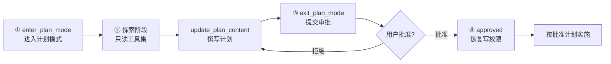

# Plan Mode（计划模式）

Plan Mode 为 `LlmAgent` 提供 **先规划、后实施** 的工作流：规划阶段模型只能使用只读工具并撰写计划文档；所有具备副作用的写工具，在人工通过 HITL 审批计划之前会被代码级 gate 拦截。

常与 `SpawnSubAgentTool`（`EXPLORE_AGENT` / `PLAN_AGENT`）配合做代码调研与方案设计，批准后可搭配 `TodoWriteTool` 或 `TaskToolSet` 跟踪实施进度。

## 解决什么问题

普通 coding agent 容易一上来就改文件、边写边改方向。Plan Mode 把流程拆成两段：

1. **规划阶段** —— 用只读工具（`Read` / `Grep` / `Glob`）、只读子 agent（`Explore` / `Plan`）调研代码，通过 `update_plan_content` 写计划、用 `ask_user_question` 澄清需求；`Write` / `Edit` / `Bash`、`todo_write`、`task_create` 等副作用工具被 gate。
2. **实施阶段** —— 人工批准后写工具解锁，模型按批准的计划落地实现。

三个需要人工介入的节点——`enter_plan_mode`、`exit_plan_mode`、`ask_user_question`——均为 `LongRunningFunctionTool`，执行会暂停，直到宿主以 tool function response 续跑。通用 HITL 机制见 [Human in the Loop](./human_in_the_loop.md)。

## 为什么这很重要

AI 编码 Agent 最大的风险之一不是写错代码，而是**写对了错误的东西**。当用户说「重构认证模块」时，Agent 可能选择 JWT 方案，而用户心中想的是 OAuth2。如果 Agent 直接开始实现，等用户发现方向错误时，已经修改了十几个文件。

Plan Mode 解决的是**意图对齐**问题：在 Agent 动手修改代码之前，先让它探索代码库、制定计划、获得用户审批。这不是简单的「先问再做」——它是一套完整的状态机，涉及：

- 写工具 gate（权限级行为约束）
- 计划文档持久化（对齐载体）
- 工作流提示词注入
- 进入 / 退出两处 HITL 审批
- 与 UI Plan 开关（`agent_mode=plan`）的联动

## 解决方案：四步闭环

Plan Mode 在对话中引入**只读阶段**，通过 `enter_plan_mode` 与 `exit_plan_mode` 两个长运行工具形成闭环：

| 步骤 | 名称 | 行为 |
| --- | --- | --- |
| 1 | **进入计划模式** | 模型判断任务需要规划，或用户在 UI 选择 Plan Mode 后，调用 `enter_plan_mode`（HITL：需用户确认进入） |
| 2 | **探索阶段** | 权限约束为只读：仅允许 `Read` / `Grep` / `Glob`、只读子 agent（`Explore` / `Plan`）及 `update_plan_content`；所有写操作在 `before_tool` 被拦截 |
| 3 | **提交方案审批** | 探索完成后调用 `exit_plan_mode`，将计划文档提交给用户审阅（HITL：需用户批准或拒绝） |
| 4 | **恢复执行** | 用户批准后状态变为 `approved`，写工具 gate 关闭，Agent 按批准计划以完整工具权限实施 |



```text
用户 / 模型                    HITL                 只读 gate              HITL              全权限
    │                          │                      │                    │                 │
    ▼                          ▼                      ▼                    ▼                 ▼
enter_plan_mode  ──批准──▶  exploring/drafting  ──写计划──▶  exit_plan_mode  ──批准──▶  approved → Write/Edit/...
```

## 关键设计决策

从工程角度看，Plan Mode 体现三个核心设计决策（与 Claude Code Plan Mode 理念对齐，在 tRPC-Agent-Python 中的落地方式如下）：

### 1. 权限模式作为行为约束

进入 Plan Mode 后，模型的工具集被限制为只读——**不是**靠提示词「请不要修改文件」，而是通过 `before_tool` 在工具调用前拦截写入操作（`PLAN_MODE_GATE` 错误）。子 agent 同样受约束：`spawn_subagent` 仅允许 `Explore` / `Plan` 原型，避免继承父 agent 的写工具面。

### 2. 计划文档作为对齐载体

计划不是停留在对话里的零散文字，而是持久化的 **Markdown 制品**（`PlanRecord.content`），写入 session state（`plan[:branch]`），跨轮 `Runner.run_async` 存活。用户可在审批环节编辑计划（`exit_plan_mode` 续跑时传入 `content`）；AG-UI 通过 `STATE_SNAPSHOT` 实时展示计划面板，便于远程会话与本地 UI 对齐。

### 3. 状态机而非布尔开关

Plan Mode 不是简单的 `isPlanMode` 标志，而是包含进入、探索、起草、审批、批准、恢复的完整状态转换链（`PlanStatus`），每个转换都有副作用：

| 转换 | 副作用 |
| --- | --- |
| `enter_plan_mode` 批准 | 创建 `PlanRecord`，进入 `exploring`，开启写 gate |
| `update_plan_content` | `exploring` → `drafting`，追加/替换计划正文 |
| `exit_plan_mode` | → `pending_approval`，暂停等待审批 |
| 批准 | → `approved`，关闭写 gate，释放 plan 锁 |
| 拒绝 | → `drafting`，允许修订后再次提交 |

## 架构

```
orchestrator（LlmAgent + setup_plan）
├── 业务工具（如 FileToolSet、SpawnSubAgentTool、TodoWriteTool）
└── PlanToolSet（由 setup_plan 挂载）
    ├── enter_plan_mode      （LongRunningFunctionTool — HITL）
    ├── update_plan_content
    ├── exit_plan_mode       （LongRunningFunctionTool — HITL）
    └── ask_user_question    （LongRunningFunctionTool — HITL）

_PlanCallbacks（before_model / before_tool）
├── 注入 plan / awareness 提示词
├── 处理 HITL 续跑 payload
├── 根据 session state 信号自动进入 Plan Mode
└── gate 激活期间拦截写工具
```

- 计划文档持久化在**主 agent 的 session** 中，key 为 `state["plan[:<branch>]"]`（默认前缀 `plan`）。
- 被 spawn 的子 agent 只返回文本，不直接修改父 agent 的 plan 状态。

## 状态机

| 状态 | 含义 | 写 gate |
| --- | --- | --- |
| `pending_enter` | 等待人工确认进入 Plan Mode | 开启 |
| `exploring` | 只读探索中 | 开启 |
| `drafting` | 正在撰写计划 | 开启 |
| `pending_approval` | 计划已提交，等待审批 | 开启 |
| `approved` | 人工批准，可开始实施 | **关闭** |

典型流转：

```text
enter_plan_mode（HITL）→ exploring → update_plan_content → drafting
    → exit_plan_mode（HITL）→ pending_approval
    → approved → 使用写工具实施
```

`exit_plan_mode` 被拒绝时，状态回到 `drafting`，可修订后再次提交。

## 功能特性

- **会话级计划制品** —— `PlanRecord` 序列化为 JSON 写入 session state，跨 `Runner.run_async` 调用存活
- **写工具 gate** —— gate 激活时 `before_tool` 拦截 `DEFAULT_WRITE_TOOL_NAMES` 中的工具
- **子 agent 限制** —— `spawn_subagent` 仅允许只读原型（`Explore`、`Plan`）；`dynamic_subagent` 须显式将 `tools` 限制为只读子集
- **Prompt 注入** —— 无活跃计划时注入 awareness 提示；gate 激活时注入完整 Plan Mode 提示
- **HITL 工具** —— 三个长运行工具暂停等待人工；续跑在 `before_model` 中处理
- **UI 自动进入** —— session state 为 `agent_mode=plan` 时自动进入，并从工具 schema 中隐藏 `enter_plan_mode`
- **HITL 幂等** —— 仅处理最新 user turn 的 function response；历史中的旧 rejection 不会回放
- **并发安全** —— plan 工具在 load → mutate → save 外包 `plan_store_lock`（按 session + branch）

## 与 Todo / Task / Goal 的关系

| 维度 | TodoWriteTool | TaskToolSet | Goal | **Plan Mode** |
| --- | --- | --- | --- | --- |
| 用途 | 步骤清单 | 任务看板 + 依赖 | 会话完成契约 | **设计文档 + 写操作审批** |
| 人工审批 | 无 | 无 | 无（仅 enforcement） | **有（进入 + 退出 HITL）** |
| 拦截写工具 | 无（仅 prompt） | 无 | 无 | **有（代码强制 gate）** |
| state key | `todos[:branch]` | `tasks[:branch]` | `goal[:branch]` | `plan[:branch]` |
| 典型场景 | 批准后跟踪步骤 | 长看板、依赖编排 | 整件事是否做完 | **调研 → 起草 → 批准 → 实施** |

> Todo / Task 管步骤分解，Goal 管完成契约；**Plan Mode 在人工签字前拦截所有副作用操作。**

## PlanOptions 构造参数

通过 `setup_plan(agent, PlanOptions(...))` 配置：

| 参数 | 类型 | 默认值 | 说明 |
| --- | --- | --- | --- |
| `state_key_prefix` | `str` | `"plan"` | state key 前缀；勿使用 `temp:` |
| `plan_prompt` | `str` | `DEFAULT_PLAN_MODE_PROMPT` | gate 激活时注入 |
| `awareness_prompt` | `str` | `DEFAULT_PLAN_AWARENESS_PROMPT` | 无活跃计划时注入 |
| `write_tool_names` | `FrozenSet[str]` | `DEFAULT_WRITE_TOOL_NAMES` | gate 期间拦截的工具名；MCP / 自定义写工具需扩展 |
| `inject_prompt` | `bool` | `True` | gate 激活时是否注入 plan prompt |
| `inject_awareness` | `bool` | `True` | 否则是否注入 awareness prompt |
| `force_enter_plan_state_key` | `Optional[str]` | `"agent_mode"` | UI 自动进入的 session key；`None` 禁用 |
| `force_enter_plan_state_value` | `str` | `"plan"` | 触发自动进入的值 |
| `on_approval` | `Callable` | `None` | `exit_plan_mode` 批准 / 拒绝时的回调 |
| `readonly_subagent_types` | `FrozenSet[str]` | `{"Explore", "Plan"}` | gate 期间允许的 `spawn_subagent` 原型 |
| `readonly_tool_names` | `FrozenSet[str]` | `{"Read", "Grep", "Glob", "webfetch", "websearch"}` | `dynamic_subagent` 允许的 `tools` 子集 |

> 每个 agent **只调用一次** `setup_plan()`，重复调用会重复挂载 toolset 与 callback。

## 工具说明

### `enter_plan_mode`（LongRunningFunctionTool）

请求人工确认后进入 Plan Mode。

| 参数 | 必填 | 说明 |
| --- | --- | --- |
| `objective` | 是 | 计划目标的简短描述 |

返回 `{status: "pending_enter", message, objective, plan_id, approval_id, ...}`。续跑格式：`{status: "approved"}` 或 `{status: "rejected", reviewer_note?: "..."}`。

当 session 已设 `agent_mode=plan` 或 gate 已激活时，该工具会从 schema 中隐藏。

### `update_plan_content`

追加或替换 Markdown 计划正文。

| 参数 | 必填 | 说明 |
| --- | --- | --- |
| `content` | 是 | 计划 Markdown |
| `mode` | 否 | `"append"`（默认）或 `"replace"` |

首次写入会将状态从 `exploring` 推进到 `drafting`。

### `exit_plan_mode`（LongRunningFunctionTool）

提交计划供人工审批。

| 参数 | 必填 | 说明 |
| --- | --- | --- |
| `summary` | 否 | 给审批人的简短摘要 |

要求计划正文非空。返回 `{status: "pending_approval", content, preview, ...}`。续跑格式：

```json
{"status": "approved"}
```

或

```json
{"status": "rejected", "reviewer_note": "请补充错误处理章节"}
```

批准时可选传入 `content` 以应用审批人编辑后的计划。

### `ask_user_question`（LongRunningFunctionTool）

规划期间的定向澄清。

| 参数 | 必填 | 说明 |
| --- | --- | --- |
| `question` | 是 | 问题文本 |
| `options` | 否 | 建议选项列表 |

续跑格式：`{status: "answered", question_id: <int>, answer: "<文本>"}`。

## 写 Gate 规则

当 `PlanRecord.is_gate_active()`（`exploring` / `drafting` / `pending_approval`）时：

| 工具类型 | 规则 |
| --- | --- |
| Plan 工具（`enter_plan_mode`、`update_plan_content`、`exit_plan_mode`、`ask_user_question`） | 始终允许（含状态校验） |
| `spawn_subagent` | 仅 `Explore`、`Plan` 原型 |
| `dynamic_subagent` | 仅当 `tools` 为 `readonly_tool_names` 的显式子集 |
| `write_tool_names` 中的工具 | 返回 `PLAN_MODE_GATE` 错误 |

默认拦截：`Write`、`Edit`、`Bash`、`todo_write`、`task_create`、`task_update`、`create_goal`、`update_goal`。

## HITL 续跑（宿主集成）

续跑时提交 user 消息，parts 中包含暂停工具的 `function_response`。`before_model` 调用 `process_hitl_function_response`，将宿主原始 payload 替换为状态机的标准结果（友好 message + 完整 plan），使模型看到与普通 tool 返回一致的结构。

**进入 Plan Mode —— 批准：**

```python
Content(
    role="user",
    parts=[Part(function_response=FunctionResponse(
        name="enter_plan_mode",
        response={"status": "approved"},
    ))],
)
```

**退出 Plan Mode —— 批准：**

```python
Content(
    role="user",
    parts=[Part(function_response=FunctionResponse(
        name="exit_plan_mode",
        response={"status": "approved"},
    ))],
)
```

**用户问答 —— 回答：**

```python
Content(
    role="user",
    parts=[Part(function_response=FunctionResponse(
        name="ask_user_question",
        response={"status": "answered", "question_id": 1, "answer": "使用 PostgreSQL"},
    ))],
)
```

配合 [AG-UI](./agui.md) 时，长运行工具在续跑前不会发出 `TOOL_CALL_RESULT`；宿主在下一轮 run 中提交 function response。`STATE_SNAPSHOT` 事件暴露 `plan:<agent_name>`，便于实时计划面板。

## 进入方式

Plan Mode 有两种进入路径，对应不同的触发方与是否经过 `pending_enter` HITL：

| 维度 | 方式 1：模型调用 `enter_plan_mode` | 方式 2：Session State 信号（UI 驱动） |
| --- | --- | --- |
| 触发方 | 模型判断任务需要规划 | 宿主 / UI 写入 session state |
| 初始状态 | `pending_enter` → HITL 确认 → `exploring` | 直接进入 `exploring` |
| 是否需要进入确认 | 是 | 否 |
| `enter_plan_mode` 工具 | 正常暴露（无 gate 时） | 从 schema 隐藏；若误调用返回 `PLAN_MODE_GATE` |

### 方式 1：模型调用 `enter_plan_mode`（HITL 确认）

**流程：**

1. 模型判断任务需要规划（awareness prompt 引导）
2. 调用 `enter_plan_mode(objective="...")`
3. 状态变为 `pending_enter`，运行暂停，宿主展示确认卡片
4. 用户批准后续跑，状态进入 `exploring`，写 gate 开启

### 方式 2：Session State 信号强制自动进入（UI 驱动）

**流程：**

1. 宿主在 session state 写入 `agent_mode = "plan"`（默认值，可通过 `PlanOptions` 自定义 key / value）
2. 下一次 invocation 时，`before_model` 触发 `_ensure_forced_plan`
3. 内部调用 `apply_enter`，**跳过** `pending_enter`，直接进入 `exploring`
4. `PlanToolSet` 从工具 schema 中隐藏 `enter_plan_mode`，避免重复 HITL

**AG-UI 示例（`examples/plan_mode/static/index.html`）：**

用户在页面切换「Plan 模式」后，每次 run 将 `agent_mode` 写入 AG-UI 请求的 `state` 字段：

```javascript
// 与 PlanOptions 默认值保持一致
const FORCE_ENTER_PLAN_STATE_KEY = "agent_mode";
const FORCE_ENTER_PLAN_STATE_VALUE = "plan";

function buildRunState() {
  return {
    [FORCE_ENTER_PLAN_STATE_KEY]:
      agentMode === "plan" ? FORCE_ENTER_PLAN_STATE_VALUE : "agent",
  };
}

// RunAgentInput.state = buildRunState()
```

切换为 Plan 模式后，下一条用户消息会自动进入 `exploring`，页面提示「无需确认 enter_plan_mode」。完整 Demo 见 [examples/plan_mode](../../../examples/plan_mode/)。

## 最佳实践

- **先挂只读探索能力** —— `FileToolSet` + `SpawnSubAgentTool(EXPLORE_AGENT, PLAN_AGENT)`，再 `setup_plan`
- **扩展 `write_tool_names`** —— agent 若挂载 MCP、Skills 或自定义写工具，将其 `tool.name` 加入 `PlanOptions.write_tool_names`
- **每个 agent 只 `setup_plan` 一次** —— 避免重复 callback
- **HITL 优先用 AG-UI** —— 浏览器卡片比 CLI 模拟 enter / approve / 问答更自然
- **批准后跟踪步骤** —— 用 `todo_write` 或 `task_create`；Plan Mode 不替代步骤看板
- **琐碎任务可跳过** —— awareness prompt 允许在说明理由后直接实施；一行修复不必强行走计划

## 完整示例

| 示例 | 说明 |
| --- | --- |
| [examples/plan_mode](../../../examples/plan_mode/) | orchestrator + `setup_plan` + AG-UI 浏览器 Demo（实时计划面板 + HITL 卡片） |

安装 AG-UI 扩展：`pip install -e '.[ag-ui]'`，配置 `examples/plan_mode/.env`，运行 `python3 run_agent_with_agui.py`。
