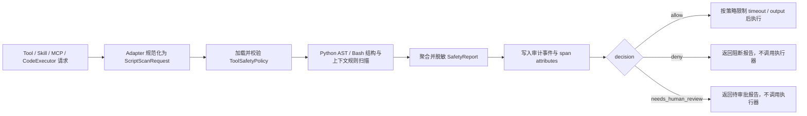

# Tool Script Safety Guard 一页设计草案

> 状态：讨论稿
> 需求基线：[Issue #90](https://github.com/trpc-group/trpc-agent-python/issues/90)

## 1. 问题、目标与边界

tRPC-Agent 的 Tool、Skill、MCP Tool 和 CodeExecutor 可以执行 Python/Bash、读写文件、访问网络和启动子进程。Issue 要解决的核心问题是：**在脚本真正执行前，依据可配置策略识别明显危险或不确定行为，输出统一决策并完成拦截、审计和可观测记录。**

本期目标：

- 扫描 Python 脚本、Bash 命令以及 argv、cwd、env 等执行上下文；tool 元数据仅用于标识和审计，不能改变安全决策。
- 覆盖危险文件操作、网络外连、进程命令、依赖安装、资源滥用、敏感信息泄漏六类风险。
- 输出 `allow`、`deny`、`needs_human_review` 三态决策和结构化报告。
- 通过 Filter 或 wrapper 在执行前阻断不允许直接执行的请求。
- 输出脱敏审计事件，并预留 OpenTelemetry 属性。

非目标：

- 不实现完整沙箱、系统调用隔离、网络防火墙或容器资源配额。
- 不承诺静态扫描无误报、无漏报或不可绕过。
- 不实现人工审批 UI；`needs_human_review` 只表示必须交给外部审批流程，在没有审批器时不得执行。

## 2. 数据模型

| 模型 | 核心字段 | 说明 |
|---|---|---|
| `ScriptPayload` | `language`, `content`, `argv`, `stdin`, `source` | 一个 Python/Bash 执行载荷；支持 CodeExecutor 多代码块和嵌套命令来源标记。 |
| `ToolMetadata` | `name`, `tool_type`, `description`, `tags` | 标识 Tool、Skill、MCP Tool 或 CodeExecutor；元数据不能提供绕过安全策略的授权。 |
| `ScriptScanRequest` | `payloads`, `cwd`, `env`, `metadata`, `requested_timeout`, `max_output_bytes` | 扫描器的统一输入。`env` 仅在内存中参与分析，原始值不得进入报告、日志或 tracing。 |
| `ToolSafetyPolicy` | `allowed_domains`, `allowed_commands`, `forbidden_paths`, `protected_write_paths`, timeout/output/write/sleep/script limits | 从 YAML 加载；拒绝未知字段、重复键和非法值。修改策略后无需修改扫描代码。 |
| `SafetyFinding` | `category`, `risk_level`, `rule_id`, `evidence`, `recommendation`, `decision` | 一条规则命中；`evidence` 必须先脱敏再截断。 |
| `SafetyReport` | `decision`, `risk_level`, `findings`, `duration_ms`, `redacted`, `summary`, `policy_version`, `review_required` | 对外结构化扫描结果；只保留脱敏、限长的证据片段，不得包含 env 值或未经处理的异常文本。 |
| `SafetyAuditEvent` | `tool_name`, `decision`, `risk_level`, `rule_ids`, `duration_ms`, `redacted`, `execution_blocked`, `timestamp` | 监控系统消费的稳定事件；对应 Issue 要求的最小审计字段。 |

规则通过统一接口返回 `SafetyFinding`。内置规则和用户注册规则走相同聚合流程；用户输入、提示词和 tool 参数不能关闭规则或伪造审批结果。

## 3. 决策语义

每条规则同时给出风险等级和建议决策，最终结果按 `deny > needs_human_review > allow` 聚合，风险等级取最高值。

**核心不变量：没有可信审批器给出的明确批准时，只有 `allow` 可以进入真实执行器。** `needs_human_review` 是待审批状态，不是告警后继续执行；执行网关不提供 `block_on_review=False` 之类的普通请求级绕过开关。

| 决策 | 典型场景 | 执行行为 |
|---|---|---|
| `allow` | 未命中风险规则，或命中明确允许的域名/命令 | 先记录安全摘要和审计事件，再执行。 |
| `deny` | 明确的危险删除、敏感文件读取、非白名单网络外连、提权、fork bomb、密钥外传等 | 记录原因和审计事件；Filter/wrapper 不调用真实执行器。 |
| `needs_human_review` | 动态 URL/路径/命令、无法静态确定的 subprocess 参数、Python 语法解析失败等 | 返回待审批报告并停止；V1 不自行放行。 |

人工复核由 SDK 外部的可信宿主流程完成。V1 只返回 `review_required=true` 的结构化结果，不实现审批 UI 或恢复执行接口。未来若接入审批器，批准信息必须由宿主侧受信通道绑定原始请求和报告后注入；不得读取脚本内容、Tool/MCP 参数、模型输出或普通 `metadata` 中的 `human_approved=true` 作为授权。没有审批器、审批超时、请求与批准记录不匹配时都保持阻断。

失败策略：

- 策略文件无效：初始化失败，不创建 Safety Guard。
- 输入适配或扫描器内部异常：生成脱敏的系统规则 finding，并按 `deny` 阻断。
- Python/Bash 内容无法可靠解析：返回 `needs_human_review`，执行网关仍阻断。
- 审计事件无法写入：默认按 `deny` 阻断，避免出现“已执行但无安全记录”。
- OpenTelemetry 写入失败：不改变安全决策，但记录框架调试日志。
- `allow` 只代表静态检查未发现配置范围内的风险，不代表脚本绝对安全。

## 4. 接入流程

接入位置：

- **Tool / Skill / MCP Tool**：`ToolSafetyFilter` 在 handler 前适配参数并扫描；阻断时返回符合现有 Tool 契约的结构化错误。
- **CodeExecutor**：`SafetyGuardedCodeExecutor` 扫描全部代码块，通过后才委托真实 executor。超时必须由真正持有子进程的实现执行 `terminate/kill + wait`，不能仅依赖取消协程。
- **CodeExecutor timeout**：wrapper 必须确认 delegate 已配置正数执行超时；缺失、为零或超过策略上限时保持阻断，不能把无界执行当作 `allow`。
- **Wrapper 示例**：为暂时无法直接接入 Filter 的执行函数提供 `guard_execution(...)` 示例。
- **CLI**：`scripts/tool_safety_check.py` 复用同一策略、扫描器和报告模型，用于运行公开样本和生成示例报告。
- **Telemetry**：设置 `tool.safety.decision`、`tool.safety.risk_level`、`tool.safety.rule_id`、耗时、脱敏和拦截状态。

## 5. 交付物与验收映射

计划交付：

- `trpc_agent_sdk/tools/safety/`：模型、策略、Python/Bash 规则、扫描器、脱敏、审计和接入层。
- `scripts/tool_safety_check.py` 与 `tool_safety_policy.yaml`。
- 至少 12 个公开样本及其期望 decision/rule ids：安全 Python、危险删除、读取密钥、非白名单网络、白名单网络、subprocess、shell 注入、依赖安装、无限循环、敏感信息输出、Bash 管道、人工复核。
- `tool_safety_report.json`、`tool_safety_audit.jsonl`。
- README/设计说明：规则扩展、接入方法、误报/漏报/绕过风险，以及与 Filter、Telemetry、CodeExecutor、沙箱的关系。

| Issue 验收标准 | 验证方式 |
|---|---|
| 12 个样本都能扫描并输出报告 | Manifest 驱动测试逐个运行 CLI/扫描器，校验结构和预期决策。 |
| 高危检出率 ≥90%，安全误报率 ≤10% | 在样本清单中标注 `dangerous/safe`，测试自动计算比例。 |
| 密钥读取、危险删除、非白名单网络 100% 检出 | 三类分别建立参数化样本集，断言不存在 `allow`。 |
| 500 行脚本扫描 ≤1 秒 | 独立性能测试，多次运行并以最差值校验。 |
| 报告包含必需字段 | JSON Schema/模型序列化测试校验 decision、risk level、rule id、evidence、recommendation。 |
| 修改 YAML 即改变策略 | 临时策略文件测试域名、路径、命令的决策变化，不修改代码。 |
| 执行前拦截并写审计 | 端到端测试分别断言 `deny` 和未获批的 `needs_human_review` 请求中 handler 调用次数为 0，审计事件 `execution_blocked=true`，且 Tool 参数或普通 metadata 伪造的审批标记无效。 |
| 文档解释组件关系及沙箱边界 | README 评审清单逐项核对，并明确 Safety Guard 不能替代运行时隔离。 |
