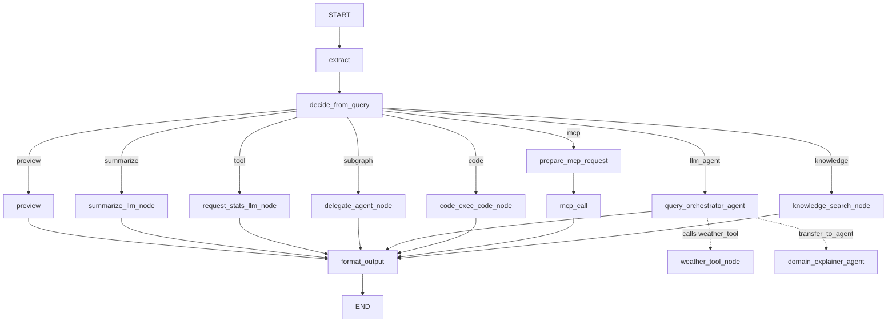

# Graph - Minimal Workflow Example

该示例演示了Graph的核心能力，包含下面的内容：

- `StateGraph` 与 `GraphAgent`
- 条件路由（`add_conditional_edges`）
- 不同节点签名：
  - `State`
  - `DocumentState`
  - `EventWriter`
  - `InvocationContext`
- `agent_node`（子 Agent）
- `llm_node` 内置工具调用（函数调用 + 工具执行 + 结果回填）
- `code_node` 代码执行（Python/Bash）
- `mcp_node` MCP 工具调用（通过 stdio 连接本地 MCP Server）
- `knowledge_node` 知识库搜索（基于 TRAG 的向量检索，可选）

## 核心能力

基于不同的路由触发不同的特性：

- **预览分支**：默认路由
- **总结分支**：文本超过 40 词
- **子图分支**：输入以 `subgraph:` 开头
- **LLM Agent 分支**：输入以 `llm_agent:` 开头
- **工具分支**：输入以 `tool:` 开头
- **代码执行分支**：输入以 `code:` 开头
- **MCP 分支**：输入以 `mcp:` 开头（stdio 方式，自包含无需外部服务）
- **知识搜索分支**（可选）：输入以 `knowledge:` 开头，需设置 `ENABLE_KNOWLEDGE = True` 并配置 TRAG 环境变量

图定义如下所示：



输入示例：

- `subgraph: Please respond in a friendly tone.` → 触发子图 `agent_node`
- `llm_agent: What's the weather in Seattle?` → 触发 `query_orchestrator_agent` 并调用 `weather_tool`（固定返回 sunny）
- `llm_agent: child: What is retrieval augmented generation?` → 触发 `query_orchestrator_agent`，并转交给其子 `domain_explainer_agent`
- `tool: Count words for this text.` → 触发带工具调用能力的 `llm_node`
- `code: run python analysis` → 触发 `code_node`，执行内置 Python 统计脚本
- `mcp: {"operation": "add", "a": 3, "b": 5}` → 触发 `mcp_node`，通过 stdio 调用本地 MCP Server 的 `calculate` 工具
- `knowledge: What is retrieval augmented generation?` → 触发 `knowledge_node`，搜索知识库（需启用 `ENABLE_KNOWLEDGE`）
- 长文本（40 词以上）→ 触发 `summarize` LLM 节点
- 短文本 → 触发 `preview`（会用 `EventWriter` 流式输出）


## 运行方法

```bash
cd examples/graph
python3 run_agent.py
```

需要配置 LLM（用于 `summarize` 与 `tool_request` 节点）：

- `TRPC_AGENT_API_KEY`
- `TRPC_AGENT_BASE_URL`
- `TRPC_AGENT_MODEL_NAME`

### 启用知识搜索分支（可选）

1. 在 `run_agent.py` 中设置 `ENABLE_KNOWLEDGE = True`
2. 在 `.env` 中配置 TRAG 环境变量：
   - `TRAG_NAMESPACE`
   - `TRAG_COLLECTION`
   - `TRAG_TOKEN`
   - `TRAG_BASE_URL`
   - `TRAG_RAG_CODE`

未启用时，`knowledge:` 输入会回退到 `preview` 分支。
