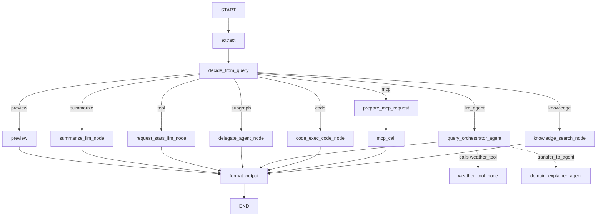

# Graph Workflow 核心能力示例

本示例演示如何基于 `StateGraph` + `GraphAgent` 构建一个多分支条件路由工作流，涵盖 `函数节点 / LLM 节点 / Agent 节点 / 代码执行节点 / MCP 节点 / 知识搜索节点` 六种节点类型，并验证条件路由与各节点的核心链路是否正常工作。

## 关键特性

- **条件路由能力**：通过 `add_conditional_edges` 基于输入前缀或词数动态选择分支
- **多种节点签名**：支持 `State`、`DocumentState`、`EventWriter`、`InvocationContext` 等不同参数签名
- **子图委派（agent_node）**：使用 `GraphAgent` 子图处理输入，演示子图嵌套调用
- **LLM Agent 节点（agent_node）**：使用 `LlmAgent` 子 Agent，支持工具调用（`weather_tool`）与子 Agent 转交（`transfer_to_agent`）
- **LLM 节点内置工具调用（llm_node）**：`llm_node` 内自动完成函数调用 → 工具执行 → 结果回填的完整链路
- **代码执行节点（code_node）**：通过 `UnsafeLocalCodeExecutor` 执行 Python 脚本并返回结果
- **MCP 节点（mcp_node）**：通过 stdio 连接本地 MCP Server，调用 `calculate` 工具
- **知识搜索节点（knowledge_node，可选）**：基于 TRAG 的向量检索
- **流式输出**：`preview` 分支通过 `AsyncEventWriter` 流式输出文本
- **节点回调与执行追踪**：通过 `NodeCallbacks` 记录每个节点的执行时间与状态变化

## Agent 层级结构说明

本例是单 GraphAgent 示例，内部包含多种节点类型与条件分支：

```text
graph (GraphAgent)
├── extract (function_node) — 提取用户输入
├── decide (function_node) — 条件路由判断
├── preview (function_node) — 短文本流式预览（EventWriter）
├── summarize (llm_node) — 长文本 LLM 摘要
├── request_stats (llm_node + tool) — LLM 工具调用（text_stats）
├── delegate (agent_node → GraphAgent 子图)
│   └── agent_reply (function_node)
├── llm_agent (agent_node → LlmAgent)
│   ├── query_orchestrator (LlmAgent)
│   │   ├── tools: [weather_tool]
│   │   └── sub_agents: [domain_explainer]
│   └── domain_explainer (LlmAgent)
├── code_exec (code_node) — Python 代码执行
├── prepare_mcp_request (function_node) — MCP 请求参数解析
├── mcp_call (mcp_node) — stdio MCP 工具调用（calculate）
├── knowledge_search (knowledge_node, 可选) — TRAG 知识搜索
└── format_output (function_node) — 最终输出格式化
```

图定义如下所示：



关键文件：

- [examples/graph/agent/agent.py](./agent/agent.py)：构建 `StateGraph`、注册各类节点、设置条件路由与边
- [examples/graph/agent/nodes.py](./agent/nodes.py)：所有函数节点实现（extract、decide、preview、format_output 等）
- [examples/graph/agent/tools.py](./agent/tools.py)：工具函数（text_stats、weather_tool）与 MCP Toolset 工厂
- [examples/graph/agent/state.py](./agent/state.py)：自定义 `DocumentState` 状态模型
- [examples/graph/agent/prompts.py](./agent/prompts.py)：LLM 节点提示词模板
- [examples/graph/agent/callbacks.py](./agent/callbacks.py)：节点回调实现（执行追踪与日志）
- [examples/graph/agent/config.py](./agent/config.py)：环境变量读取
- [examples/graph/mcp_server.py](./mcp_server.py)：本地 MCP Server（stdio，提供 calculate 工具）
- [examples/graph/run_agent.py](./run_agent.py)：测试入口，执行 8 轮不同分支的测试

## 关键代码解释

这一节用于快速定位"图构建、条件路由、各类节点"三条核心链路。

### 1) StateGraph 构建与节点注册（`agent/agent.py`）

- 使用 `StateGraph(DocumentState)` 创建图，挂载 `NodeCallbacks` 用于执行追踪
- 使用 `add_node` 注册函数节点（extract、decide、preview、format_output）
- 使用 `add_llm_node` 注册 LLM 节点（summarize、request_stats），支持工具绑定与 `GenerateContentConfig`
- 使用 `add_agent_node` 注册子 Agent 节点（delegate、llm_agent），通过 `StateMapper` 完成输入/输出映射
- 使用 `add_code_node` 注册代码执行节点，通过 `UnsafeLocalCodeExecutor` 执行 Python 脚本
- 使用 `add_mcp_node` 注册 MCP 节点，通过 stdio 连接本地 MCP Server

### 2) 条件路由与分支选择（`agent/nodes.py`）

- `decide_route` 根据输入前缀（`subgraph:`、`llm_agent:`、`tool:`、`code:`、`mcp:`、`knowledge:`）或词数（≥40 触发 summarize）决定路由
- 使用 `add_conditional_edges` + `create_route_choice` 动态构建分支映射
- 不匹配的路由回退到 `preview` 分支

### 3) 节点签名与参数注入（`agent/nodes.py`）

- `extract_document(state: State)` — 使用基础 `State` 类型
- `decide_route(state: DocumentState, ctx: InvocationContext)` — 使用自定义状态 + 调用上下文
- `stream_preview(state: DocumentState, async_writer: AsyncEventWriter)` — 使用异步事件写入器进行流式输出
- 框架根据函数签名自动注入对应参数

### 4) 执行追踪与回调（`agent/callbacks.py`）

- `before_node` 回调打印当前步骤、节点名、状态键
- `after_node` 回调记录执行时间，写入 `node_execution_history` 列表
- `format_output` 节点读取 `node_execution_history`，生成完整的执行流程报告

## 环境与运行

### 环境要求

- Python 3.10+（强烈建议 3.12）

### 安装步骤

```bash
git clone https://github.com/trpc-group/trpc-agent-python.git
cd trpc-agent-python
python3 -m venv .venv
source .venv/bin/activate
pip3 install -e .
```

### 环境变量要求

在 [examples/graph/.env](./.env) 中配置（或通过 `export`）：

- `TRPC_AGENT_API_KEY`
- `TRPC_AGENT_BASE_URL`
- `TRPC_AGENT_MODEL_NAME`

#### 启用知识搜索分支（可选）

1. 在 `run_agent.py` 中设置 `ENABLE_KNOWLEDGE = True`
2. 在 `.env` 中额外配置 TRAG 环境变量：
   - `TRAG_NAMESPACE`
   - `TRAG_COLLECTION`
   - `TRAG_TOKEN`
   - `TRAG_BASE_URL`
   - `TRAG_RAG_CODE`

未启用时，`knowledge:` 输入会回退到 `preview` 分支。

### 运行命令

```bash
cd examples/graph
python3 run_agent.py
```

## 运行结果（实测）

```text
============================================
Run 1/8 — Preview 分支（短文本 + EventWriter 流式输出）
Session: 8e84939c...
Input: A short note about exercise and health.
--------------------------------------------
[Node start] node_type=function, node_name=extract
[Node done ] node_type=function, node_name=extract
[Node start] node_type=function, node_name=decide
[Node done ] node_type=function, node_name=decide
[Node start] node_type=function, node_name=preview
[preview] [event_writer]: preview
[event_writer]: A short note about exercise and health.
[Node done ] node_type=function, node_name=preview
==============================
 Graph Result
==============================
A short note about exercise and health.
Route: preview | Word Count: 7
Execution Flow: extract → decide → preview
----------------------------------------
============================================
Run 2/8 — Subgraph 分支（agent_node → delegate GraphAgent 子图）
Session: 39528a40...
Input: subgraph: Please reply as a friendly assistant.
--------------------------------------------
[Node start] node_type=function, node_name=extract
[Node done ] node_type=function, node_name=extract
[Node start] node_type=function, node_name=decide
[Node done ] node_type=function, node_name=decide
[Node start] node_type=agent, node_name=delegate
[Node done ] node_type=agent, node_name=delegate
==============================
 Graph Result
==============================
Agent handled this request: Please reply as a friendly assistant.
Route: subgraph | Word Count: 6
Execution Flow: extract → decide → delegate
----------------------------------------
============================================
Run 3/8 — LLM Agent 分支（weather_tool 工具调用）
Session: cb2cf6e9...
Input: llm_agent: What's the weather in Seattle today?
--------------------------------------------
[Node start] node_type=function, node_name=extract
[Node done ] node_type=function, node_name=extract
[Node start] node_type=function, node_name=decide
[Node done ] node_type=function, node_name=decide
[Node start] node_type=agent, node_name=llm_agent
[query_orchestrator] [Function call] weather_tool({'location': 'Seattle'})
[query_orchestrator] [Function result] {'location': 'Seattle', 'weather': 'sunny'}
[query_orchestrator] The weather in Seattle today is sunny.
[Node done ] node_type=agent, node_name=llm_agent
==============================
 Graph Result
==============================
The weather in Seattle today is sunny.
Route: llm_agent | Word Count: 6
Execution Flow: extract → decide → llm_agent (2.833s)
----------------------------------------
============================================
Run 4/8 — LLM Agent 分支（transfer_to_agent → domain_explainer 子 Agent）
Session: 8537b85f...
Input: llm_agent: child: Explain retrieval-augmented generation in one sentence.
--------------------------------------------
[Node start] node_type=function, node_name=extract
[Node done ] node_type=function, node_name=extract
[Node start] node_type=function, node_name=decide
[Node done ] node_type=function, node_name=decide
[Node start] node_type=agent, node_name=llm_agent
[query_orchestrator] [Function call] transfer_to_agent({'agent_name': 'domain_explainer'})
[query_orchestrator] [Function result] {'transferred_to': 'domain_explainer'}
[domain_explainer] Retrieval-augmented generation (RAG) is a technique where an AI system retrieves relevant information from a knowledge source and uses it to generate more accurate and informed responses.
[Node done ] node_type=agent, node_name=llm_agent
==============================
 Graph Result
==============================
Retrieval-augmented generation (RAG) is a technique where an AI system retrieves relevant information from a knowledge source and uses it to generate more accurate and informed responses.
Route: llm_agent | Word Count: 7
Execution Flow: extract → decide → llm_agent (5.312s)
----------------------------------------
============================================
Run 5/8 — Tool 分支（llm_node 内置工具调用 text_stats）
Session: 0bbb9189...
Input: tool: Count words for this text and show the stats.
--------------------------------------------
[Node start] node_type=function, node_name=extract
[Node done ] node_type=function, node_name=extract
[Node start] node_type=function, node_name=decide
[Node done ] node_type=function, node_name=decide
[Node start] node_type=llm, node_name=request_stats
[Model start] deepseek-v3-local-II (request_stats)
[Model done ] deepseek-v3-local-II (request_stats)
[request_stats] [Function call] text_stats({'text': 'Count words for this text and show the stats.'})
[Tool start] text_stats
  Args   : {"text": "Count words for this text and show the stats."}
[Tool done ] text_stats
  Result : {"word_count": 9, "sentence_count": 1}
[request_stats] [Function result] {'word_count': 9, 'sentence_count': 1}
[Model start] deepseek-v3-local-II (request_stats)
[request_stats] The text contains 9 words and 1 sentence.
[Model done ] deepseek-v3-local-II (request_stats)
[Node done ] node_type=llm, node_name=request_stats
==============================
 Graph Result
==============================
{"word_count": 9, "sentence_count": 1}
Route: tool | Word Count: 9
Execution Flow: extract → decide → request_stats (2.184s)
----------------------------------------
============================================
Run 6/8 — Code 分支（code_node 执行 Python 统计脚本）
Session: 8aa49b38...
Input: code: run python analysis
--------------------------------------------
[Node start] node_type=function, node_name=extract
[Node done ] node_type=function, node_name=extract
[Node start] node_type=function, node_name=decide
[Node done ] node_type=function, node_name=decide
[Node start] node_type=code, node_name=code_exec
[Node done ] node_type=code, node_name=code_exec
==============================
 Graph Result
==============================
Code execution result:
=== Python Data Analysis ===
count: 10
min: 11
max: 89
mean: 45.8
median: 44.0
stdev: 26.83
Route: code | Word Count: 3
Execution Flow: extract → decide → code_exec (0.116s)
----------------------------------------
============================================
Run 7/8 — MCP 分支（stdio mcp_node → calculate 工具）
Session: 3f3dfd56...
Input: mcp: {"operation": "add", "a": 3, "b": 5}
--------------------------------------------
[Node start] node_type=function, node_name=extract
[Node done ] node_type=function, node_name=extract
[Node start] node_type=function, node_name=decide
[Node done ] node_type=function, node_name=decide
[Node start] node_type=function, node_name=prepare_mcp_request
[Node done ] node_type=function, node_name=prepare_mcp_request
[Node start] node_type=tool, node_name=mcp_call
INFO     Processing request of type ListToolsRequest
INFO     Processing request of type CallToolRequest
[Node done ] node_type=tool, node_name=mcp_call
==============================
 Graph Result
==============================
8.0
Route: mcp | Word Count: 6
Execution Flow: extract → decide → prepare_mcp_request → mcp_call (0.396s)
----------------------------------------
============================================
Run 8/8 — Summarize 分支（长文本 LLM 摘要）
Session: 3cf3fd1e...
Input: This is a longer paragraph meant to trigger summarization. It should contain enough words to cross the summary thresh...
--------------------------------------------
[Node start] node_type=function, node_name=extract
[Node done ] node_type=function, node_name=extract
[Node start] node_type=function, node_name=decide
[Node done ] node_type=function, node_name=decide
[Node start] node_type=llm, node_name=summarize
[Model start] deepseek-v3-local-II (summarize)
[summarize] - The input is a long paragraph designed to trigger summarization.
- It exceeds the word count threshold to demonstrate the LLM's summarization function.
- The main purpose is to show how the system processes and condenses lengthy text.
[Model done ] deepseek-v3-local-II (summarize)
[Node done ] node_type=llm, node_name=summarize
==============================
 Graph Result
==============================
- The input is a long paragraph designed to trigger summarization.
- It exceeds the word count threshold to demonstrate the LLM's summarization function.
- The main purpose is to show how the system processes and condenses lengthy text.
Route: summarize | Word Count: 59
Execution Flow: extract → decide → summarize (2.275s)
----------------------------------------
```

## 结果分析（是否符合要求）

结论：**符合本示例测试要求**。

- **路由判断正确**：8 轮输入分别命中 preview / subgraph / llm_agent / llm_agent(child) / tool / code / mcp / summarize，条件路由逻辑无误
- **函数节点正常**：extract 正确提取输入，decide 正确识别前缀与词数，preview 通过 EventWriter 流式输出
- **LLM 节点工具调用正确**：request_stats 节点自动调用 `text_stats` 工具并回填结果，`word_count=9, sentence_count=1` 与输入一致
- **Agent 节点工具调用正确**：llm_agent 节点中 `query_orchestrator` 正确调用 `weather_tool` 获取天气，`transfer_to_agent` 正确转交给 `domain_explainer`
- **代码执行正确**：code_node 执行 Python 统计脚本，输出 count/min/max/mean/median/stdev 均正确
- **MCP 调用正确**：通过 stdio 连接本地 MCP Server，`calculate(add, 3, 5)` 返回 `8.0`
- **摘要生成正确**：长文本（59 词）触发 summarize 分支，LLM 生成 3 条摘要要点

说明：该示例每轮使用新的 `session_id`，因此主要验证的是各节点类型与路由逻辑的正确性，不强调跨轮记忆一致性。

## 适用场景建议

- 快速验证 Graph 条件路由与多分支执行：适合使用本示例
- 了解不同节点类型（function / llm / agent / code / mcp / knowledge）的用法：适合使用本示例
- 学习 `StateMapper`、`NodeCallbacks`、`AsyncEventWriter` 等 Graph 高级特性：适合使用本示例
- 需要测试单 Agent + Tool Calling 主链路：建议使用 `examples/llmagent`
- 需要测试多 Agent 分支隔离行为：建议使用 `examples/filter_with_agent`
