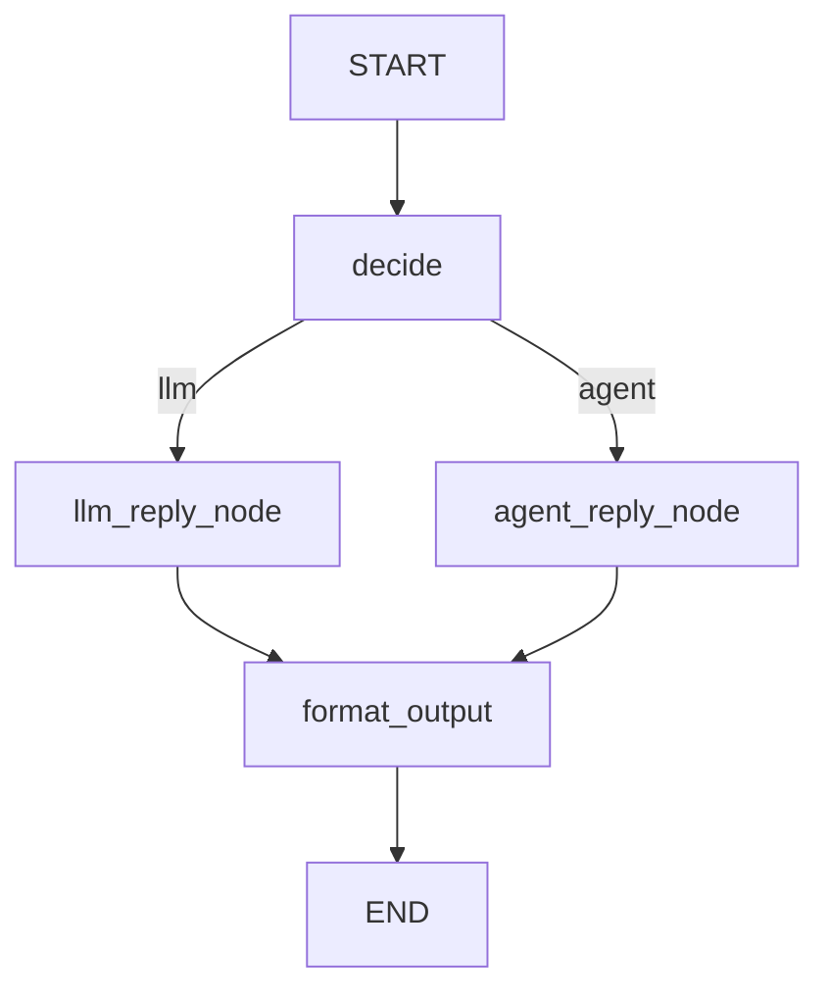

# Graph Multi-Turn Example

该示例演示在同一个 Session 中进行多轮对话，并通过 `decide` 节点选择不同分支：

- `llm_node` 分支：输入前缀 `llm:`
- `agent_node` 分支：输入前缀 `agent:`

图结构：



## 运行

```bash
cd examples/graph_multi_turns
python3 run_agent.py
```

需要配置 LLM 环境变量：

- `TRPC_AGENT_API_KEY`
- `TRPC_AGENT_BASE_URL`
- `TRPC_AGENT_MODEL_NAME`

说明：

- 示例会创建一个 Session，并连续发送 4 个 turn。
- `decide` 节点直接读取 `STATE_KEY_USER_INPUT`，不再需要单独 `extract` 节点。
- 前两个 turn 走 `llm_node`，后两个 turn 走 `agent_node`。
- 输出中会打印节点生命周期日志、模型调用日志和最终格式化结果。

示例输出如下：

```bash
============================================
Graph Multi-Turn Demo
Session: cb75281e...
============================================
Turn 1/4
Input: llm: Define retrieval-augmented generation in one sentence.
--------------------------------------------
[Node start] node_type=function, node_name=decide
[node:decide] return={'route': 'llm', 'query_text': 'Define retrieval-augmented generation in one sentence.', 'user_input': 'Define retrieval-augmented generation in one sentence.', 'context_note': 'user=demo_user session=cb75281e-76ba-414c-88bf-07d4cefdfc8a turn=1'}
[Node done ] node_type=function, node_name=decide
[Node start] node_type=llm, node_name=llm_reply_node
[Model start] deepseek-v3-local-II (llm_reply_node)
[llm_reply_node] Retrieval-augmented generation (RAG) enhances AI responses by retrieving relevant information from external sources before generating an answer.
[Model done ] deepseek-v3-local-II (llm_reply_node)
[Node done ] node_type=llm, node_name=llm_reply_node
[Node start] node_type=function, node_name=format_output
[node:format_output] return.last_response_len=321
[Node done ] node_type=function, node_name=format_output
==============================
 Graph Multi-Turn Result
==============================

Branch: llm
Context: user=demo_user session=cb75281e-76ba-414c-88bf-07d4cefdfc8a turn=1

Retrieval-augmented generation (RAG) enhances AI responses by retrieving relevant information from external sources before generating an answer.
----------------------------------------
============================================
Turn 2/4
Input: llm: Summarize your previous answer in six words.
--------------------------------------------
[Node start] node_type=function, node_name=decide
[node:decide] return={'route': 'llm', 'query_text': 'Summarize your previous answer in six words.', 'user_input': 'Summarize your previous answer in six words.', 'context_note': 'user=demo_user session=cb75281e-76ba-414c-88bf-07d4cefdfc8a turn=2'}
[Node done ] node_type=function, node_name=decide
[Node start] node_type=llm, node_name=llm_reply_node
[Model start] deepseek-v3-local-II (llm_reply_node)
[llm_reply_node] RAG retrieves info to improve answers.
[Model done ] deepseek-v3-local-II (llm_reply_node)
[Node done ] node_type=llm, node_name=llm_reply_node
[Node start] node_type=function, node_name=format_output
[node:format_output] return.last_response_len=215
[Node done ] node_type=function, node_name=format_output
==============================
 Graph Multi-Turn Result
==============================

Branch: llm
Context: user=demo_user session=cb75281e-76ba-414c-88bf-07d4cefdfc8a turn=2

RAG retrieves info to improve answers.
----------------------------------------
============================================
Turn 3/4
Input: agent: What i ask? Reply as branch agent and then greet me.
--------------------------------------------
[Node start] node_type=function, node_name=decide
[node:decide] return={'route': 'agent', 'query_text': 'What i ask? Reply as branch agent and then greet me.', 'user_input': 'What i ask? Reply as branch agent and then greet me.', 'context_note': 'user=demo_user session=cb75281e-76ba-414c-88bf-07d4cefdfc8a turn=3'}
[Node done ] node_type=function, node_name=decide
[Node start] node_type=agent, node_name=agent_reply_node
[branch_agent_worker] Agent branch: You asked about defining retrieval-augmented generation and summarizing it in six words. Hello there! How can I assist you further?
[Node done ] node_type=agent, node_name=agent_reply_node
[Node start] node_type=function, node_name=format_output
[node:format_output] return.last_response_len=324
[Node done ] node_type=function, node_name=format_output
==============================
 Graph Multi-Turn Result
==============================

Branch: agent
Context: user=demo_user session=cb75281e-76ba-414c-88bf-07d4cefdfc8a turn=3

Agent branch: You asked about defining retrieval-augmented generation and summarizing it in six words. Hello there! How can I assist you further?
----------------------------------------
============================================
Turn 4/4
Input: agent: Summarize what i have asked you Done.
--------------------------------------------
[Node start] node_type=function, node_name=decide
[node:decide] return={'route': 'agent', 'query_text': 'Summarize what i have asked you Done.', 'user_input': 'Summarize what i have asked you Done.', 'context_note': 'user=demo_user session=cb75281e-76ba-414c-88bf-07d4cefdfc8a turn=4'}
[Node done ] node_type=function, node_name=decide
[Node start] node_type=agent, node_name=agent_reply_node
[branch_agent_worker] Agent branch: You asked me to define retrieval-augmented generation, then summarize that definition in six words, and finally to summarize what you'd asked. All done! 😊
[Node done ] node_type=agent, node_name=agent_reply_node
[Node start] node_type=function, node_name=format_output
[node:format_output] return.last_response_len=347
[Node done ] node_type=function, node_name=format_output
==============================
 Graph Multi-Turn Result
==============================

Branch: agent
Context: user=demo_user session=cb75281e-76ba-414c-88bf-07d4cefdfc8a turn=4

Agent branch: You asked me to define retrieval-augmented generation, then summarize that definition in six words, and finally to summarize what you'd asked. All done! 😊
----------------------------------------
```