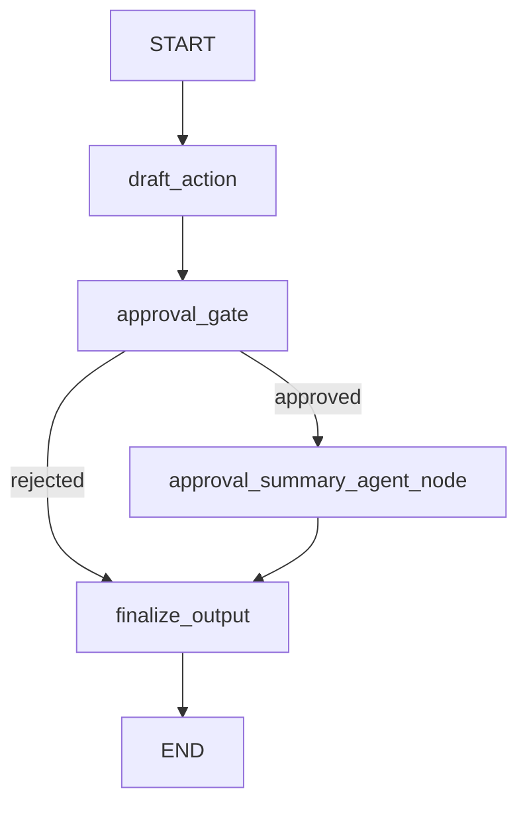

# Graph Interrupt / Resume 流程示例

本示例演示如何基于 `GraphAgent` + `StateGraph` 实现一个带审批中断的 Graph 工作流，验证 `interrupt → 等待用户决策 → resume → 条件路由 → 最终输出` 的完整链路是否正常工作。

## 关键特性

- **Graph 中断与恢复**：通过 `interrupt(...)` 在 `approval_gate` 节点暂停执行，等待用户通过 `FunctionResponse` 提交审批决策后恢复
- **条件路由**：基于用户审批结果（`approved` / `rejected`）动态路由至不同分支
- **多节点类型混合编排**：Graph 中同时包含 `llm_node`（草案生成）、`function_node`（审批门控 / 最终输出）、`agent_node`（审批总结）
- **State 驱动的数据流**：自定义 `InterruptState` 在节点间传递审批状态、建议动作、总结请求等上下文
- **流式事件处理**：通过 `runner.run_async(...)` 消费 Node / Model / Tool 生命周期事件与 `LongRunningEvent`

## Agent 层级结构说明

本例为单 GraphAgent 示例，Graph 内部包含 4 个节点：

```text
graph_with_interrupt (GraphAgent)
├── graph: StateGraph(InterruptState)
│   ├── draft_action (llm_node) ─ 生成推荐动作
│   ├── approval_gate (function_node) ─ interrupt 等待用户审批
│   ├── approval_summary_agent_node (agent_node) ─ 总结已批准内容
│   └── finalize_output (function_node) ─ 组装最终输出
└── model: OpenAIModel
```

图结构：



关键文件：

- [examples/graph_with_interrupt/agent/agent.py](./agent/agent.py)：构建 `GraphAgent`，组装 StateGraph 并注册所有节点与边
- [examples/graph_with_interrupt/agent/nodes.py](./agent/nodes.py)：`approval_gate`（中断门控）、`route_after_approval`（条件路由）、`finalize_output`（最终输出）
- [examples/graph_with_interrupt/agent/state.py](./agent/state.py)：自定义 `InterruptState` 状态定义
- [examples/graph_with_interrupt/agent/prompts.py](./agent/prompts.py)：`draft_action` 与 `approval_summary_agent` 的提示词
- [examples/graph_with_interrupt/agent/callbacks.py](./agent/callbacks.py)：节点回调占位（可扩展）
- [examples/graph_with_interrupt/agent/config.py](./agent/config.py)：环境变量读取
- [examples/graph_with_interrupt/run_agent.py](./run_agent.py)：测试入口，执行 interrupt → resume 完整流程

## 关键代码解释

这一节用于快速定位"Graph 构建、中断恢复、条件路由、事件消费"四条核心链路。

### 1) Graph 组装与节点注册（`agent/agent.py`）

- 使用 `StateGraph(InterruptState)` 创建有状态图，自定义状态 schema 携带审批相关字段
- 通过 `add_llm_node` 注册 `draft_action` 节点，配置 `GenerateContentConfig` 控制生成参数
- 通过 `add_node` 注册 `approval_gate`（中断门控）和 `finalize_output`（最终输出）两个 function 节点
- 通过 `add_agent_node` 注册 `approval_summary_agent_node`，使用 `StateMapper` 进行输入 / 输出映射
- 使用 `add_conditional_edges` 连接 `approval_gate` 到 `approved` / `rejected` 两条分支

### 2) 中断门控与恢复决策（`agent/nodes.py`）

- `approval_gate` 读取 `STATE_KEY_LAST_RESPONSE` 获取模型草案，构造 interrupt payload 后调用 `interrupt(payload)` 暂停执行
- 恢复后从 `decision` 中解析用户审批状态（`approved` / `rejected`）和备注
- 组装 `summary_request` 供下游 `approval_summary_agent_node` 使用
- `route_after_approval` 根据 `approval_status` 返回路由标识，决定进入总结分支还是直接输出

### 3) 状态定义与数据流（`agent/state.py`）

- `InterruptState` 继承 `State`，定义 `suggested_action`、`approval_status`、`summary_request` 等字段
- 使用 `Annotated[list, append_list]` 实现 `node_execution_history` 的追加语义
- 各节点通过返回 `Dict[str, Any]` 更新状态字段，在节点间传递上下文

### 4) 流式事件处理与中断捕获（`run_agent.py`）

- 使用 `runner.run_async(...)` 消费事件流
- 通过 `NodeExecutionMetadata` / `ModelExecutionMetadata` / `ToolExecutionMetadata` 解析生命周期事件
- 当收到 `LongRunningEvent` 时记录中断信息，随后用 `FunctionResponse` 构造 resume 消息继续执行

## 环境与运行

### 环境要求

- Python 3.12

### 安装步骤

```bash
git clone https://github.com/trpc-group/trpc-agent-python.git
cd trpc-agent-python
python3 -m venv .venv
source .venv/bin/activate
pip3 install -e .
```

### 环境变量要求

在 [examples/graph_with_interrupt/.env](./.env) 中配置（或通过 `export`）：

- `TRPC_AGENT_API_KEY`
- `TRPC_AGENT_BASE_URL`
- `TRPC_AGENT_MODEL_NAME`

### 运行命令

```bash
cd examples/graph_with_interrupt
python3 run_agent.py
```

## 运行结果（实测）

```text
============================================
Graph Interrupt Demo
Session: f3f56f9c...
--------------------------------------------
[user] Draft one practical action for migrating this graph project safely.
[Node start] node_type=llm, node_name=draft_action
[Model start] deepseek-v3-local-II (draft_action)
[draft_action] Back up all project files and dependencies before making any changes.
[Model done ] deepseek-v3-local-II (draft_action)
[Node done ] node_type=llm, node_name=draft_action
[Node start] node_type=function, node_name=approval_gate
[node_execute:approval_gate] interrupt_payload={'title': 'Approval Required', 'request': '', 'suggested_action': 'Back up all project files and dependencies before making any changes.', 'options': ['approved', 'rejected'], 'tip': "Provide status in FunctionResponse.response, e.g. {'status':'approved','note':'...'}"}
[graph_with_interrupt] [Function call] graph_interrupt({'title': 'Approval Required', 'request': '', 'suggested_action': 'Back up all project files and dependencies before making any changes.', 'options': ['approved', 'rejected'], 'tip': "Provide status in FunctionResponse.response, e.g. {'status':'approved','note':'...'}"})
[graph_with_interrupt] [Function result] {'title': 'Approval Required', 'request': '', 'suggested_action': 'Back up all project files and dependencies before making any changes.', 'options': ['approved', 'rejected'], 'tip': "Provide status in FunctionResponse.response, e.g. {'status':'approved','note':'...'}"}
[interrupt] LongRunningEvent received
[interrupt] function=graph_interrupt
[interrupt] args={'title': 'Approval Required', 'request': '', 'suggested_action': 'Back up all project files and dependencies before making any changes.', 'options': ['approved', 'rejected'], 'tip': "Provide status in FunctionResponse.response, e.g. {'status':'approved','note':'...'}"}
[interrupt] response={'title': 'Approval Required', 'request': '', 'suggested_action': 'Back up all project files and dependencies before making any changes.', 'options': ['approved', 'rejected'], 'tip': "Provide status in FunctionResponse.response, e.g. {'status':'approved','note':'...'}"}
--------------------------------------------
[user decision] {'status': 'approved', 'note': 'Looks good, proceed with this action.'}
[Node start] node_type=function, node_name=approval_gate
[node_execute:approval_gate] resume_decision={'suggested_action': 'Back up all project files and dependencies before making any changes.', 'approval_status': 'approved', 'approval_note': 'Looks good, proceed with this action.', 'summary_request': 'User request: \nApproved action: Back up all project files and dependencies before making any changes.\nApproval note: Looks good, proceed with this action.\nSummarize what was approved and what will happen next in 1-2 short sentences.', 'context_note': 'user=demo_user session=f3f56f9c-59bc-4a84-a76e-4aec5ebc8d2f'}
[Node done ] node_type=function, node_name=approval_gate
[Node start] node_type=agent, node_name=approval_summary_agent_node
[approval_summary_agent] Backup of project files and dependencies was approved. The system will now proceed with creating the backup before making any changes.
[Node done ] node_type=agent, node_name=approval_summary_agent_node
[Node start] node_type=function, node_name=finalize_output
[node_execute:finalize_output] return.last_response_len=440
[Node done ] node_type=function, node_name=finalize_output
==============================
 Graph Interrupt Result
==============================

Decision: approved
Action: Back up all project files and dependencies before making any changes.
Summary: Backup of project files and dependencies was approved. The system will now proceed with creating the backup before making any changes.
Note: Looks good, proceed with this action.
Context: user=demo_user session=f3f56f9c-59bc-4a84-a76e-4aec5ebc8d2f
--------------------------------------------
```

## 结果分析（是否符合要求）

结论：**符合本示例测试要求**。

- **中断触发正确**：`draft_action` 生成草案后，`approval_gate` 成功调用 `interrupt(...)` 暂停执行并输出 `LongRunningEvent`
- **恢复流程正确**：用户通过 `FunctionResponse` 提交 `approved` 决策后，Graph 从 `approval_gate` 恢复执行
- **条件路由正确**：`approved` 决策进入 `approval_summary_agent_node` 分支，总结结果后进入 `finalize_output`
- **状态传递正确**：`suggested_action`、`approval_status`、`approval_note` 等字段在节点间正确流转
- **最终输出完整**：包含决策状态、动作内容、总结文本、用户备注与上下文信息

说明：示例中使用固定模拟用户决策（`approved`），可在 `run_agent.py` 中修改 `user_decision` 为 `rejected` 测试拒绝分支。

## 适用场景建议

- 验证 Graph 中 interrupt / resume 机制：适合使用本示例
- 验证 StateGraph 条件路由（`add_conditional_edges`）：适合使用本示例
- 验证多节点类型混合编排（llm_node + function_node + agent_node）：适合使用本示例
- 需要测试纯 LLM Agent 的工具调用链路：建议使用 `examples/llmagent`
- 需要测试多轮 Graph 对话：建议使用 `examples/graph_multi_turns`
