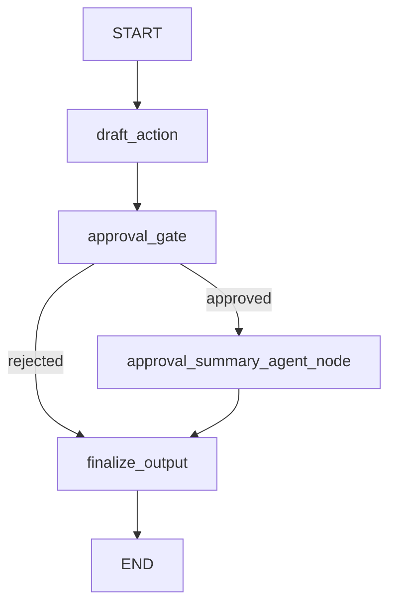

# Graph With Interrupt Example

该示例演示 Graph 的 interrupt / resume 流程：

1. `llm_node` 先生成一个推荐动作（`draft_action`）。
2. `approval_gate` 读取模型输出并调用 `interrupt(...)` 暂停执行，等待用户决策。
3. 用户通过 `FunctionResponse` 返回 `approved/rejected`。
4. 若为 `approved`，进入 `agent_node`（`approval_summary_agent_node`）总结“已批准内容与后续动作”。
5. Graph 最后进入 `finalize_output` 生成最终结果。

图结构：



## 运行

```bash
cd examples/graph_with_interrupt
python3 run_agent.py
```

需要配置 LLM 环境变量：

- `TRPC_AGENT_API_KEY`
- `TRPC_AGENT_BASE_URL`
- `TRPC_AGENT_MODEL_NAME`

说明：

- 首次调用会触发 interrupt，并打印 `LongRunningEvent`。
- 示例中使用固定的模拟用户决策（`approved`）进行 resume。
- 你可以在 `run_agent.py` 中修改 `user_decision` 来测试 `rejected` 分支。

输出示例如下：

```bash
============================================
Graph Interrupt Demo
Session: 9ed211a3...
--------------------------------------------
[user] Draft one practical action for migrating this graph project safely.
[Node start] node_type=llm, node_name=draft_action
[Model start] deepseek-v3-local-II (draft_action)
[draft_action] Back up all graph data and configurations before starting the migration.
[Model done ] deepseek-v3-local-II (draft_action)
[Node done ] node_type=llm, node_name=draft_action
[Node start] node_type=function, node_name=approval_gate
[node:approval_gate] interrupt_payload={'title': 'Approval Required', 'request': '', 'suggested_action': 'Back up all graph data and configurations before starting the migration.', 'options': ['approved', 'rejected'], 'tip': "Provide status in FunctionResponse.response, e.g. {'status':'approved','note':'...'}"}
[Node error] node_type=function, node_name=approval_gate
  Error: (Interrupt(value={'title': 'Approval Required', 'request': '', 'suggested_action': 'Back up all graph data and configurations before starting the migration.', 'options': ['approved', 'rejected'], 'tip': "Provide status in FunctionResponse.response, e.g. {'status':'approved','note':'...'}"}, resumable=True, ns=['approval_gate:ffea4002-beab-3047-519f-32c9c9c9ae6b']),)
[graph_with_interrupt] [Function call] approval_gate({'title': 'Approval Required', 'request': '', 'suggested_action': 'Back up all graph data and configurations before starting the migration.', 'options': ['approved', 'rejected'], 'tip': "Provide status in FunctionResponse.response, e.g. {'status':'approved','note':'...'}"})
[graph_with_interrupt] [Function result] {'title': 'Approval Required', 'request': '', 'suggested_action': 'Back up all graph data and configurations before starting the migration.', 'options': ['approved', 'rejected'], 'tip': "Provide status in FunctionResponse.response, e.g. {'status':'approved','note':'...'}"}
[interrupt] LongRunningEvent received
[interrupt] function=approval_gate
[interrupt] args={'title': 'Approval Required', 'request': '', 'suggested_action': 'Back up all graph data and configurations before starting the migration.', 'options': ['approved', 'rejected'], 'tip': "Provide status in FunctionResponse.response, e.g. {'status':'approved','note':'...'}"}
[interrupt] response={'title': 'Approval Required', 'request': '', 'suggested_action': 'Back up all graph data and configurations before starting the migration.', 'options': ['approved', 'rejected'], 'tip': "Provide status in FunctionResponse.response, e.g. {'status':'approved','note':'...'}"}
--------------------------------------------
[user decision] {'status': 'approved', 'note': 'Looks good, proceed with this action.'}
[Node start] node_type=function, node_name=approval_gate
[node:approval_gate] interrupt_payload={'title': 'Approval Required', 'request': '', 'suggested_action': 'Back up all graph data and configurations before starting the migration.', 'options': ['approved', 'rejected'], 'tip': "Provide status in FunctionResponse.response, e.g. {'status':'approved','note':'...'}"}
[node:approval_gate] resume_decision={'suggested_action': 'Back up all graph data and configurations before starting the migration.', 'approval_status': 'approved', 'approval_note': 'Looks good, proceed with this action.', 'summary_request': 'User request: \nApproved action: Back up all graph data and configurations before starting the migration.\nApproval note: Looks good, proceed with this action.\nSummarize what was approved and what will happen next in 1-2 short sentences.', 'context_note': 'user=demo_user session=9ed211a3-a4d2-43fc-9dce-c6ba2a85e81a'}
[Node done ] node_type=function, node_name=approval_gate
[Node start] node_type=agent, node_name=approval_summary_agent_node
[approval_summary_agent] The backup of all graph data and configurations was approved. The migration will proceed once the backup is complete.
[Node done ] node_type=agent, node_name=approval_summary_agent_node
[Node start] node_type=function, node_name=finalize_output
[node:finalize_output] return.last_response_len=426
[Node done ] node_type=function, node_name=finalize_output
==============================
 Graph Interrupt Result
==============================

Decision: approved
Action: Back up all graph data and configurations before starting the migration.
Summary: The backup of all graph data and configurations was approved. The migration will proceed once the backup is complete.
Note: Looks good, proceed with this action.
Context: user=demo_user session=9ed211a3-a4d2-43fc-9dce-c6ba2a85e81a
--------------------------------------------
```