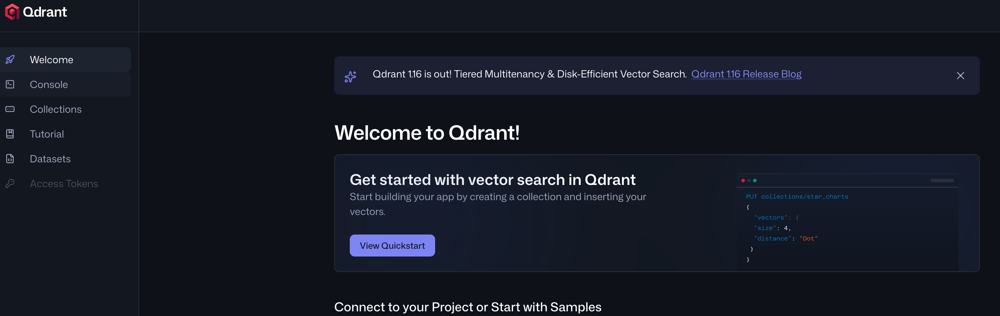
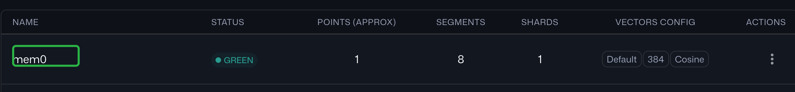
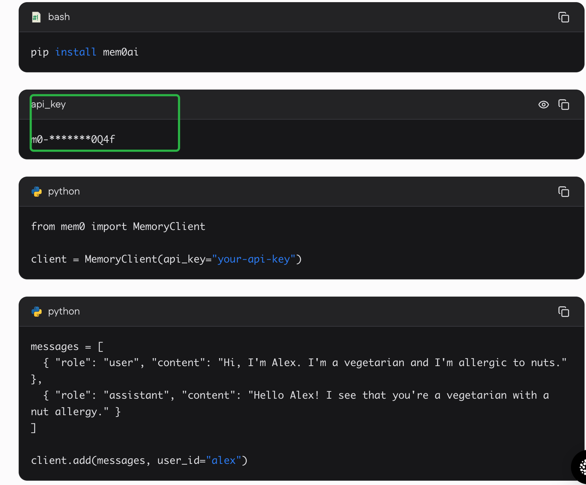
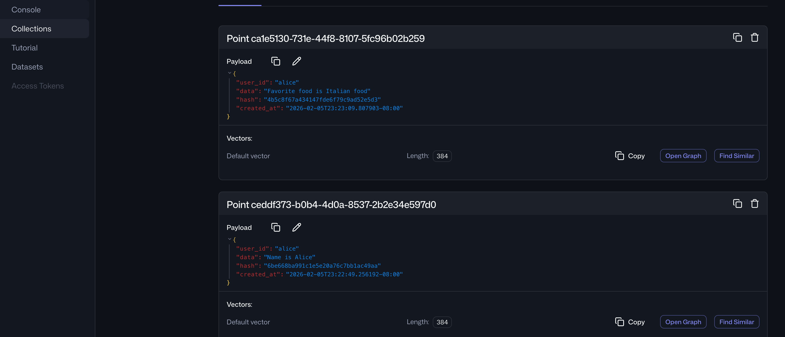
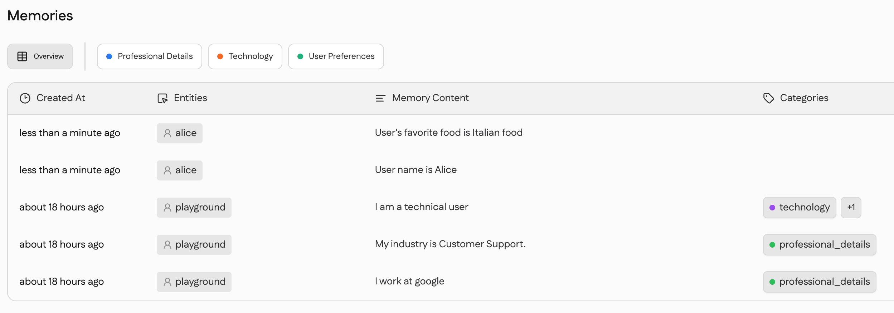

# Mem0 与 tRPC-Agent 集成

## 概述

Mem0 是为 LLM 提供的智能、自我改进的记忆层，能够在各种应用中实现更加个性化和连贯一致的用户体验。本示例演示如何将 Mem0 与 tRPC-Agent 集成，构建具有长期记忆能力的智能代理。

- **官方文档**：[https://docs.mem0.ai/introduction](https://docs.mem0.ai/introduction)
- **工具源码**：[mem0_tool.py](../../trpc_agent_ecosystem/tools/mem0_tool.py)

---

## 快速开始

### 前置要求

| 组件 | 版本 | 用途 |
|------|------|------|
| Python | >=3.10 | 运行环境 |
| mem0ai | latest | Mem0 SDK |
| sentence-transformers | latest | 本地嵌入模型（**自托管模式**） |
| qdrant-client | latest | 向量数据库客户端（**自托管模式**） |

### 安装依赖

```bash
# 安装必需的包
pip3 install mem0ai

# 仅 自托管模式 需要
pip3 sentence-transformers qdrant-client

# 使用 trpc-agent 的开发依赖安装
pip install trpc-agent-py[mem0]
```

### 环境配置

复制 `.env` 文件并配置：

```bash
# 模型配置（必需）
TRPC_AGENT_API_KEY=your-api-key
TRPC_AGENT_BASE_URL=your-llm-base-url
TRPC_AGENT_MODEL_NAME=your-model-name

# Mem0 平台配置（可选，用于远程模式）
MEM0_API_KEY=your-mem0-api-key
MEM0_BASE_URL=https://api.mem0.ai
```

### 运行示例

```bash
cd examples/mem_0
python run_agent.py
```

---

## 架构说明

本示例提供 **两种部署模式**：

| 模式 | 记忆存储 | 适用场景 |
|------|---------|---------|
| **自托管模式** | 本地 Qdrant + 嵌入模型 | 完全控制、无外部依赖、本地测试 |
| **平台模式** | Mem0 云端 API | 生产环境、快速部署、跨实例共享 |


---

### 项目结构

```
examples/mem_0/
├── agent/
│   ├── agent.py          # Agent 定义及 mem0 工具集成
│   ├── config.py         # 两种模式的配置
│   ├── prompts.py        # Agent 指令提示词
│   └── tools.py          # （预留扩展工具）
├── images/               # 文档图片
├── .env                  # 环境变量配置
├── run_agent.py          # 演示运行脚本
└── README.md             # 本文档
```

---

## 模式一：自托管 Mem0

mem0 官方提供 `AsyncMemory` 和 `Memory` 两种 sdk 类，后续都是以 `AsyncMemory` 为基础介绍

### 组件架构

自托管模式需要三个核心组件：

| 组件 | 默认提供商 | 默认模型/配置 |
|------|----------|--------------|
| **LLM** | OpenAI | `gpt-4o` |
| **嵌入模型** | OpenAI | `text-embedding-3-small`（1536 维） |
| **向量存储** | 内存存储 | 本地内存（非持久化） |
| **版本** | v1.1 | - |
| **历史数据库** | SQLite | `{mem0_dir}/history.db` |

mem0 支持的提供商

| 组件 | 支持的提供商 |
|------|-------------|
| **向量存储** | Qdrant, Pinecone, Chroma, Weaviate, Milvus, In-Memory |
| **LLM** | OpenAI, DeepSeek, Anthropic, Gemini, Groq, Azure OpenAI |
| **嵌入模型** | OpenAI, HuggingFace, Ollama, Azure OpenAI |

#### 基本用法

如果用户拥有 `OPENAI_API_KEY`，那么实例化方式如下：

```python
import os
os.environ["OPENAI_API_KEY"] = "sk-xxx"
mem = AsyncMemory()
```

#### 高级用法

如果用户期望完全设置自定义的三个核心组件，可以使用如下的方式，这里测试选型如下（用户有需要可以自行选择其他的）：

| 组件 | 提供商 | 测试值 | 用途 |
|------|--------|---------|------|
| **向量存储(vector_store)** | Qdrant | - | 存储记忆嵌入向量 |
| **LLM** | DeepSeek | deepseek-v3 | 生成记忆摘要 |
| **嵌入模型(embedder)** | HuggingFace | multi-qa-MiniLM-L6-cos-v1 | 将文本转换为向量（384 维） |

##### 步骤 1：部署 Qdrant 向量数据库

```bash
# 拉取 Qdrant 镜像
docker pull qdrant/qdrant

# 创建存储目录
mkdir -p /tmp/qdrant_storage && chmod 777 /tmp/qdrant_storage

# 启动 Qdrant 服务
docker run -d --name qdrant_server -v /tmp/qdrant_storage:/qdrant/storage -p 6333:6333 qdrant/qdrant

# 验证服务运行状态
docker logs qdrant_server

# 访问控制台
# 浏览器打开：http://localhost:6333/dashboard#/welcome
```

**Qdrant 控制台预览：**



##### 步骤 2：初始化 Qdrant 集合

**⚠️ 重要提示**：嵌入模型 `multi-qa-MiniLM-L6-cos-v1` 生成 **384 维**向量，但 Qdrant 默认维度为 1536。首次使用前必须使用正确的维度初始化集合。

```python
from qdrant_client import QdrantClient
from qdrant_client.models import VectorParams, Distance

# 连接本地 Qdrant
client = QdrantClient(host="localhost", port=6333)

# 删除已有集合（如需要）
try:
    client.delete_collection("mem0")
except Exception:
    pass

# 创建正确维度的集合
client.create_collection(
    collection_name="mem0",
    vectors_config=VectorParams(
        size=384,  # 必须与嵌入模型输出维度匹配
        distance=Distance.COSINE
    )
)

print("✅ 集合 'mem0' 创建成功")
```

**在控制台中验证**：[http://localhost:6333/dashboard#/collections](http://localhost:6333/dashboard#/collections)



##### 步骤 3：配置记忆设置

编辑 `agent/config.py` 或设置环境变量：

```python
# agent/config.py
def get_memory_config() -> MemoryConfig:
    """获取自托管模式的记忆配置"""
    memory_config = {
        "vector_store": {
            "provider": "qdrant",
            "config": {
                "host": "localhost",
                "port": 6333,
                "collection_name": "mem0",
            }
        },
        "llm": {
            "provider": "deepseek",
            "config": {
                "model": os.getenv('TRPC_AGENT_MODEL_NAME', 'deepseek-v3'),
                "api_key": os.getenv('TRPC_AGENT_API_KEY', ''),
                "deepseek_base_url": os.getenv('TRPC_AGENT_BASE_URL', ''),
                "temperature": 0.2,
                "max_tokens": 2000,
            }
        },
        "embedder": {
            "provider": "huggingface",
            "config": {
                "model": "multi-qa-MiniLM-L6-cos-v1"  # 384 维
            }
        }
    }
    return MemoryConfig(**memory_config)
```

---

## 模式二：Mem0 平台（云端 API）

### 注册 Mem0 平台

访问 [https://app.mem0.ai/dashboard](https://app.mem0.ai/dashboard) 创建账号。

### 获取 API 凭证

注册后，从控制台获取 API Key 和组织/项目 ID。


### 初始化平台客户端

#### 更新 `.env` 文件，添加 Mem0 凭证：

```bash
MEM0_API_KEY=m0-your-api-key
MEM0_BASE_URL=https://api.mem0.ai
```

#### 创建平台客户端

```python
 from mem0 import AsyncMemoryClient
# agent/config.py
def get_mem0_platform_config() -> dict:
    """从环境变量获取 Mem0 平台配置"""
    return {
        "api_key": os.getenv('MEM0_API_KEY', ''),
        "host": os.getenv('MEM0_BASE_URL', 'https://api.mem0.ai'),
    }
 # agent/agent.py

mem0_platform_config = get_mem0_platform_config()
mem_client = AsyncMemoryClient(api_key=mem0_platform_config['api_key'], host=mem0_platform_config['host'], org_id="xxx")

```

AsyncMemoryClient 平台客户端参数

| 参数 | 类型 | 说明 | 默认值 | 必需 |
|------|------|------|--------|------|
| `api_key` | str | Mem0 API 认证密钥 | - | ✅ 是 |
| `host` | str | Mem0 API 基础 URL | `https://api.mem0.ai` | 否 |
| `org_id` | str | 组织 ID | `None` | 否 |
| `project_id` | str | 项目 ID | `None` | 否 |

完整代码参考：[agent.py](./agent/agent.py)

---

## Agent 实现细节

### Agent 指令

```python
# agent/prompts.py
INSTRUCTION = """
You are a helpful personal assistant with memory capabilities.
- Use the search_memory function to recall past conversations and user preferences.
- Use the save_memory function to store important information about the user.
- Always personalize your responses based on available memory.
"""
```

### 可用工具

| 工具类 | 工具名 | Agent 参数 | 描述 |
|--------|--------|-----------|------|
| `SearchMemoryTool` | `search_memory` | `query: str` | 搜索过去的对话和记忆 |
| `SaveMemoryTool` | `save_memory` | `content: str` | 保存重要信息到记忆 |

> `user_id` 由框架从 `InvocationContext` 自动注入，**无需**在工具调用参数中传递。

完整源码参考：[trpc_agent_ecosystem/tools/mem0_tool.py](../../trpc_agent_ecosystem/tools/mem0_tool.py)


### 完整 Agent 设置

```python
# agent/agent.py
from mem0 import AsyncMemory, AsyncMemoryClient
from trpc_agent_sdk.agents import LlmAgent
from trpc_agent_sdk.server.tools.mem0_tool import SearchMemoryTool, SaveMemoryTool

from .config import get_memory_config, get_mem0_platform_config

def create_agent(use_mem0_platform: bool = False) -> LlmAgent:
    """创建具有 mem0 记忆能力的 Agent

    Args:
        use_mem0_platform: 若为 True，使用 Mem0 平台（云端）。
                          若为 False，使用自托管模式。
    """
    if use_mem0_platform:
        # 平台模式：AsyncMemoryClient
        mem0_platform_config = get_mem0_platform_config()
        mem0_client = AsyncMemoryClient(
            api_key=mem0_platform_config['api_key'],
            host=mem0_platform_config['host']
        )
    else:
        # 自托管模式：AsyncMemory
        memory_config = get_memory_config()
        mem0_client = AsyncMemory(config=memory_config)

    # 用同一个 client 实例化工具
    search_memory_tool = SearchMemoryTool(client=mem0_client)
    save_memory_tool   = SaveMemoryTool(client=mem0_client)

    return LlmAgent(
        name="personal_assistant",
        description="能够记住用户偏好的个人助理",
        model=_create_model(),
        instruction=INSTRUCTION,
        tools=[search_memory_tool, save_memory_tool],
    )

# 通过修改此参数切换模式
root_agent = create_agent(use_mem0_platform=False)  # 自托管
# root_agent = create_agent(use_mem0_platform=True)   # 平台
```
完整源码参考：[agent/agent.py](./agent/agent.py)

---

## 运行演示

### 运行脚本

```sh
python3 examples/mem_0/run_agent.py
```

### 完整演示输出

```
🆔 Session ID: 84edae79...
📝 User: Do you remember my name?
🤖 Assistant:
🔧 [Invoke Tool: search_memory({'query': "user's name"})]
📊 [Tool Result: {'status': 'no_memories', 'message': 'No relevant memories found'}]
It seems I don't have your name stored in my memory. Could you remind me?
----------------------------------------
🆔 Session ID: d76b4ee6...
📝 User: My name is Alice
🤖 Assistant:
🔧 [Invoke Tool: save_memory({'content': "The user's name is Alice."})]
📊 [Tool Result: {'status': 'success', 'message': 'Information saved to memory', 'result': {'results': [{'id': 'ceddf373-...', 'memory': 'Name is Alice', 'event': 'ADD'}]}}]
Thank you, Alice! I've saved your name to memory.
----------------------------------------
🆔 Session ID: ac740b05...
📝 User: Do you remember my name?
🤖 Assistant:
🔧 [Invoke Tool: search_memory({'query': "user's name"})]
📊 [Tool Result: {'status': 'success', 'memories': '- Name is Alice\n- Favorite food is Italian food'}]
Yes, your name is Alice! How can I assist you today?
----------------------------------------
```
运行后的存储的结果如下：

- 自托管 **Qdrant 中的记忆存储：**

- mem0 平台 **Mem0 平台中的记忆存储：**



---


## 常见问题

### 错误：向量维度不匹配

**症状：**
```
qdrant_client.http.exceptions.UnexpectedResponse: 400 (Bad Request)
{"status":{"error":"Wrong input: Vector dimension error: expected dim: 1536, got 384"}}
```

**原因：**
Qdrant 集合是用 1536 维（OpenAI 嵌入）创建的，但您的嵌入模型输出 384 维。

**解决方案：**

| 选项 | 步骤 | 适用场景 |
|------|------|---------|
| **A. 重建集合** | 删除并用正确维度重建集合（见步骤 2） | 全新开始、测试环境 |
| **B. 更换嵌入模型** | 使用与现有集合维度匹配的嵌入模型 | 生产环境、有现存数据 |
| **C. 使用不同集合** | 在配置中设置 `collection_name: "mem0_384"` | 保留两个集合 |

**常用嵌入模型维度：**

| 嵌入模型 | 维度 | 需要 API Key |
|---------|------|-------------|
| `multi-qa-MiniLM-L6-cos-v1` | **384** | ❌ 否 |
| `text-embedding-3-small` | **1536** | ✅ 是（OpenAI） |
| `text-embedding-3-large` | **3072** | ✅ 是（OpenAI） |
| `all-MiniLM-L6-v2` | **384** | ❌ 否 |

### 错误：未提供 Mem0 API Key

**症状：**
```
ValueError: Mem0 API Key not provided. Please provide an API Key.
```

**解决方案：**
```bash
# 平台模式
export MEM0_API_KEY=your-mem0-api-key

# 自托管模式（如使用 OpenAI 组件）
export OPENAI_API_KEY=your-openai-key
```

### 错误：无法连接 Qdrant

**症状：**
```
ConnectionError: Cannot connect to Qdrant at localhost:6333
```

**解决方案：**
```bash
# 检查 Qdrant 是否运行
docker ps | grep qdrant_server

# 如未运行，启动它
docker start qdrant_server

# 或重新创建
docker run -d --name qdrant_server \
  -v /tmp/qdrant_storage:/qdrant/storage \
  -p 6333:6333 qdrant/qdrant
```

### 错误，安装需要的依赖失败，可以按照以下方式安装必须的依赖
```bash
pip3 install langchain_huggingface>=0.1.0
pip3 install huggingface-hub<1.0.0,>=0.33.4
pip3 install sentence_transformers
pip3 install nvidia-ml-py
pip3 install pynvml
```


---

## 对比：自托管 vs 平台

| 特性 | 自托管模式 | 平台模式 |
|------|-----------|---------|
| **部署** | 需要本地服务 | 完全托管 |
| **控制** | 完全配置控制 | 受限于平台选项 |
| **可扩展性** | 手动扩展 | 自动扩展 |
| **持久化** | 您的基础设施 | Mem0 云存储 |
| **延迟** | 本地网络 | 互联网延迟 |
| **成本** | 基础设施成本 | API 使用成本 |
| **数据隐私** | 完全控制 | 与 Mem0 共享 |
| **最适合** | 开发、测试、本地部署 | 生产环境、快速部署 |

---

## 参考资料

- **Mem0 文档**：[https://docs.mem0.ai/introduction](https://docs.mem0.ai/introduction)
- **Mem0 GitHub 示例**：[https://github.com/mem0ai/mem0/tree/main/examples](https://github.com/mem0ai/mem0/tree/main/examples)
- **Google AI ADK 集成**：[https://docs.mem0.ai/integrations/google-ai-adk](https://docs.mem0.ai/integrations/google-ai-adk)
- **tRPC-Agent Mem0 工具**：[mem0_tool.py](../../trpc_agent_ecosystem/tools/mem0_tool.py)
