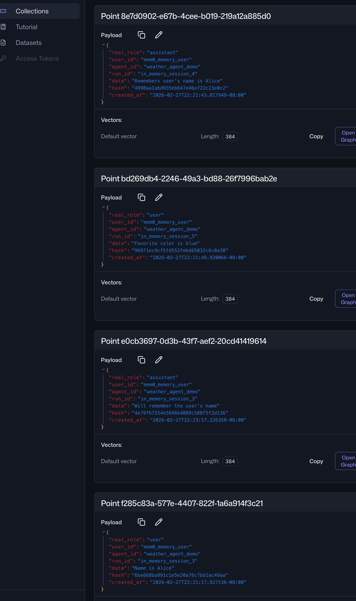
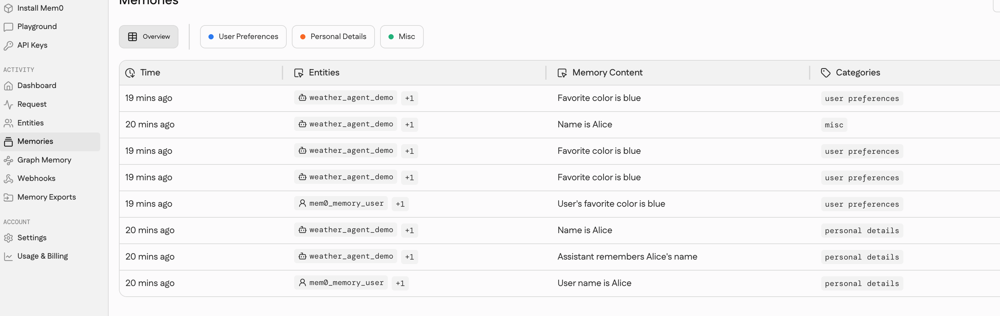

# Mem0 Memory Service 使用指南

本示例演示如何在 `trpc-agent` 中使用 `Mem0MemoryService` 实现跨会话记忆检索与存储，并覆盖自托管与云平台两种部署方式。

## 关键特性

- 同时支持 `AsyncMemory`（自托管）和 `AsyncMemoryClient`（Mem0 平台）
- 采用两级 key 策略：用户维度共享记忆，会话维度保留执行上下文
- 提供 `infer=True/False` 两种记忆提炼策略，适配不同成本与可解释性需求
- 提供 TTL 定时清理机制，避免记忆无限增长
- 文档包含完整故障排查与实测结果对比，便于直接落地

## Agent 层级结构说明

```text
memory_assistant (LlmAgent)
└── MemoryService: Mem0MemoryService
    ├── Backend A: AsyncMemory (Qdrant + Embedding, self-hosted)
    └── Backend B: AsyncMemoryClient (Mem0 cloud)
```

关键文件：

- [examples/memory_service_with_mem0/run_agent.py](./run_agent.py)
- [examples/memory_service_with_mem0/agent/agent.py](./agent/agent.py)
- [examples/memory_service_with_mem0/agent/config.py](./agent/config.py)

## 关键代码解释

- `create_memory_service(use_mem0_platform=...)`：一处开关切换部署模式
- `infer` 参数：控制存储前是否做语义提炼（总结）还是保留原文
- TTL 配置：后台周期清理过期记忆，控制成本和数据规模
- 搜索路径：`load_memory` 基于用户维度聚合检索，支持跨 session 召回

## 环境与运行

### 环境要求

- Python 3.12
- 需要可用的 LLM 配置（`TRPC_AGENT_*`）
- 自托管模式需要 Qdrant 与本地 embedding 相关依赖

### 运行命令

```bash
cd examples/memory_service_with_mem0
python3 run_agent.py
```

说明：`run_agent.py` 中可切换 `use_mem0_platform`（模式）和 `infer`（提炼策略）。

## 运行结果（实测）

本目录已包含详细实测与对比，请重点查看后文 `运行结果分析`（包含 8 组组合：模式 x infer x TTL）。

## 结果分析（是否符合要求）

结论：**符合本示例测试目标**。  
文档中的实验覆盖了关键变量（部署模式、infer 开关、TTL 开关），并给出可复用结论与参数建议，能够支撑选型与调优。

## 适用场景建议

- 需要跨 session 个性化记忆的对话系统
- 既要支持本地私有化，又要支持云端托管的团队
- 需要对记忆提炼质量、召回率、成本进行系统性调参的场景

---

## 特有说明

以下章节保留原始的详细技术说明、配置样例、实测数据与 QA，便于深入排查与二次开发：

## 概述

本示例演示如何使用 **Mem0MemoryService** 实现跨会话的持久化记忆管理。`Mem0MemoryService` 封装了 Mem0 的两种客户端：

| 客户端 | 类 | 适用场景 |
|---|---|---|
| 自托管 | `AsyncMemory` | 私有化部署，数据不出内网，需要本地 Qdrant + 嵌入模型 |
| 远端平台 | `AsyncMemoryClient` | 使用 Mem0 官方云服务，开箱即用，无需维护基础设施 |

**核心能力**：
- 跨会话记忆共享：不同 `session_id` 可共享同一用户的记忆
- 两级 Key 策略：`save_key`（用户维度）→ Mem0 `agent_id, user_id`；`session_id` → `run_id` / 元数据
- TTL 自动过期：后台定期清理超时记忆，防止数据无限增长
- 语义搜索：通过 `load_memory` 工具检索语义相关的历史记忆

---

## 架构设计

### 两级 Key 策略

```
session.save_key  →  Mem0 agent_id, user_id        （用户维度，跨所有 session 查询）
session.id        →  run_id / metadata["session_id"]  （会话维度，可按 session 过滤）
```

查询时只需指定 `agent_id 和 user_id`（即 `save_key` 分解而来），即可检索该用户所有会话的记忆。

### 角色路由（仅 AsyncMemoryClient）

Mem0 云端平台按消息角色分开存储：
- `user` 消息 → 存储在 `user_id` 命名空间
- `assistant` 消息 → 存储在 `agent_id` 命名空间

为确保两类消息都能被搜索到，`Mem0MemoryService` 搜索时使用 `OR` 过滤器同时检索两个命名空间：

```python
# 搜索过滤器（AsyncMemoryClient）
filters = {
    "AND": [
        {"OR": [{"user_id": user_id}, {"agent_id": agent_id}]},
        {"run_id": "*"}
    ]
}
```

### 组件图

```
┌─────────────────────────────────────────────────┐
│                   trpc-agent                     │
│                                                  │
│  Runner → store_session() → Mem0MemoryService    │
│        ← search_memory()  ←                      │
└─────────────────────────────┬───────────────────┘
                              │
              ┌───────────────┴───────────────┐
              │                               │
    ┌─────────▼─────────┐         ┌──────────▼──────────┐
    │  AsyncMemory       │         │  AsyncMemoryClient   │
    │  （自托管）         │         │  （Mem0 云端平台）    │
    └─────────┬─────────┘         └──────────┬──────────┘
              │                              │
    ┌─────────▼─────────┐         ┌──────────▼──────────┐
    │  Qdrant            │         │  mem0.ai API         │
    │  HuggingFace Embed │         │  （托管向量 DB）      │
    └───────────────────┘         └─────────────────────┘
```

---

## 环境准备

### 配置 `.env` 文件

在 [examples/memory_service_with_mem0/.env](./.env) 中配置：

```bash
# LLM 模型配置（必填）
TRPC_AGENT_API_KEY=your_llm_api_key
TRPC_AGENT_BASE_URL=https://your-llm-endpoint
TRPC_AGENT_MODEL_NAME=your-model-name

# Mem0 云端平台配置（使用 AsyncMemoryClient 时必填）
MEM0_API_KEY=your_mem0_api_key
MEM0_BASE_URL=https://api.mem0.ai
```

### 自托管模式额外依赖

自托管模式需要本地 Qdrant 服务和嵌入模型：

```bash
# 拉取 Qdrant 镜像
docker pull qdrant/qdrant

# 创建存储目录
mkdir -p /tmp/qdrant_storage && chmod 777 /tmp/qdrant_storage

# 启动 Qdrant 服务
docker run -d --name qdrant_server -v /tmp/qdrant_storage:/qdrant/storage -p 6333:6333 qdrant/qdrant

# 验证服务运行状态
docker logs qdrant_server

# 访问控制台
# 浏览器打开：http://localhost:6333/dashboard#/welcome
```

---

## 快速开始

```bash
cd examples/memory_service_with_mem0
python3 run_agent.py
```

切换模式：编辑 `run_agent.py` 中的 `use_mem0_platform` 变量：

```python
async def main():
    use_mem0_platform = False  # False=自托管(AsyncMemory), True=云端(AsyncMemoryClient)
    memory_service = create_memory_service(use_mem0_platform=use_mem0_platform)
    ...
```

切换 `infer` 模式：在 `create_memory_service()` 中修改：

```python
memory_service = Mem0MemoryService(
    mem0_client=mem0_client,
    memory_service_config=memory_service_config,
    infer=False,   # True=语义抽取模式, False=原文存储模式
)
```

---

## 两种部署模式详解

### 自托管模式（AsyncMemory + Qdrant）

#### 配置方式

```python
from mem0 import AsyncMemory
from mem0.configs.base import MemoryConfig

memory_config = MemoryConfig(**{
    "vector_store": {
        "provider": "qdrant",
        "config": {
            "host": "localhost",
            "port": 6333,
            "collection_name": "mem0",
        }
    },
    "llm": {
        "provider": "deepseek",
        "config": {
            "model": "your-model",
            "api_key": "your-api-key",
            "deepseek_base_url": "your-base-url",
            "temperature": 0.2,
            "max_tokens": 2000,
        }
    },
    "embedder": {
        "provider": "huggingface",
        "config": {
            "model": "multi-qa-MiniLM-L6-cos-v1"  # 本地运行，无需 API key
        }
    }
})

mem0_client = AsyncMemory(config=memory_config)
```

#### 特点

| 特性 | 说明 |
|---|---|
| 数据存储 | 本地 Qdrant 向量库 |
| 嵌入模型 | HuggingFace 本地模型（首次运行自动下载） |
| `infer=True` 存储行为 | LLM 抽取语义事实，部分消息可能不落库（NONE 动作） |
| `infer=False` 存储行为 | 原文存储，每次会先 `delete_all` 再重新写入 |
| 搜索方式 | 向量语义搜索 |
| 网络依赖 | 仅 LLM API（嵌入模型本地运行） |

---

### 远端平台模式（AsyncMemoryClient）

#### 配置方式

```python
from mem0 import AsyncMemoryClient

mem0_client = AsyncMemoryClient(
    api_key="your_mem0_api_key",
    host="https://api.mem0.ai",
)
```

#### 特点

| 特性 | 说明 |
|---|---|
| 数据存储 | Mem0 托管云端 |
| 嵌入模型 | 平台内置，无需本地配置 |
| `infer=True` 存储行为 | 平台侧 LLM 抽取语义事实，异步索引（存储后有短暂延迟才可搜索） |
| `infer=False` 存储行为 | 原文存储，立即可搜索 |
| 搜索方式 | 平台向量语义搜索（v2 API，需在 `filters` 中传 user_id/agent_id） |
| 网络依赖 | 需要访问 `api.mem0.ai` |
| 角色路由 | user 消息存 `user_id`，assistant 消息存 `agent_id` |

#### 注意：搜索 API 参数差异

AsyncMemoryClient 使用 v2 搜索 API，`user_id`/`agent_id` 必须放在 `filters` 对象中，
不能作为顶级参数传入。`Mem0MemoryService` 已自动处理此差异。

```python
# 错误写法（会导致 400 Bad Request）
await client.search(query="Alice", user_id="alice")

# 正确写法（Mem0MemoryService 内部使用）
await client.search(query="Alice", filters={"user_id": "alice"})
```

---

## infer 参数详解

`infer` 参数控制 Mem0 如何处理写入的消息，是最核心的配置项，直接影响存储行为和搜索效果。

### 对比表

| 维度 | `infer=True` | `infer=False` |
|---|---|---|
| **存储方式** | LLM 先做语义抽取和冲突消解，再存储"事实"片段 | 原文逐条存储，不做 LLM 处理 |
| **存储内容** | 提炼后的语义事实（如"用户名字是 Alice"） | 对话原文（如"Hello! My name is Alice."） |
| **可能不存储** | 当 LLM 判断为 NONE（无新信息）时不写入 | 每条消息必然写入 |
| **冲突消解** | 自动做（新事实覆盖旧事实） | 不做，依靠 delete_all + re-add 避免重复 |
| **搜索精度** | 语义匹配质量高（抽取后的事实更纯粹） | 语义匹配基于原文，可能受干扰 |
| **延迟** | 高（需要 LLM 调用和异步索引） | 低（直接写入向量库） |
| **消费 token** | 多（每次写入调用 LLM） | 少（无 LLM 调用） |
| **适用场景** | 长期用户画像、偏好记忆、知识积累 | 完整对话历史归档、审计日志 |

### infer=True 工作原理

```txt
输入消息
    │
    ▼
Mem0 LLM 分析
    │
    ├─ ADD：新事实，直接存入向量库
    ├─ UPDATE：更新已有事实（覆盖旧向量）
    ├─ DELETE：删除矛盾的旧事实
    └─ NONE：无新信息，跳过（不写入）

存入向量库的内容：提炼后的"事实"字符串, 不是原文逐条落库。可能导致历史数据并不能有效存储

```

**示例**：

输入：`"Hello! My name is Alice. Please remember my name."`

存储结果（infer=True）：`"User's name is Alice"`（LLM 提炼后的事实）

输入：`"My name is Bob now."`

存储结果（infer=True）：原 "Alice" 条目被 UPDATE 为 `"User's name is Bob"`（冲突消解）

### infer=False 工作原理

```
输入消息
    │
    ▼
delete_all（清空该 user_id+session 的旧记录）
    │
    ▼
直接 embed 原文 → 存入向量库

存入向量库的内容：对话原文（role: user/assistant + content）
```

**注意**：`infer=False` 时每次 `store_session` 都会先清空再重写，因此同一 session 不会产生重复记录，
但跨 session 的记录会共存（由 `run_id` 区分）。

### 选择建议

```
需要语义理解 + 长期记忆 + 自动去重？  →  infer=True
需要完整原文存档 + 低延迟 + 稳定性？  →  infer=False（推荐生产环境）
```

---

## TTL 缓存淘汰机制

### 工作原理

`Mem0MemoryService` 启动时，若 TTL 配置已启用，会创建一个后台 `asyncio.Task`，定期扫描
所有已知 `user_id` 的记忆，删除 `updated_at` 时间戳超过 `ttl_seconds` 的条目。

```
后台清理循环
    │
    ├─ 每隔 cleanup_interval_seconds 秒执行一次
    │
    ├─ 遍历 _known_user_ids（每次 store_session 时自动注册）
    │
    ├─ 调用 get_all(user_id=...) 获取所有记忆
    │
    └─ 对每条记忆：
           updated_at < now - ttl_seconds？
               是 → delete(memory_id)
               否 → 保留
```

### 配置示例

```python
from trpc_agent_sdk.memory import MemoryServiceConfig

memory_service_config = MemoryServiceConfig(
    enabled=True,
    ttl=MemoryServiceConfig.create_ttl_config(
        enable=True,                        # 启用 TTL
        ttl_seconds=20,                     # 记忆过期时间（秒）
        cleanup_interval_seconds=20         # 清理间隔（秒）
    ),
)
```

### 参数建议

| 参数 | 示例值 | 生产建议 |
|---|---|---|
| `ttl_seconds` | 20（演示） | 86400（24h）~ 604800（7天） |
| `cleanup_interval_seconds` | 20（演示） | 3600（1h） |

> **注意**：TTL 基于 `updated_at` 而非 `created_at`。若一条记忆被 UPDATE，其过期时间会从更新时刻重新计算。

---

## 运行结果分析

示例脚本 `run_agent.py` 执行三轮对话，每轮包含 7 个查询，演示跨会话的记忆能力：

```
t=0s    First Run   → 7 个查询，从空记忆开始，逐步建立 Alice/blue 记忆
t≈2s    Second Run  → 记忆仍有效，能正确检索 Alice 和 blue
t≈32s   Third Run   → 若开启 TTL(20s)，记忆已过期；若关闭 TTL，记忆持续有效
```

查询列表（每次运行使用不同 `session_id`）：

```python
demo_queries = [
    "Do you remember my name?",                          # Q1：测试初始状态（空记忆）
    "Do you remember my favorite color?",                # Q2：测试初始状态（空记忆）
    "What is the weather like in paris?",                # Q3：工具调用（无记忆依赖）
    "Hello! My name is Alice. Please remember my name.", # Q4：写入名字
    "Now, do you still remember my name?",               # Q5：验证名字记忆
    "Hello! My favorite color is blue. Please remember it.", # Q6：写入颜色
    "Now, do you still remember my favorite color?",     # Q7：验证颜色记忆
]
```

---

### 自托管模式 AsyncMemory

- infer is True 存储数据:

- infer is False 存储数据:


#### infer=True — 关闭 TTL

**预期行为**：Q1/Q2 返回空（第一轮无记忆），Q4 告知名字后 Q5 能正确回忆，Q6 告知颜色后 Q7 能正确回忆。三轮运行记忆均持续有效。

**实际观察**：

```
First run
Q1 → 空记忆，无法回答
Q4 → Alice 被存储（但伴随 PointStruct 错误日志）
Q5 → 成功检索到 Alice ✅
Q6 → blue 被存储
Q7 → 成功检索到 blue ✅

Second/Third run
Q1 → 直接检索到 Alice ✅（跨 session 共享）
Q2 → 直接检索到 blue ✅
Q4/Q6 → 重复写入时触发 PointStruct 错误（NONE 动作 bug）
```

> 详见 [QA 章节 - Q3](#q3-运行时出现-pointstruct-vector-none-错误怎么处理)

---

#### infer=True — 开启 TTL（20s）

```
First run  → 正常建立记忆
Second run（t≈2s）→ 记忆有效，成功检索 ✅
           → 日志：Mem0 cleanup: deleted 3 expired memories for user_id=mem0_memory_user
Third run（t≈32s）→ 记忆已过期被清理，Q1/Q2 返回空 ❌
           → 重新写入后当轮可检索
```

**分析**：TTL 清理在 Second run 期间触发，日志显示 `deleted 3 expired memories`，
Third run 开始时记忆已被清除，验证了 TTL 功能正常。

---

#### infer=False — 关闭 TTL

**预期行为**：原文存储，行为应比 `infer=True` 更稳定可预期。

**实际观察**：

```
First run
Q1/Q2 → 空记忆 ✅（正常，首轮无数据）
Q4 → 写入 Alice（无 PointStruct 错误，行为稳定）
Q5 → 成功检索到 Alice ✅
Q6 → 写入 blue（注意：Q7 检索可能出现延迟，部分情况返回空）

Second run
Q1 → 检索到 Alice ✅
Q2 → 部分情况下检索不到 blue（原因：infer=False 的 delete_all+re-add 模式
     与跨 session 混存时可能产生竞争）

Third run
Q1/Q2 → 均能检索到 ✅
```

**分析**：`infer=False` 模式存储更稳定（无 PointStruct 错误），但跨 session 的 favorite color
检索在某些轮次仍可能不稳定，原因是向量语义相似度阈值和多条记录的排序问题。

---

#### infer=False — 开启 TTL（20s）

```
First run  → 正常建立记忆（名字和颜色均成功写入）
Second run → 检索成功 ✅；TTL 清理触发（deleted 9 memories）
Third run  → TTL 清理后记忆不完整：
             Q1 → 有时返回 "I don't recall your name, but I remember your favorite color is blue"
```

**分析**：TTL 清理与 Second run 的对话穿插执行，清理时机不确定，
导致 Third run 开始时部分记忆已被清除、部分尚未清除，出现记忆不一致现象。
这是预期的 TTL 行为，说明 TTL 工作正常。

---

### 远端平台模式 AsyncMemoryClient

- infer is True 存储数据:

- infer is False 存储数据:


#### infer=True — 关闭 TTL

**整体表现**：比自托管模式稳定，无 PointStruct 错误。

```
First run
Q1/Q2 → 空记忆（首轮正常）
Q4 → Alice 成功写入平台（infer=True 提炼为事实）
Q5 → 成功检索到 Alice ✅
Q6/Q7 → blue 成功存储和检索 ✅

Second run
Q1 → 直接检索到 Alice ✅（数据持久化在云端）
Q2 → 直接检索到 blue ✅

Third run
Q1/Q2 → 均成功检索 ✅
偶发 → [net-retry] search attempt=1/5 failed: [SSL: WRONG_VERSION_NUMBER]（网络抖动，自动重试）
```

**分析**：云端模式在 `infer=True` 下表现最佳。数据跨三轮运行持久保存，无本地 SDK bug 干扰。
偶发的 SSL 错误由 `_retry_transport` 自动重试，不影响最终结果。

---

#### infer=True — 开启 TTL（20s）

```
First run → 平台已有旧数据时，Q1/Q2 直接检索到（注意：TTL 清理了上一批旧数据后，仅剩新数据）
           → 日志：Mem0 cleanup: deleted 9 expired memories for user_id=mem0_memory_user
Second run → 成功检索 ✅；清理再次触发（deleted 3 ~ 5 memories）
Third run  → TTL 清理后记忆丢失，Q1/Q2 返回空 ❌
           → 清理日志贯穿整轮
```

**分析**：远端平台 + TTL 联合验证了端到端的过期清理链路：
云端 `get_all` → 本地解析 `updated_at` → 调用平台 `delete(memory_id)` 删除过期条目。

---

#### infer=False — 关闭 TTL

**表现最稳定的配置组合。**

```
所有三轮运行：
Q1/Q5 → 均成功检索到 Alice ✅
Q2/Q7 → 均成功检索到 blue ✅
无任何错误日志
```

**分析**：`infer=False` + `AsyncMemoryClient` 是最稳定的组合：
- 原文直接写入，不依赖 LLM 抽取
- 云端平台处理向量化，无本地 SDK bug
- 无 TTL 时数据永久保存

---

#### infer=False — 开启 TTL（20s）

```
First run  → 正常建立记忆（名字和颜色均成功）
Second run → 成功检索 ✅；清理触发（deleted 5 ~ 9 memories）
Third run  → 部分记忆丢失（Q1 偶发：不记得名字，但记得颜色）
           → 清理日志频繁出现
```

**分析**：与自托管 TTL 结果类似，Third run 开始时清理已部分执行，
出现"有颜色无名字"的记忆不一致现象。同样是 TTL 功能的预期行为。

---

### 各模式对比总结

| 模式 | infer | TTL | 稳定性 | 搜索准确性 | 说明 |
|---|---|---|---|---|---|
| AsyncMemory（自托管） | True | 关 | 中（有 PointStruct 错误日志） | 高 | 适合开发调试 |
| AsyncMemory（自托管） | True | 开 | 中 | 高 | TTL 功能正常 |
| AsyncMemory（自托管） | False | 关 | 高 | 中（语义匹配依赖原文质量） | 推荐自托管生产 |
| AsyncMemory（自托管） | False | 开 | 高 | 中 | 带数据清理的生产方案 |
| AsyncMemoryClient（云端） | True | 关 | 最高 | 最高 | 推荐云端方案 |
| AsyncMemoryClient（云端） | True | 开 | 高 | 最高 | 带 TTL 的云端方案 |
| AsyncMemoryClient（云端） | False | 关 | 最高 | 高 | 最稳定，无任何错误 |
| AsyncMemoryClient（云端） | False | 开 | 高 | 高 | 带数据清理的云端方案 |

---

## 常见问题 QA

### Q1: `search_memory` 只能检索到 user 消息，检索不到 assistant 消息？

**原因**：Mem0 云端平台（`AsyncMemoryClient`）按消息角色分命名空间存储：
- `role=user` 的消息存储在 `user_id` 命名空间
- `role=assistant` 的消息存储在 `agent_id` 命名空间

如果搜索时只传 `user_id` 过滤器，则只能检索到 user 消息。

**解决方案**：`Mem0MemoryService` 通过以下两个机制解决此问题：

1. 存储时强制设置 `agent_id = user_id`（若未显式指定）：
```python
# store_session 内部（AsyncMemoryClient 路径）
effective_agent_id = mem0_kwargs.agent_id or mem0_kwargs.user_id
await self._mem0.add(messages, user_id=user_id, agent_id=effective_agent_id, ...)
```

2. 搜索时使用 `OR` 过滤器同时覆盖两个命名空间：
```python
filters = {"AND": [{"OR": [{"user_id": user_id}, {"agent_id": agent_id}]}, {"run_id": "*"}]}
```

---

### Q2: 调用 `search_memory` 报 `400 Bad Request`，错误信息 "Filters are required and cannot be empty"？

**原因**：`AsyncMemoryClient` 使用 v2 搜索 API，`user_id`/`agent_id`/`run_id` 等过滤条件
必须嵌套在 `filters` 对象中，而不能作为顶级关键字参数传入。

```python
# 错误：
await client.search(query=query, user_id="alice", top_k=10)
# 正确：
await client.search(query=query, filters={"user_id": "alice"}, top_k=10)
```

`Mem0MemoryService` 已在 `__mem0_search_memory` 方法中正确构造 `filters` 结构，
正常使用不会触发此问题。若直接调用 `AsyncMemoryClient.search()`，请注意参数格式。

---

### Q3: Mem0 平台上出现 `*_deleted_` 后缀的用户 ID（如 `mem0_memory_user_deleted_1772023850`）？

**原因**：当调用 `AsyncMemoryClient.delete_all(user_id=...)` 时，Mem0 平台不做物理删除，
而是将该 `user_id` 重命名为 `{user_id}_deleted_{timestamp}` 进行"软删除"。

**触发场景**：早期版本的 `Mem0MemoryService` 在 `store_session` 中调用了 `delete_all` 来清空旧数据，
导致平台出现大量软删除记录，并且后续查询该 `user_id` 时会返回空。

**当前版本的解决方案**：已移除 `store_session` 中对 `delete_all` 的调用。
`infer=True` 本身有冲突消解机制，`infer=False` 则通过 `run_id` 隔离不同 session，均不需要 `delete_all`。

---

### Q4: SSL 错误 `[SSL: WRONG_VERSION_NUMBER] wrong version number`？

**完整日志**：
```
[net-retry] search attempt=1/5 failed: [SSL: WRONG_VERSION_NUMBER] wrong version number (_ssl.c:1010); sleep 2s
```

**原因**：本地代理（HTTP_PROXY/HTTPS_PROXY 环境变量）拦截了 HTTPS 请求，
代理与 Mem0 API 服务器之间使用了不兼容的 TLS 版本，导致握手失败。

**解决方案**：

1. 临时清除代理环境变量：
```bash
unset HTTP_PROXY HTTPS_PROXY http_proxy https_proxy
```

2. 若代理无法移除，创建客户端时禁用代理信任：
```python
import httpx
from mem0 import AsyncMemoryClient

# 方式一：通过 httpx 客户端（如果 AsyncMemoryClient 支持注入）
httpx_client = httpx.AsyncClient(trust_env=False)

# 方式二：通过环境变量屏蔽代理
import os
os.environ.pop("HTTP_PROXY", None)
os.environ.pop("HTTPS_PROXY", None)
client = AsyncMemoryClient(api_key=..., host=...)
```

**`Mem0MemoryService` 的处理**：已内置 `_retry_transport` 方法，对 `httpx.TransportError`（包含 SSL 错误）
进行最多 5 次指数退避重试（2s、4s、8s…），大多数情况下网络抖动自动恢复。

---

### Q5: 存储成功但 `search_memory` 返回空，尤其在首次写入后立即搜索？

**原因（AsyncMemoryClient + infer=True）**：Mem0 云端平台的向量索引是**异步更新**的。
`add()` 调用返回成功并不代表数据已可被搜索。平台在后台处理嵌入向量，可能有数秒到数十秒的延迟。

**解决方案**：

1. 使用 `async_mode=False`（`Mem0MemoryService` 默认值）让平台同步等待索引完成再返回：
```python
Mem0MemoryService(
    mem0_client=mem0_client,
    memory_service_config=memory_service_config,
    infer=True,
    async_mode=False,   # 等待平台索引完成（默认）
)
```

2. 若仍出现，可在写入后加短暂延迟再搜索（不推荐，`async_mode=False` 通常已足够）。

**原因（AsyncMemory + infer=True）**：`infer=True` 时 LLM 可能对某些消息判断为 NONE，
导致该条消息不存入向量库。这是预期行为，不是 bug。若需每条消息必存，请改用 `infer=False`。

---

### Q6: `infer=False` 模式下，跨 session 查询时 `search_memory` 有时找不到数据？

**原因**：`infer=False` 存储原文，语义搜索依赖向量相似度。若查询语句与存储原文语义差异较大
（如存储了 "Hello! My favorite color is blue"，但查询 "favorite color"），
相似度可能低于阈值，导致检索不到。

**解决方案**：

1. 使用更语义化的存储格式：在 `infer=False` 模式下，建议将对话内容预处理为更简洁的陈述句
（接近 `infer=True` 提炼后的格式），再写入 Mem0。

2. 增大 `limit` 参数，返回更多候选结果：
```python
await memory_service.search_memory(key=save_key, query=query, limit=20)
```

3. 若需完整对话历史且对语义搜索精度要求不高，建议使用 SQLite 等关系型数据库作为主存储，
Mem0 仅作为语义搜索的可选增强层。

---

### Q7: TTL 清理时记忆删除不彻底或时机不准确？

**原因**：TTL 的触发是基于 `cleanup_interval_seconds` 定时轮询，不是精确到秒的即时过期。
实际删除时机 = 写入时间 + TTL + 下一个清理周期的等待时间（最多 `cleanup_interval_seconds`）。

**示例**：
```
ttl_seconds=20, cleanup_interval_seconds=20
t=0：写入数据
t=20：数据理论过期
t=30：清理任务触发（下一个 20s 周期），发现数据 updated_at < now-20，执行删除
```

实际过期窗口：`[ttl_seconds, ttl_seconds + cleanup_interval_seconds]`。

**建议**：生产环境将 `cleanup_interval_seconds` 设置为 `ttl_seconds` 的 50%~100%，
在清理及时性和性能开销之间取得平衡。
