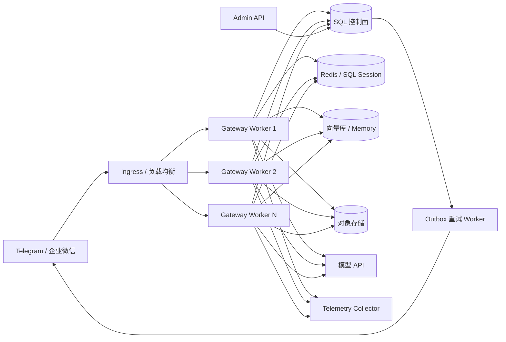

# 多租户 IM Agent 架构与验收设计

## 1. 目标和边界

系统把 Telegram、企业微信等外部 IM 消息转换成统一输入，路由到正确租户的 tRPC-Agent，在任意 Worker 节点上恢复 Session/Memory，最后可靠地回复原通道。设计优先保证：租户隔离、消息幂等、同一会话有序、Worker 无状态、全链路可审计。

本示例交付“可运行最小方案”和“生产推荐方案”。模型、Redis、SQL 和 IM 平台本身属于外部依赖；企业微信加密消息的 AES 解密建议放在经过认证的 Ingress/KMS 插件中，本示例负责官方签名校验及解密后 JSON/XML 的归一化。

## 2. 节点拓扑



组件职责：

| 组件 | 职责 |
|---|---|
| Ingress | TLS、限流、请求体大小、企业微信 AES 解密、灰度路由 |
| Gateway/Worker | 验签、租户解析、治理、Session 租约、Runner 执行、回复入 Outbox |
| Channel Adapter | 平台消息与内部信封互转，不包含业务 Agent 逻辑 |
| Storage Adapter | 为 Session、Memory、Artifact、Knowledge 提供统一接口 |
| SQL 控制面 | 租户配置、账号绑定、幂等事件、审计、租约、Outbox |
| Admin API | 查看无敏感信息的租户状态；生产中应接 RBAC 与操作审计 |
| Telemetry Collector | 汇总 IM callback、Runner、模型、工具、存储和回复 Trace |

Worker 不保存必须持久化的状态，因此**不需要 sticky session**。任意节点都能根据 HMAC Session ID 从共享后端恢复上下文。进程内缓存只能用于模型客户端和租户 Runner，不能作为事实来源。

## 3. 租户模型和隔离

`TenantConfig` 至少包含：

- `tenant_id`、展示名、Agent App ID 和 Agent 名称；
- 模型名、Base URL、API Key 的环境变量引用；
- Session 后端类型及 DSN 环境变量引用；
- 通道账号绑定、工具白名单、用户白名单；
- 输入长度、请求 Token 预算、模型超时、Session 租约时间。

隔离层次：

1. **配置隔离**：账号路由键为 `(channel, account_id)`，全局唯一；配置热更新先完整校验，再原子替换。
2. **Session 隔离**：tRPC-Agent `app_name` 固定为 `tenant:{tenant_id}:app:{agent_app_id}`；Session ID 还包含租户、通道、账号和会话身份。
3. **数据隔离**：所有控制面表包含 `tenant_id`，生产 SQL 用户应启用行级权限或租户独立 Schema；向量库 namespace 和对象存储 prefix 同样以租户开头。
4. **工具隔离**：Agent 工具只能从 `tool_allowlist` 构造。本参考实现默认不给 Agent 任何特权工具，属于 fail-closed。
5. **日志隔离**：平台原始用户/群 ID 经 HMAC 后再进入 Session 和审计；消息正文不写审计表。
6. **密钥隔离**：配置文件和数据库仅保存环境变量名，真实 token、API Key、DSN 由 KMS/Vault/Secret 注入。

## 4. 消息路由、Session 和顺序

完整处理顺序如下：

1. 由 URL 中的 `channel/account_id` 找到唯一租户。
2. Adapter 使用该绑定的密钥验证平台回调。
3. 转为 `InboundMessage`：租户、通道、账号、外部消息 ID、用户、会话、群聊类型、正文。
4. 执行用户权限、长度和 Token 预算策略。
5. 计算稳定且不可逆的 `user_id/session_id`。
6. 获取 SQL Session 租约。获取失败返回 `429 + Retry-After`，让平台稍后重投。
7. 用唯一键 `(tenant_id, channel, account_id, external_message_id)` 声明消息；同一租户的不同机器人互不误判，重复消息不再次执行模型或工具。
8. 锁定 Session 行并递增 `last_event_seq`，形成确定的事件顺序。
9. tRPC-Agent Runner 从共享 Redis/SQL 后端读取 Session，执行 Agent 并写回事件/state/summary。
10. 模型结果和 Outbox 在同一事务提交。
11. 外发 Worker 声明 Outbox 后投递；失败进入指数退避队列，进程崩溃留下的 `sending` 项租约到期后恢复。
12. 写审计、指标和 Trace，释放 Session 租约。

Session 规则：

- 单聊：`tenant + channel + account + direct + user + thread`，不同用户严格隔离。
- 群聊：`tenant + channel + account + group + conversation + thread`，群成员共享上下文。
- 跨群：`conversation_id` 不同，因此隔离。
- 跨租户：`tenant_id/account_id` 不同，因此即使平台用户 ID 相同也隔离。
- 若业务要求“群内每人独立”，只需在群聊身份中加入 `user_id`，不修改存储协议。

Session 租约时间必须大于模型超时；当前默认 `120s > 90s`。生产环境应增加租约心跳，并监控被抢占次数。

## 5. 数据模型

SQLAlchemy Schema 已实现以下表：

| 表 | 关键字段和作用 |
|---|---|
| `mt_tenants` | tenant_id、状态、配置版本、原子月度 Token 用量 |
| `mt_agent_apps` | `(tenant_id, agent_app_id)` 复合主键、agent、model、tool_allowlist |
| `mt_channel_bindings` | channel、account_id 唯一键、secret_ref |
| `mt_sessions` | tenant/app/channel、HMAC 用户与会话、last_event_seq、state |
| `mt_message_events` | 外部消息幂等键、session sequence、方向、状态、payload hash |
| `mt_memories` | tenant/session、类型、内容引用、版本 |
| `mt_summaries` | session、through_sequence 唯一版本、摘要 |
| `mt_artifacts` | tenant/session、对象存储 URI、content type |
| `mt_knowledge` | tenant、向量 namespace、来源 URI |
| `mt_audit_logs` | 题目要求的审计字段和 Token 成本 |
| `mt_session_leases` | 跨节点同 Session 串行化 |
| `mt_outbox` | 可靠 IM 投递、尝试次数和下次执行时间 |

Session event → state → summary 的更新规则：原始事件先获得不可变序号；state 只由该序号对应事件的 delta 推导；summary 记录 `through_sequence`，只允许覆盖更早或相等的事件范围。摘要生成失败不能回滚原始事件。

## 6. 后端选择和一致性

| 后端 | 一致性 | 延迟 | 成本/运维 | 推荐用途 |
|---|---|---|---|---|
| InMemory | 单进程强一致，跨节点不可见 | 最低 | 最低 | 单元测试、本地演示，禁止多副本生产 |
| Redis | 单键操作强一致，跨键需 Lua/事务 | 低 | 中 | 高频 Session、租约、短期 Memory |
| SQL | 事务强一致，可行锁/版本锁 | 中 | 中 | 控制面、审计、幂等、Outbox、长期 Session |
| 向量库 | 通常最终一致 | 中 | 中至高 | Knowledge 与语义 Memory，不能承担消息顺序 |
| 对象存储 | 新对象读后通常强一致 | 中至高 | 低 | Artifact、大文件、冷数据 |
| 外部 Memory | 依服务 SLA，通常最终一致 | 高 | 中至高 | 可插拔长期记忆，需超时和降级 |

推荐生产组合：SQL 保存控制面和不可丢事件，Redis 保存热 Session，向量库保存 Knowledge/Memory，对象存储保存 Artifact。Redis 更新使用 Lua 或 CAS 版本，SQL 使用 `SELECT FOR UPDATE`/乐观版本，禁止“读整个 Session 后无条件覆盖”的丢更新模式。

跨节点可见性由共享 Redis/SQL Session 后端直接保证。若生产部署另加 Worker 本地只读缓存，建议在 Memory 写入成功后发布 `tenant/session/memory_version` 失效通知，并用短 TTL 与读取版本号兜底；该本地缓存层不属于本示例的已实现范围。

## 7. 数据迁移

推荐采用双写、校验、切读、停止旧写四阶段：

1. 为记录分配稳定 ID、版本号和内容哈希，启动目标端回填。
2. 新写入同时写旧端和目标端；失败进入迁移 Outbox。
3. 比较数量、最大版本、水位和抽样内容哈希，按租户逐批追平。
4. 灰度把读取切到目标端，保留旧端回退窗口；稳定后停止旧写并归档。

Redis → SQL：按 Session 扫描，不使用生产 `KEYS *`；以版本 CAS 防止回填覆盖新写。 本地向量库 → 远端向量库：保留原文、chunk ID、embedding 模型版本；模型改变时重算向量，不能只复制旧向量。

数据库 Schema 使用 `migrations/` 中的 Alembic 版本化迁移：先增加兼容字段，再部署双读写代码，最后清理旧字段。禁止生产 `drop_all/create_all`；Compose 的 `migrate` 服务与 Kubernetes 的迁移 Job 都必须先于 Gateway 发布成功。

## 8. IM Adapter

### Telegram

- 使用官方 `X-Telegram-Bot-Api-Secret-Token`，常量时间比较。
- 幂等 ID 为 `update_id:message_id`。
- private 映射单聊，其余 chat type 映射群聊；topic ID 进入 thread 维度。
- 文本和 caption 进入 Agent；回复使用 `sendMessage`，单条截断为平台允许的 4096 字符。

### 企业微信

- 校验 `signature` 或 `msg_signature`、timestamp、nonce，并拒绝超过 5 分钟的回调。
- 支持解密后的 JSON/XML 文本消息；加密正文交给经过认证的 AES/KMS Ingress 插件。
- `MsgId` 是幂等 ID；`FromUserName/ChatId` 分别映射用户和会话。
- 外发采用配置的企业微信 Webhook，文本按 2048 字符限制。

图片和文件应先存入租户对象存储，正文只传带过期时间的内部引用。当前 Outbox 对投递失败执行有上限的指数退避、稳定抖动和死信状态；若需主动贴合各平台 QPS，生产部署可在 Sender 前增加按账号隔离的 token bucket，并解析平台 `Retry-After`。撤回事件作为新事件追加，不物理删除审计记录。

## 9. 治理与安全

已实现的前置策略：通道账号许可、回调验签、用户白名单、1 MiB 请求体、输入长度、单请求预算、原子预留并按实际用量结算的月度 Token 预算、模型超时、工具默认禁用。通过网关后，Runner 仍会执行注册的 `multi_tenant_im_governance` tRPC-Agent Filter；缺少可信租户上下文的直接 Runner 调用会 fail-closed。

生产 Filter 链建议按以下顺序：

1. `TenantAuthFilter`：租户、账号、用户 RBAC。
2. `PromptDlpFilter`：身份证、手机号、密钥等输入脱敏。
3. `BudgetFilter`：请求、日/月 Token 与金额预算。
4. `ToolAllowlistFilter`：工具白名单和参数 Schema。
5. `DangerousToolApprovalFilter`：付款、删除、外发等生成待确认卡片；确认 token 绑定 tenant/user/session/tool/args hash 且短时有效。
6. `OutputDlpFilter`：回复敏感信息检测、内容策略和长度适配。

安全要求：

- 日志和 Trace 禁止记录正文、Authorization、IM token、模型 Key 和数据库密码。
- HMAC namespace secret 定期轮换时需支持 current/previous 两个版本的读取窗口。
- Admin API 生产中接入 mTLS/OIDC、RBAC、来源网段和操作审计；示例 token 仅用于最小演示。
- 容器只读根文件系统、非 root、丢弃 Linux capabilities；工具执行放独立沙箱池，禁止与 Gateway 共进程。

## 10. 可观测性与审计

Trace 主链：

```text
im.callback → tenant.resolve → signature.verify → session.lease
→ idempotency.claim → runner.run → model.call → tool.call
→ session/memory.write → outbox.commit → im.reply
```

`request_span` 已建立根 Span，tRPC-Agent 内部 Runner/模型/工具 Span 会继承当前上下文。配置 `OTEL_EXPORTER_OTLP_ENDPOINT` 后输出到 Collector。

示例直接导出的低基数指标包括请求量/总延迟、模型/存储/IM 投递阶段延迟、投递状态、审计写入状态、Token 和模型成本。tRPC-Agent 内部 Span 继续提供模型与工具明细。完整生产监控还应包括：

- 按租户/通道/状态的请求量与延迟；
- IM 投递成功、重试和死信；
- 模型耗时、工具耗时、错误率；
- 输入/输出 Token、租户成本与预算利用率；
- Redis/SQL QPS、连接池饱和度和 Session 读写延迟；
- Session 租约冲突、幂等重复和 payload conflict。

审计表包含 `tenant_id, channel, user_id, session_id, agent_name, tool_name, decision, latency_ms, error_type, cost, token_count, trace_id`。其中 user_id 为 HMAC 值，正文不进入审计。

## 11. 故障、降级与恢复

| 故障 | 行为 |
|---|---|
| Gateway 节点退出 | LB 转到其他节点；过期 Session/Outbox 租约自动恢复 |
| IM 重复投递 | 唯一幂等键命中，返回成功但不重复调用模型/工具 |
| SQL 短暂不可用 | readiness 失败摘流；回调返回 503，让平台重试，不降级到本地状态 |
| Redis Session 不可用 | 只读 FAQ Agent 可选降级；有状态/写工具请求直接失败，避免上下文错乱 |
| 模型超时 | 90 秒取消、事件标记 failed，平台重试后允许同一事件重新执行 |
| 工具失败 | 可重试只读工具按幂等键退避；非幂等写工具必须有业务 idempotency key |
| IM 回复失败 | Agent 结果和 Outbox 已提交，后台重试，不再次运行 Agent |
| 配置错误 | 原子热更新拒绝整批错误配置，继续使用上一版本 |

Outbox 第 8 次投递仍失败后转为 `dead_letter` 状态，指标可直接告警；人工重放必须保留原 outbox_id。

## 12. 部署、灰度和回滚

最小方案：一个 Gateway、MySQL、Redis，使用 `docker-compose.yml`。该方案便于演示但不提供跨可用区容灾。

生产方案：至少三个 Gateway Pod、托管多可用区 SQL、Redis Sentinel/Cluster、独立 Outbox Worker、Ingress、OTel Collector、Secret Manager。`kubernetes.yaml` 提供发布前迁移 Job、RollingUpdate、HPA、PDB、探针、资源限制和容器安全上下文。部署流水线必须等待迁移 Job 成功后再更新 Deployment。

灰度维度：镜像版本、`tenant_id`、通道账号。先让内部租户流量进入 canary Deployment，观察错误率、P95、Token 成本、重复率后逐步扩大。配置表保留 `config_version` 和最后五个版本；回滚只切换租户的 active version，不修改其他租户。

## 13. 容量估算

定义：

- 峰值回调 `R` 次/秒；平均一次会话占用 `T` 秒；
- 模型调用比例 `P`；平均输入输出 Token 为 `Tin/Tout`；
- 单 Worker 安全并发 `C`；目标利用率 `U`（建议 0.65）。

估算：

- 并发 Session ≈ `R × T × P`。
- Worker 数量 ≥ `ceil(并发 Session / (C × U))`，再增加一个可用区冗余。
- 模型 Token/秒 ≈ `R × P × (Tin + Tout)`。
- SQL QPS ≈ `R × (租约2 + 幂等1 + 完成事务1 + 审计1 + Outbox2)`，约 `7R`，另加查询和重试。
- Redis QPS ≈ `R × P × 每轮 Session 读写次数`，通常 `2R～5R`。

例：峰值 50 RPS、模型比例 0.8、平均耗时 8 秒，约 320 个并发 Session。单 Worker 安全并发 80、利用率 65%，至少 `ceil(320/52)=7` 个 Worker，再按可用区和突发系数部署 9～12 个。

压测必须使用真实消息长度分布、流式输出、慢工具和 IM 429 注入；验收 P95/P99、数据库连接池、Outbox 堆积和每租户成本，不能只测 Echo。

## 14. 已知边界与后续增强

- 示例的 SQL Session 租约适合说明一致性；大规模生产可改为 Redis Lua 租约并增加续租/fencing token。
- 企业微信加密正文需要接入官方 AES 解密库，且 corp_id 校验必须启用。
- 当前工具列表默认空；接入真实工具时必须从租户白名单构造并增加危险操作确认 Filter。
- SQLAlchemy `create_all` 仅在显式 `AUTO_CREATE_SCHEMA=true` 的离线演示中启用；在线默认关闭，生产 Schema 由 Alembic 迁移任务管理。
- 多区域部署需要 home-region 路由或全局事件序列，不能依赖跨区域数据库延迟强行同步。
