# trpc-agent A2A Framework 原理说明

本文说明 `trpc_agent_sdk.server.a2a` 如何把 `trpc-agent` 接入 A2A 协议，并给出可对照的运行示例。

## 1. 框架支持 A2A 的核心原理

这一层本质上是一个 **双向协议适配器**：

- **服务端方向**：`TrpcA2aAgentService` / `TrpcA2aAgentExecutor` 把 A2A 请求转换为 `Runner.run_async(...)` 调用，再把 `Event` 转回 A2A 流式事件。
- **客户端方向**：`TrpcRemoteA2aAgent` 把本地 `Event/Content` 转换为 A2A 消息，调用远端 A2A 服务并把响应还原为本地 `Event`。
- **关键策略**：
  - metadata 使用**无前缀键**（如 `user_id`、`session_id`、`app_name`）。
  - 流式输出采用 **artifact-first**（优先通过 `TaskArtifactUpdateEvent` 传输内容分片）。

## 2. 原理图

```mermaid
flowchart LR
    U[User / Caller]
    C[TrpcRemoteA2aAgent\n客户端适配层]
    A2AC[A2AClient]
    HTTP[HTTP + A2A Protocol]
    A2AS[A2AStarletteApplication\n+ DefaultRequestHandler]
    SVC[TrpcA2aAgentService]
    EXE[TrpcA2aAgentExecutor]
    RUN[Runner]
    AGENT[BaseAgent / LlmAgent]
    TOOLS[Tools / Model / Session]

    U --> C
    C --> A2AC
    A2AC --> HTTP
    HTTP --> A2AS
    A2AS --> SVC
    SVC --> EXE
    EXE --> RUN
    RUN --> AGENT
    AGENT --> TOOLS

    TOOLS --> AGENT
    AGENT --> RUN
    RUN --> EXE
    EXE -->|convert_event_to_a2a_events| A2AS
    A2AS --> HTTP
    HTTP --> A2AC
    A2AC --> C
    C --> U
```



## 3. 核心链路伪代码讲解

### 3.1 服务启动与装配（Server Bootstrap）

对应核心文件：

- `trpc_agent_sdk/server/a2a/_agent_service.py`
- `trpc_agent_sdk/server/a2a/executor/_a2a_agent_executor.py`

```python
def bootstrap_a2a_service(base_agent):
    # 1) 组装 trpc Runner 所需依赖
    session_service = InMemorySessionService()  # 或外部注入
    memory_service = optional_memory_service

    # 2) 用 BaseAgent 构建 A2A AgentExecutor 适配器
    svc = TrpcA2aAgentService(
        service_name="my_service",
        agent=base_agent,
        session_service=session_service,
        memory_service=memory_service,
        executor_config=TrpcA2aAgentExecutorConfig(),
    )
    svc.initialize()  # 构建 AgentCard，开启 streaming capability

    # 3) 交给 A2A SDK 的 HTTP App
    app = A2AStarletteApplication(
        agent_card=svc.agent_card,
        http_handler=DefaultRequestHandler(agent_executor=svc),
    )
    return app
```

### 3.2 请求执行路径（A2A -> Runner -> A2A）

对应核心文件：

- `trpc_agent_sdk/server/a2a/executor/_a2a_agent_executor.py`
- `trpc_agent_sdk/server/a2a/converters/_request_converter.py`
- `trpc_agent_sdk/server/a2a/converters/_event_converter.py`

```python
async def execute(context, event_queue):
    ensure context.message exists
    if first request:
        enqueue submitted status

    # A2A RequestContext -> trpc run_args
    run_args = convert_a2a_request_to_trpc_agent_run_args(context)
    # run_args includes: user_id, session_id(context_id), new_message, run_config(metadata)

    session = get_or_create_session(run_args.user_id, run_args.session_id)
    enqueue working status(metadata={app_name, user_id, session_id})

    aggregator = TaskResultAggregator()
    async for trpc_event in runner.run_async(**run_args):
        # Optional callback: filter/augment event
        trpc_event = maybe_apply_event_callback(trpc_event)
        if trpc_event is None:
            continue

        # trpc Event -> A2A events (artifact-first)
        for a2a_event in convert_event_to_a2a_events(trpc_event, on_event=aggregator.process_event):
            await event_queue.enqueue_event(a2a_event)

    # flush terminal status
    if aggregator still working and has message:
        enqueue final artifact chunk(last_chunk=True)
        enqueue completed status
    else:
        enqueue final status(aggregated state)
```

### 3.3 远程客户端路径（Runner 使用远程 A2A Agent）

对应核心文件：

- `trpc_agent_sdk/server/a2a/_remote_a2a_agent.py`

```python
async def remote_agent_run(invocation_ctx):
    ensure initialized:
        discover AgentCard (if needed)
        create A2AClient

    outgoing_msg = convert local content/event to A2A Message
    outgoing_msg.context_id = session_id
    outgoing_msg.metadata = build_request_message_metadata(invocation_ctx)

    streaming_req = SendStreamingMessageRequest(message=outgoing_msg, metadata=run_config.metadata)
    stream = a2a_client.send_message_streaming(streaming_req)

    async for response in stream_with_cancel_check(stream, invocation_ctx.cancel_event):
        result = response.result
        # TaskArtifactUpdateEvent / TaskStatusUpdateEvent / Task / Message
        for event in _events_from_response(result):
            yield convert_to_local_Event(event)

    if cancelled and task_id known:
        call a2a_client.cancel_task(task_id)
```

## 4. 关键设计点

- **协议无前缀元数据**：统一使用 `user_id/session_id/app_name/...`，读取逻辑见 `_utils.py`。
- **artifact-first 流式输出**：中间分片通过 `TaskArtifactUpdateEvent` 输出，结束时补齐最终状态。
- **取消语义打通**：本地 cancel event 与远端 `cancel_task` 同步。
- **可插拔扩展**：`TrpcA2aAgentExecutorConfig` 支持 `user_id_extractor`、`event_callback`。

## 5. 与 `examples/a2a` 的对应关系

示例目录（可直接运行）：

- [examples/a2a/README.md](../../../examples/a2a/README.md)
- [examples/a2a/run_server.py](../../../examples/a2a/run_server.py)
- [examples/a2a/test_a2a.py](../../../examples/a2a/test_a2a.py)
- [examples/a2a/agent/agent.py](../../../examples/a2a/agent/agent.py)

运行映射：

1. `run_server.py` 创建 `TrpcA2aAgentService` 并挂到 `A2AStarletteApplication`。
2. `test_a2a.py` 创建 `TrpcRemoteA2aAgent`，通过 `Runner` 发起 3 轮对话。
3. 第 2 轮触发 `get_weather_report` 工具调用，展示工具事件与文本分片的 A2A 流式传输。
