# trpc-agent A2A Framework 原理说明

`trpc_agent_sdk.server.a2a_v1` 是 a2a-sdk **1.x** 适配层（extra `trpc-agent-py[a2a-v1]`）。a2a-sdk 0.3 使用并列包 [`a2a/`](../a2a/README.md)（extra `trpc-agent-py[a2a]`）。两个 extra **不能同时安装**。

本文说明 1.x 适配层如何把 `trpc-agent` 接入 A2A 协议，并给出可对照的运行示例。

## 1. 框架支持 A2A 的核心原理

这一层本质上是一个 **双向协议适配器**：

- **服务端方向**：`TrpcA2aAgentService` / `TrpcA2aAgentExecutor` 把 A2A 请求转换为 `Runner.run_async(...)` 调用，再把 `Event` 转回 A2A 流式事件。
- **客户端方向**：`TrpcRemoteA2aAgent` 把本地 `Event/Content` 转换为 A2A 消息，调用远端 A2A 服务并把响应还原为本地 `Event`。
- **关键策略**：
  - metadata 使用**无前缀键**（如 `user_id`、`session_id`、`app_name`）。
  - 流式输出采用 **artifact-first**（优先通过 `TaskArtifactUpdateEvent` 传输内容分片）。

## 2. 原理图

```mermaid
flowchart LR
    U[User / Caller]
    C[TrpcRemoteA2aAgent\n客户端适配层]
    A2AC[A2A Client\ncreate_client / CompatJsonRpcTransport]
    HTTP[HTTP + A2A Protocol]
    A2AS[create_a2a_application\n+ DefaultRequestHandler]
    SVC[TrpcA2aAgentService]
    EXE[TrpcA2aAgentExecutor]
    RUN[Runner]
    AGENT[BaseAgent / LlmAgent]
    TOOLS[Tools / Model / Session]

    U --> C
    C --> A2AC
    A2AC --> HTTP
    HTTP --> A2AS
    A2AS --> SVC
    SVC --> EXE
    EXE --> RUN
    RUN --> AGENT
    AGENT --> TOOLS

    TOOLS --> AGENT
    AGENT --> RUN
    RUN --> EXE
    EXE -->|convert_event_to_a2a_events| A2AS
    A2AS --> HTTP
    HTTP --> A2AC
    A2AC --> C
    C --> U
```



## 3. 核心链路伪代码讲解

### 3.1 服务启动与装配（Server Bootstrap）

对应核心文件：

- `trpc_agent_sdk/server/a2a_v1/_agent_service.py`
- `trpc_agent_sdk/server/a2a_v1/executor/_a2a_agent_executor.py`

```python
def bootstrap_a2a_service(base_agent):
    # 1) 组装 trpc Runner 所需依赖
    session_service = InMemorySessionService()  # 或外部注入
    memory_service = optional_memory_service

    # 2) 用 BaseAgent 构建 A2A AgentExecutor 适配器
    svc = TrpcA2aAgentService(
        service_name="my_service",
        agent=base_agent,
        session_service=session_service,
        memory_service=memory_service,
        executor_config=TrpcA2aAgentExecutorConfig(),
    )
    svc.initialize()  # 构建 AgentCard，开启 streaming capability

    # 3) 交给 SDK 的 1.x 路由装配封装
    app = create_a2a_application(svc)
    return app
```

> `create_a2a_application()` 是**可选便利层**——它打包了 a2a-sdk 1.x 的路由装配（卡片 url、0.3 兼容接口等默认处理）。需要深度定制 Starlette 时，可直接绕过它、用 a2a-sdk 的公开组件（`DefaultRequestHandler` / `create_agent_card_routes` / `create_jsonrpc_routes`）自己拼。

### 3.2 请求执行路径（A2A -> Runner -> A2A）

对应核心文件：

- `trpc_agent_sdk/server/a2a_v1/executor/_a2a_agent_executor.py`
- `trpc_agent_sdk/server/a2a_v1/converters/_request_converter.py`
- `trpc_agent_sdk/server/a2a_v1/converters/_event_converter.py`

```python
async def execute(context, event_queue):
    ensure context.message exists
    if first request:
        # a2a-sdk 1.x 强制"先 Task 后 update"：首个事件必须是 Task
        enqueue Task(id=context.task_id, status=SUBMITTED, history=[user_message])

    # A2A RequestContext -> trpc run_args
    run_args = convert_a2a_request_to_trpc_agent_run_args(context)
    # run_args includes: user_id, session_id(context_id), new_message, run_config(metadata)

    session = get_or_create_session(run_args.user_id, run_args.session_id)
    enqueue working status(metadata={app_name, user_id, session_id})

    aggregator = TaskResultAggregator()
    async for trpc_event in runner.run_async(**run_args):
        # Optional callback: filter/augment event
        trpc_event = maybe_apply_event_callback(trpc_event)
        if trpc_event is None:
            continue

        # trpc Event -> A2A events (artifact-first)
        for a2a_event in convert_event_to_a2a_events(trpc_event, on_event=aggregator.process_event):
            await event_queue.enqueue_event(a2a_event)

    # flush terminal status
    if aggregator still working and has message:
        enqueue final artifact chunk(last_chunk=True)
        enqueue completed status
    else:
        enqueue final status(aggregated state)
```

### 3.3 远程客户端路径（Runner 使用远程 A2A Agent）

对应核心文件：

- `trpc_agent_sdk/server/a2a_v1/_remote_a2a_agent.py`

```python
async def remote_agent_run(invocation_ctx):
    ensure initialized:
        discover AgentCard (if needed), fill empty JSONRPC urls, then create_client
        (force_v0_3=True: CompatJsonRpcTransport to card JSONRPC url, else agent_base_url)

    outgoing_msg = convert local content/event to A2A Message
    outgoing_msg.context_id = session_id
    outgoing_msg.metadata = build_request_message_metadata(invocation_ctx)

    # a2a-sdk 1.x：SendMessageRequest(tenant, message, ...)，返回 StreamResponse(oneof)
    req = SendMessageRequest(message=outgoing_msg, metadata=run_config.metadata)
    stream = a2a_client.send_message(req)

    async for response in stream_with_cancel_check(stream, invocation_ctx.cancel_event):
        result = response_payload(response)  # HasField 选择 task/message/status_update/artifact_update
        # TaskArtifactUpdateEvent / TaskStatusUpdateEvent / Task / Message
        for event in _events_from_response(result):
            yield convert_to_local_Event(event)

    if cancelled and task_id known:
        call a2a_client.cancel_task(CancelTaskRequest(id=task_id))
```

## 4. 关键设计点

- **协议无前缀元数据**：统一使用 `user_id/session_id/app_name/...`，读取逻辑见 `_utils.py`。
- **artifact-first 流式输出**：中间分片通过 `TaskArtifactUpdateEvent` 输出，结束时补齐最终状态。
- **取消语义打通**：本地 cancel event 与远端 `cancel_task` 同步。
- **可插拔扩展**：`TrpcA2aAgentExecutorConfig` 支持 `user_id_extractor`、`event_callback`。

### 4.1 AgentCard 的对外 URL 配置

服务端**不知道自己的对外地址**，AgentCard 里 `supported_interfaces[].url`（以及 v0.3 兼容的顶层 `url`）必须由部署方指定。url 只有**一个配置入口**：`TrpcA2aAgentService(rpc_url=...)`（或完全自定义的 `agent_card`）。

```python
# 方式 1：固定域名（推荐，有反代/域名时）
svc = TrpcA2aAgentService(
    service_name="weather",
    agent=root_agent,
    rpc_url="https://agent.example.com/a2a",   # 直接写进 AgentCard
)

# 方式 2：完全自定义卡片
from a2a.types import AgentCard, AgentInterface
card = AgentCard(
    name="weather", description="...", version="1.0",
    supported_interfaces=[AgentInterface(
        protocol_binding="JSONRPC", protocol_version="1.0",
        url="https://agent.example.com/a2a",
    )],
)
svc = TrpcA2aAgentService(service_name="weather", agent=root_agent, agent_card=card)

# 方式 3：本地/无固定域名，直接把监听地址当 rpc_url
svc = TrpcA2aAgentService(
    service_name="weather",
    agent=root_agent,
    rpc_url="http://127.0.0.1:18081",
)
```

**规则**：`create_a2a_application()` 装配时不因卡片 url 空而阻断 **1.0-only** 启动——JSON-RPC 直连的客户端不读卡片。但若所有接口的 url 都为空（没配 `rpc_url` 也没自定义 `agent_card`），会打出一条 **warning** 提示配置缺失，因为依赖卡片发现的客户端会连不上。开启 `enable_v0_3_compat=True` 时则不同：0.3 客户端靠 well-known 卡片的顶层 `url` 发现服务，空 url **无法补救**，装配会 **raise `ValueError`**，避免服务看似起来了但旧客户端发现失败。

**挂载路径自动推导**：`create_a2a_application()` **不接收挂载路径参数**——JSON-RPC 路由挂到哪由卡片 url 的 path 推导（`https://x.com/a2a` → `/a2a`，无路径则 `/`），保证"卡片声明的路径"与"实际挂载路径"永远一致，客户端不会发现 A 调 B。

开启 `enable_v0_3_compat=True` 时，框架还会在 `/.well-known/agent.json` 发布同一张卡（0.3 `A2ACardResolver` 的默认发现路径），在**用于 well-known 发现的卡片副本**上追加 `protocol_version="0.3"` 接口（复用已有 url），并打开 JSON-RPC 的 0.3 解码。**须先配置可达 url**（见上文）；url 全空时装配会 raise。**默认关闭该开关**（只发布 `/.well-known/agent-card.json`，`agent.json` 为 404），旧 0.3 客户端无法发现服务。默认由本函数构造的 `DefaultRequestHandler` 也会拿到这份副本。若调用方传入**自定义 `request_handler`**，框架**不会**改写该 handler 自己的 `agent_card`——0.3 客户端仍可走 JSON-RPC 路由，但 handler 若按其 `supported_interfaces` 做版本判断，需要调用方自行在那张卡上声明 0.3 接口。

```python
from trpc_agent_sdk.server.a2a_v1 import TrpcA2aAgentService, create_a2a_application

svc = TrpcA2aAgentService(..., rpc_url="http://127.0.0.1:18081")
app = create_a2a_application(svc, enable_v0_3_compat=True)
```

> 完整运行示例见 [examples/a2a_v1](../../../examples/a2a_v1/README.md)。

## 5. 与 `examples/a2a_v1` 的对应关系

示例目录（可直接运行）：

- [examples/a2a_v1/README.md](../../../examples/a2a_v1/README.md)
- [examples/a2a_v1/run_server.py](../../../examples/a2a_v1/run_server.py)
- [examples/a2a_v1/test_a2a.py](../../../examples/a2a_v1/test_a2a.py)
- [examples/a2a_v1/agent/agent.py](../../../examples/a2a_v1/agent/agent.py)

运行映射：

1. `run_server.py` 创建 `TrpcA2aAgentService` 并通过 `create_a2a_application()` 挂载为 A2A 服务。
2. `test_a2a.py` 创建 `TrpcRemoteA2aAgent`，通过 `Runner` 发起 3 轮对话。
3. 第 2 轮触发 `get_weather_report` 工具调用，展示工具事件与文本分片的 A2A 流式传输。
