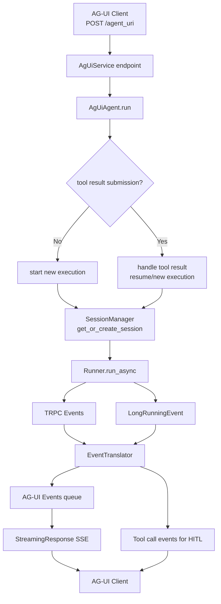

# AG-UI Server 实现说明

本目录提供 `trpc-agent` 与 [AG-UI Protocol](https://github.com/ag-ui-protocol/ag-ui) 的服务端桥接能力。核心目标是：将 `Runner.run_async(...)` 产生的事件流转换为 AG-UI 标准事件，并通过 HTTP/SSE 持续推送给前端。

## 1. 实现原理（高层）

`trpc_agent_sdk.server.ag_ui` 的职责可以拆成三层：

- **服务编排层**（`_plugin/`）
  - `AgUiManager`：统一管理 service 生命周期，启动 FastAPI/Uvicorn
  - `AgUiService`：注册 URI 与 `AgUiAgent`，提供 POST 流式接口
  - `AgUiServiceRegistry`：全局 service 注册表（单例）
- **协议桥接层**（`_core/_agui_agent.py`）
  - 负责 AG-UI 请求解析、session 获取、执行状态跟踪、继续执行（tool result submission）
  - 调用 `Runner.run_async(...)` 执行真实 agent
- **事件翻译层**（`_core/_event_translator.py`）
  - 把 `trpc_agent_sdk.events.Event` 翻译为 AG-UI 事件（文本流、tool call、state snapshot 等）
  - 处理 streaming 文本闭合、tool call 生命周期、一致性兜底（force close）

## 2. 端到端流程图

## 3. 核心代码讲解

### 3.1 `AgUiManager`：服务聚合与启动

[AgUiManager](./_plugin/_manager.py)

- `_build_agents()`：遍历所有 service，调用 `create_agents()`，并把 URI->Agent 映射挂到 manager
- `run()`：先 build，再 `uvicorn.run(...)`
- `close()`：遍历关闭所有 `AgUiAgent`（释放后台执行状态、清理任务）

这层是“容器”，不关心协议细节。

### 3.2 `AgUiService`：URI 与流式接口绑定

[AgUiService](./_plugin/_service.py)

- `add_agent(uri, agui_agent)`：注册 URI，同时在 FastAPI 动态加 POST 路由
- `_ag_ui_agent_endpoint(...)`：
  - 按 `Accept` 头创建 `EventEncoder`
  - 找到对应 `AgUiAgent`
  - 返回 `StreamingResponse(event_generator(...), media_type=...)`

这层负责“把请求接进来并输出 SSE”。

### 3.3 `AgUiAgent`：协议桥接核心

`trpc_agent_sdk/server/ag_ui/_core/_agui_agent.py`

- `run(...)`：
  - 判断是否 tool result submission（前端回传工具结果）
  - 分流到 `_start_new_execution` 或 `_handle_tool_result_submission`
- `_ensure_session_exists(...)`：通过 `SessionManager` 建立/复用会话
- 内部执行主链：
  - `runner.run_async(...)` 拉取 TRPC 事件
  - `EventTranslator.translate(...)` 逐个翻译并入队
  - 最终 `force_close_streaming_message()` + state snapshot 兜底收尾

这层是“AG-UI <-> TRPC”的核心状态机。

### 3.4 `EventTranslator`：事件协议转换

[EventTranslator](./_core/_event_translator.py)

- 文本事件：`TEXT_MESSAGE_START/CONTENT/END`
- 工具事件：`TOOL_CALL_START/ARGS/END/RESULT`
- 长任务工具：`translate_lro_function_calls(...)`
- 状态事件：`STATE_DELTA` / `STATE_SNAPSHOT`
- 一致性保障：`force_close_streaming_message()` 防止流中断后消息未闭合

这层确保前端严格收到 AG-UI 预期事件序列。

### 3.5 `SessionManager`：会话与状态增强

[SessionManager](./_core/_session_manager.py)

- 在底层 session service 之上提供：
  - timeout/cleanup
  - 每用户会话限制
  - 状态读写/批量更新
  - 过期会话清理（含 HITL pending tool call 保护）

这层为线上运行提供“会话治理能力”。

## 4. 示例入口（可直接参考）

- 示例文档：[examples/agui/README.md](../../../examples/agui/README.md)
- 服务端启动：[examples/agui/run_server.py](../../../examples/agui/run_server.py)
- Runner 组装：[examples/agui/_agui_runner.py](../../../examples/agui/_agui_runner.py)

建议阅读顺序：

1. 先看 [examples/agui/run_server.py](../../../examples/agui/run_server.py)（如何启动）
2. 再看 [examples/agui/_agui_runner.py](../../../examples/agui/_agui_runner.py)（如何注册 service + uri）
3. 回到本目录看 `AgUiService` / `AgUiAgent`（协议桥接细节）

## 5. 对外导出 API

`trpc_agent_sdk.server.ag_ui` 当前对外导出：

- `AgUiAgent`
- `AgUiUserFeedBack`
- `get_agui_http_req`
- `AgUiManager`
- `AgUiService`
- `get_agui_service_registry`

